# Payment SAGA Platform

Enterprise-grade payment processing platform using **Temporal + Spring State Machine** hybrid architecture with a true Microservices approach.

## Table of Contents

- [Architecture Overview](#architecture-overview)
- [Core Technology Stack](#core-technology-stack)
  - [Temporal - Workflow Orchestration](#temporal---workflow-orchestration)
  - [Spring State Machine - Domain State Management](#spring-state-machine---domain-state-management)
  - [Kafka - Event Streaming](#kafka---event-streaming)
  - [The Hybrid SAGA Pattern](#the-hybrid-saga-pattern)
- [6-Layer Hybrid SAGA Architecture](#6-layer-hybrid-saga-architecture)
- [Architecture Principles](#architecture-principles)
- [Module Structure](#module-structure)
- [Microservices Communication](#microservices-communication)
- [Key Features](#key-features)
- [Enterprise-Grade Resilience & Fault Tolerance](#enterprise-grade-resilience--fault-tolerance)
- [Payment Product Funnel System](#payment-product-funnel-system)
- [Quick Start](#quick-start)
- [Infrastructure Services](#infrastructure-services)
- [API Usage](#api-usage)
- [Testing](#testing)
- [Observability](#observability)
- [Kubernetes Deployment with Kong Gateway](#kubernetes-deployment-with-kong-gateway)
- [Documentation](#documentation)

---

## Architecture Overview

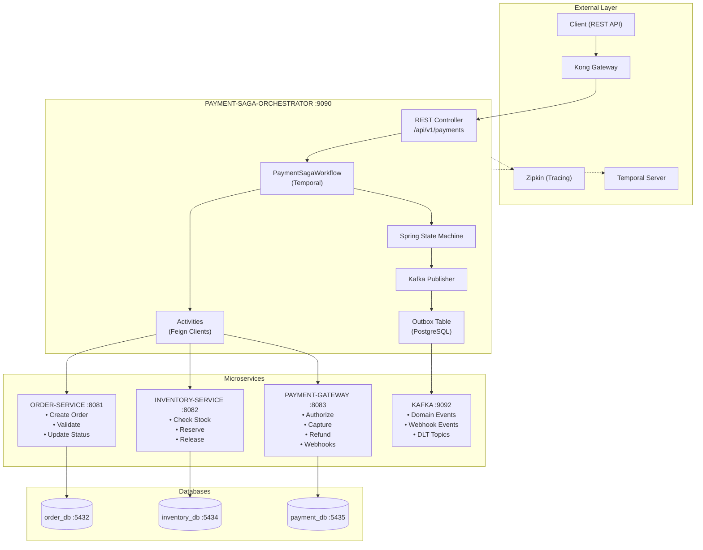
```mermaid
flowchart TB
    subgraph External["External Layer"]
        Client["Client (REST API)"]
        Kong["Kong Gateway"]
        Zipkin["Zipkin (Tracing)"]
        Temporal["Temporal Server"]
    end

    subgraph Orchestrator["PAYMENT-SAGA-ORCHESTRATOR :9090"]
        REST["REST Controller<br/>/api/v1/payments"]
        Workflow["PaymentSagaWorkflow<br/>(Temporal)"]
        StateMachine["Spring State Machine"]
        KafkaPub["Kafka Publisher"]
        Activities["Activities<br/>(Feign Clients)"]
        Outbox["Outbox Table<br/>(PostgreSQL)"]
    end

    subgraph Services["Microservices"]
        Order["ORDER-SERVICE :8081<br/>• Create Order<br/>• Validate<br/>• Update Status"]
        Inventory["INVENTORY-SERVICE :8082<br/>• Check Stock<br/>• Reserve<br/>• Release"]
        Payment["PAYMENT-GATEWAY :8083<br/>• Authorize<br/>• Capture<br/>• Refund<br/>• Webhooks"]
        Kafka["KAFKA :9092<br/>• Domain Events<br/>• Webhook Events<br/>• DLT Topics"]
    end

    subgraph Databases["Databases"]
        OrderDB[(order_db :5432)]
        InventoryDB[(inventory_db :5434)]
        PaymentDB[(payment_db :5435)]
    end

    Client --> Kong --> REST
    REST --> Workflow --> StateMachine --> KafkaPub
    Workflow --> Activities
    KafkaPub --> Outbox
    Activities --> Order & Inventory & Payment
    Outbox --> Kafka
    Order --> OrderDB
    Inventory --> InventoryDB
    Payment --> PaymentDB
    Orchestrator -.-> Zipkin
    Orchestrator -.-> Temporal
```

## Core Technology Stack

### Temporal - Workflow Orchestration

[Temporal](https://temporal.io/) provides durable workflow execution that survives failures:

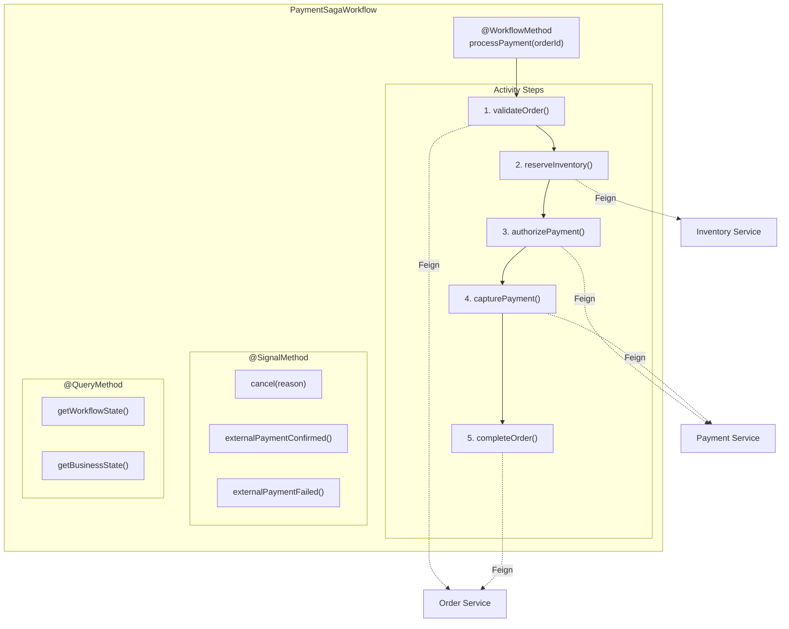
```mermaid
flowchart TB
    subgraph Workflow["PaymentSagaWorkflow"]
        WM["@WorkflowMethod<br/>processPayment(orderId)"]

        subgraph Activities["Activity Steps"]
            A1["1. validateOrder()"]
            A2["2. reserveInventory()"]
            A3["3. authorizePayment()"]
            A4["4. capturePayment()"]
            A5["5. completeOrder()"]
        end

        subgraph Signals["@SignalMethod"]
            S1["cancel(reason)"]
            S2["externalPaymentConfirmed()"]
            S3["externalPaymentFailed()"]
        end

        subgraph Queries["@QueryMethod"]
            Q1["getWorkflowState()"]
            Q2["getBusinessState()"]
        end
    end

    WM --> A1 --> A2 --> A3 --> A4 --> A5
    A1 -.->|Feign| Order["Order Service"]
    A2 -.->|Feign| Inventory["Inventory Service"]
    A3 -.->|Feign| Payment["Payment Service"]
    A4 -.->|Feign| Payment
    A5 -.->|Feign| Order
```

**Temporal Features:**

- Automatic retries with exponential backoff
- Durable execution (survives crashes)
- Compensation stack for rollback (LIFO)
- Signal methods for external events
- Query methods for state inspection

**Why Temporal?**

- Handles "what step are we on" in the SAGA
- Persists workflow state automatically
- Provides exactly-once execution semantics
- Built-in retry policies and timeouts

### Spring State Machine - Domain State Management

[Spring State Machine](https://spring.io/projects/spring-statemachine) models fine-grained business states:

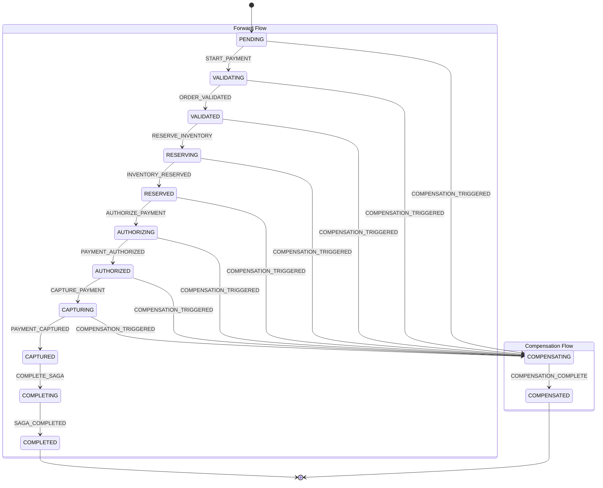
```mermaid
stateDiagram-v2
    [*] --> PENDING

    state "Forward Flow" as forward {
        PENDING --> VALIDATING : START_PAYMENT
        VALIDATING --> VALIDATED : ORDER_VALIDATED
        VALIDATED --> RESERVING : RESERVE_INVENTORY
        RESERVING --> RESERVED : INVENTORY_RESERVED
        RESERVED --> AUTHORIZING : AUTHORIZE_PAYMENT
        AUTHORIZING --> AUTHORIZED : PAYMENT_AUTHORIZED
        AUTHORIZED --> CAPTURING : CAPTURE_PAYMENT
        CAPTURING --> CAPTURED : PAYMENT_CAPTURED
        CAPTURED --> COMPLETING : COMPLETE_SAGA
        COMPLETING --> COMPLETED : SAGA_COMPLETED
    }

    state "Compensation Flow" as compensation {
        COMPENSATING --> COMPENSATED : COMPENSATION_COMPLETE
    }

    PENDING --> COMPENSATING : COMPENSATION_TRIGGERED
    VALIDATING --> COMPENSATING : COMPENSATION_TRIGGERED
    VALIDATED --> COMPENSATING : COMPENSATION_TRIGGERED
    RESERVING --> COMPENSATING : COMPENSATION_TRIGGERED
    RESERVED --> COMPENSATING : COMPENSATION_TRIGGERED
    AUTHORIZING --> COMPENSATING : COMPENSATION_TRIGGERED
    AUTHORIZED --> COMPENSATING : COMPENSATION_TRIGGERED
    CAPTURING --> COMPENSATING : COMPENSATION_TRIGGERED

    COMPLETED --> [*]
    COMPENSATED --> [*]
```

**State Machine Features:**

- Guards for transition validation
- Actions on state entry/exit
- Event publishing on transitions
- State persistence via JPA

**Why Spring State Machine?**

- Handles "what business state is this payment in"
- Enforces valid state transitions
- Publishes domain events on transitions
- Provides audit trail of state changes

### Kafka - Event Streaming

[Apache Kafka](https://kafka.apache.org/) provides reliable event streaming:

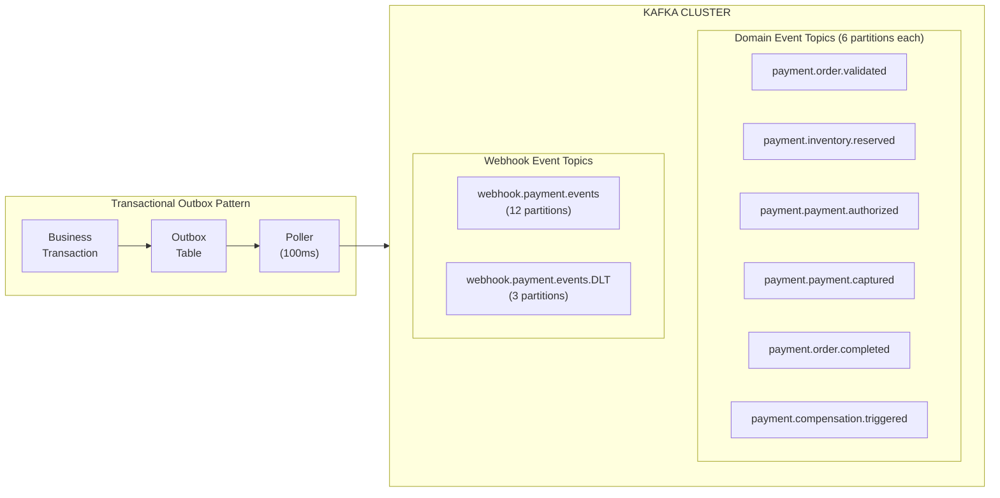
```mermaid
flowchart LR
    subgraph Kafka["KAFKA CLUSTER"]
        subgraph Domain["Domain Event Topics (6 partitions each)"]
            T1["payment.order.validated"]
            T2["payment.inventory.reserved"]
            T3["payment.payment.authorized"]
            T4["payment.payment.captured"]
            T5["payment.order.completed"]
            T6["payment.compensation.triggered"]
        end

        subgraph Webhook["Webhook Event Topics"]
            W1["webhook.payment.events<br/>(12 partitions)"]
            W2["webhook.payment.events.DLT<br/>(3 partitions)"]
        end
    end

    subgraph Outbox["Transactional Outbox Pattern"]
        Txn["Business<br/>Transaction"] --> Table["Outbox<br/>Table"] --> Poller["Poller<br/>(100ms)"]
    end

    Poller --> Kafka
```

**Kafka Guarantees:**

- At-least-once delivery
- Ordering per partition (by orderId)
- Idempotency via event IDs
- Dead letter handling for failures

### Why Both Temporal AND Kafka?

**Short Answer:** They solve different problems. Temporal orchestrates, Kafka broadcasts.

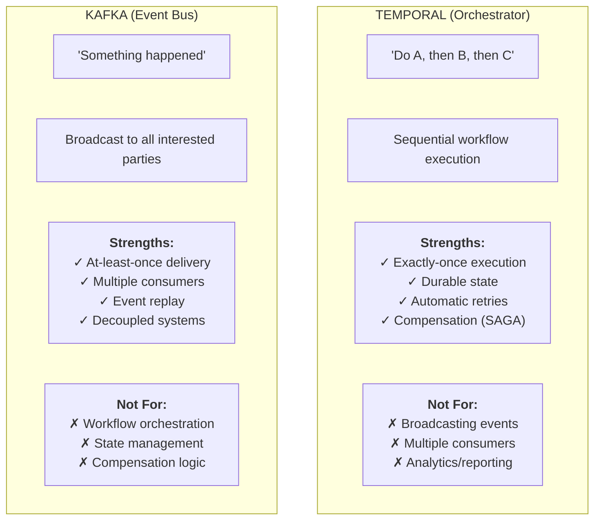
```mermaid
flowchart TB
    subgraph Temporal["TEMPORAL (Orchestrator)"]
        T1["'Do A, then B, then C'"]
        T2["Sequential workflow execution"]
        T3["<b>Strengths:</b><br/>✓ Exactly-once execution<br/>✓ Durable state<br/>✓ Automatic retries<br/>✓ Compensation (SAGA)"]
        T4["<b>Not For:</b><br/>✗ Broadcasting events<br/>✗ Multiple consumers<br/>✗ Analytics/reporting"]
    end

    subgraph Kafka["KAFKA (Event Bus)"]
        K1["'Something happened'"]
        K2["Broadcast to all interested parties"]
        K3["<b>Strengths:</b><br/>✓ At-least-once delivery<br/>✓ Multiple consumers<br/>✓ Event replay<br/>✓ Decoupled systems"]
        K4["<b>Not For:</b><br/>✗ Workflow orchestration<br/>✗ State management<br/>✗ Compensation logic"]
    end
```

**Technical Comparison:**

| Capability             | Temporal            | Kafka               |
| ---------------------- | ------------------- | ------------------- |
| Workflow Orchestration | ✅ Core use         | ❌ Not designed for |
| State Management       | ✅ Excellent        | ❌ Not designed for |
| Event Broadcasting     | ⚠️ Limited          | ✅ Core use         |
| Multiple Consumers     | ❌ One workflow     | ✅ Unlimited        |
| Retry Logic            | ✅ Built-in         | ⚠️ Manual           |
| Compensation (SAGA)    | ✅ Built-in         | ⚠️ Manual           |
| Exactly-Once Semantics | ✅ Guaranteed       | ⚠️ At-least-once    |
| Event Replay           | ⚠️ Workflow history | ✅ Event log        |
| Analytics/Streaming    | ❌ Not for this     | ✅ Designed for     |
| Throughput             | ~10K TPS            | ~1M+ TPS            |

**How They Work Together:**

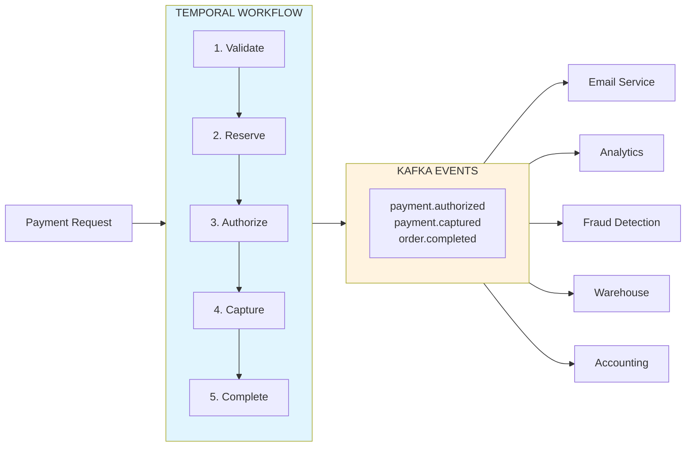
```mermaid
flowchart LR
    User["Payment Request"] --> Temporal

    subgraph Temporal["TEMPORAL WORKFLOW"]
        T1["1. Validate"] --> T2["2. Reserve"]
        T2 --> T3["3. Authorize"]
        T3 --> T4["4. Capture"]
        T4 --> T5["5. Complete"]
    end

    Temporal --> Kafka

    subgraph Kafka["KAFKA EVENTS"]
        Events["payment.authorized<br/>payment.captured<br/>order.completed"]
    end

    Kafka --> Email["Email Service"]
    Kafka --> Analytics["Analytics"]
    Kafka --> Fraud["Fraud Detection"]
    Kafka --> Warehouse["Warehouse"]
    Kafka --> Accounting["Accounting"]

    style Temporal fill:#e1f5fe
    style Kafka fill:#fff3e0
```

**Key Benefits of Using Both:**

| Temporal Handles                  | Kafka Handles                          |
| --------------------------------- | -------------------------------------- |
| Sequential step execution         | Broadcasting state changes             |
| "Authorize then Capture" ordering | Notifying Email, Analytics, Warehouse  |
| Retry on payment gateway timeout  | Decoupled consumer processing          |
| Compensate on failure (refund)    | Event replay for debugging             |
| Track workflow progress           | Add new consumers without code changes |
| Exactly-once payment processing   | Audit trail of all events              |

> **Key Insight**: Temporal orchestrates the payment workflow (the "how"), Kafka broadcasts what happened (the "what") to everyone who cares.

For a comprehensive deep-dive into when to use each technology and integration patterns, see **[Temporal vs Kafka Integration Guide](docs/temporal-kafka-integration.md)**.

### The Hybrid SAGA Pattern

This project combines Temporal and Spring State Machine for a "best-of-both-worlds" approach:

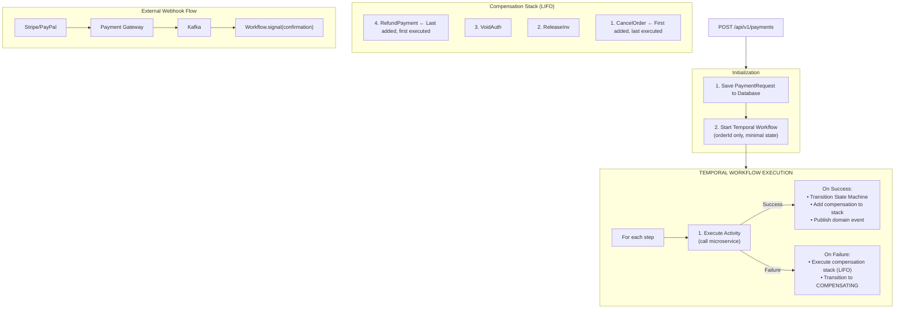
```mermaid
flowchart TB
    API["POST /api/v1/payments"] --> Init

    subgraph Init["Initialization"]
        Save["1. Save PaymentRequest to Database"]
        Start["2. Start Temporal Workflow<br/>(orderId only, minimal state)"]
        Save --> Start
    end

    Start --> Loop

    subgraph Loop["TEMPORAL WORKFLOW EXECUTION"]
        Step["For each step"]
        Execute["1. Execute Activity<br/>(call microservice)"]
        Success["On Success:<br/>• Transition State Machine<br/>• Add compensation to stack<br/>• Publish domain event"]
        Failure["On Failure:<br/>• Execute compensation stack (LIFO)<br/>• Transition to COMPENSATING"]

        Step --> Execute
        Execute -->|Success| Success
        Execute -->|Failure| Failure
    end

    subgraph Stack["Compensation Stack (LIFO)"]
        direction TB
        C4["4. RefundPayment ← Last added, first executed"]
        C3["3. VoidAuth"]
        C2["2. ReleaseInv"]
        C1["1. CancelOrder ← First added, last executed"]
    end

    subgraph Webhook["External Webhook Flow"]
        Provider["Stripe/PayPal"] --> Gateway["Payment Gateway"]
        Gateway --> Kafka["Kafka"]
        Kafka --> Signal["Workflow.signal(confirmation)"]
    end
```

## 6-Layer Hybrid SAGA Architecture

1. **Workflow Orchestration** - Temporal handles durable execution, retries, timeouts
2. **Activity Execution** - Spring beans execute business logic with idempotency
3. **Domain State Management** - Spring State Machine models business states & transitions
4. **Event Streaming** - Kafka publishes domain events via Transactional Outbox pattern
5. **Webhook Integration** - External payment gateway webhooks flow through Kafka to signal workflows
6. **Persistence** - PostgreSQL (per-service databases), Redis for caching

### Webhook → Kafka → Workflow Integration

External payment gateway webhooks (Stripe, PayPal, Adyen, Square) are processed and published to Kafka, then consumed by the orchestrator to signal running workflows.

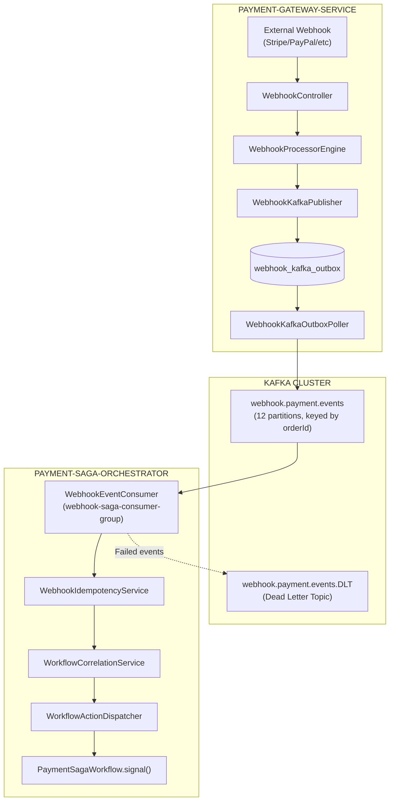
```mermaid
flowchart TB
    subgraph Gateway["PAYMENT-GATEWAY-SERVICE"]
        Webhook["External Webhook<br/>(Stripe/PayPal/etc)"]
        Controller["WebhookController"]
        Engine["WebhookProcessorEngine"]
        Publisher["WebhookKafkaPublisher"]
        OutboxTable[("webhook_kafka_outbox")]
        Poller["WebhookKafkaOutboxPoller"]

        Webhook --> Controller --> Engine --> Publisher --> OutboxTable --> Poller
    end

    subgraph KafkaCluster["KAFKA CLUSTER"]
        Events["webhook.payment.events<br/>(12 partitions, keyed by orderId)"]
        DLT["webhook.payment.events.DLT<br/>(Dead Letter Topic)"]
    end

    subgraph Orchestrator["PAYMENT-SAGA-ORCHESTRATOR"]
        Consumer["WebhookEventConsumer<br/>(webhook-saga-consumer-group)"]
        Idempotency["WebhookIdempotencyService"]
        Correlation["WorkflowCorrelationService"]
        Dispatcher["WorkflowActionDispatcher"]
        Signal["PaymentSagaWorkflow.signal()"]

        Consumer --> Idempotency --> Correlation --> Dispatcher --> Signal
    end

    Poller --> Events
    Events --> Consumer
    Consumer -.->|Failed events| DLT
```

**Key Design Decisions:**

- Webhooks signal existing workflows (not start new ones)
- Kafka partitioning by orderId ensures ordering per order
- At-least-once delivery with idempotency tracking
- Dead Letter Topic for failed events after max retries

## Architecture Principles

This codebase implements validated architecture principles documented in:

- [Anti-Pattern Deep Dive](docs/anti-pattern-deep-dive.md) - Workflow state management best practices
- [Pattern 1 Comprehensive Guide](docs/pattern1-comprehensive-guide.md) - Hybrid SAGA pattern principles
- [Observability Guide](docs/Observability.md) - Correlation tracking, structured logging, and trace resumption
- [Logging Standards](docs/LOGGING_STANDARDS.md) - Log patterns, MDC keys, and prefix conventions

### Principle 1: Minimal Workflow State (Avoid "Workflow as Database")

**Problem**: Storing full objects in Temporal workflow state causes quadratic storage growth (O(n²)) because every state change is persisted to event history.

**Solution**: Store references (IDs) only, not full objects.

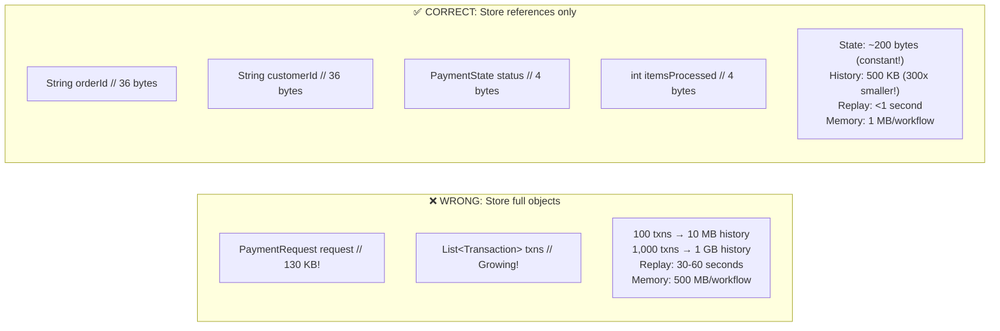
```mermaid
flowchart LR
    subgraph Wrong["❌ WRONG: Store full objects"]
        W1["PaymentRequest request // 130 KB!"]
        W2["List&lt;Transaction&gt; txns // Growing!"]
        W3["100 txns → 10 MB history<br/>1,000 txns → 1 GB history<br/>Replay: 30-60 seconds<br/>Memory: 500 MB/workflow"]
    end

    subgraph Correct["✅ CORRECT: Store references only"]
        C1["String orderId // 36 bytes"]
        C2["String customerId // 36 bytes"]
        C3["PaymentState status // 4 bytes"]
        C4["int itemsProcessed // 4 bytes"]
        C5["State: ~200 bytes (constant!)<br/>History: 500 KB (300x smaller!)<br/>Replay: &lt;1 second<br/>Memory: 1 MB/workflow"]
    end
```

**Implementation in this codebase:**

- `PaymentSagaWorkflowImpl` stores only `sagaId`, `orderId`, `customerId`, `status`
- Full `PaymentRequest` is persisted to database via `PaymentRequestRepository`
- Activities query database when needed (not from workflow state)

### Principle 2: Single Responsibility Separation

**Temporal owns workflow execution state:**

- Which step is currently executing?
- How many times has this activity been retried?
- What's the compensation stack?

**Spring State Machine owns business domain state:**

- What is the current payment status? (PENDING, AUTHORIZED, CAPTURED, etc.)
- What business events have occurred?
- Can we transition to the next state?

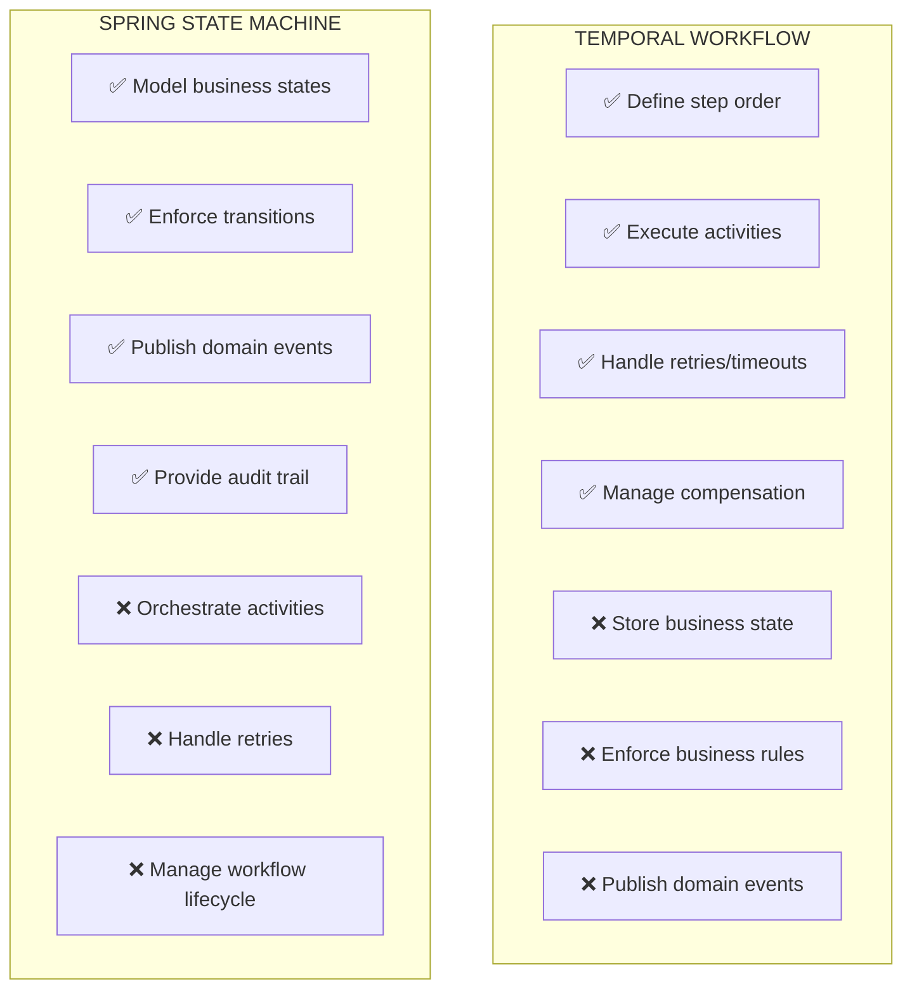
```mermaid
flowchart TB
    subgraph Temporal["TEMPORAL WORKFLOW"]
        T1["✅ Define step order"]
        T2["✅ Execute activities"]
        T3["✅ Handle retries/timeouts"]
        T4["✅ Manage compensation"]
        T5["❌ Store business state"]
        T6["❌ Enforce business rules"]
        T7["❌ Publish domain events"]
    end

    subgraph StateMachine["SPRING STATE MACHINE"]
        S1["✅ Model business states"]
        S2["✅ Enforce transitions"]
        S3["✅ Publish domain events"]
        S4["✅ Provide audit trail"]
        S5["❌ Orchestrate activities"]
        S6["❌ Handle retries"]
        S7["❌ Manage workflow lifecycle"]
    end
```

### Principle 3: Idempotency at Every Layer

Every operation must be safe to retry without side effects:

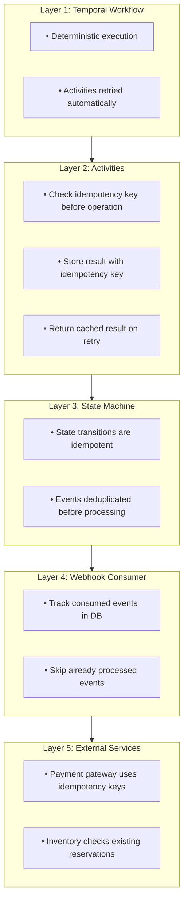
```mermaid
flowchart TB
    subgraph L1["Layer 1: Temporal Workflow"]
        L1A["• Deterministic execution"]
        L1B["• Activities retried automatically"]
    end

    subgraph L2["Layer 2: Activities"]
        L2A["• Check idempotency key before operation"]
        L2B["• Store result with idempotency key"]
        L2C["• Return cached result on retry"]
    end

    subgraph L3["Layer 3: State Machine"]
        L3A["• State transitions are idempotent"]
        L3B["• Events deduplicated before processing"]
    end

    subgraph L4["Layer 4: Webhook Consumer"]
        L4A["• Track consumed events in DB"]
        L4B["• Skip already processed events"]
    end

    subgraph L5["Layer 5: External Services"]
        L5A["• Payment gateway uses idempotency keys"]
        L5B["• Inventory checks existing reservations"]
    end

    L1 --> L2 --> L3 --> L4 --> L5
```

**Implementation in this codebase:**

- `IdempotencyService` checks Redis + PostgreSQL before operations
- Webhook consumer uses `WebhookIdempotencyService` to track processed events
- Payment gateway receives idempotency key with every request

### Principle 4: Transactional Outbox Pattern (CDC)

Events are published reliably using Change Data Capture (CDC) with Debezium:

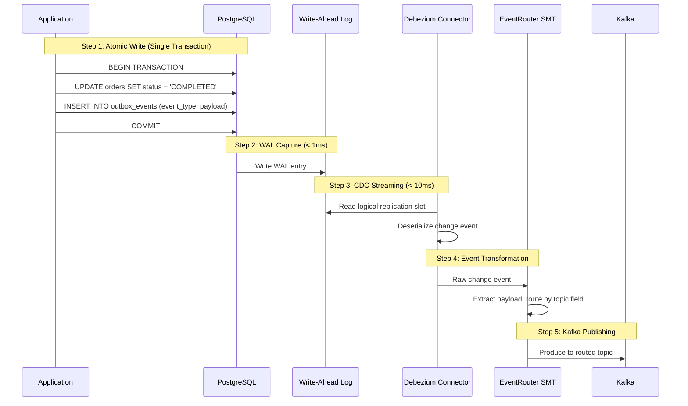
```mermaid
sequenceDiagram
    participant App as Application
    participant DB as PostgreSQL
    participant WAL as Write-Ahead Log
    participant Deb as Debezium Connector
    participant SMT as EventRouter SMT
    participant Kafka as Kafka

    Note over App,DB: Step 1: Atomic Write (Single Transaction)
    App->>DB: BEGIN TRANSACTION
    App->>DB: UPDATE orders SET status = 'COMPLETED'
    App->>DB: INSERT INTO outbox_events (event_type, payload)
    App->>DB: COMMIT

    Note over DB,WAL: Step 2: WAL Capture (< 1ms)
    DB->>WAL: Write WAL entry

    Note over WAL,Deb: Step 3: CDC Streaming (< 10ms)
    Deb->>WAL: Read logical replication slot
    Deb->>Deb: Deserialize change event

    Note over Deb,SMT: Step 4: Event Transformation
    Deb->>SMT: Raw change event
    SMT->>SMT: Extract payload, route by topic field

    Note over SMT,Kafka: Step 5: Kafka Publishing
    SMT->>Kafka: Produce to routed topic
```

**Guarantees:**

- No dual-write problem (event ↔ business data consistency)
- Ultra-low latency (< 10ms from commit to Kafka)
- Exactly-once semantics with Debezium + Kafka transactions
- WAL-based ordering (guaranteed event order)
- Automatic recovery (connector resumes from last offset)

**Implementation in this codebase:**

- `OutboxPublisher` writes events to `outbox_events` table within business transactions
- Debezium PostgreSQL Connector captures INSERT via logical replication
- EventRouter SMT routes events to correct Kafka topics based on `topic` field
- `OutboxCdcCleanupJob` removes captured events hourly (1-hour retention)
- Legacy polling classes (`OutboxPoller`, `WebhookKafkaOutboxPoller`) are deprecated but available for rollback

**Deployment Modes:**

| Mode | Latency | Use Case |
|------|---------|----------|
| `cdc` (default) | < 10ms | Production - ultra-low latency |
| `polling` | 50-100ms | Development/testing, no Kafka Connect |

See `docs/CDC_OUTBOX_ARCHITECTURE.md` for detailed CDC documentation.

### Principle 5: Event-Driven Communication

Domain events flow through Kafka for loose coupling:

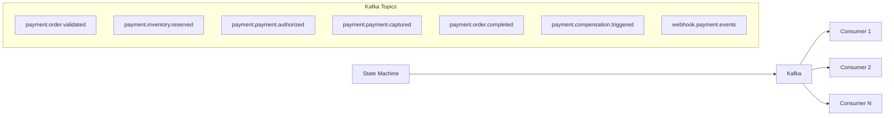
```mermaid
flowchart LR
    SM["State Machine"] --> Kafka["Kafka"]
    Kafka --> C1["Consumer 1"]
    Kafka --> C2["Consumer 2"]
    Kafka --> C3["Consumer N"]

    subgraph Topics["Kafka Topics"]
        T1["payment.order.validated"]
        T2["payment.inventory.reserved"]
        T3["payment.payment.authorized"]
        T4["payment.payment.captured"]
        T5["payment.order.completed"]
        T6["payment.compensation.triggered"]
        T7["webhook.payment.events"]
    end
```

**Benefits:**

- Temporal workflow doesn't know about downstream systems
- New consumers can be added without changing workflow
- Provides natural audit trail
- Enables event sourcing and replay

### Principle 6: Compensation Stack (LIFO Rollback)

When a step fails, all previous steps are compensated in reverse order:

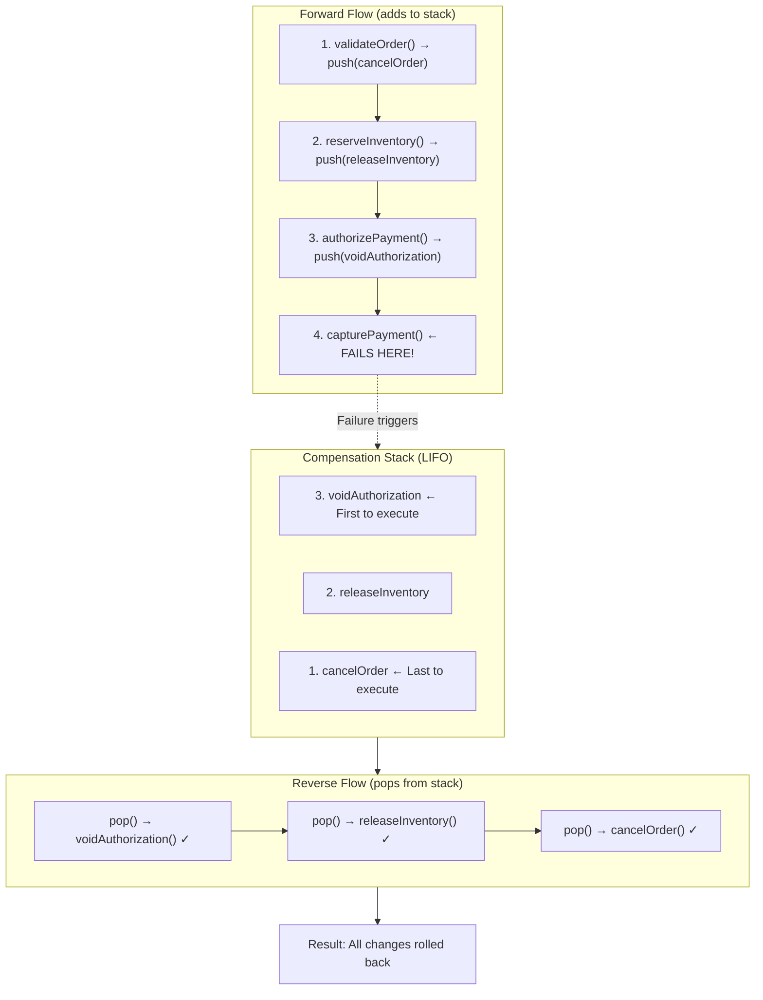
```mermaid
flowchart TB
    subgraph Forward["Forward Flow (adds to stack)"]
        F1["1. validateOrder() → push(cancelOrder)"]
        F2["2. reserveInventory() → push(releaseInventory)"]
        F3["3. authorizePayment() → push(voidAuthorization)"]
        F4["4. capturePayment() ← FAILS HERE!"]
        F1 --> F2 --> F3 --> F4
    end

    subgraph Stack["Compensation Stack (LIFO)"]
        S1["3. voidAuthorization ← First to execute"]
        S2["2. releaseInventory"]
        S3["1. cancelOrder ← Last to execute"]
    end

    subgraph Reverse["Reverse Flow (pops from stack)"]
        R1["pop() → voidAuthorization() ✓"]
        R2["pop() → releaseInventory() ✓"]
        R3["pop() → cancelOrder() ✓"]
        R1 --> R2 --> R3
    end

    F4 -.->|Failure triggers| Stack
    Stack --> Reverse
    Reverse --> Result["Result: All changes rolled back"]
```

**Implementation in this codebase:**

- `PaymentSagaWorkflowImpl` maintains `compensationStack` as `List<CompensationAction>`
- Each successful step adds compensation to front of list (LIFO)
- On failure, `compensate()` executes all compensations in order

### Principle 7: End-to-End Observability

Every request must be traceable across all services, threads, and async boundaries:

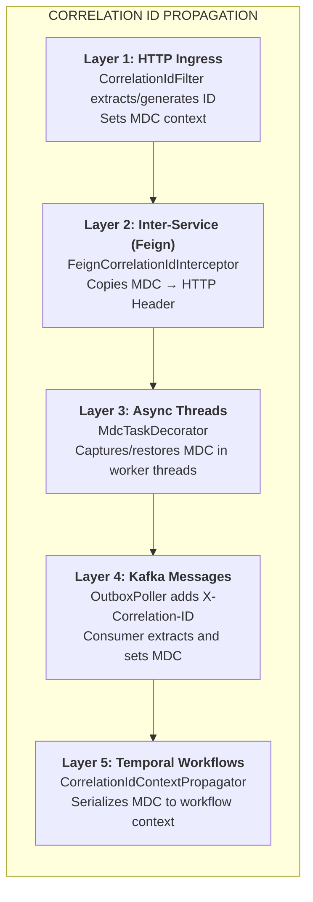
```mermaid
flowchart TB
    subgraph Propagation["CORRELATION ID PROPAGATION"]
        direction TB
        L1["<b>Layer 1: HTTP Ingress</b><br/>CorrelationIdFilter extracts/generates ID<br/>Sets MDC context"]
        L2["<b>Layer 2: Inter-Service (Feign)</b><br/>FeignCorrelationIdInterceptor<br/>Copies MDC → HTTP Header"]
        L3["<b>Layer 3: Async Threads</b><br/>MdcTaskDecorator<br/>Captures/restores MDC in worker threads"]
        L4["<b>Layer 4: Kafka Messages</b><br/>OutboxPoller adds X-Correlation-ID<br/>Consumer extracts and sets MDC"]
        L5["<b>Layer 5: Temporal Workflows</b><br/>CorrelationIdContextPropagator<br/>Serializes MDC to workflow context"]

        L1 --> L2 --> L3 --> L4 --> L5
    end
```

**Three Pillars of Observability:**

| Pillar      | Technology               | Purpose                                  |
| ----------- | ------------------------ | ---------------------------------------- |
| **Tracing** | Zipkin + Correlation IDs | End-to-end request tracking              |
| **Metrics** | Prometheus + Micrometer  | Business and infrastructure health       |
| **Logging** | SLF4J + MDC              | Structured logs with correlation context |

**Implementation in this codebase:**

- `CorrelationIdFilter` (payment-saga-common) - Shared servlet filter for all services
- `FeignCorrelationIdInterceptor` - Propagates correlation to downstream services
- `MdcTaskDecorator` - Preserves MDC context in async thread pools
- `CorrelationIdContextPropagator` - Propagates context across Temporal boundaries

**Note on Istio Integration:**

When running with Istio service mesh:
- B3 trace propagation is handled automatically by Envoy sidecars
- Application code focuses on business correlation IDs (`X-Correlation-ID`)
- Both work together: B3 for distributed tracing (Zipkin/Jaeger), correlation ID for business context
- `FeignCorrelationIdInterceptor` propagates B3 headers for mesh-aware tracing

### Principle 8: Structured Logging Pattern

All services use a unified log format for consistent parsing and aggregation:

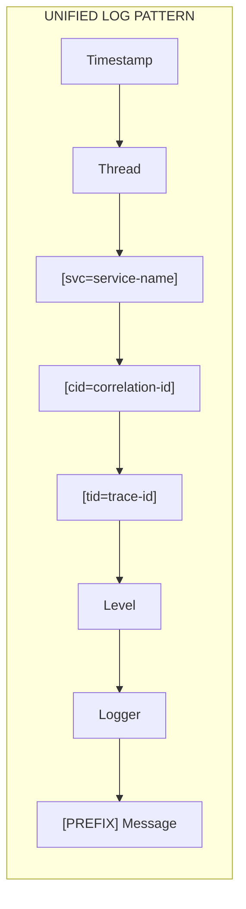
```mermaid
flowchart LR
    subgraph Pattern["UNIFIED LOG PATTERN"]
        direction TB
        P1["Timestamp"] --> P2["Thread"]
        P2 --> P3["[svc=service-name]"]
        P3 --> P4["[cid=correlation-id]"]
        P4 --> P5["[tid=trace-id]"]
        P5 --> P6["Level"]
        P6 --> P7["Logger"]
        P7 --> P8["[PREFIX] Message"]
    end
```

**Log Pattern:**

```
%d{yyyy-MM-dd HH:mm:ss.SSS} [%thread] [svc=%X{service:-}] [cid=%X{correlationId:-}] [tid=%X{traceId:-}] %-5level %logger{36} - %msg%n
```

**Standardized Prefixes by Layer:**

| Layer          | Prefix         | Example                                     |
| -------------- | -------------- | ------------------------------------------- |
| Controller/API | `[API]`        | `[API] Processing payment: orderId=ORD-123` |
| Service        | `[*-SVC]`      | `[ORDER-SVC] Validating order`              |
| Activity       | `[ACTIVITY-*]` | `[ACTIVITY-START] validateOrder`            |
| State Machine  | `[SM-*]`       | `[SM-TRANSITION] PENDING→AUTHORIZED`        |
| Consumer       | `[*-CONSUMER]` | `[WEBHOOK-CONSUMER] Processing event`       |
| Fallback       | `[FALLBACK-*]` | `[FALLBACK-ORDER] Service unavailable`      |

**Example Cross-Service Trace:**

```
10:30:45.100 [svc=payment-saga-orchestrator] [cid=abc-123] INFO  - [API] Processing payment
10:30:45.150 [svc=order-service]             [cid=abc-123] INFO  - [ORDER-SVC] Validating order
10:30:45.200 [svc=inventory-service]         [cid=abc-123] INFO  - [INVENTORY-SVC] Reserving stock
10:30:45.250 [svc=payment-gateway-service]   [cid=abc-123] INFO  - [PAYMENT-SVC] Authorizing payment
```

**Implementation in this codebase:**

- `LoggingConstants` - Centralized MDC keys and prefix constants
- All services share the same log pattern via `application.yml`
- Service-specific prefixes: `[ORDER-SVC]`, `[INVENTORY-SVC]`, `[PAYMENT-SVC]`

### Principle 9: Trace Resumption for Async Webhooks

External webhook responses (arriving hours/days later) must be linked back to original traces:

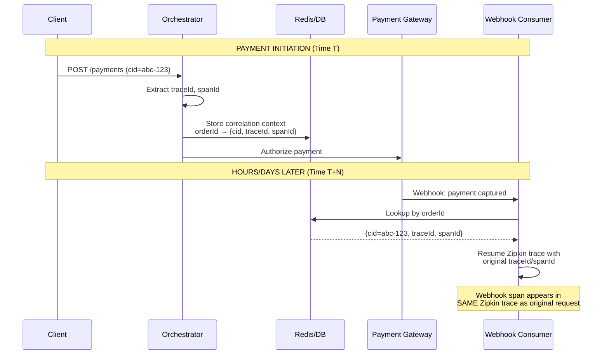
```mermaid
sequenceDiagram
    participant Client
    participant Orchestrator
    participant Redis as Redis/DB
    participant Gateway as Payment Gateway
    participant Webhook as Webhook Consumer

    Note over Client,Webhook: PAYMENT INITIATION (Time T)
    Client->>Orchestrator: POST /payments (cid=abc-123)
    Orchestrator->>Orchestrator: Extract traceId, spanId
    Orchestrator->>Redis: Store correlation context<br/>orderId → {cid, traceId, spanId}
    Orchestrator->>Gateway: Authorize payment

    Note over Client,Webhook: HOURS/DAYS LATER (Time T+N)
    Gateway->>Webhook: Webhook: payment.captured
    Webhook->>Redis: Lookup by orderId
    Redis-->>Webhook: {cid=abc-123, traceId, spanId}
    Webhook->>Webhook: Resume Zipkin trace with<br/>original traceId/spanId

    Note over Webhook: Webhook span appears in<br/>SAME Zipkin trace as original request
```

**Problem Solved:**

- Without trace resumption, webhooks appear as disconnected traces
- Logs cannot be linked back to original payment request
- End-to-end latency metrics are incomplete

**Storage Strategy:**

```
Redis (Primary):
  correlation:order:{orderId} → {correlationId, traceId, parentSpanId}
  correlation:ref:{authId}    → orderId (pointer)

PostgreSQL (Fallback):
  payment_requests.correlation_id
  payment_requests.trace_id
  payment_requests.parent_span_id
```

**Implementation in this codebase:**

- `CorrelationRegistry` / `RedisCorrelationRegistry` - Stores correlation context with 7-day TTL
- `TraceContextRestorer` - Utility to resume Zipkin traces
- `WebhookKafkaOutboxPoller` - Injects B3 trace headers into Kafka messages
- `WebhookEventConsumer` - Extracts headers and resumes traces

### Principle 10: Unified Error Handling and Error Code Mapping

All services use a standardized error response format with categorized error codes:

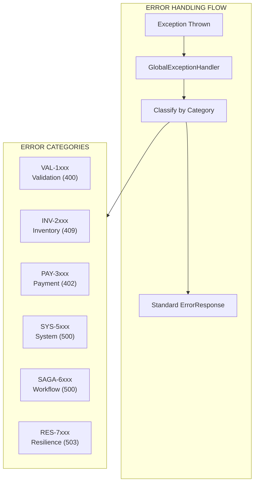
```mermaid
flowchart TB
    subgraph ErrorFlow["ERROR HANDLING FLOW"]
        Exception["Exception Thrown"]
        Handler["GlobalExceptionHandler"]
        Classify["Classify by Category"]
        Response["Standard ErrorResponse"]

        Exception --> Handler --> Classify --> Response
    end

    subgraph Categories["ERROR CATEGORIES"]
        VAL["VAL-1xxx<br/>Validation (400)"]
        INV["INV-2xxx<br/>Inventory (409)"]
        PAY["PAY-3xxx<br/>Payment (402)"]
        SYS["SYS-5xxx<br/>System (500)"]
        SAGA["SAGA-6xxx<br/>Workflow (500)"]
        RES["RES-7xxx<br/>Resilience (503)"]
    end

    Classify --> Categories
```

**Error Code Format:** `{CATEGORY}-{CODE}`

| Category      | Prefix      | HTTP Status | Retryable | Examples                                                     |
| :------------ | :---------- | ----------: | :-------: | :----------------------------------------------------------- |
| Validation    | `VAL-1xxx`  |         400 |    No     | `VAL-1001` Invalid request, `VAL-1004` Invalid amount        |
| Inventory     | `INV-2xxx`  |         409 |    No     | `INV-2001` Insufficient stock, `INV-2003` Reservation failed |
| Payment       | `PAY-3xxx`  |         402 |    No     | `PAY-3001` Auth failed, `PAY-3004` Card declined             |
| System        | `SYS-5xxx`  |         500 |    Yes    | `SYS-5001` Internal error, `SYS-5008` Timeout                |
| SAGA/Workflow | `SAGA-6xxx` |         500 |    Yes    | `SAGA-6001` Workflow failed, `SAGA-6002` Compensation failed |
| Resilience    | `RES-7xxx`  |         503 |    Yes    | `RES-7001` Circuit breaker open, `RES-7003` Rate limited     |

**Standard Error Response:**

```json
{
  "errorCode": "PAY-3004",
  "message": "Card declined by issuer",
  "category": "PAYMENT",
  "status": 402,
  "timestamp": "2024-01-15T10:30:00Z",
  "path": "/api/v1/payments",
  "traceId": "abc123",
  "correlationId": "xyz-789",
  "retryable": false,
  "details": {
    "declineCode": "insufficient_funds",
    "cardLast4": "4242"
  }
}
```

**External Error Code Mapping:**

Payment gateway errors are mapped to internal codes via `ErrorCodeMappingService`:

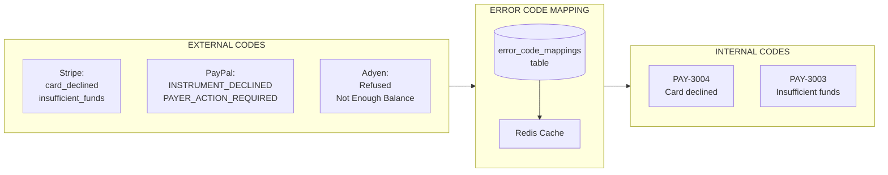
```mermaid
flowchart LR
    subgraph External["EXTERNAL CODES"]
        Stripe["Stripe:<br/>card_declined<br/>insufficient_funds"]
        PayPal["PayPal:<br/>INSTRUMENT_DECLINED<br/>PAYER_ACTION_REQUIRED"]
        Adyen["Adyen:<br/>Refused<br/>Not Enough Balance"]
    end

    subgraph Mapping["ERROR CODE MAPPING"]
        DB[(error_code_mappings<br/>table)]
        Cache["Redis Cache"]
        DB --> Cache
    end

    subgraph Internal["INTERNAL CODES"]
        PAY3004["PAY-3004<br/>Card declined"]
        PAY3003["PAY-3003<br/>Insufficient funds"]
    end

    External --> Mapping --> Internal
```

| External (Stripe)    | External (PayPal)     | Internal Code | Message            |
| :------------------- | :-------------------- | :------------ | :----------------- |
| `card_declined`      | `INSTRUMENT_DECLINED` | `PAY-3004`    | Card declined      |
| `insufficient_funds` | `PAYER_CANNOT_PAY`    | `PAY-3003`    | Insufficient funds |
| `expired_card`       | `CREDIT_CARD_EXPIRED` | `PAY-3005`    | Card expired       |
| `rate_limit`         | `RATE_LIMIT_REACHED`  | `RES-7003`    | Rate limited       |

**Implementation in this codebase:**

- `PaymentErrorCode` (payment-saga-common) - Enum of all error codes with categories
- `ErrorCategory` (payment-saga-common) - Error categories with HTTP status and retryable flag
- `ErrorResponse` (payment-saga-common) - Standard error response DTO
- `PaymentBusinessException` / `PaymentSystemException` - Typed exceptions
- `GlobalExceptionHandler` (orchestrator) - Centralized exception handling
- `ErrorCodeMappingService` (payment-gateway) - Maps external codes to internal codes
- `ErrorCodeMappingEntity` / `ErrorCodeMappingRepository` - Database-driven mappings

### Principle 11: Horizontal Scaling with Customer-Hash Sharding

The platform scales to 500+ TPS through customer-hash based sharding that distributes workflows across multiple Temporal task queues:

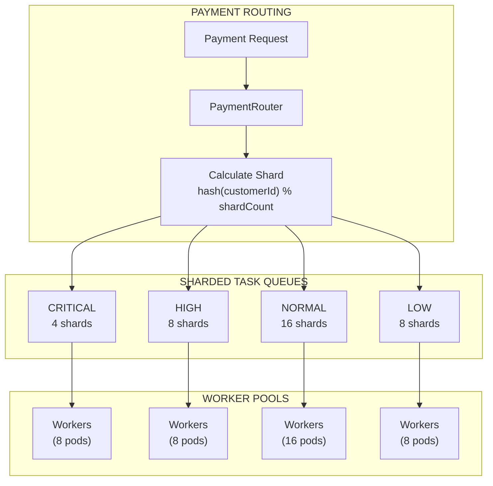
```mermaid
flowchart TB
    subgraph Routing["PAYMENT ROUTING"]
        Request["Payment Request"]
        Router["PaymentRouter"]
        Hash["Calculate Shard<br/>hash(customerId) % shardCount"]
    end

    subgraph Queues["SHARDED TASK QUEUES"]
        C["CRITICAL<br/>4 shards"]
        H["HIGH<br/>8 shards"]
        N["NORMAL<br/>16 shards"]
        L["LOW<br/>8 shards"]
    end

    subgraph Workers["WORKER POOLS"]
        W1["Workers<br/>(8 pods)"]
        W2["Workers<br/>(8 pods)"]
        W3["Workers<br/>(16 pods)"]
        W4["Workers<br/>(8 pods)"]
    end

    Request --> Router --> Hash
    Hash --> C & H & N & L
    C --> W1
    H --> W2
    N --> W3
    L --> W4
```

**Sharding Formula:**

```
shard_id = abs(customerId.hashCode()) % shardCount
task_queue = payment-saga-queue-{priority}-shard-{shard_id}

Example: customerId="CUST-12345", priority=NORMAL, shardCount=16
  → shard_id = 11
  → task_queue = "payment-saga-queue-normal-shard-11"
```

| Priority | Shards | Target SLA | Use Cases                              |
| :------- | -----: | :--------- | :------------------------------------- |
| CRITICAL |      4 | 5s         | VIP customers, >$5,000 transactions    |
| HIGH     |      8 | 10s        | Subscriptions, >$1,000 transactions    |
| NORMAL   |     16 | 30s        | Standard payments (60-70% traffic)     |
| LOW      |      8 | 60s        | Batch payments, scheduled transactions |

**Key Benefits:**

- **Customer Affinity**: Same customer always routes to same shard (preserves ordering)
- **Linear Scaling**: Add workers = proportional throughput increase
- **Hot-Spot Prevention**: Consistent hashing distributes load evenly
- **Priority Isolation**: VIP payments never blocked by batch processing

**Throughput Scaling Path:**

| Phase | Database   | Target TPS | Use Case             |
| :---- | :--------- | :--------- | :------------------- |
| 1-4   | PostgreSQL | 500-5K     | Standard production  |
| 5     | Cassandra  | 10K-100K+  | Bank-wide enterprise |

**Implementation in this codebase:**

- `ShardingConfiguration` (orchestrator) - Configuration properties for shard counts
- `ShardedWorkerFactory` (orchestrator) - Registers workers for each shard-priority combination
- `PaymentPriority.getShardedTaskQueue()` - Calculates sharded task queue name
- `PaymentRouter.calculateShardedTaskQueue()` - Routes payments to appropriate shard
- [TEMPORAL_SCALING_ARCHITECTURE.md](docs/TEMPORAL_SCALING_ARCHITECTURE.md) - Detailed architecture with Cassandra migration guide

### Principle 12: Defense-in-Depth Authentication

Authentication is enforced at multiple layers to prevent single points of failure:

```mermaid
flowchart TB
    subgraph Layer1["Layer 1: API Gateway (Kong)"]
        L1A["JWT Validation / OAuth 2.0 Token Introspection"]
        L1B["Rate Limiting (per-tenant)"]
        L1C["Bot Protection"]
    end

    subgraph Layer2["Layer 2: Application (Spring Security)"]
        L2A["JWT Validation (backup)"]
        L2B["Permission-Based Authorization (@PreAuthorize)"]
        L2C["Tenant Context Extraction"]
    end

    subgraph Layer3["Layer 3: Data (PostgreSQL RLS)"]
        L3A["Row-Level Security Policies"]
        L3B["Tenant Isolation"]
    end

    Layer1 --> Layer2 --> Layer3
```

**Kong Authentication Methods:**

- **JWT Validation** (default): Stateless validation of self-contained JWTs
- **OAuth 2.0 Token Introspection**: Active validation of opaque tokens with authorization server

**Implementation in this codebase:**

- Kong JWT/OAuth 2.0 plugin validates tokens at the edge
- Spring Security Resource Server validates JWT and extracts permissions
- `@PreAuthorize` annotations enforce fine-grained access control
- PostgreSQL RLS policies enforce tenant isolation at the database level

### Principle 13: Zero Trust Service Communication

All internal service-to-service communication is encrypted and authenticated via mTLS:

```mermaid
flowchart LR
    subgraph Mesh["Istio Service Mesh (mTLS)"]
        S1["orchestrator (Envoy sidecar)"]
        S2["order-service (Envoy sidecar)"]
        S3["inventory-service (Envoy sidecar)"]
        S4["payment-gateway (Envoy sidecar)"]
    end

    O["Orchestrator"] <-->|mTLS| OS["Order Service"]
    O <-->|mTLS| IS["Inventory Service"]
    O <-->|mTLS| PG["Payment Gateway"]
```

**Key Principles:**

- Never trust, always verify - every request is authenticated
- Kubernetes NetworkPolicies enforce least-privilege communication
- No plaintext traffic within the cluster
- Automatic certificate rotation via Istio's istiod (Citadel)

**Kubernetes Deployment (Istio):**

Istio service mesh provides automatic mTLS via Envoy sidecars. Certificates are managed and rotated automatically by istiod. See [Principle 21](#principle-21-layered-gateway-architecture) for Istio configuration details.

- `k8s/base/istio/peer-authentication.yaml` - mTLS STRICT mode
- `k8s/base/istio/authorization-policies.yaml` - Service-to-service access control
- `k8s/base/network-policies/` - NetworkPolicies for defense-in-depth

**Local Development (Non-Istio):**

For local profiles without Istio, optional certificate-based authentication can be configured:

- `MtlsConfiguration` - Configures certificate-based mTLS for Feign clients (optional)

### Principle 14: Webhook Security

All external payment provider webhooks are verified using provider-specific signature algorithms:

```mermaid
flowchart TB
    subgraph Verification["WEBHOOK VERIFICATION FLOW"]
        W1["1. IP Allowlist Check<br/>Only accept from provider IPs"]
        W2["2. Signature Verification<br/>HMAC-SHA256 or RSA-SHA256"]
        W3["3. Timestamp Validation<br/>Reject stale webhooks (>5 min)"]
        W4["4. Idempotency Check<br/>Deduplicate by event ID"]
        W5["5. Process Event<br/>Signal workflow"]

        W1 --> W2 --> W3 --> W4 --> W5
    end
```

| Provider | Algorithm                     | Status      |
| -------- | ----------------------------- | ----------- |
| Stripe   | HMAC-SHA256                   | Implemented |
| PayPal   | RSA-SHA256 (API verification) | Implemented |
| Adyen    | HMAC-SHA256                   | Implemented |
| Square   | HMAC-SHA256                   | Implemented |

**Implementation in this codebase:**

- `WebhookSecurityFilter` - IP allowlisting
- `StripeWebhookProcessor`, `PayPalWebhookProcessor`, etc. - Signature verification
- `WebhookIdempotencyService` - Deduplication

### Principle 15: Secrets Management

No secrets are stored in plain Kubernetes YAML or environment variables. All credentials use External Secrets Operator with AWS Secrets Manager:

```mermaid
flowchart LR
    subgraph AWS["AWS Secrets Manager"]
        S1["paylink/payment-gateway/stripe"]
        S2["paylink/payment-gateway/paypal"]
        S3["paylink/databases/postgres"]
    end

    subgraph K8s["Kubernetes"]
        ESO["External Secrets Operator"]
        Secret["K8s Secret"]
        Pod["Application Pod"]

        ESO -->|Sync| Secret
        Secret -->|Mount| Pod
    end

    AWS -->|Fetch| ESO
```

**Key Features:**

- Automatic rotation with zero downtime
- Audit trail of secret access
- Encryption at rest and in transit
- RBAC for secret access

**Implementation in this codebase:**

- `k8s/base/external-secrets/` - ExternalSecret manifests
- Application properties reference secrets via environment variables

### Principle 16: Multi-Tenant Data Isolation

All tenant data is isolated at the database level using PostgreSQL Row-Level Security (RLS):

```mermaid
flowchart TB
    subgraph Flow["REQUEST FLOW"]
        R1["Request with JWT"]
        R2["Extract tenant_id from JWT"]
        R3["Set PostgreSQL session variable"]
        R4["RLS policy filters all queries"]
    end

    R1 --> R2 --> R3 --> R4

    subgraph RLS["ROW-LEVEL SECURITY"]
        P1["CREATE POLICY tenant_isolation ON payment_requests<br/>USING (tenant_id = current_setting('app.current_tenant'))"]
    end
```

**Guarantees:**

- Tenants cannot access each other's data even with SQL injection
- All queries automatically filtered by tenant
- Admin bypass available for cross-tenant operations

**Implementation in this codebase:**

- `TenantContextFilter` - Extracts and sets tenant context
- `TenantAwareEntityListener` - Automatically sets tenant_id on persist
- `V10__add_rls_policies.sql` - Database migration for RLS policies

### Principle 17: Customer Consent Management (Open Banking)

SBV Circular 64 mandates explicit, granular customer consent for third-party data access:

```mermaid
flowchart TB
    subgraph Consent["CONSENT LIFECYCLE"]
        C1["TPP Requests Consent"]
        C2["Customer Reviews Scope"]
        C3["Customer Authorizes (SCA)"]
        C4["Consent Active (max 90 days)"]
        C5["Customer Revokes / Expires"]
    end

    C1 --> C2 --> C3 --> C4 --> C5

    subgraph Scope["CONSENT PERMISSIONS"]
        S1["ACCOUNTS - View account list"]
        S2["BALANCES - View balances"]
        S3["TRANSACTIONS - View history"]
        S4["PAYMENTS - Initiate payments"]
    end
```

**Consent Requirements (SBV Circular 64):**

- Granular permissions (accounts, balances, transactions, payments)
- Time-bound access (maximum 90 days)
- Customer-revocable at any time
- Strong Customer Authentication (SCA) for authorization

**Implementation in this codebase:**

- `ConsentEntity` / `ConsentRepository` - Consent persistence with expiry
- `ConsentService` - Consent lifecycle management
- `ConsentController` - Open Banking consent APIs
- `ConsentValidationFilter` - Validates consent_id in JWT claims

### Principle 18: Third-Party Provider Registration (Open Banking)

All TPPs must be registered and validated before accessing customer data:

```mermaid
flowchart TB
    subgraph TPP["TPP REGISTRATION FLOW"]
        T1["TPP Submits Registration"]
        T2["Validate SBV License Number"]
        T3["Verify Certificate"]
        T4["Issue API Credentials"]
        T5["Assign API Tier Access"]
    end

    T1 --> T2 --> T3 --> T4 --> T5

    subgraph Status["TPP STATUS"]
        S1["PENDING - Awaiting verification"]
        S2["ACTIVE - Authorized access"]
        S3["SUSPENDED - Temporarily blocked"]
        S4["REVOKED - Permanently blocked"]
    end
```

**TPP Verification (SBV Circular 64):**

- SBV license number validation
- mTLS client certificate authentication
- API tier restrictions (Tier 1/2/3)
- Rate limiting per TPP license

**Implementation in this codebase:**

- `ThirdPartyProviderEntity` / `TppRepository` - TPP persistence
- `TppRegistrationService` - TPP onboarding and credential management
- `TppController` - TPP management APIs
- Kong mTLS plugin - Certificate-based TPP authentication

### Principle 19: Data Access Audit (Open Banking)

All customer data access must be logged for regulatory compliance:

```mermaid
flowchart TB
    subgraph Audit["AUDIT TRAIL"]
        A1["Request Received"]
        A2["Extract Context<br/>(TPP, Customer, Consent)"]
        A3["Log to Immutable Table"]
        A4["Process Request"]
        A5["Log Response Status"]
    end

    A1 --> A2 --> A3 --> A4 --> A5

    subgraph Fields["AUDIT FIELDS"]
        F1["timestamp - When accessed"]
        F2["tpp_id - Who accessed"]
        F3["customer_id - Whose data"]
        F4["consent_id - Authorization"]
        F5["resource_type - What data"]
        F6["correlation_id - Trace link"]
    end
```

**Audit Requirements (SBV Circular 64):**

- All API access logged to immutable table
- 7-year retention period
- No UPDATE/DELETE on audit records
- SBV reporting capability

**Implementation in this codebase:**

- `DataAccessAuditEntity` - Audit record persistence
- `DataAccessAuditService` - Audit logging service
- `DataAccessAuditFilter` - Automatic request/response logging
- Database trigger - Prevents audit record modification

### Principle 20: API Tiering (Open Banking)

Open Banking APIs are classified into tiers with different access requirements:

```mermaid
flowchart TB
    subgraph Tiers["API TIERS (SBV Circular 64)"]
        T1["Tier 1: Information Query<br/>• Account list<br/>• Product catalog<br/>• Branch locations"]
        T2["Tier 2: Consent-Based (AIS)<br/>• Account details<br/>• Transaction history<br/>• Balance inquiry"]
        T3["Tier 3: Payment Initiation (PIS)<br/>• Payment initiation<br/>• Payment status<br/>• Strong Customer Auth"]
    end

    subgraph Access["ACCESS REQUIREMENTS"]
        A1["Tier 1: TPP Registration"]
        A2["Tier 2: + Customer Consent"]
        A3["Tier 3: + SCA Confirmation"]
    end

    T1 --> A1
    T2 --> A2
    T3 --> A3
```

**API Tier Classification:**

| Tier   | Category                           | Consent Required | SCA Required |
| :----- | :--------------------------------- | :--------------- | :----------- |
| Tier 1 | Information Query                  | No               | No           |
| Tier 2 | Account Information Services (AIS) | Yes              | No           |
| Tier 3 | Payment Initiation Services (PIS)  | Yes              | Yes          |

**Implementation in this codebase:**

- `AccountInfoController` - Tier 1 APIs
- `TransactionController` - Tier 2 APIs
- `PaymentInitiationController` - Tier 3 APIs
- `OpenBankingSecurityConfig` - Tier-based access control

### Principle 21: Layered Gateway Architecture

External and internal traffic are handled by separate security layers with distinct responsibilities:

```mermaid
flowchart TB
    subgraph External["EXTERNAL LAYER (Kong Gateway)"]
        E1["Authentication (JWT/API Key)"]
        E2["Rate Limiting (100/min payments, 1000/min global)"]
        E3["Security Headers (HSTS, X-Frame-Options, CSP)"]
        E4["Correlation ID Injection"]
        E5["Request Size Limiting (10MB)"]
    end

    subgraph Internal["INTERNAL LAYER (Istio Service Mesh)"]
        I1["mTLS Encryption (STRICT mode)"]
        I2["Authorization Policies (service-to-service ACLs)"]
        I3["Circuit Breaking & Retries"]
        I4["B3 Distributed Tracing"]
        I5["Load Balancing with Health Checks"]
    end

    External --> Internal
```

**Service Access Matrix (Istio AuthorizationPolicy):**

| FROM \ TO        | Order | Inventory | Payment | Open Banking |
| ---------------- | ----- | --------- | ------- | ------------ |
| Kong (External)  | ✅    | ✅        | ✅      | ✅           |
| Orchestrator     | ✅    | ✅        | ✅      | ❌           |
| Open Banking API | ✅    | ❌        | ✅      | -            |
| Domain Services  | ❌    | ❌        | ❌      | ❌           |

**Key Design Decisions:**

- **Kong at edge**: Handles authentication before traffic enters the mesh
- **Istio internally**: Zero-trust with mTLS between all services
- **No direct cross-domain calls**: Order cannot call Inventory directly (prevents tight coupling)
- **Orchestrator as hub**: Only the orchestrator coordinates saga steps

**Implementation in this codebase:**

- `k8s/base/kong/` - Kong ingress routes and plugins
- `k8s/base/istio/peer-authentication.yaml` - mTLS STRICT mode
- `k8s/base/istio/authorization-policies.yaml` - Service access control
- `k8s/base/istio/destination-rules.yaml` - Traffic policies
- [API_GATEWAY_ARCHITECTURE.md](docs/API_GATEWAY_ARCHITECTURE.md) - Detailed architecture documentation

### Architecture Validation

These principles have been validated through:

| Principle                    | Implementation                                                            | Tests                                              |
| :--------------------------- | :------------------------------------------------------------------------ | :------------------------------------------------- |
| Minimal Workflow State       | `PaymentSagaWorkflowImpl` stores only IDs                                 | `PaymentSagaWorkflowTest`                          |
| Single Responsibility        | Temporal + State Machine separation                                       | `PaymentStateMachineTest`                          |
| Idempotency                  | `IdempotencyService`, `WebhookIdempotencyService`                         | `*IdempotencyTest`                                 |
| Transactional Outbox         | `OutboxPoller`, `WebhookKafkaOutboxPoller`                                | `OutboxPollerTest`, `WebhookKafkaOutboxPollerTest` |
| Event-Driven                 | Kafka topics for all domain events                                        | `WebhookEventConsumerTest`                         |
| Compensation Stack           | LIFO rollback in `PaymentSagaWorkflowImpl`                                | `PaymentSagaWorkflowAdvancedTest`                  |
| End-to-End Observability     | `CorrelationIdFilter`, `MdcTaskDecorator`, Propagators                    | `CorrelationIdFilterTest`                          |
| Structured Logging           | `LoggingConstants`, unified log pattern, MDC keys                         | Service integration tests                          |
| Trace Resumption             | `CorrelationRegistry`, `TraceContextRestorer`                             | `WebhookEventConsumerTest`                         |
| Unified Error Handling       | `PaymentErrorCode`, `GlobalExceptionHandler`, `ErrorCodeMappingService`   | `GlobalExceptionHandlerTest`                       |
| Horizontal Scaling           | `ShardingConfiguration`, `ShardedWorkerFactory`, `PaymentRouter` sharding | `PaymentRouterTest` sharding tests                 |
| Defense-in-Depth Auth        | Kong + Spring Security + RLS                                              | Security integration tests                         |
| Zero Trust mTLS              | Istio mTLS (STRICT), NetworkPolicies                                      | Infrastructure tests                               |
| Webhook Security             | Signature verification, IP allowlisting                                   | `WebhookProcessor*Test`                            |
| Secrets Management           | External Secrets Operator                                                 | Deployment validation                              |
| Multi-Tenant Isolation       | PostgreSQL RLS, TenantContext                                             | `TenantIsolationTest`                              |
| Customer Consent Management  | `ConsentEntity`, `ConsentService`, `ConsentValidationFilter`              | `ConsentServiceTest`                               |
| TPP Registration             | `ThirdPartyProviderEntity`, `TppRegistrationService`, Kong mTLS           | `TppRegistrationServiceTest`                       |
| Data Access Audit            | `DataAccessAuditEntity`, `DataAccessAuditFilter`, immutable table         | `DataAccessAuditServiceTest`                       |
| API Tiering                  | Tier 1/2/3 controllers, `OpenBankingSecurityConfig`                       | Open Banking API tests                             |
| Layered Gateway Architecture | Kong (edge) + Istio (mesh), `authorization-policies.yaml`                 | Infrastructure tests                               |

## Module Structure

```
payment-saga/
├── order-service-api/           # Order Service API contracts (DTOs, interfaces)
├── inventory-service-api/       # Inventory Service API contracts
├── payment-gateway-service-api/ # Payment Gateway API contracts
├── payment-saga-common/         # Shared code, domain events, outbox pattern
├── order-service/               # Order management microservice
├── inventory-service/           # Stock management microservice
├── payment-gateway-service/     # Payment provider integration microservice
├── payment-saga-orchestrator/   # SAGA orchestrator (Temporal workflows)
├── k8s/                         # Kubernetes manifests (Kong Gateway, EKS overlays)
└── observability/               # Prometheus, Grafana configurations
```

### API Module Pattern

Services communicate through API contract modules:

- **`*-api` modules** contain DTOs, request/response classes, and service interfaces
- **Implementation modules** depend only on API modules (not other implementations)
- **Decoupled deployments** - services can be deployed independently

## Microservices Communication

```mermaid
flowchart TB
    subgraph Sync["SYNCHRONOUS (Feign + K8s DNS)"]
        Orch["Orchestrator<br/>@FeignClient(name='order-service')"]
        K8s["Kubernetes DNS<br/>(Service Discovery)"]
        Order["Order Service<br/>order-service"]
        Orch --> K8s --> Order
    end

    subgraph Async["ASYNCHRONOUS (Kafka + Outbox)"]
        Txn["Business Transaction<br/>(Atomic)"]
        Outbox["Outbox Table<br/>(Same DB)"]
        KafkaTopic["Kafka Topics"]
        Consumers["Consumers<br/>(Other Services)"]
        Txn --> Outbox --> KafkaTopic --> Consumers
    end
```

### Communication Patterns

| Pattern               | Technology                    | Use Case                                           |
| --------------------- | ----------------------------- | -------------------------------------------------- |
| **Synchronous**       | Spring Cloud OpenFeign        | SAGA step execution (validate, reserve, authorize) |
| **Service Discovery** | Kubernetes DNS + Spring Cloud | Service resolution via K8s DNS (EKS/K8s profiles)  |
| **API Gateway**       | Kong Gateway                  | Ingress routing, rate limiting, authentication     |
| **Async Events**      | Kafka + Outbox                | Domain event publishing (payment captured, etc.)   |
| **Webhook Ingestion** | Kafka                         | External payment gateway confirmations             |
| **Caching**           | Redis                         | Idempotency keys, session data                     |
| **Tracing**           | Zipkin + Brave                | Distributed request tracing                        |

### Database-per-Service

Each microservice owns its data with complete isolation:

```mermaid
flowchart TB
    subgraph Services["Microservices"]
        OrderSvc["ORDER SERVICE"]
        InvSvc["INVENTORY SERVICE"]
        PaySvc["PAYMENT GATEWAY"]
        OrchestratorSvc["ORCHESTRATOR"]
    end

    subgraph Databases["Databases"]
        OrderDB[("order_db :5432<br/>• orders<br/>• order_items<br/>• order_history")]
        InvDB[("inventory_db :5434<br/>• products<br/>• inventory<br/>• reservations")]
        PayDB[("payment_db :5435<br/>• transactions<br/>• authorizations<br/>• captures<br/>• webhook_events")]
        SagaDB[("saga_db :5436<br/>• payment_requests<br/>• transactions<br/>• state_machine_context<br/>• outbox_events<br/>• idempotency_records<br/>• webhook_consumed<br/>• compensation_records")]
    end

    OrderSvc --> OrderDB
    InvSvc --> InvDB
    PaySvc --> PayDB
    OrchestratorSvc --> SagaDB
```

**Benefits:**

- Independent scaling per service
- Technology flexibility (could use different DBs)
- Failure isolation
- Clear data ownership

## Key Features

- Minimal Workflow State - Avoids Temporal history bloat anti-pattern
- Idempotency at Every Layer - Safe retries without side effects
- Automatic Compensation - LIFO rollback on failures
- Rich Domain State - 14 business states, 30+ events
- Transactional Outbox - Reliable event publishing
- Database-per-Service - True microservices data isolation
- Distributed Tracing - Zipkin integration with correlation IDs
- Production Metrics - Prometheus + Grafana dashboards
- Kubernetes Ready - Kustomize-based deployment
- **Resilience4j Integration** - Circuit breakers, bulkheads, rate limiters
- **Unified Error Handling** - Standardized error codes and responses
- **Payment Funnel Routing** - Priority-based task queue assignment
- **Consistent Hash Partitioning** - Customer-sticky Kafka partitioning
- **Payment Product Funnel** - 10 payment types with configurable workflows, fee calculation, and rule-based routing

## Enterprise-Grade Resilience & Fault Tolerance

### Resilience4j Integration

The platform implements comprehensive resilience patterns using Resilience4j:

```mermaid
flowchart TB
    subgraph Flow["REQUEST FLOW (Innermost to Outermost)"]
        Request["Client Request"]
        Bulkhead["Bulkhead<br/>• order: 20 concurrent<br/>• inventory: 20 concurrent<br/>• payment: 15 concurrent"]
        RateLimiter["Rate Limiter<br/>• order: 200/sec<br/>• inventory: 200/sec<br/>• payment: 50/sec"]
        CircuitBreaker["Circuit Breaker<br/>• Window: 10-20 calls<br/>• Threshold: 40-60%<br/>• Open: 30-60 seconds"]
        Retry["Retry<br/>• Max attempts: 3<br/>• Backoff: 1s → 2s → 4s<br/>• Ignores business exceptions"]
        Feign["Feign Client → Service"]

        Request --> Bulkhead --> RateLimiter --> CircuitBreaker --> Retry --> Feign
    end
```

```mermaid
stateDiagram-v2
    [*] --> CLOSED
    CLOSED --> OPEN : Failure rate exceeds threshold
    OPEN --> HALF_OPEN : Wait duration expires
    HALF_OPEN --> CLOSED : Success
    HALF_OPEN --> OPEN : Failure
```

**Configuration (per service):**

| Service                 | Circuit Breaker       | Bulkhead      | Rate Limiter |
| ----------------------- | --------------------- | ------------- | ------------ |
| order-service           | 50% failure, 30s wait | 20 concurrent | 200/sec      |
| inventory-service       | 60% failure, 30s wait | 20 concurrent | 200/sec      |
| payment-gateway-service | 40% failure, 60s wait | 15 concurrent | 50/sec       |

**Resilient Client Wrappers:**

```java
// ResilientOrderClient wraps OrderClient with all resilience patterns
@Bulkhead(name = "order-service")
@RateLimiter(name = "order-service")
@CircuitBreaker(name = "order-service", fallbackMethod = "validateOrderFallback")
@Retry(name = "order-service")
public OrderValidation validateOrder(OrderRequest request) {
    return orderClient.validateOrder(request);
}
```

**Fallback Strategies:**

- **Forward operations**: Return failed response (triggers saga compensation)
- **Compensation operations**: Log failure, continue compensation (fail-open)
- **Critical payments**: Never fake success, always return declined

**Monitoring Endpoints:**

```bash
# Check circuit breaker states
curl http://localhost:9090/actuator/circuitbreakers

# Check rate limiter status
curl http://localhost:9090/actuator/ratelimiters

# Prometheus metrics
curl http://localhost:9090/actuator/prometheus | grep resilience4j
```

### Unified Error Handling

Standardized error codes and responses across the platform:

| Category      | Code      | Description             | HTTP    | Retryable |
| ------------- | --------- | ----------------------- | ------- | --------- |
| **VAL-1xxx**  |           | **Validation Errors**   | **400** | **No**    |
|               | VAL-1001  | Invalid request format  | 400     | No        |
|               | VAL-1002  | Required field missing  | 400     | No        |
|               | VAL-1003  | Invalid order ID        | 400     | No        |
|               | VAL-1010  | Order validation failed | 400     | No        |
| **INV-2xxx**  |           | **Inventory Errors**    | **409** | **No**    |
|               | INV-2001  | Insufficient stock      | 409     | No        |
|               | INV-2003  | Reservation failed      | 409     | No        |
|               | INV-2005  | Reservation not found   | 409     | No        |
| **PAY-3xxx**  |           | **Payment Errors**      | **402** | **No**    |
|               | PAY-3001  | Authorization failed    | 402     | No        |
|               | PAY-3004  | Card declined           | 402     | No        |
|               | PAY-3007  | Fraud suspected         | 402     | No        |
| **SYS-5xxx**  |           | **System Errors**       | **500** | **Yes**   |
|               | SYS-5001  | Internal error          | 500     | Yes       |
|               | SYS-5002  | Database error          | 500     | Yes       |
|               | SYS-5008  | Operation timeout       | 500     | Yes       |
| **SAGA-6xxx** |           | **Workflow Errors**     | **500** | **Yes**   |
|               | SAGA-6001 | Workflow failed         | 500     | Yes       |
|               | SAGA-6002 | Compensation failed     | 500     | Yes       |
|               | SAGA-6006 | Payment saga not found  | 500     | Yes       |
| **RES-7xxx**  |           | **Resilience Errors**   | **503** | **Yes**   |
|               | RES-7001  | Circuit breaker open    | 503     | Yes       |
|               | RES-7002  | Bulkhead full           | 503     | Yes       |
|               | RES-7003  | Rate limited            | 429     | Yes       |

**Error Response Format:**

```json
{
  "errorCode": "PAY-3004",
  "message": "Card was declined by issuer",
  "category": "PAYMENT",
  "status": 402,
  "timestamp": "2024-01-15T10:30:00Z",
  "path": "/api/v1/payments",
  "traceId": "abc123def456",
  "correlationId": "req-789",
  "retryable": false,
  "details": {
    "orderId": "ORD-001",
    "declineCode": "insufficient_funds"
  }
}
```

**Global Exception Handler:**

The `GlobalExceptionHandler` provides consistent error responses for:

- Business exceptions (`PaymentBusinessException`)
- System exceptions (`PaymentSystemException`)
- Resilience exceptions (circuit breaker, bulkhead, rate limiter)
- Validation errors (Bean Validation)
- Feign client errors
- Temporal workflow errors

### Payment Funnel & Distribution

Priority-based routing for optimal resource allocation:

```mermaid
flowchart TB
    Request["Payment Request"] --> Priority

    subgraph Priority["PRIORITY CALCULATION"]
        P1["VIP Customer? → CRITICAL"]
        P2["Amount > $5,000? → CRITICAL"]
        P3["Amount > $1,000? → HIGH"]
        P4["Subscription? → HIGH"]
        P5["Batch Payment? → LOW"]
        P6["Otherwise → NORMAL"]
    end

    Priority --> Queue

    subgraph Queue["TASK QUEUE ASSIGNMENT"]
        Q1["CRITICAL → queue-critical (3 workers, 5s SLA)"]
        Q2["HIGH → queue-high (5 workers, 10s SLA)"]
        Q3["NORMAL → queue-normal (10 workers, 30s SLA)"]
        Q4["LOW → queue-low (20 workers, 60s SLA)"]
    end

    Queue --> Channel

    subgraph Channel["CHANNEL SELECTION"]
        C1["1. Check channel health"]
        C2["2. Filter by amount limits"]
        C3["3. Weighted random selection"]
        C4["4. Fallback if unhealthy"]

        subgraph Weights["Channel Weights"]
            W1["STRIPE (40%) - Default"]
            W2["PAYPAL (30%) - International"]
            W3["ADYEN (20%) - Enterprise"]
            W4["SQUARE (10%) - Disabled"]
        end
    end
```

**Routing Context:**

```java
PaymentRoutingContext context = router.route(orderRequest);
// Returns:
// - selectedChannel: STRIPE
// - priority: CRITICAL
// - taskQueue: payment-saga-queue-critical
// - selectionReason: "VIP customer"
// - routedAt: 2024-01-15T10:30:00Z
```

### Kafka Consistent Hashing

Customer-sticky partitioning ensures ordering and cache locality:

```mermaid
flowchart TB
    Key["{customerId}:{orderId}"] --> Extract["Extract partition key<br/>{customerId}"]
    Extract --> Hash["Hash (MD5)<br/>0x7A3F..."]
    Hash --> Ring["Consistent Hash Ring<br/>(150 VNodes per partition)"]
    Ring --> Partition["Partition 7"]

    subgraph Example["Example Routing"]
        E1["CUST-123:ORD-001 → Partition 7"]
        E2["CUST-123:ORD-002 → Partition 7 (same!)"]
        E3["CUST-456:ORD-003 → Partition 3"]
    end
```

**Benefits:**

- Same customer always routes to same partition
- Minimizes key remapping when partitions change (~25% remapped)
- Even distribution across partitions
- Preserves ordering for same customer's orders
- Better cache locality for customer data

**Kafka Producer Configuration:**

```yaml
spring:
  kafka:
    producer:
      properties:
        partitioner.class: com.payment.saga.kafka.PaymentConsistentHashPartitioner
        batch.size: 32768
        linger.ms: 5
        compression.type: lz4
        buffer.memory: 67108864
```

### Throughput Optimization

Connection pool and async executor tuning for high throughput:

**Database (HikariCP):**

| Setting                    |   Value | Description                               |
| :------------------------- | ------: | :---------------------------------------- |
| `maximum-pool-size`        |      30 | Max connections in pool                   |
| `minimum-idle`             |      10 | Min idle connections maintained           |
| `connection-timeout`       | 10000ms | Max wait for connection                   |
| `leak-detection-threshold` | 60000ms | Log warning if connection held too long   |
| `PreparedStatement cache`  |     250 | Cached prepared statements per connection |

**Redis (Lettuce):**

| Setting      |  Value | Description             |
| :----------- | -----: | :---------------------- |
| `max-active` |     32 | Max active connections  |
| `max-idle`   |     16 | Max idle connections    |
| `min-idle`   |      8 | Min idle connections    |
| `max-wait`   | 1000ms | Max wait for connection |

**Temporal Worker:**

| Setting                                  | Value | Description                      |
| :--------------------------------------- | ----: | :------------------------------- |
| `max-concurrent-activities`              |    50 | Max parallel activity executions |
| `max-concurrent-workflows`               |   200 | Max parallel workflow executions |
| `max-concurrent-local-activities`        |   100 | Max parallel local activities    |
| `sticky-queue-schedule-to-start-timeout` |    5s | Sticky execution timeout         |

**Async Task Executors:**

| Executor               | Core | Max | Queue | Purpose                  |
| :--------------------- | ---: | --: | ----: | :----------------------- |
| `paymentTaskExecutor`  |   10 |  50 |   100 | Default async operations |
| `webhookTaskExecutor`  |    5 |  25 |   200 | Webhook processing       |
| `compensationExecutor` |    5 |  20 |    50 | Rollback operations      |
| `outboxTaskExecutor`   |    3 |  10 |   100 | Outbox polling           |
| `metricsTaskExecutor`  |    2 |   5 |   500 | Background metrics       |

**Feign Clients:**

| Setting                        |   Value | Description                          |
| :----------------------------- | ------: | :----------------------------------- |
| `default.connect-timeout`      |  5000ms | Connection timeout for all clients   |
| `default.read-timeout`         | 10000ms | Read timeout for all clients         |
| `payment-gateway.read-timeout` | 15000ms | Extended timeout for payment gateway |

### Resilience Verification

```bash
# 1. Check circuit breaker state
curl http://localhost:9090/actuator/circuitbreakers | jq '.circuitBreakers'

# 2. Test rate limiting (send burst of requests)
for i in {1..200}; do
  curl -s -o /dev/null -w "%{http_code}\n" \
    http://localhost:9090/api/v1/payments -X POST \
    -H "Content-Type: application/json" \
    -d '{"orderId":"ORD-'$i'","customerId":"CUST-001","amount":100}' &
done
wait
# Expect: 429 (Too Many Requests) after limit exceeded

# 3. Verify error codes
curl -X POST http://localhost:9090/api/v1/payments \
  -H "Content-Type: application/json" \
  -d '{"orderId": null}' | jq '.errorCode'
# Expect: "VAL-1001"

# 4. Check consistent hashing
# Same customer always maps to same partition
echo "CUST-123:order1" | md5 | cut -c1-8  # Same prefix = same partition
echo "CUST-123:order2" | md5 | cut -c1-8  # Same prefix = same partition

# 5. Monitor resilience metrics
curl http://localhost:9090/actuator/prometheus | grep -E "resilience4j_(circuitbreaker|bulkhead|ratelimiter)"
```

## Payment Product Funnel System

The platform supports a highly configurable Payment Product Funnel system that routes payments through product-specific workflows with dynamic fee calculation and rule-based channel selection.

### Supported Payment Products

| Product                | Category         | Key Characteristics                                     |
| :--------------------- | :--------------- | :------------------------------------------------------ |
| **Bank Transfer**      | `FUNDS_TRANSFER` | ACH/Wire/SEPA, async confirmation (1-3 days)            |
| **Card Payment**       | `CARD`           | Existing flow enhanced with fees                        |
| **Points & Loyalty**   | `ALTERNATIVE`    | Instant redemption, no inventory requirement            |
| **Loan Disbursement**  | `LENDING`        | Heavy compliance (KYC/AML), credit checks               |
| **Loan Settlement**    | `LENDING`        | Links to loan system                                    |
| **Investment Trading** | `TRADING`        | T+2 settlement, brokerage integration                   |
| **Bill Payment**       | `RECURRING`      | Scheduling support, biller verification                 |
| **Multi-Source**       | `COMPOSITE`      | Split across multiple payment sources (child workflows) |
| **Crypto**             | `CRYPTO`         | Blockchain confirmations, wallet verification           |
| **Merchant/Affiliate** | `B2B`            | Custom fees, payout reconciliation                      |

### Payment Categories

| Category         | Products                           | Compliance         | Settlement    |
| :--------------- | :--------------------------------- | :----------------- | :------------ |
| `FUNDS_TRANSFER` | Bank Transfer                      | Standard           | 1-3 days      |
| `CARD`           | Card Payment                       | Standard           | Instant       |
| `ALTERNATIVE`    | Points & Loyalty                   | Standard           | Instant       |
| `LENDING`        | Loan Disbursement, Loan Settlement | Enhanced (KYC/AML) | 1-5 days      |
| `TRADING`        | Investment Trading                 | Enhanced           | T+2           |
| `RECURRING`      | Bill Payment                       | Standard           | Scheduled     |
| `COMPOSITE`      | Multi-Source                       | Standard           | Varies        |
| `CRYPTO`         | Crypto                             | Enhanced           | Confirmations |
| `B2B`            | Merchant/Affiliate                 | Standard           | Net-30/60     |

### Fee Calculation Engine

The platform includes a sophisticated fee calculation engine supporting multiple fee types:

**Fee Types:**

| Type         | Description                                 | Example                       |
| :----------- | :------------------------------------------ | :---------------------------- |
| `FLAT`       | Fixed amount regardless of transaction size | $0.30 per transaction         |
| `PERCENTAGE` | Percentage of transaction amount            | 2.9% of amount                |
| `TIERED`     | Variable rate based on amount brackets      | 0-$1K: $0.50, $1K-$10K: $1.00 |
| `HYBRID`     | Combination of flat + percentage            | 2.9% + $0.30                  |

```mermaid
flowchart TB
    subgraph Flow["CALCULATION FLOW"]
        R["1. Resolve Rules<br/>• Check merchant-specific first<br/>• Fall back to global rules"]
        C["2. Calculate Base Fee<br/>• Apply fee type formula"]
        B["3. Apply Bounds<br/>• Enforce min/max fee"]
        A["4. Audit Log<br/>• Record breakdown"]
        R --> C --> B --> A
    end
```

**Fee Rule Configuration:**

```java
// Example: Hybrid fee rule for card payments
FeeRuleEntity.builder()
    .ruleId("CARD_DEFAULT")
    .productType("card")
    .feeType(FeeType.HYBRID)
    .flatAmount(BigDecimal.valueOf(0.30))
    .percentageRate(BigDecimal.valueOf(0.029))  // 2.9%
    .minFee(BigDecimal.valueOf(0.50))
    .maxFee(BigDecimal.valueOf(50.00))
    .build();

// Example: Tiered fee rule for bank transfers
FeeRuleEntity.builder()
    .ruleId("BANK_TRANSFER_TIERED")
    .productType("bank_transfer")
    .feeType(FeeType.TIERED)
    .tierConfig("""
        [
            {"maxAmount": 1000, "flatFee": 0.50},
            {"maxAmount": 10000, "flatFee": 1.00},
            {"maxAmount": 100000, "flatFee": 5.00},
            {"flatFee": 25.00}
        ]
        """)
    .build();
```

### Product Configuration Service

Each payment product has configurable workflow steps, validations, and channels:

**CARD_PAYMENT:**

| Attribute      | Value                                                                   |
| :------------- | :---------------------------------------------------------------------- |
| Workflow Steps | `VALIDATE` → `RESERVE_INVENTORY` → `AUTHORIZE` → `CAPTURE` → `COMPLETE` |
| Validations    | `CUSTOMER_VERIFIED`, `MERCHANT_ACTIVE`                                  |
| Channels       | STRIPE, ADYEN, PAYPAL                                                   |
| Priority       | NORMAL                                                                  |
| Timeout        | 5 min                                                                   |

**BANK_TRANSFER:**

| Attribute      | Value                                                               |
| :------------- | :------------------------------------------------------------------ |
| Workflow Steps | `VALIDATE` → `VERIFY_SOURCE` → `VERIFY_DEST` → `INITIATE` → `AWAIT` |
| Validations    | `CUSTOMER_VERIFIED`, `KYC_COMPLETE`                                 |
| Channels       | PLAID, STRIPE_ACH, WIRE                                             |
| Priority       | NORMAL                                                              |
| Timeout        | 3 days                                                              |

**MULTI_SOURCE:**

| Attribute      | Value                                                                  |
| :------------- | :--------------------------------------------------------------------- |
| Workflow Steps | `VALIDATE` → `ALLOCATE` → `PROCESS_SOURCES` → `AGGREGATE` → `COMPLETE` |
| Validations    | `CUSTOMER_VERIFIED`, `ALL_SOURCES_VALID`                               |
| Channels       | INTERNAL                                                               |
| Priority       | NORMAL                                                                 |
| Timeout        | 10 min                                                                 |
| Notes          | Spawns child workflows for each payment source                         |

**CRYPTO:**

| Attribute      | Value                                                          |
| :------------- | :------------------------------------------------------------- |
| Workflow Steps | `VALIDATE` → `CHECK_BALANCE` → `INITIATE` → `AWAIT_BLOCKCHAIN` |
| Validations    | `WALLET_VERIFIED`, `KYC_COMPLETE`                              |
| Channels       | COINBASE, CIRCLE                                               |
| Priority       | HIGH                                                           |
| Timeout        | 1 hour                                                         |
| Notes          | Requires 6 blockchain confirmations                            |

### Rule-Based Product Router

Dynamic channel selection using SpEL (Spring Expression Language) expressions:

```mermaid
flowchart TB
    Request["Payment Request"]

    Request --> Step1["1. Load Routing Rules<br/>(cached, ordered by priority)"]

    Step1 --> Step2
    subgraph Step2["2. Evaluate SpEL Conditions"]
        R1["amount > 50000 → WIRE_TRANSFER"]
        R2["currency == 'EUR' → SEPA"]
        R3["metadata['country']=='US' → ACH"]
        R4["true (default) → STRIPE"]
    end

    Step2 --> Step3["3. Check Channel Health<br/>• Circuit breaker state<br/>• Success rate<br/>• P99 latency"]

    Step3 --> Step4["4. Apply Fallback<br/>fallbackChannels: [ADYEN, PAYPAL]"]

    Step4 --> Step5["5. Calculate Priority<br/>• VIP → CRITICAL<br/>• Amount > $5K → HIGH<br/>• Default → from config"]

    Step5 --> Result["ProductRoutingResult:<br/>channel: STRIPE<br/>priority: HIGH<br/>taskQueue: queue-high"]
```

**Context Variables:** `amount`, `currency`, `customerId`, `merchantId`, `productType`, `metadata`

**Example Routing Rules:**

```java
// High-value wire transfer rule
RoutingRuleEntity.builder()
    .ruleId("BANK_HIGH_VALUE")
    .ruleName("High Value Wire Transfer")
    .productType("bank_transfer")
    .conditionExpression("amount > 50000")
    .targetChannel("WIRE")
    .fallbackChannels(List.of("SWIFT"))
    .priority(10)  // Higher priority (lower number)
    .build();

// European SEPA transfer rule
RoutingRuleEntity.builder()
    .ruleId("BANK_SEPA")
    .ruleName("European SEPA Transfer")
    .productType("bank_transfer")
    .conditionExpression("currency == 'EUR' || metadata['country'] in {'DE','FR','IT','ES'}")
    .targetChannel("SEPA")
    .fallbackChannels(List.of("WIRE"))
    .priority(20)
    .build();

// Default rule (always matches)
RoutingRuleEntity.builder()
    .ruleId("BANK_DEFAULT")
    .ruleName("Default ACH Transfer")
    .productType("bank_transfer")
    .conditionExpression("true")
    .targetChannel("ACH")
    .fallbackChannels(List.of("WIRE"))
    .priority(100)
    .build();
```

### Database Schema

The Payment Product Funnel adds 7 new tables:

```mermaid
erDiagram
    payment_product_configs {
        varchar product_type PK
        boolean enabled
        jsonb workflow_steps
        jsonb required_validations
        jsonb supported_channels
        varchar default_priority
        bigint default_timeout_ms
    }

    fee_rules {
        varchar rule_id PK
        varchar product_type
        varchar merchant_id
        varchar fee_type
        decimal flat_amount
        decimal percentage_rate
        jsonb tier_config
        decimal min_fee
        decimal max_fee
        timestamp effective_from
        timestamp effective_to
    }

    routing_rules {
        varchar rule_id PK
        varchar rule_name
        varchar product_type
        text condition_expression
        varchar target_channel
        jsonb fallback_channels
        int weight
        int priority
        boolean enabled
    }

    multi_source_payments {
        varchar payment_id PK
        varchar order_id
        varchar parent_saga_id
        decimal total_amount
        varchar allocation_strategy
    }

    payment_sources {
        varchar source_id PK
        varchar multi_source_payment_id FK
        varchar payment_method
        decimal allocated_amount
        int priority
        varchar child_workflow_id
        varchar status
    }

    calculated_fees_log {
        bigserial id PK
        varchar order_id
        varchar product_type
        decimal total_fee
        jsonb calculation_breakdown
    }

    product_payment_data {
        bigserial id PK
        varchar order_id UK
        varchar product_type
        jsonb product_data
        jsonb routing_result
    }

    multi_source_payments ||--o{ payment_sources : contains
```

### Payment Method Support

Extended `PaymentMethod` enum supporting 22 payment methods:

| Category        | Payment Methods                                           |
| --------------- | --------------------------------------------------------- |
| **Card**        | CREDIT_CARD, DEBIT_CARD                                   |
| **Bank**        | BANK_TRANSFER, ACH_TRANSFER, WIRE_TRANSFER, SEPA_TRANSFER |
| **Digital**     | DIGITAL_WALLET, BUY_NOW_PAY_LATER                         |
| **Alternative** | LOYALTY_POINTS, GIFT_CARD, STORE_CREDIT                   |
| **Lending**     | LOAN_ACCOUNT, LINE_OF_CREDIT                              |
| **Investment**  | BROKERAGE_ACCOUNT, MUTUAL_FUND                            |
| **Crypto**      | BITCOIN, ETHEREUM, USDC, USDT                             |
| **B2B**         | MERCHANT_CREDIT, AFFILIATE_PAYOUT                         |

### Usage Example

```bash
# Process a card payment with fee calculation
curl -X POST http://localhost:9090/api/v1/payments \
  -H "Content-Type: application/json" \
  -d '{
    "orderId": "ORD-001",
    "customerId": "CUST-001",
    "productType": "CARD_PAYMENT",
    "amount": 100.00,
    "currency": "USD",
    "paymentDetails": {
      "paymentMethod": "CREDIT_CARD",
      "amount": 100.00,
      "currency": "USD"
    }
  }'

# Process a bank transfer (async)
curl -X POST http://localhost:9090/api/v1/payments \
  -H "Content-Type: application/json" \
  -d '{
    "orderId": "ORD-002",
    "customerId": "CUST-001",
    "productType": "BANK_TRANSFER",
    "amount": 5000.00,
    "currency": "USD",
    "productSpecificData": {
      "sourceAccountId": "ACC-SRC-001",
      "destinationAccountId": "ACC-DST-001",
      "routingNumber": "021000021"
    }
  }'

# Calculate fees for a transaction
curl -X POST http://localhost:9090/api/v1/fees/calculate \
  -H "Content-Type: application/json" \
  -d '{
    "productType": "CARD_PAYMENT",
    "amount": 100.00,
    "currency": "USD",
    "merchantId": "MERCH-001"
  }'
```

### Future Enhancements

The Payment Product Funnel system is designed for extensibility:

- **Multi-Source Orchestration**: Child workflow pattern for split payments
- **Async Confirmation Handling**: Webhook signals for bank transfers and crypto
- **Product-Specific Activities**: Specialized activities for each payment type
- **Enhanced State Machine**: Additional states for product-specific flows

See [PAYMENT_PRODUCT_FUNNEL_PLAN.md](docs/PAYMENT_PRODUCT_FUNNEL_PLAN.md) for the full implementation roadmap.

## Quick Start

### Prerequisites

- Java 21+
- Maven 3.8+
- Docker & Docker Compose

### 1. Start Infrastructure

```bash
# Start all infrastructure (databases, Kafka, Temporal, observability)
docker compose up -d

# Create Temporal namespace
docker exec payment-saga-temporal tctl --address temporal:7233 --namespace payment-saga namespace register --retention 168h
```

### 2. Build the Application

```bash
mvn clean install
```

### 3. Run Services

**Option A: Run locally with direct URLs (local profile)**

```bash
# Terminal 1: Order Service
java -jar -Dspring.profiles.active=local order-service/target/order-service-1.0.0-SNAPSHOT.jar

# Terminal 2: Inventory Service
java -jar -Dspring.profiles.active=local inventory-service/target/inventory-service-1.0.0-SNAPSHOT.jar

# Terminal 3: Payment Gateway Service
java -jar -Dspring.profiles.active=local payment-gateway-service/target/payment-gateway-service-1.0.0-SNAPSHOT.jar

# Terminal 4: Orchestrator
java -jar -Dspring.profiles.active=local payment-saga-orchestrator/target/payment-saga-orchestrator-1.0.0-SNAPSHOT.jar
```

**Option B: Deploy to Kubernetes with Kong Gateway**

```bash
# Build Docker images
docker build -t payment-saga/order-service:latest order-service/
docker build -t payment-saga/inventory-service:latest inventory-service/
docker build -t payment-saga/payment-gateway-service:latest payment-gateway-service/
docker build -t payment-saga/orchestrator:latest payment-saga-orchestrator/

# Install Kong Ingress Controller (if not already installed)
kubectl apply -f https://raw.githubusercontent.com/Kong/kubernetes-ingress-controller/main/deploy/single/all-in-one-dbless.yaml

# Deploy to Kubernetes (uses K8s DNS for service discovery)
kubectl apply -k k8s/base/

# Deploy to AWS EKS with ALB integration
kubectl apply -k k8s/overlays/eks/
```

## Infrastructure Services

| Service                | Port | Description                |
| ---------------------- | ---- | -------------------------- |
| Kong Gateway           | 80   | API Gateway (Ingress)      |
| Orchestrator           | 9090 | Payment SAGA API           |
| Order Service          | 8081 | Order management           |
| Inventory Service      | 8082 | Stock management           |
| Payment Gateway        | 8083 | Payment processing         |
| PostgreSQL (saga)      | 5432 | Orchestrator database      |
| PostgreSQL (order)     | 5433 | Order service database     |
| PostgreSQL (inventory) | 5434 | Inventory service database |
| PostgreSQL (payment)   | 5435 | Payment gateway database   |
| Temporal               | 7233 | Workflow engine            |
| Temporal UI            | 8080 | Workflow visibility        |
| Kafka                  | 9092 | Event streaming            |
| Redis                  | 6379 | Caching                    |
| Zipkin                 | 9411 | Distributed tracing        |
| Prometheus             | 9099 | Metrics collection         |
| Grafana                | 3000 | Metrics visualization      |

## API Usage

```bash
curl -X POST http://localhost:9090/api/v1/payments \
  -H "Content-Type: application/json" \
  -d '{
    "orderId": "ORD-001",
    "customerId": "CUST-001",
    "amount": 100.00,
    "currency": "USD",
    "items": [
      {"sku": "PROD-001", "name": "Product", "quantity": 1, "price": 100.00}
    ],
    "paymentDetails": {
      "paymentMethod": "CREDIT_CARD",
      "amount": 100.00,
      "currency": "USD"
    }
  }'
```

## Testing

### Test Suite Overview

**353 tests** across 32+ test classes covering:

| Category            | Test Classes | Tests |
| ------------------- | ------------ | ----- |
| Workflow Tests      | 2            | 12    |
| Activity Tests      | 3            | 25    |
| State Machine Tests | 3            | 20    |
| Service Tests       | 6            | 75    |
| Repository Tests    | 4            | 51    |
| Outbox Tests        | 3            | 23    |
| Webhook Kafka Tests | 4            | 21    |
| Integration Tests   | 2            | 20    |
| Configuration Tests | 3            | 24    |
| API Tests           | 2            | 33    |

### Running Tests

```bash
# Run all tests (353 tests, ~40 seconds)
mvn test

# Run specific test class
mvn test -Dtest=PaymentSagaWorkflowTest

# Run specific test method
mvn test -Dtest=PaymentSagaWorkflowTest#testProcessPaymentSuccess

# Run tests by category
mvn test -Dtest="*RepositoryTest"        # Repository tests
mvn test -Dtest="*ServiceImplTest"       # Service tests
mvn test -Dtest="*WorkflowTest"          # Workflow tests

# Run integration tests only
mvn test -Dtest="*IntegrationTest,*EndToEndTest"

# Run with TestContainers (PostgreSQL, Kafka, Redis)
mvn test -Dtest="*RepositoryTest,*IntegrationTest"
```

### Test Infrastructure

- **TestContainers**: PostgreSQL 16, Kafka, Redis for integration tests
- **Temporal TestWorkflowEnvironment**: Workflow testing without server
- **WireMock**: HTTP mock server for Feign client tests
- **Awaitility**: Async testing utilities

## Observability

For comprehensive documentation on the observability architecture, correlation ID propagation, metrics, dashboards, and alerting, see **[Observability.md](docs/Observability.md)**.

### Distributed Tracing (Zipkin)

- URL: http://localhost:9411
- All service calls include correlation IDs
- Trace payment flows across services

### Metrics (Prometheus + Grafana)

- Prometheus: http://localhost:9099
- Grafana: http://localhost:3000 (admin/admin)
- Pre-built dashboards:
  - **Payment Business Metrics** - Success rates, failure analysis, funnel stages
  - **Payment Infrastructure** - JVM, connection pools, Kafka lag, circuit breakers

### Correlation ID Propagation

End-to-end correlation tracking across all boundaries:

```mermaid
flowchart LR
    HTTP["HTTP Request<br/>(CorrelationIdFilter)"]
    Feign["Feign Calls<br/>(FeignCorrelationIdInterceptor)"]
    Async["Async Threads<br/>(MdcTaskDecorator)"]
    Kafka["Kafka Messages<br/>(Header Injection)"]
    Temporal["Temporal Workflows<br/>(ContextPropagator)"]

    HTTP --> Feign & Async & Kafka & Temporal
```

### Alerting

Prometheus alerting rules for critical conditions:

- High payment failure rate (>10%)
- Circuit breaker open
- Kafka consumer lag (>1000 messages)
- Database connection pool exhaustion
- Service downtime

### Service Discovery & API Gateway

**Kong Gateway (Kubernetes)**

- Routes external traffic to backend services
- Provides rate limiting, correlation IDs, and security headers
- Kong plugins configured in `k8s/base/kong/kong-plugins.yaml`

**Kubernetes DNS (K8s profiles)**

- Services discovered via K8s DNS: `<service-name>.<namespace>.svc.cluster.local`
- Spring Cloud Kubernetes LoadBalancer enabled for `k8s` and `eks` profiles

**Local Development (local profile)**

- Direct URL configuration via `spring.cloud.openfeign.client.config.<service>.url`
- No service discovery needed for local development

## Kubernetes Deployment with Kong Gateway

### Architecture

```mermaid
flowchart TB
    Traffic["External Traffic"]

    subgraph AWS["AWS EKS"]
        ALB["AWS ALB"]

        subgraph Kong["Kong Gateway"]
            KongFeatures["• Rate Limiting (100/min, 1000/min)<br/>• Correlation ID injection<br/>• Security Headers<br/>• Request Size Limiting (10MB)"]
        end

        subgraph Services["Microservices (K8s DNS)"]
            Orch["Orchestrator :9090"]
            Order["Order Service :8081"]
            Inventory["Inventory Service :8082"]
            Payment["Payment Service :8083"]
        end

        Orch <-->|Spring Cloud K8s| Order
        Orch <-->|LoadBalancer| Inventory
        Orch <-->|K8s DNS| Payment
    end

    Traffic --> ALB --> Kong --> Services
```

### Kong Ingress Routes

| Path               | Service                   | Port | Description          |
| ------------------ | ------------------------- | ---- | -------------------- |
| `/api/v1/payments` | payment-saga-orchestrator | 9090 | Payment SAGA API     |
| `/api/v1/fees`     | payment-saga-orchestrator | 9090 | Fee calculation      |
| `/api/orders`      | order-service             | 8081 | Order management     |
| `/api/inventory`   | inventory-service         | 8082 | Inventory management |
| `/api/webhooks`    | payment-gateway-service   | 8083 | Webhook endpoints    |
| `/api/payments`    | payment-gateway-service   | 8083 | Internal payments    |

### Kong Plugins

| Plugin                  | Configuration                         | Purpose                                 |
| ----------------------- | ------------------------------------- | --------------------------------------- |
| `rate-limiting`         | 100/min (payments), 1000/min (global) | Prevent API abuse                       |
| `correlation-id`        | X-Correlation-ID header               | Distributed tracing                     |
| `request-size-limiting` | 10MB max                              | Protect against large payloads          |
| `response-transformer`  | Security headers                      | X-Frame-Options, X-Content-Type-Options |

### Spring Profiles

| Profile  | Service Discovery                 | Use Case                      |
| -------- | --------------------------------- | ----------------------------- |
| `local`  | Direct URLs in config             | Local development without K8s |
| `docker` | Docker Compose service names      | Docker Compose environment    |
| `k8s`    | Kubernetes DNS + Spring Cloud K8s | Kubernetes (Minikube, Kind)   |
| `eks`    | Kubernetes DNS + Spring Cloud K8s | AWS EKS production            |

### Deployment Commands

```bash
# Local Kubernetes (Minikube/Kind)
kubectl apply -k k8s/base/

# AWS EKS with ALB
kubectl apply -k k8s/overlays/eks/

# Verify deployment
kubectl get pods -n payment-saga
kubectl get ingress -n payment-saga

# Check Kong Gateway logs
kubectl logs -l app=kong -n kong
```

### EKS Overlay Features

- AWS Application Load Balancer (ALB) integration
- SSL/TLS termination support
- WAF integration ready
- Health check configuration for ALB
- ECR image references

## Documentation

### Architecture Guides

- [API Gateway Architecture](docs/API_GATEWAY_ARCHITECTURE.md) - Kong + Istio layered gateway architecture with service mesh
- [T24 Core Banking Integration](docs/T24_CORE_BANKING_INTEGRATION.md) - SAGA pattern for Temenos T24 integration
- [Temporal Scaling Architecture](docs/TEMPORAL_SCALING_ARCHITECTURE.md) - Customer-hash sharding for 500+ TPS horizontal scaling
- [Temporal vs Kafka Integration](docs/temporal-kafka-integration.md) - When to use each and how they complement each other
- [Anti-Pattern Deep Dive](docs/anti-pattern-deep-dive.md) - Temporal workflow state best practices
- [Hybrid SAGA Pattern Guide](docs/pattern1-comprehensive-guide.md) - Temporal + Spring State Machine pattern
- [Tech Stack Rationale](docs/TECH_STACK_RATIONALE.md) - Technology selection decisions and scalability architecture (500 → 10K+ TPS)
- [Database Selection Guide](docs/DATABASE_SELECTION_GUIDE.md) - When to use PostgreSQL, Aurora, DynamoDB, ScyllaDB, CockroachDB, TigerBeetle
- [CDC Outbox Architecture](docs/CDC_OUTBOX_ARCHITECTURE.md) - Debezium CDC for reliable event publishing with exactly-once semantics

### Security

- [Security Architecture](docs/Security.md) - Comprehensive security architecture covering authentication, mTLS, webhook security, secrets management, and PCI-DSS compliance

### Operations & Observability

- [Observability Guide](docs/Observability.md) - Correlation tracking, metrics, dashboards, and alerting
- [Logging Standards](docs/LOGGING_STANDARDS.md) - Log patterns, MDC keys, and prefix conventions

### Planning & Migration

- [Enhancement Plan](docs/ENHANCEMENT_PLAN.md) - Planned improvements
- [Kong Migration Plan](docs/KONG_MIGRATION_PLAN.md) - Migration from Eureka to Kong Gateway
