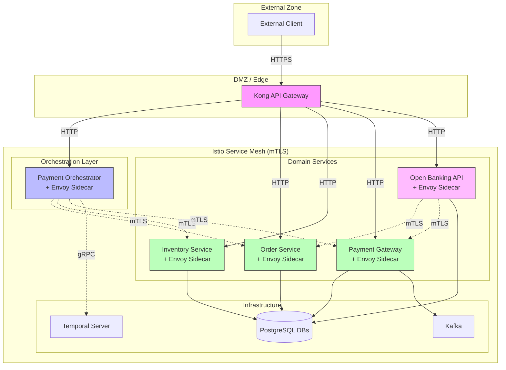
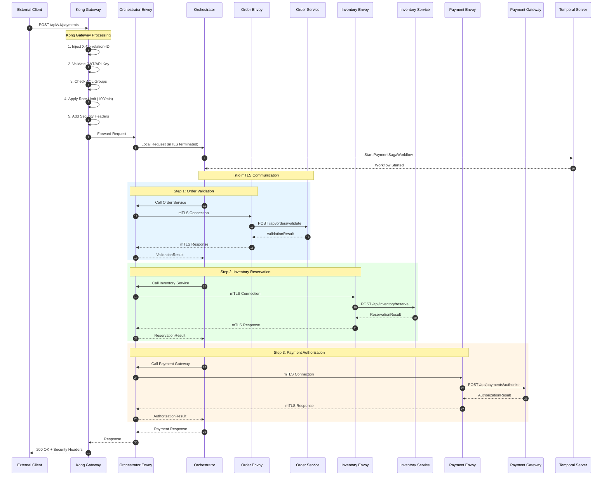
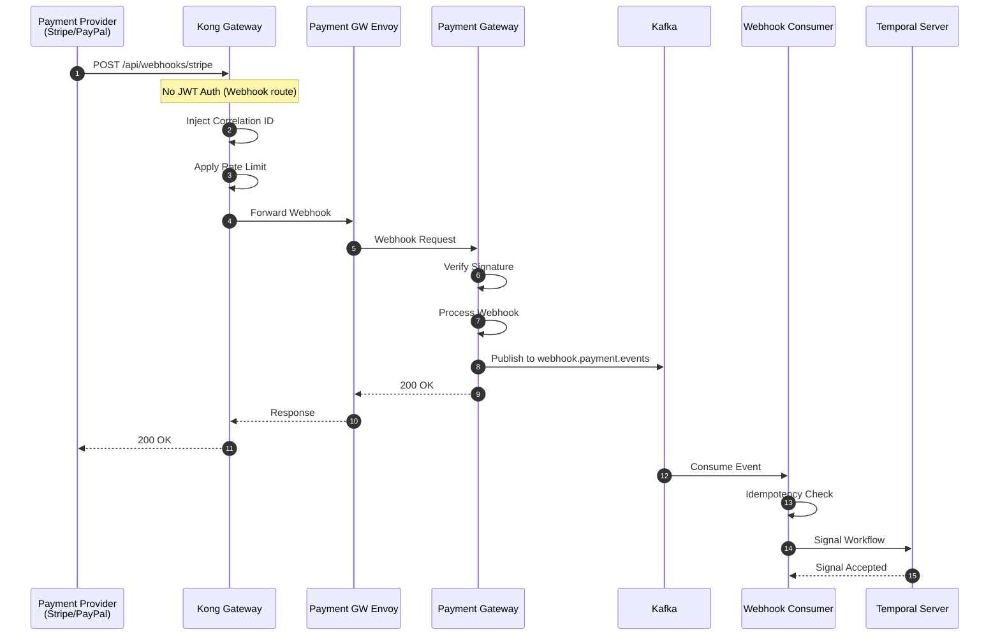
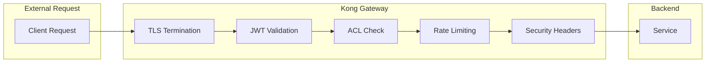
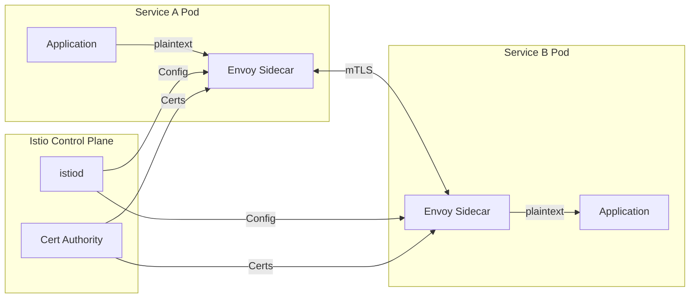
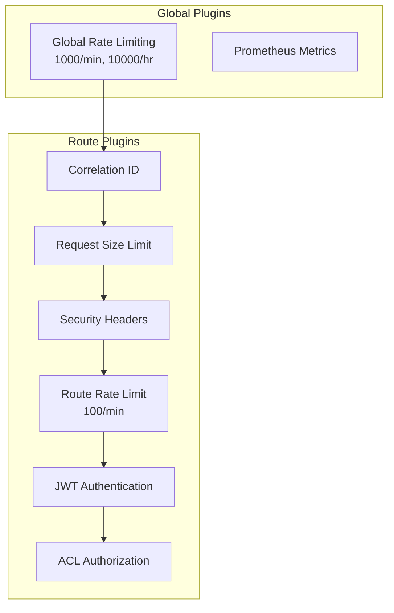
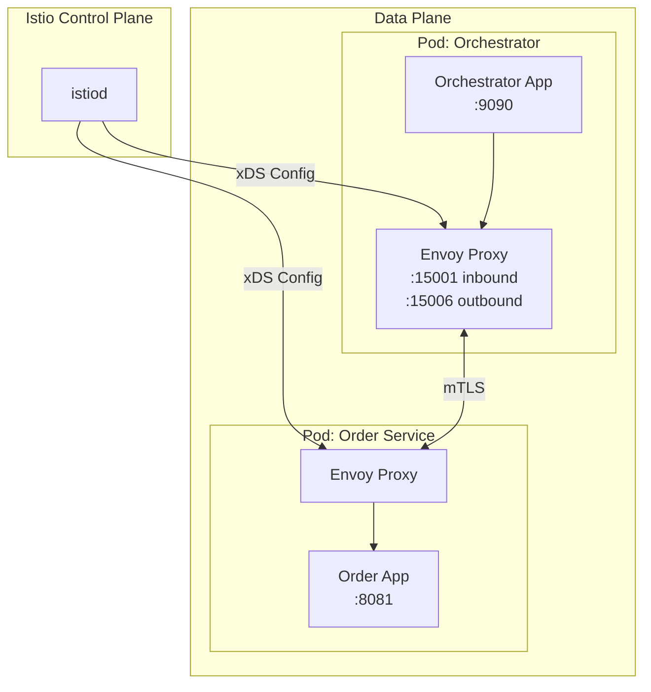
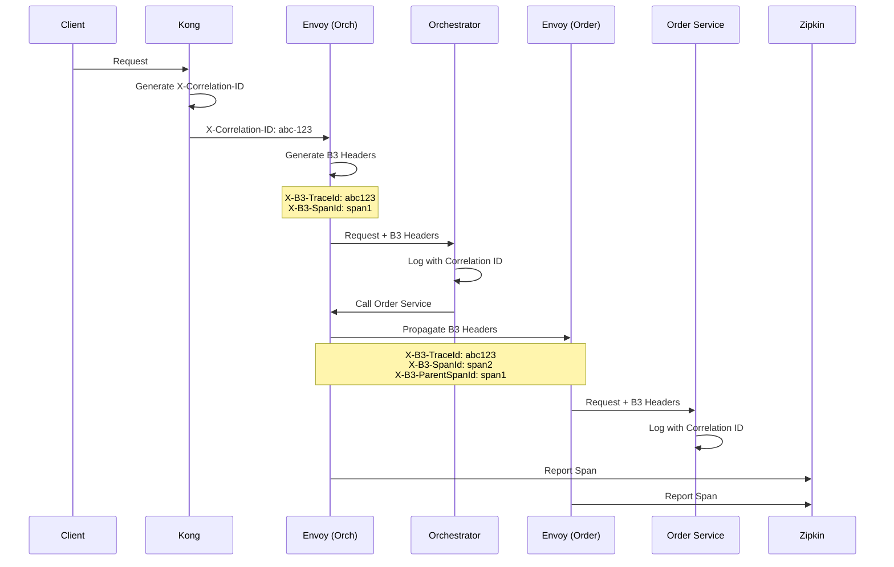

# API Gateway Architecture

This document describes the request handling architecture for the Payment SAGA platform, covering external API gateway routing via Kong and internal service-to-service communication via Istio service mesh.

## Table of Contents

- [Architecture Overview](#architecture-overview)
- [Request Flow](#request-flow)
- [Component Responsibilities](#component-responsibilities)
- [Security Model](#security-model)
- [Service Access Matrix](#service-access-matrix)
- [Kong Gateway Configuration](#kong-gateway-configuration)
- [Istio Service Mesh](#istio-service-mesh)
- [Distributed Tracing](#distributed-tracing)

---

## Architecture Overview

The Payment SAGA platform uses a **layered gateway architecture**:

1. **Kong Gateway** - Handles external client traffic (authentication, rate limiting, security headers)
2. **Istio Service Mesh** - Handles internal service-to-service traffic (mTLS, authorization, observability)



---

## Request Flow

### External Payment Request Flow



### Webhook Event Flow



---

## Component Responsibilities

### Kong Gateway (Edge)

| Responsibility | Description |
|----------------|-------------|
| **Authentication** | JWT validation via JWKS, API Key validation |
| **Authorization** | ACL group enforcement (payment-processors, admin) |
| **Rate Limiting** | Global (1000/min) and per-API (100/min for payments) |
| **Security Headers** | HSTS, X-Frame-Options, X-Content-Type-Options, X-XSS-Protection |
| **Correlation ID** | UUID generation and propagation |
| **Request Validation** | Size limiting (10MB for payments, 1MB for Open Banking) |
| **Bot Protection** | Block automated tools (curl, wget in production) |
| **Routing** | Path-based routing to backend services |

### Istio Service Mesh (Internal)

| Responsibility | Description |
|----------------|-------------|
| **mTLS Encryption** | All service-to-service traffic encrypted |
| **Authorization Policies** | Fine-grained access control (who can call whom) |
| **Traffic Management** | Retries, timeouts, circuit breaking |
| **Observability** | Distributed tracing, metrics collection |
| **Load Balancing** | Round-robin with health checks |

### Payment Orchestrator

| Responsibility | Description |
|----------------|-------------|
| **Workflow Orchestration** | Temporal workflow execution |
| **Service Coordination** | Calls Order, Inventory, Payment services |
| **State Management** | Spring State Machine for business states |
| **Compensation** | SAGA rollback on failures |
| **Event Publishing** | Domain events via Kafka |

### Domain Services

| Service | Responsibility |
|---------|----------------|
| **Order Service** | Order validation, status management, cancellation |
| **Inventory Service** | Stock reservation, release |
| **Payment Gateway** | Payment authorization, capture, refund, webhooks |
| **Open Banking API** | PSD2/SBV64 compliant APIs, TPP management, consents |

---

## Security Model

### External Traffic Security (Kong)



**Authentication Methods:**

| Route Type | Auth Method | Example Routes |
|------------|-------------|----------------|
| Authenticated | JWT + ACL | `/api/v1/payments`, `/api/orders` |
| Webhook | Signature Verification (App-level) | `/api/webhooks/*` |
| Public | None | `/swagger-ui`, `/api-docs` |
| Open Banking | TPP JWT + Consent | `/open-banking/v1/*` |

### Internal Traffic Security (Istio)



**mTLS Configuration:**

| Setting | Value | Description |
|---------|-------|-------------|
| Mode | `STRICT` | All traffic must be mTLS |
| Certificate Rotation | Automatic | 24-hour rotation by Istio |
| Cipher Suites | TLS 1.3 preferred | Strong encryption |

---

## Service Access Matrix

This matrix defines which services can communicate with each other. Enforced by Istio AuthorizationPolicy.

```
┌─────────────────────┬────────┬────────┬────────┬────────┬──────────┬───────────┐
│ FROM \ TO           │ Order  │ Inv    │ Pay    │ OB-API │ Temporal │ Kafka     │
├─────────────────────┼────────┼────────┼────────┼────────┼──────────┼───────────┤
│ Kong Gateway        │   ✅   │   ✅   │   ✅   │   ✅   │    ❌    │    ❌     │
│ Orchestrator        │   ✅   │   ✅   │   ✅   │   ❌   │    ✅    │    ✅     │
│ Order Service       │   -    │   ❌   │   ❌   │   ❌   │    ❌    │    ✅     │
│ Inventory Service   │   ❌   │   -    │   ❌   │   ❌   │    ❌    │    ✅     │
│ Payment Gateway     │   ❌   │   ❌   │   -    │   ❌   │    ❌    │    ✅     │
│ Open Banking API    │   ✅   │   ❌   │   ✅   │   -    │    ❌    │    ✅     │
└─────────────────────┴────────┴────────┴────────┴────────┴──────────┴───────────┘

Legend: ✅ = Allowed, ❌ = Denied, - = Self
```

**Rationale:**
- **Orchestrator → All Services**: Needs to coordinate the payment saga
- **Open Banking → Order, Payment**: Needs to initiate payments and query orders
- **Domain Services → Kafka**: Event publishing for domain events
- **No cross-domain calls**: Order cannot call Inventory directly (prevents tight coupling)

---

## Kong Gateway Configuration

### Route Categories

| Category | Host | Routes | Authentication |
|----------|------|--------|----------------|
| **Authenticated** | `payment-saga.example.com` | `/api/v1/payments`, `/api/orders`, `/api/inventory`, `/api/payments` | JWT + ACL |
| **Webhooks** | `payment-saga.example.com` | `/api/webhooks/*` | None (signature at app) |
| **Public** | `payment-saga.example.com` | `/swagger-ui`, `/api-docs` | None |
| **Open Banking Tier 1** | `openbanking.paylink.com` | `/open-banking/v1/accounts` | TPP JWT |
| **Open Banking Tier 2** | `openbanking.paylink.com` | `/open-banking/v1/accounts/*/balance`, `*/transactions` | TPP JWT + Consent |
| **Open Banking Tier 3** | `openbanking.paylink.com` | `/open-banking/v1/payments` | TPP JWT + Consent + SCA |

### Plugin Stack



---

## Istio Service Mesh

### Traffic Flow



### Key Resources

| Resource | Purpose | File |
|----------|---------|------|
| **PeerAuthentication** | Enable mTLS STRICT mode | `peer-authentication.yaml` |
| **AuthorizationPolicy** | Service-to-service ACLs | `authorization-policies.yaml` |
| **DestinationRule** | mTLS client settings | `destination-rules.yaml` |
| **VirtualService** | Routing, retries, timeouts | `virtual-services.yaml` |
| **ServiceEntry** | External service definitions | `service-entries.yaml` |

---

## Distributed Tracing

### Trace Propagation



### Header Propagation

| Header | Source | Purpose |
|--------|--------|---------|
| `X-Correlation-ID` | Kong | Business correlation ID |
| `X-B3-TraceId` | Istio/App | Distributed trace ID |
| `X-B3-SpanId` | Istio/App | Current span ID |
| `X-B3-ParentSpanId` | Istio/App | Parent span ID |
| `X-B3-Sampled` | Istio/App | Sampling decision |

### Observability Stack

| Component | Purpose | Endpoint |
|-----------|---------|----------|
| **Zipkin** | Distributed tracing | http://localhost:9411 |
| **Prometheus** | Metrics collection | http://localhost:9090 |
| **Grafana** | Dashboards | http://localhost:3000 |
| **Kiali** | Service mesh visualization | http://localhost:20001 |

---

## Configuration Files

| File | Location | Description |
|------|----------|-------------|
| Kong Ingress | `k8s/base/kong/kong-ingress.yaml` | Route definitions |
| Kong Plugins | `k8s/base/kong/kong-plugins.yaml` | Plugin configurations |
| Istio PeerAuth | `k8s/base/istio/peer-authentication.yaml` | mTLS settings |
| Istio AuthZ | `k8s/base/istio/authorization-policies.yaml` | Access control |
| Istio DestRule | `k8s/base/istio/destination-rules.yaml` | Traffic policies |
| Istio VirtualSvc | `k8s/base/istio/virtual-services.yaml` | Routing rules |
| Istio ServiceEntry | `k8s/base/istio/service-entries.yaml` | External services |

---

## Related Documentation

- [Security Architecture](./Security.md) - Overall security design
- [Kong Migration Plan](./KONG_MIGRATION_PLAN.md) - Migration from Eureka
- [Temporal Scaling Architecture](./TEMPORAL_SCALING_ARCHITECTURE.md) - Workflow scaling

### Istio Configuration Files

| File | Purpose |
|------|---------|
| `k8s/base/istio/peer-authentication.yaml` | mTLS STRICT mode |
| `k8s/base/istio/authorization-policies.yaml` | Service access control |
| `k8s/base/istio/destination-rules.yaml` | Traffic policies |
| `k8s/base/istio/virtual-services.yaml` | Routing rules |
| `k8s/base/istio/service-entries.yaml` | External services |
