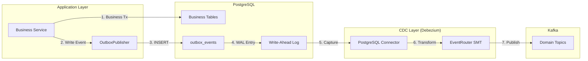
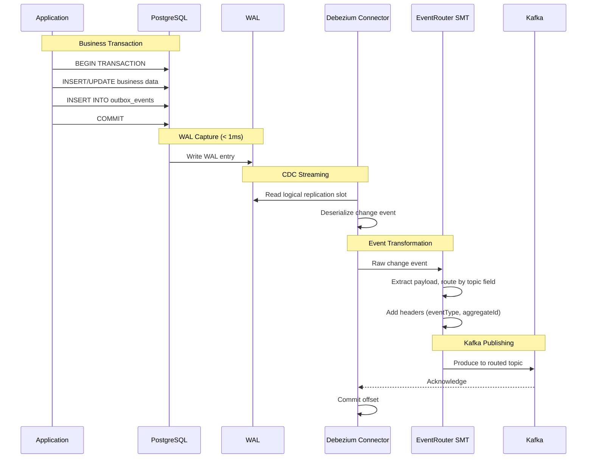

# CDC-Based Outbox Pattern Architecture

This document describes the Change Data Capture (CDC) implementation for the Transactional Outbox Pattern using Debezium.

## Table of Contents

- [Overview](#overview)
- [Architecture](#architecture)
- [Why CDC Over Polling](#why-cdc-over-polling)
- [Components](#components)
- [Configuration](#configuration)
- [Deployment](#deployment)
- [Monitoring](#monitoring)
- [Troubleshooting](#troubleshooting)
- [Rollback Procedure](#rollback-procedure)

---

## Overview

The Payment SAGA Platform uses CDC (Change Data Capture) with **Debezium** to reliably publish domain events from the outbox table to Kafka. This replaces the traditional polling-based approach with a more efficient, low-latency event streaming mechanism.

### Key Benefits

| Benefit | Description |
|---------|-------------|
| **Ultra-low latency** | < 10ms from database commit to Kafka (vs 50-100ms with polling) |
| **No polling overhead** | Eliminates continuous database queries |
| **WAL-based ordering** | Guaranteed event ordering from PostgreSQL WAL |
| **Exactly-once semantics** | Debezium + Kafka transactions ensure no duplicates |
| **Automatic recovery** | Connector resumes from last offset on restart |

---

## Architecture

### High-Level Flow



### Detailed Sequence



---

## Why CDC Over Polling

### Comparison

| Aspect | Polling (Legacy) | CDC (Current) |
|--------|------------------|---------------|
| **Latency** | 50-100ms | < 10ms |
| **DB Load** | 10 queries/sec (polling) | Minimal (WAL only) |
| **CPU Usage** | Continuous polling threads | Event-driven |
| **Ordering** | `ORDER BY created_at` | WAL order (perfect) |
| **Scalability** | Multiple pollers with SKIP LOCKED | Single connector, horizontal Kafka |
| **Recovery** | Application retry logic | Automatic offset resume |
| **Complexity** | Simple (application code) | Medium (Kafka Connect) |

### When to Use Each

**Use CDC when:**
- Low latency (< 10ms) is required
- High event throughput (> 10,000/sec)
- Database load from polling is a concern
- You already have Kafka Connect infrastructure

**Use Polling when:**
- Simplicity is priority
- No Kafka Connect expertise
- Development/testing environments
- Latency of 50-100ms is acceptable

---

## Components

### 1. Debezium PostgreSQL Connector

Captures changes from PostgreSQL's Write-Ahead Log (WAL) using logical replication.

**Key Configuration:**
- `plugin.name: pgoutput` - Native PostgreSQL logical decoding
- `slot.name: outbox_slot` - Replication slot for tracking position
- `publication.name: outbox_publication` - PostgreSQL publication for tables

### 2. EventRouter SMT (Single Message Transform)

Transforms raw Debezium change events into domain events routed to appropriate Kafka topics.

**Transformation Logic:**
```
Input:  {"op": "c", "after": {"event_id": "...", "topic": "payment.events", "payload": {...}}}
Output: Topic: payment.events, Key: partition_key, Value: payload
```

### 3. OutboxPublisher (Application)

Writes events to the outbox table within the business transaction. **Unchanged from polling approach.**

```java
@Transactional(propagation = Propagation.MANDATORY)
public void publish(PaymentDomainEvent event) {
    OutboxEventEntity entity = OutboxEventEntity.from(event);
    outboxRepository.save(entity);
}
```

### 4. OutboxCdcCleanupJob

Periodically removes captured events from the outbox table to prevent unbounded growth.

```java
@Scheduled(cron = "${outbox.cdc.cleanup.cron:0 0 * * * ?}")
public void cleanupCapturedEvents() {
    outboxRepository.deleteByCreatedAtBefore(
        Instant.now().minus(retentionHours, ChronoUnit.HOURS)
    );
}
```

---

## Configuration

### PostgreSQL Setup

```sql
-- Enable logical replication (postgresql.conf or docker command)
wal_level = logical
max_replication_slots = 4
max_wal_senders = 4

-- Create replication user
CREATE USER debezium WITH REPLICATION LOGIN PASSWORD '***';
GRANT SELECT ON ALL TABLES IN SCHEMA public TO debezium;

-- Create publication
CREATE PUBLICATION outbox_publication FOR TABLE outbox_events;
```

### Debezium Connector

```json
{
  "name": "outbox-connector",
  "config": {
    "connector.class": "io.debezium.connector.postgresql.PostgresConnector",
    "plugin.name": "pgoutput",
    "database.hostname": "postgres-saga",
    "database.port": "5432",
    "database.user": "debezium",
    "database.password": "${secrets:debezium-password}",
    "database.dbname": "saga_db",
    "database.server.name": "payment-saga",
    "table.include.list": "public.outbox_events",
    "publication.name": "outbox_publication",
    "slot.name": "outbox_slot",

    "transforms": "outbox",
    "transforms.outbox.type": "io.debezium.transforms.outbox.EventRouter",
    "transforms.outbox.table.field.event.id": "event_id",
    "transforms.outbox.table.field.event.key": "partition_key",
    "transforms.outbox.table.field.event.payload": "payload",
    "transforms.outbox.route.by.field": "topic",
    "transforms.outbox.route.topic.replacement": "${routedByValue}"
  }
}
```

### Application Properties

```yaml
outbox:
  mode: cdc  # Options: polling, cdc
  cdc:
    cleanup:
      enabled: true
      retention-hours: 1
      cron: "0 0 * * * ?"
```

---

## Deployment

### Docker Compose

```bash
# Start Kafka Connect
docker compose up -d kafka-connect

# Wait for Kafka Connect to be ready
docker compose logs -f kafka-connect | grep "Kafka Connect started"

# Deploy connector
curl -X POST http://localhost:8083/connectors \
  -H "Content-Type: application/json" \
  -d @k8s/base/kafka-connect/outbox-connector.json

# Verify connector status
curl http://localhost:8083/connectors/outbox-connector/status
```

### Kubernetes

```bash
# Deploy Kafka Connect
kubectl apply -k k8s/base/kafka-connect/

# Create connector via ConfigMap or REST API
kubectl exec -it kafka-connect-0 -- curl -X POST http://localhost:8083/connectors ...
```

---

## Monitoring

### Kafka Connect Metrics

| Metric | Description |
|--------|-------------|
| `kafka_connect_connector_status` | Connector state (RUNNING/PAUSED/FAILED) |
| `kafka_connect_source_task_poll_batch_avg_time_ms` | Average poll latency |
| `kafka_connect_source_task_source_record_write_total` | Events captured |

### Debezium Metrics

| Metric | Description |
|--------|-------------|
| `debezium_postgres_streaming_lag_in_bytes` | Replication lag |
| `debezium_postgres_total_number_of_events_seen` | Total events processed |
| `debezium_postgres_milliseconds_since_last_event` | Time since last event |

### Alerts

```yaml
# Prometheus alerting rules
groups:
  - name: cdc-alerts
    rules:
      - alert: DebeziumConnectorDown
        expr: kafka_connect_connector_status{connector="outbox-connector"} != 1
        for: 1m
        labels:
          severity: critical
        annotations:
          summary: "Outbox CDC connector is not running"

      - alert: DebeziumReplicationLag
        expr: debezium_postgres_streaming_lag_in_bytes > 10485760
        for: 5m
        labels:
          severity: warning
        annotations:
          summary: "Debezium replication lag > 10MB"
```

---

## Troubleshooting

### Common Issues

#### 1. Connector Not Starting

```bash
# Check connector status
curl http://localhost:8083/connectors/outbox-connector/status

# Check logs
docker compose logs kafka-connect | grep -i error
```

**Common causes:**
- PostgreSQL `wal_level` not set to `logical`
- Replication slot already exists (drop and recreate)
- Database user lacks REPLICATION privilege

#### 2. Events Not Appearing in Kafka

```bash
# Check if WAL is being read
SELECT * FROM pg_replication_slots WHERE slot_name = 'outbox_slot';

# Check connector offsets
curl http://localhost:8083/connectors/outbox-connector/offsets
```

#### 3. High Replication Lag

```bash
# Check WAL size
SELECT pg_wal_lsn_diff(pg_current_wal_lsn(), confirmed_flush_lsn)
FROM pg_replication_slots
WHERE slot_name = 'outbox_slot';
```

**Solutions:**
- Increase Kafka Connect worker resources
- Check network latency to Kafka
- Ensure outbox cleanup job is running

### Replication Slot Management

```sql
-- List replication slots
SELECT * FROM pg_replication_slots;

-- Drop stuck slot (CAUTION: may lose events)
SELECT pg_drop_replication_slot('outbox_slot');

-- Monitor slot lag
SELECT slot_name,
       pg_wal_lsn_diff(pg_current_wal_lsn(), restart_lsn) as lag_bytes
FROM pg_replication_slots;
```

---

## Rollback Procedure

If CDC has issues, switch back to polling mode:

### 1. Update Configuration

```yaml
# application.yml
outbox:
  mode: polling
  poller:
    enabled: true
    interval-ms: 100
    batch-size: 100
```

### 2. Restart Application

```bash
kubectl rollout restart deployment/payment-saga-orchestrator
```

### 3. Stop Debezium Connector

```bash
curl -X DELETE http://localhost:8083/connectors/outbox-connector
```

### 4. Clean Up Replication Slot

```sql
SELECT pg_drop_replication_slot('outbox_slot');
```

The polling classes (`OutboxPoller`, `WebhookKafkaOutboxPoller`) are deprecated but not removed, allowing quick rollback.

---

## Related Documentation

- [Debezium Documentation](https://debezium.io/documentation/)
- [Debezium Outbox Event Router](https://debezium.io/documentation/reference/transformations/outbox-event-router.html)
- [PostgreSQL Logical Replication](https://www.postgresql.org/docs/current/logical-replication.html)
- [Architecture Principles](../README.md#principle-4-transactional-outbox-pattern-cdc)
