# Design Architecture Board (DAB) Document
# Payment SAGA Platform

| **Document** | **Details** |
|---|---|
| **Product Name** | Payment SAGA Platform |
| **Version** | 1.0 |
| **Date** | 2026-02-08 |
| **Classification** | CONFIDENTIAL |
| **Status** | SUBMITTED FOR DAB REVIEW |

---

## Table of Contents

- [I. Business Context](#i-business-context)
  - [1.1 Introduction / Overview](#11-introduction--overview)
  - [1.2 Problem Statements](#12-problem-statements)
  - [1.3 Objectives & Goals](#13-objectives--goals)
  - [1.4 Scopes (In/Out)](#14-scopes-inout)
  - [1.5 Requirements](#15-requirements)
- [II. Proposed Solution](#ii-proposed-solution)
  - [II.1 Key Design Concerns](#ii1-key-design-concerns)
  - [II.2 High-level Architecture](#ii2-high-level-architecture)
  - [II.3 Data Design](#ii3-data-design)
  - [II.4 Detailed Design](#ii4-detailed-design)
  - [II.5 Integration Detailed Design](#ii5-integration-detailed-design)
  - [II.6 Infrastructure Design](#ii6-infrastructure-design)
  - [II.7 Security Design](#ii7-security-design)
- [III. DAB Light Assessment](#iii-dab-light-assessment)

---

# I. BUSINESS CONTEXT

## 1.1 Introduction / Overview

The **Payment SAGA Platform** is an enterprise-grade distributed payment processing system designed for bank-wide payment orchestration. The platform addresses the fundamental challenges of distributed transactions in financial systems by implementing a **hybrid SAGA pattern** that combines:

- **Temporal** for durable workflow orchestration — managing step ordering, retries, timeouts, and compensation flows
- **Spring State Machine** for fine-grained business state modeling — enforcing state transition guards, publishing domain events, and maintaining audit trails

The platform is deployed as **true microservices** with database-per-service isolation:

| Service | Responsibility | Port |
|---|---|---|
| **Order Service** | Order lifecycle management, validation | 8081 |
| **Inventory Service** | Stock management, reservation | 8082 |
| **Payment Gateway Service** | Payment processing, webhook handling | 8083 |
| **SAGA Orchestrator** | Workflow orchestration, state machine | 9090 |
| **Open Banking API** | SBV Circular 64 compliance, TPP access | 8085 |

The system integrates with external Payment Service Providers (Stripe, PayPal, Adyen, Square) via verified webhooks, processes events through a CDC-based outbox pattern with sub-10ms latency, and provides Open Banking APIs compliant with SBV Circular 64/2024/TT-NHNN.

## 1.2 Problem Statements

| # | Problem | Impact |
|---|---|---|
| **PS-1** | Monolithic payment systems cannot scale beyond single-digit thousands TPS; vertical scaling hits hardware limits | Bank-wide payment processing requires horizontal scalability across multiple payment channels and products |
| **PS-2** | Distributed transactions across order, inventory, and payment domains need guaranteed compensation to maintain data consistency | Failed partial transactions without proper rollback lead to financial discrepancies and reconciliation overhead |
| **PS-3** | External payment webhooks (Stripe, PayPal, Adyen, Square) require exactly-once processing to prevent duplicate charges or missed confirmations | Webhook delivery is at-least-once by design; without idempotency and deduplication, customers may be charged multiple times |
| **PS-4** | SBV Circular 64/2024/TT-NHNN mandates Open Banking APIs with TPP tiering, consent management, and audit trails by March 2027 | Non-compliance results in regulatory penalties; banks must expose payment initiation and account information APIs to licensed TPPs |
| **PS-5** | Multi-tenant payment processing requires data isolation at the database level to prevent cross-tenant data leakage | Shared database schemas without row-level isolation create compliance risk for PCI-DSS and data sovereignty requirements |

## 1.3 Objectives & Goals

| # | Objective | Target | Timeline |
|---|---|---|---|
| **OBJ-1** | Achieve 500 TPS sustained throughput (Phase 1) with a scaling path to 10K+ TPS | 500 TPS → 10K+ TPS | Phase 1: Month 1-3; Phase 5: Month 6+ |
| **OBJ-2** | Implement SAGA pattern with automatic LIFO compensation across all distributed steps | 100% compensation coverage, <5s compensation time | Month 1 |
| **OBJ-3** | Integrate 4 payment gateway providers with webhook signature verification | Stripe, PayPal, Adyen, Square | Month 2 |
| **OBJ-4** | Achieve 99.95% availability with zero-downtime deployments | <26.3 min downtime/year | Ongoing |
| **OBJ-5** | Achieve PCI-DSS 4.0.1 compliance and SBV Circular 64 compliance | Full audit trail, data encryption, TPP tiering | Month 3-6 |
| **OBJ-6** | Sub-10ms CDC event delivery latency from outbox to Kafka | <10ms P99 | Month 1 |
| **OBJ-7** | 413+ automated tests with >80% code coverage | 413 tests across 32+ test classes | Ongoing |

## 1.4 Scopes (In/Out)

### In Scope

| # | Scope Item | Description |
|---|---|---|
| 1 | SAGA Orchestration | Temporal-based workflow orchestration with Spring State Machine for business state |
| 2 | 4 Microservices | Order, Inventory, Payment Gateway, Orchestrator with database-per-service |
| 3 | CDC Outbox Pattern | Debezium-based Change Data Capture for reliable event publishing (<10ms latency) |
| 4 | Webhook Integration | Stripe, PayPal, Adyen, Square webhook processing with signature verification |
| 5 | Open Banking Module | SBV Circular 64 compliant APIs with TPP tiering, consent management, SCA |
| 6 | K8s/EKS Deployment | Kubernetes manifests with Kong Ingress, Istio Service Mesh, HPA auto-scaling |
| 7 | Observability Stack | Prometheus metrics, Grafana dashboards, Zipkin distributed tracing |
| 8 | Priority-based Sharding | Customer-hash sharding across 36 task queues with 4 priority levels |

### Out of Scope

| # | Scope Item | Rationale |
|---|---|---|
| 1 | Core Banking Integration (T24) | Separate integration project; will consume Payment SAGA APIs |
| 2 | Mobile Frontend | Separate frontend project; will use REST APIs |
| 3 | Customer IdP | Existing enterprise IAM system will be integrated via OAuth2 |
| 4 | Card Tokenization Vault | Will use PSP-provided tokenization (Stripe, Adyen) |
| 5 | ISO 20022 Messaging | Phase 2 scope; requires core banking integration |
| 6 | Multi-Region Active-Active | Phase 3 scope; requires Cassandra persistence migration |

## 1.5 Requirements

### Functional Requirements

| ID | Requirement | Priority |
|---|---|---|
| **FR-01** | Process payment transactions through a 5-step SAGA workflow (Validate → Reserve → Authorize → Capture → Complete) | CRITICAL |
| **FR-02** | Automatically compensate failed transactions in LIFO order (Refund → Void → Release → Cancel) | CRITICAL |
| **FR-03** | Receive and process webhooks from 4 PSPs with signature verification (HMAC-SHA256, RSA-SHA256) | HIGH |
| **FR-04** | Publish domain events via CDC outbox pattern to Kafka for downstream consumers | HIGH |
| **FR-05** | Route payments to priority-based sharded task queues based on customer ID hash and transaction amount | HIGH |
| **FR-06** | Expose Open Banking APIs for payment initiation and account information per SBV Circular 64 | HIGH |
| **FR-07** | Maintain immutable audit trail of all state transitions and compensation actions | HIGH |
| **FR-08** | Support idempotent request processing with dual-layer deduplication (HTTP + Kafka) | MEDIUM |

### Non-Functional Requirements

| ID | Requirement | Target |
|---|---|---|
| **NFR-01** | Throughput | 500 TPS sustained (Phase 1), 10K+ TPS (Phase 5) |
| **NFR-02** | Latency | P99 <500ms for payment processing, P99 <10ms for CDC event delivery |
| **NFR-03** | Availability | 99.95% uptime (26.3 min downtime/year) |
| **NFR-04** | Security — Transport | mTLS STRICT mode across all service-to-service communication |
| **NFR-05** | Test Coverage | >80% code coverage, 413+ automated tests |
| **NFR-06** | Deployment | Zero-downtime rolling updates with PodDisruptionBudget |
| **NFR-07** | Audit Retention | 7-year retention for financial transactions, trigger-protected immutability |
| **NFR-08** | PCI-DSS Compliance | PCI-DSS 4.0.1 compliance for payment data handling |
| **NFR-09** | Regulatory Compliance | SBV Circular 64/2024/TT-NHNN Open Banking compliance by March 2027 |

---

# II. PROPOSED SOLUTION

## II.1 Key Design Concerns

### Concern 1: Workflow vs State Consistency

**Challenge:** Maintaining consistency between Temporal workflow state (which step are we executing?) and business domain state (what business state is this payment in?).

**Decision:** Hybrid architecture separating concerns:
- **Temporal** manages workflow orchestration: step ordering, durability, retries, timeouts, compensation flow
- **Spring State Machine** manages business state: `PENDING → VALIDATING → VALIDATED → ... → COMPLETED`

**Rationale:** Temporal's replay mechanism can re-execute activities, but business state transitions must be idempotent and auditable. The state machine provides guard conditions and publishes domain events on transitions.

### Concern 2: Event Delivery Guarantee

**Challenge:** Ensuring exactly-once event delivery from application database to Kafka.

**Decision:** Transactional Outbox + Debezium CDC (< 10ms latency), replacing traditional polling.

**Rationale:** CDC captures events directly from PostgreSQL WAL, eliminating polling overhead and achieving sub-10ms latency. The outbox write is part of the business transaction, guaranteeing atomicity.

### Concern 3: Compensation Reliability

**Challenge:** Ensuring all compensation actions execute even when individual compensations fail.

**Decision:** LIFO compensation stack with continue-on-failure semantics. Failed compensations log errors but do not prevent remaining compensations. Dead Letter Topic (DLT) captures unrecoverable failures for manual intervention.

### Concern 4: Horizontal Scaling

**Challenge:** Scaling beyond single-worker throughput limits.

**Decision:** Customer-hash sharding with priority-based routing across 36 task queues (4 CRITICAL + 8 HIGH + 16 NORMAL + 8 LOW). Formula: `shard_id = abs(customerId.hashCode()) % shardCount`.

### Concern 5: Multi-Tenancy Data Isolation

**Challenge:** Preventing cross-tenant data access in a shared infrastructure.

**Decision:** PostgreSQL Row-Level Security (RLS) policies with `tenant_id` column and `SET LOCAL` session variables. RLS is enforced at the database level, making it transparent to the application layer.

### Concern 6: Gateway Layering

**Challenge:** Separating external (north-south) and internal (east-west) traffic concerns.

**Decision:** Layered gateway architecture:
- **Kong** handles external traffic: JWT authentication, rate limiting, security headers, correlation ID injection
- **Istio** handles internal traffic: mTLS encryption, authorization policies, circuit breaking, distributed tracing

## II.2 High-level Architecture

The architecture is described using the **C4 model** at three levels of abstraction: System Context (Level 1), Container (Level 2), and Component (Level 3).

### C4 Level 1 — System Context Diagram

Shows the Payment SAGA Platform as a single system and its relationships with external actors and systems.

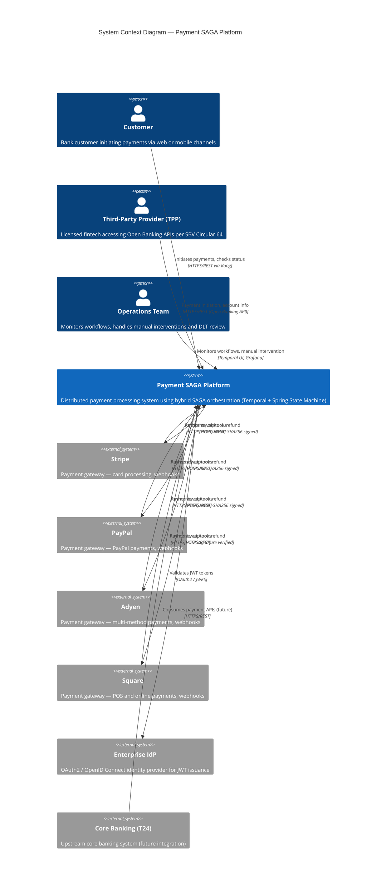

### C4 Level 2 — Container Diagram

Shows the internal containers (deployable units) within the Payment SAGA Platform and their interactions.

```mermaid
C4Container
    title Container Diagram — Payment SAGA Platform

    Person(customer, "Customer", "Web/Mobile user")
    Person(tpp, "TPP", "Open Banking consumer")
    System_Ext(psp, "Payment Service Providers", "Stripe, PayPal, Adyen, Square")
    System_Ext(idp, "Enterprise IdP", "OAuth2 JWT issuer")

    Container_Boundary(edge, "Edge Layer") {
        Container(waf, "AWS WAF + Shield", "AWS Managed", "DDoS protection, OWASP rules, IP reputation")
        Container(alb, "AWS ALB", "AWS Managed", "SSL termination, health checks")
    }

    Container_Boundary(platform, "Payment SAGA Platform") {
        Container(kong, "Kong Ingress Controller", "Kong 3.4", "API Gateway: JWT auth, rate limiting (100/min), security headers, correlation ID, webhook routing")

        Container(orchestrator, "SAGA Orchestrator", "Java 21 / Spring Boot 3.2.1 / Port 9090", "Workflow orchestration, state machine, Kafka consumer, priority-based sharding router. 8-50 pods (HPA)")
        Container(orderSvc, "Order Service", "Java 21 / Spring Boot 3.2.1 / Port 8081", "Order lifecycle: validation, creation, status management. 2 replicas")
        Container(inventorySvc, "Inventory Service", "Java 21 / Spring Boot 3.2.1 / Port 8082", "Stock management: reservation, release, confirmation. 2 replicas")
        Container(paymentSvc, "Payment Gateway Service", "Java 21 / Spring Boot 3.2.1 / Port 8083", "Payment processing: authorize, capture, refund. Webhook reception and CDC outbox. 2 replicas")
        Container(openBanking, "Open Banking API", "Java 21 / Spring Boot 3.2.1 / Port 8085", "SBV Circular 64: TPP tiering, consent management, SCA. 2-10 pods (HPA)")

        ContainerDb(sagaDb, "saga_db", "PostgreSQL 16 / Port 5436", "payment_requests, state_machine_context, outbox_events, event_store. RLS enabled")
        ContainerDb(orderDb, "order_db", "PostgreSQL 16 / Port 5432", "orders, order_items, customers")
        ContainerDb(inventoryDb, "inventory_db", "PostgreSQL 16 / Port 5434", "products, inventory_reservations")
        ContainerDb(paymentDb, "payment_db", "PostgreSQL 16 / Port 5435", "payment_authorizations, captures, refunds, webhook_kafka_outbox. CDC publication enabled")

        Container(temporal, "Temporal Server", "Temporal 1.22.3 / gRPC 7233", "Durable workflow execution: 512 history shards, Frontend(3), History(4), Matching(3), Worker(2)")
        ContainerQueue(kafka, "Apache Kafka", "Kafka 3.6 / MSK", "Event streaming: 8 topics, 12 partitions max. LZ4 compression")
        Container(debezium, "Debezium CDC", "Debezium 2.5 / Kafka Connect", "PostgreSQL WAL capture, EventRouter SMT, <10ms latency")
        Container(redis, "Redis", "Redis 7 / ElastiCache", "Idempotency keys, distributed locking, caching. 3-node multi-AZ")
        Container(istio, "Istio Service Mesh", "Istio 1.20 / Envoy sidecars", "mTLS STRICT, AuthorizationPolicy, circuit breaking, B3 tracing")
    }

    Rel(customer, waf, "HTTPS")
    Rel(tpp, waf, "HTTPS (Open Banking)")
    Rel(psp, kong, "Webhook POST (signed)")
    Rel(waf, alb, "Forwards traffic")
    Rel(alb, kong, "Routes to Kong")

    Rel(kong, orchestrator, "REST/JSON", "Payment SAGA API")
    Rel(kong, orderSvc, "REST/JSON", "Order API")
    Rel(kong, inventorySvc, "REST/JSON", "Inventory API")
    Rel(kong, paymentSvc, "REST/JSON", "Payment & Webhook API")
    Rel(kong, openBanking, "REST/JSON", "Open Banking API")

    Rel(orchestrator, orderSvc, "Feign REST", "Validate, complete, cancel orders")
    Rel(orchestrator, inventorySvc, "Feign REST", "Reserve, release inventory")
    Rel(orchestrator, paymentSvc, "Feign REST", "Authorize, capture, void, refund")
    Rel(orchestrator, temporal, "gRPC", "Start/signal/query workflows")
    Rel(orchestrator, sagaDb, "JDBC/R2DBC", "Read/write payment requests, state machine")
    Rel(orchestrator, redis, "Lettuce", "Idempotency, caching")
    Rel(kafka, orchestrator, "Kafka Consumer", "Webhook events (webhook.payment.events)")

    Rel(orderSvc, orderDb, "JDBC", "Read/write orders")
    Rel(inventorySvc, inventoryDb, "JDBC", "Read/write inventory")
    Rel(paymentSvc, paymentDb, "JDBC", "Read/write payments, webhook outbox")
    Rel(paymentSvc, psp, "HTTPS/REST", "Authorize, capture, refund")

    Rel(debezium, paymentDb, "PostgreSQL WAL", "Captures outbox INSERT events")
    Rel(debezium, kafka, "Kafka Producer", "Publishes CDC events")

    Rel(kong, idp, "JWKS", "Validate JWT tokens")

    UpdateLayoutConfig($c4ShapeInRow="4", $c4BoundaryInRow="1")
```

### C4 Level 3 — Component Diagram (SAGA Orchestrator)

Zooms into the SAGA Orchestrator container to show its internal components.

```mermaid
C4Component
    title Component Diagram — SAGA Orchestrator (payment-saga-orchestrator)

    Container_Ext(kong, "Kong Gateway", "API Gateway")
    Container_Ext(orderSvc, "Order Service", "Port 8081")
    Container_Ext(inventorySvc, "Inventory Service", "Port 8082")
    Container_Ext(paymentSvc, "Payment Gateway Service", "Port 8083")
    Container_Ext(temporal, "Temporal Server", "gRPC 7233")
    ContainerDb_Ext(sagaDb, "saga_db", "PostgreSQL 16")
    ContainerQueue_Ext(kafka, "Kafka", "webhook.payment.events")
    Container_Ext(redis, "Redis", "Cache / Idempotency")

    Container_Boundary(orchestrator, "SAGA Orchestrator") {
        Component(paymentController, "PaymentController", "Spring REST Controller", "POST /api/v1/payments — accepts payment requests, starts Temporal workflows, returns workflow execution ID")
        Component(paymentRouter, "PaymentRouter", "Spring Component", "Calculates priority (CRITICAL/HIGH/NORMAL/LOW) and shard ID from customerId hash. Routes to 1 of 36 task queues")
        Component(workflow, "PaymentSagaWorkflowImpl", "Temporal Workflow", "5-step SAGA: Validate → Reserve → Authorize → Capture → Complete. LIFO compensation stack. Signal handlers for external webhooks")
        Component(paymentActivities, "PaymentActivities", "Temporal Activities", "Calls Order/Inventory/Payment services via Feign REST. Retry: 3 attempts, 1-30s backoff")
        Component(stateMachineActivities, "StateMachineActivities", "Temporal Local Activities", "Transitions Spring State Machine: 10 forward states + compensation states. Publishes domain events to outbox")
        Component(dataActivities, "DataActivities", "Temporal Activities", "CRUD on payment_requests, state_machine_context. Keeps workflow state minimal — data lives in DB")
        Component(stateMachineConfig, "PaymentStateMachineConfig", "Spring State Machine", "Defines states (PENDING→COMPLETED), events, guards, and transition actions. Factory creates per-workflow instances")
        Component(webhookConsumer, "WebhookEventConsumer", "Kafka Listener", "Consumes webhook.payment.events (3 threads). Manual ack, 5 retries with exponential backoff (1-30s)")
        Component(idempotencyService, "WebhookIdempotencyService", "Spring Service", "Redis-based deduplication by eventId. Prevents duplicate webhook processing")
        Component(correlationService, "WorkflowCorrelationService", "Spring Service", "Maps orderId/authId/captureId to Temporal workflowId for signal delivery")
        Component(actionDispatcher, "WorkflowActionDispatcher", "Spring Service", "Dispatches signals to running workflows: externalPaymentConfirmed, externalCaptureConfirmed, externalPaymentFailed, disputeOpened")
        Component(shardedWorkerFactory, "ShardedWorkerFactory", "Spring Component", "Registers Temporal workers for each shard-priority combination. 36 task queues, configurable concurrency per priority")
        Component(feignClients, "Feign Clients", "Spring Cloud OpenFeign", "order-service, inventory-service, payment-gateway-service. Profile-based discovery (local/docker/k8s/istio)")
        Component(outboxPublisher, "OutboxPublisher", "Spring Component", "Writes domain events to outbox_events table within business transaction. Debezium CDC captures for Kafka delivery")
    }

    Rel(kong, paymentController, "REST/JSON", "POST /api/v1/payments")
    Rel(paymentController, paymentRouter, "Calls", "Determine task queue")
    Rel(paymentController, temporal, "gRPC", "Start workflow on routed queue")
    Rel(paymentRouter, workflow, "Routes to", "payment-saga-queue-{priority}-shard-{id}")

    Rel(workflow, paymentActivities, "Executes", "Business operations")
    Rel(workflow, stateMachineActivities, "Executes", "State transitions (local)")
    Rel(workflow, dataActivities, "Executes", "DB read/write")

    Rel(paymentActivities, feignClients, "Delegates to", "REST calls")
    Rel(feignClients, orderSvc, "Feign REST", "Validate, cancel, complete")
    Rel(feignClients, inventorySvc, "Feign REST", "Reserve, release")
    Rel(feignClients, paymentSvc, "Feign REST", "Authorize, capture, void, refund")

    Rel(stateMachineActivities, stateMachineConfig, "Uses", "Get/transition state")
    Rel(stateMachineActivities, outboxPublisher, "Publishes", "Domain events to outbox")
    Rel(dataActivities, sagaDb, "JDBC", "payment_requests, state_machine_context")
    Rel(outboxPublisher, sagaDb, "JDBC", "INSERT outbox_events")

    Rel(kafka, webhookConsumer, "Consumes", "Webhook events")
    Rel(webhookConsumer, idempotencyService, "Checks", "Duplicate detection")
    Rel(idempotencyService, redis, "GET/SET", "eventId dedup keys")
    Rel(webhookConsumer, correlationService, "Resolves", "orderId → workflowId")
    Rel(correlationService, sagaDb, "SELECT", "Lookup by orderId/authId")
    Rel(webhookConsumer, actionDispatcher, "Dispatches", "Signal payload")
    Rel(actionDispatcher, temporal, "gRPC Signal", "externalPaymentConfirmed, etc.")

    Rel(shardedWorkerFactory, temporal, "Registers", "36 workers across 4 priorities")

    UpdateLayoutConfig($c4ShapeInRow="4", $c4BoundaryInRow="1")
```

### C4 Level 3 — Component Diagram (Payment Gateway Service)

Zooms into the Payment Gateway Service to show the webhook processing and CDC outbox pipeline.

```mermaid
C4Component
    title Component Diagram — Payment Gateway Service (payment-gateway-service)

    Container_Ext(kong, "Kong Gateway", "API Gateway")
    Container_Ext(stripe, "Stripe", "Payment Provider")
    Container_Ext(paypal, "PayPal", "Payment Provider")
    Container_Ext(adyen, "Adyen", "Payment Provider")
    Container_Ext(square, "Square", "Payment Provider")
    ContainerDb_Ext(paymentDb, "payment_db", "PostgreSQL 16")
    Container_Ext(debezium, "Debezium CDC", "Kafka Connect")

    Container_Boundary(paymentGw, "Payment Gateway Service") {
        Component(webhookController, "WebhookController", "Spring REST Controller", "POST /api/webhooks/{provider} — receives PSP webhooks, validates signatures")
        Component(paymentController, "PaymentController", "Spring REST Controller", "POST /api/v1/payments/authorize|capture|refund — payment operations")
        Component(processorEngine, "WebhookProcessorEngine", "Spring Component", "Dispatches webhooks to provider-specific processors based on event type")
        Component(stripeProcessor, "StripeWebhookProcessor", "Strategy", "HMAC-SHA256 signature verification, Stripe event parsing")
        Component(paypalProcessor, "PayPalWebhookProcessor", "Strategy", "RSA-SHA256 certificate verification, PayPal event parsing")
        Component(adyenProcessor, "AdyenWebhookProcessor", "Strategy", "HMAC-SHA256 verification, Adyen event parsing")
        Component(squareProcessor, "SquareWebhookProcessor", "Strategy", "Square signature verification, event parsing")
        Component(kafkaPublisher, "WebhookKafkaPublisher", "Spring Component", "Writes processed webhook events to webhook_kafka_outbox table within the business transaction")
        Component(paymentService, "PaymentService", "Spring Service", "Payment orchestration: authorize, capture, void, refund via PSP client adapters")
        Component(outboxEntity, "WebhookKafkaOutbox", "JPA Entity + Repository", "Outbox table with FOR UPDATE SKIP LOCKED. CDC publication on INSERT")
        Component(cdcCleanup, "WebhookKafkaCdcCleanupJob", "Scheduled Job", "Hourly cleanup of captured outbox events (status=CAPTURED, age>1h)")
    }

    Rel(kong, webhookController, "POST", "/api/webhooks/{provider}")
    Rel(kong, paymentController, "POST", "/api/v1/payments/*")

    Rel(webhookController, processorEngine, "Dispatches", "Raw webhook payload + headers")
    Rel(processorEngine, stripeProcessor, "Delegates", "Stripe events")
    Rel(processorEngine, paypalProcessor, "Delegates", "PayPal events")
    Rel(processorEngine, adyenProcessor, "Delegates", "Adyen events")
    Rel(processorEngine, squareProcessor, "Delegates", "Square events")

    Rel(stripeProcessor, kafkaPublisher, "Returns", "Validated WebhookKafkaEvent")
    Rel(paypalProcessor, kafkaPublisher, "Returns", "Validated WebhookKafkaEvent")
    Rel(kafkaPublisher, outboxEntity, "INSERT", "Within @Transactional")
    Rel(outboxEntity, paymentDb, "JDBC", "webhook_kafka_outbox table")
    Rel(cdcCleanup, paymentDb, "DELETE", "Captured events >1h old")

    Rel(debezium, paymentDb, "WAL", "Captures INSERT on outbox table (<10ms)")

    Rel(paymentController, paymentService, "Calls", "Authorize, capture, refund")
    Rel(paymentService, stripe, "HTTPS", "Stripe API calls")
    Rel(paymentService, paypal, "HTTPS", "PayPal API calls")
    Rel(paymentService, adyen, "HTTPS", "Adyen API calls")
    Rel(paymentService, square, "HTTPS", "Square API calls")
    Rel(paymentService, paymentDb, "JDBC", "payment_authorizations, captures, refunds")

    UpdateLayoutConfig($c4ShapeInRow="4", $c4BoundaryInRow="1")
```

**Module Dependency Rules:**
- **API modules** (`*-api`) contain only DTOs and interfaces — no implementation
- **Service modules** depend on their own API module and `payment-saga-common`, never on each other's implementations
- **Orchestrator** depends on all API modules to call services via Feign clients

### Change Summary

| Item | Status | Description |
|---|---|---|
| Platform | **NEW** | Payment SAGA Platform v1.0 — greenfield implementation |
| Architecture Pattern | **NEW** | Hybrid SAGA (Temporal + Spring State Machine) |
| Outbox Pattern | **NEW** | Debezium CDC replaces traditional polling outbox |
| Webhook Pipeline | **NEW** | Webhook → Outbox → CDC → Kafka → Consumer → Workflow Signal |
| Sharding | **NEW** | Customer-hash sharding with priority-based routing (36 queues) |
| Open Banking | **NEW** | SBV Circular 64 compliant TPP APIs |
| Service Mesh | **NEW** | Istio mTLS + AuthorizationPolicy |
| API Gateway | **NEW** | Kong Ingress Controller with plugins |

### Technology Stack Summary

| Category | Technology | Version | Rationale |
|---|---|---|---|
| **Language** | Java | 21 LTS | Virtual Threads (Project Loom), 8+ year LTS support |
| **Framework** | Spring Boot | 3.2.1 | Native GraalVM path, Spring Cloud Kubernetes |
| **Workflow Engine** | Temporal | 1.22.3 | Durable execution, native compensation, signal/query |
| **State Machine** | Spring State Machine | 4.0.0 | Guard conditions, domain events, audit integration |
| **Messaging** | Apache Kafka | 3.6 | Partitioned event streaming, consumer groups |
| **CDC** | Debezium | 2.5 | PostgreSQL WAL-based CDC, EventRouter SMT |
| **Database** | PostgreSQL | 16 | JSONB, RLS, logical replication, Flyway migrations |
| **Cache** | Redis | 7 | Idempotency keys, distributed locking |
| **API Gateway** | Kong | 3.4 | Ingress routing, rate limiting, JWT validation |
| **Service Mesh** | Istio | 1.20 | mTLS, AuthorizationPolicy, circuit breaking |
| **Container Orchestration** | AWS EKS | 1.28 | Managed Kubernetes, HPA, PDB |
| **Migration** | Flyway | 10.4.1 | Versioned schema migrations (V1–V14) |
| **Observability** | Micrometer + Prometheus + Grafana + Zipkin | — | Metrics, dashboards, distributed tracing |
| **Build** | Maven | 3.9 | Multi-module project, dependency management |
| **Testing** | JUnit 5 + Mockito + TestContainers | — | 413 tests, real PostgreSQL/Kafka in tests |

## II.3 Data Design

### Entity and Domain Modeling

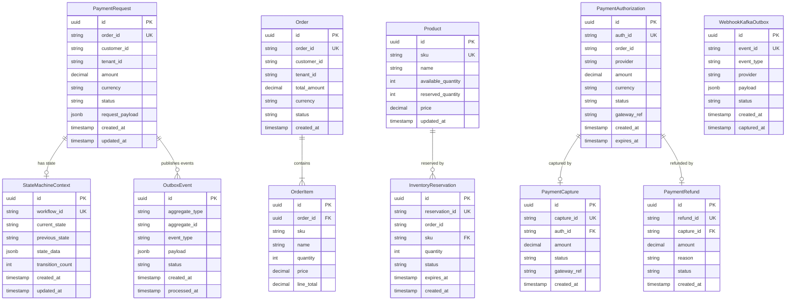

### Schema Detailed Design

| Database | Port | Tables | Migration Range | Key Features |
|---|---|---|---|---|
| **saga_db** | 5436 | payment_requests, state_machine_context, outbox_events, event_store | V1–V14 | RLS policies, event sourcing, JSONB payloads |
| **order_db** | 5432 | orders, order_items | V1–V4 | Composite indexes on customer_id + status |
| **inventory_db** | 5434 | products, inventory_reservations | V1–V5 | Optimistic locking, reservation TTL |
| **payment_db** | 5435 | payment_authorizations, payment_captures, payment_refunds, webhook_kafka_outbox | V1–V8 | CDC publication, FOR UPDATE SKIP LOCKED |

### Table Detailed Design

#### Table: `payment_requests` (saga_db)

| Column | Type | Constraints | Description |
|---|---|---|---|
| `id` | UUID | PK, DEFAULT gen_random_uuid() | Primary key |
| `order_id` | VARCHAR(50) | NOT NULL, UNIQUE | Order reference |
| `customer_id` | VARCHAR(50) | NOT NULL | Customer reference |
| `tenant_id` | VARCHAR(50) | NOT NULL | Tenant for RLS |
| `amount` | DECIMAL(19,4) | NOT NULL, CHECK > 0 | Payment amount |
| `currency` | VARCHAR(3) | NOT NULL | ISO 4217 currency |
| `status` | VARCHAR(30) | NOT NULL, DEFAULT 'PENDING' | Current status |
| `request_payload` | JSONB | NOT NULL | Full request (for audit) |
| `idempotency_key` | VARCHAR(100) | UNIQUE | Deduplication key |
| `created_at` | TIMESTAMPTZ | NOT NULL, DEFAULT NOW() | Creation timestamp |
| `updated_at` | TIMESTAMPTZ | NOT NULL, DEFAULT NOW() | Last update |

**Indexes:** `idx_payment_requests_order_id`, `idx_payment_requests_customer_id`, `idx_payment_requests_status`, `idx_payment_requests_tenant_id`

#### Table: `state_machine_context` (saga_db)

| Column | Type | Constraints | Description |
|---|---|---|---|
| `id` | UUID | PK | Primary key |
| `workflow_id` | VARCHAR(100) | NOT NULL, UNIQUE | Temporal workflow ID |
| `order_id` | VARCHAR(50) | NOT NULL | Order reference |
| `current_state` | VARCHAR(40) | NOT NULL | Current PaymentState |
| `previous_state` | VARCHAR(40) | | Previous PaymentState |
| `state_data` | JSONB | | Transition context data |
| `transition_count` | INTEGER | NOT NULL, DEFAULT 0 | Number of transitions |
| `created_at` | TIMESTAMPTZ | NOT NULL | Creation timestamp |
| `updated_at` | TIMESTAMPTZ | NOT NULL | Last update |

#### Table: `outbox_events` (saga_db)

| Column | Type | Constraints | Description |
|---|---|---|---|
| `id` | UUID | PK | Primary key |
| `aggregate_type` | VARCHAR(100) | NOT NULL | Entity type |
| `aggregate_id` | VARCHAR(100) | NOT NULL | Entity ID |
| `event_type` | VARCHAR(100) | NOT NULL | Domain event type |
| `payload` | JSONB | NOT NULL | Event payload |
| `status` | VARCHAR(20) | NOT NULL, DEFAULT 'PENDING' | PENDING / CAPTURED / PROCESSED |
| `created_at` | TIMESTAMPTZ | NOT NULL, DEFAULT NOW() | Creation timestamp |
| `processed_at` | TIMESTAMPTZ | | When Debezium captured |

#### Table: `webhook_kafka_outbox` (payment_db)

| Column | Type | Constraints | Description |
|---|---|---|---|
| `id` | UUID | PK | Primary key |
| `event_id` | VARCHAR(100) | NOT NULL, UNIQUE | PSP event ID |
| `event_type` | VARCHAR(100) | NOT NULL | Webhook event type |
| `provider` | VARCHAR(30) | NOT NULL | PSP name |
| `order_id` | VARCHAR(50) | | Extracted order ID |
| `payload` | JSONB | NOT NULL | Full webhook body |
| `status` | VARCHAR(20) | NOT NULL, DEFAULT 'PENDING' | CDC capture status |
| `created_at` | TIMESTAMPTZ | NOT NULL, DEFAULT NOW() | Creation timestamp |
| `captured_at` | TIMESTAMPTZ | | CDC capture timestamp |

**CDC Configuration:** `FOR UPDATE SKIP LOCKED` query for concurrent outbox processing. Publication: `CREATE PUBLICATION outbox_pub FOR TABLE webhook_kafka_outbox WITH (publish = 'insert');`

#### Table: `inventory_reservations` (inventory_db)

| Column | Type | Constraints | Description |
|---|---|---|---|
| `id` | UUID | PK | Primary key |
| `reservation_id` | VARCHAR(50) | NOT NULL, UNIQUE | Reservation reference |
| `order_id` | VARCHAR(50) | NOT NULL | Order reference |
| `sku` | VARCHAR(50) | NOT NULL, FK → products | Product SKU |
| `quantity` | INTEGER | NOT NULL, CHECK > 0 | Reserved quantity |
| `status` | VARCHAR(20) | NOT NULL | RESERVED / RELEASED / CONFIRMED |
| `expires_at` | TIMESTAMPTZ | NOT NULL | Auto-release time |
| `created_at` | TIMESTAMPTZ | NOT NULL, DEFAULT NOW() | Creation timestamp |

#### Table: `payment_authorizations` (payment_db)

| Column | Type | Constraints | Description |
|---|---|---|---|
| `id` | UUID | PK | Primary key |
| `auth_id` | VARCHAR(100) | NOT NULL, UNIQUE | Authorization reference |
| `order_id` | VARCHAR(50) | NOT NULL | Order reference |
| `provider` | VARCHAR(30) | NOT NULL | PSP (stripe/paypal/adyen/square) |
| `amount` | DECIMAL(19,4) | NOT NULL | Authorized amount |
| `currency` | VARCHAR(3) | NOT NULL | ISO 4217 currency |
| `status` | VARCHAR(20) | NOT NULL | AUTHORIZED / CAPTURED / VOIDED |
| `gateway_ref` | VARCHAR(200) | | PSP reference ID |
| `created_at` | TIMESTAMPTZ | NOT NULL | Creation timestamp |
| `expires_at` | TIMESTAMPTZ | NOT NULL | Authorization expiry |

## II.4 Detailed Design

### Payment Happy Path Flow

The forward payment flow progresses through 10 business states managed by Spring State Machine, with 5 SAGA steps orchestrated by Temporal:

```
PENDING → VALIDATING → VALIDATED → RESERVING → RESERVED →
AUTHORIZING → AUTHORIZED → CAPTURING → CAPTURED →
COMPLETING → COMPLETED
```

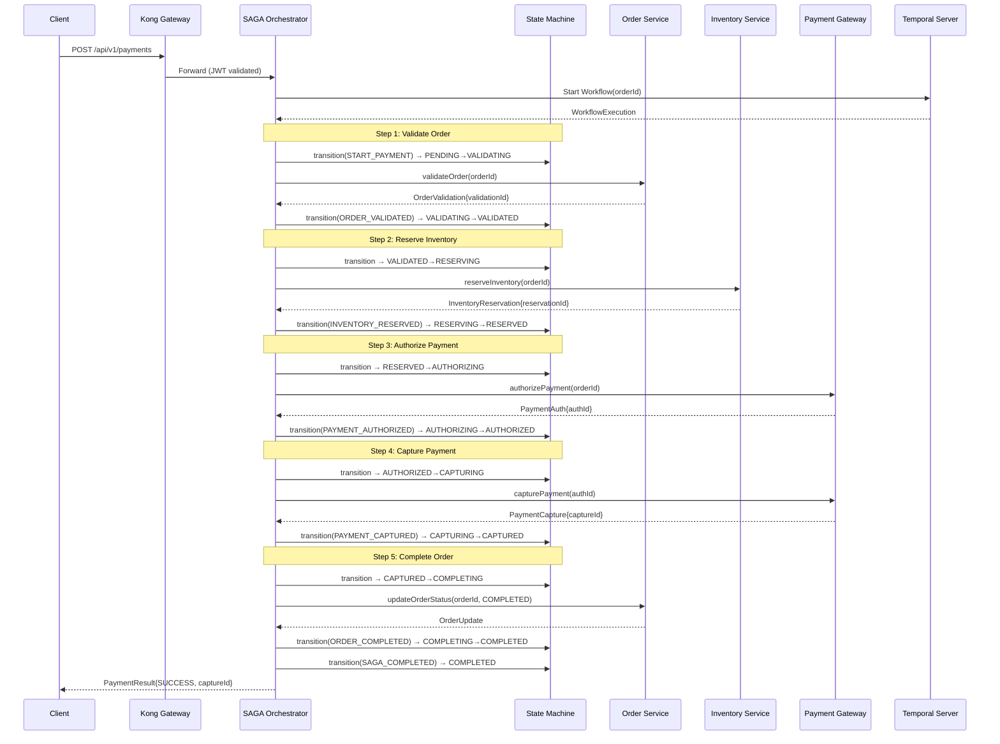

### Compensation Flow (LIFO Rollback)

When any step fails, the compensation stack is executed in reverse order (Last-In-First-Out):

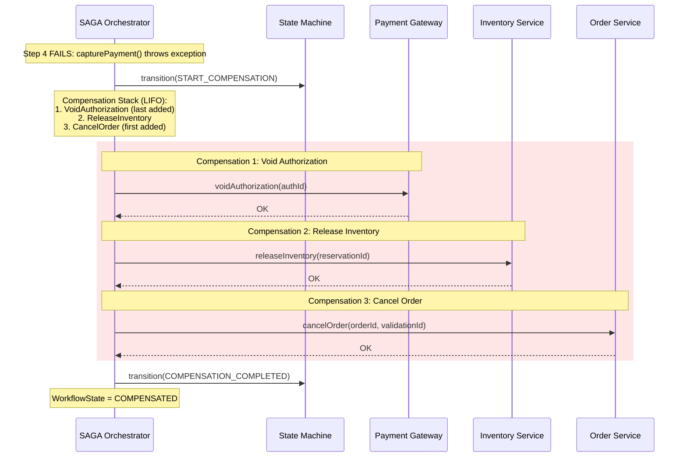

### Webhook → Kafka → Workflow Pipeline

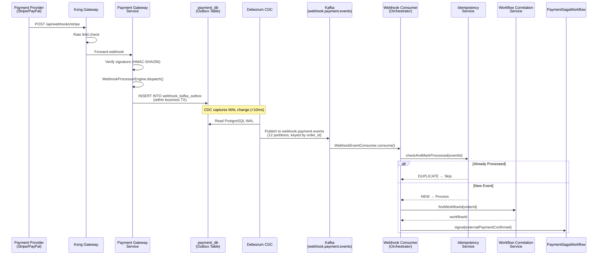

### Error Handling

#### Error Code Categories

| Category | Prefix | Examples | Handling |
|---|---|---|---|
| **Validation** | VAL | VAL_001 (Invalid amount), VAL_002 (Missing field) | Return 400, no compensation |
| **Inventory** | INV | INV_001 (Insufficient stock), INV_002 (SKU not found) | Compensate prior steps |
| **Payment** | PAY | PAY_001 (Declined), PAY_002 (Gateway timeout) | Retry with backoff, then compensate |
| **System** | SYS | SYS_001 (Database unavailable), SYS_002 (Kafka unreachable) | Circuit breaker, retry, alert |
| **SAGA** | SAGA | SAGA_001 (Compensation failed), SAGA_002 (Timeout) | DLT + manual intervention |
| **Resource** | RES | RES_001 (Concurrent modification), RES_002 (Lock timeout) | Optimistic retry |

#### Resilience Patterns

| Pattern | Technology | Configuration |
|---|---|---|
| **Circuit Breaker** | Resilience4j | 50% failure threshold, 60s half-open, 10 calls in sliding window |
| **Bulkhead** | Resilience4j | 25 max concurrent calls, 10 max wait |
| **Rate Limiter** | Resilience4j + Kong | 100/min per client (Kong), 500/min internal (Resilience4j) |
| **Retry** | Temporal RetryOptions | 3 max attempts, 1s initial → 30s max, 2.0 backoff coefficient |
| **Dead Letter Topic** | Kafka DLT | `webhook.payment.events.DLT` (3 partitions), manual review queue |
| **Timeout** | Temporal ActivityOptions | 5 min start-to-close for payment activities, 30s for data activities |

## II.5 Integration Detailed Design

### Message Specifications

| Attribute | Specification |
|---|---|
| **Format** | JSON over Apache Kafka |
| **Serialization** | Jackson ObjectMapper with Java 8 Date/Time module |
| **Compression** | LZ4 (Kafka producer-level) |
| **Schema Evolution** | Backward-compatible (additive fields only) |
| **Idempotency** | Dual-layer: HTTP `Idempotency-Key` header + Kafka `eventId` deduplication |
| **Ordering** | Per-partition ordering, keyed by `order_id` |
| **Delivery Guarantee** | At-least-once (Kafka) + application-level exactly-once (idempotency service) |

### Kafka Topics

| Topic | Partitions | Key | Purpose | Retention |
|---|---|---|---|---|
| `webhook.payment.events` | 12 | order_id | Webhook events from PSPs via CDC outbox | 7 days |
| `webhook.payment.events.DLT` | 3 | order_id | Dead letter for failed webhook processing | 30 days |
| `payment.order.validated` | 6 | order_id | Order validation domain events | 3 days |
| `payment.inventory.reserved` | 6 | order_id | Inventory reservation domain events | 3 days |
| `payment.payment.authorized` | 6 | order_id | Payment authorization domain events | 3 days |
| `payment.payment.captured` | 6 | order_id | Payment capture domain events | 3 days |
| `payment.order.completed` | 6 | order_id | Order completion domain events | 3 days |
| `payment.compensation.triggered` | 6 | order_id | Compensation trigger events | 7 days |

### Message Body Example

**Webhook Kafka Event (CDC Outbox → Kafka):**

```json
{
  "id": "evt_3PkS2M0B5P1a2LcHmC4Qi5",
  "eventId": "evt_3PkS2M0B5P1a2LcHmC4Qi5",
  "eventType": "PAYMENT_CONFIRMED",
  "provider": "STRIPE",
  "orderId": "ORD-001",
  "authorizationId": "auth_1MqLDe2eZvKYlo2CkBQDQ5",
  "captureId": null,
  "amount": 10000,
  "currency": "usd",
  "rawPayload": {
    "id": "evt_3PkS2M0B5P1a2LcHmC4Qi5",
    "type": "payment_intent.succeeded",
    "data": {
      "object": {
        "id": "pi_1MqLDe2eZvKYlo2CkBQDQ5",
        "metadata": {"order_id": "ORD-001"},
        "amount": 10000,
        "currency": "usd"
      }
    }
  },
  "timestamp": "2026-02-08T07:00:00Z"
}
```

### API Specification

| # | Service | Method | Endpoint | Description |
|---|---|---|---|---|
| 1 | Orchestrator | POST | `/api/v1/payments` | Initiate payment SAGA workflow |
| 2 | Orchestrator | GET | `/api/v1/payments/{orderId}` | Query payment status |
| 3 | Orchestrator | POST | `/api/v1/payments/{orderId}/cancel` | Cancel running workflow |
| 4 | Order Service | POST | `/api/v1/orders/validate` | Validate order request |
| 5 | Inventory Service | POST | `/api/v1/inventory/reserve` | Reserve inventory |
| 6 | Payment Gateway | POST | `/api/v1/payments/authorize` | Authorize payment |
| 7 | Payment Gateway | POST | `/api/webhooks/{provider}` | Receive PSP webhooks |
| 8 | Open Banking | POST | `/api/v1/open-banking/payments` | Initiate payment (TPP) |

## II.6 Infrastructure Design

### EKS Cluster Topology

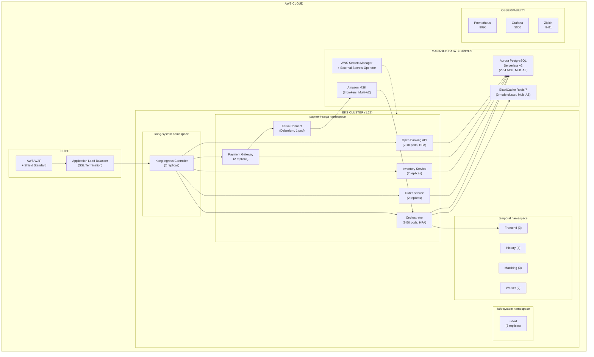

### Infrastructure Components

| Component | Specification | Replicas / Sizing |
|---|---|---|
| **EKS Cluster** | Kubernetes 1.28, managed control plane | 3 AZ, m5.xlarge nodes |
| **SAGA Orchestrator** | Java 21, Spring Boot 3.2.1, 500m-2000m CPU, 1-2Gi RAM | 8-50 pods (HPA) |
| **Order/Inventory/Payment Services** | Java 21, 100m-500m CPU, 256-512Mi RAM | 2 replicas each |
| **Open Banking API** | Java 21, 200m-1000m CPU, 512Mi-1Gi RAM | 2-10 pods (HPA) |
| **Aurora PostgreSQL** | Serverless v2, Multi-AZ | 2-64 ACU, 4 databases |
| **Amazon MSK** | Kafka 3.6, Multi-AZ | 3 brokers, m5.large |
| **ElastiCache Redis** | Redis 7, Multi-AZ | 3-node cluster, r6g.large |
| **Temporal Cluster** | Frontend 3, History 4, Matching 3, Worker 2 | 12 pods total |
| **Kafka Connect** | Debezium 2.5, 500m-1000m CPU, 512Mi-1Gi RAM | 1 pod |
| **Kong Ingress** | Kong 3.4 | 2 replicas |
| **Istio** | istiod 1.20 + Envoy sidecars | 3 replicas + per-pod |
| **Prometheus** | Time-series metrics | 1 pod |
| **Grafana** | Dashboards, alerting | 1 pod |
| **Zipkin** | Distributed tracing | 1 pod |

### HPA Configuration

| Deployment | Min Replicas | Max Replicas | CPU Target | Memory Target |
|---|---|---|---|---|
| `payment-saga-orchestrator` | 8 | 50 | 70% | 80% |
| `open-banking-api` | 2 | 10 | 70% | 80% |

Scale-up policy: 50% or 4 pods per 60s (whichever is greater). Scale-down policy: 25% per 120s with 300s stabilization.

## II.7 Security Design

### System Classification

| Classification | Value | Justification |
|---|---|---|
| **System Classification** | **HIGH** | Financial payment processing system handling monetary transactions |
| **Data Sensitivity** | **HIGH** | PII, financial data, PCI cardholder data |
| **Regulatory Scope** | PCI-DSS 4.0.1, SBV Circular 64/2024/TT-NHNN | Payment card data + Open Banking regulatory compliance |

### Data Classification

| Category | Examples | Classification | Handling Rules |
|---|---|---|---|
| **PII** | Customer ID, name, email | CONFIDENTIAL | Encrypted at rest (AES-256), masked in logs, 7-year retention |
| **Financial** | Transaction amounts, currency, status | CONFIDENTIAL | Immutable audit trail, trigger-protected, reconciliation controls |
| **PCI** | Card number (last 4), auth codes | RESTRICTED | Never stored in clear; PSP handles tokenization |
| **Internal** | Workflow IDs, correlation IDs, metrics | INTERNAL | Standard logging, 90-day retention |

### 6-Layer Defense-in-Depth

```mermaid
flowchart TB
    subgraph L1["LAYER 1: EDGE SECURITY"]
        WAF["AWS WAF<br/>• OWASP Top 10 rules<br/>• IP reputation lists<br/>• Rate limiting (global)"]
        Shield["AWS Shield Standard<br/>• DDoS protection"]
    end

    subgraph L2["LAYER 2: API GATEWAY (Kong)"]
        Auth["Authentication<br/>• OAuth2 JWT validation<br/>• API key management<br/>• Phantom Token pattern"]
        Rate["Rate Limiting<br/>• 100/min per client (payments)<br/>• 1000/min global"]
        Headers["Security Headers<br/>• HSTS, X-Frame-Options<br/>• CSP, X-Content-Type-Options"]
        CorrID["Correlation ID<br/>• X-Correlation-ID injection"]
    end

    subgraph L3["LAYER 3: APPLICATION SECURITY"]
        RBAC["RBAC<br/>• @PreAuthorize annotations<br/>• 3 roles, 6 permissions"]
        Webhook["Webhook Verification<br/>• HMAC-SHA256 (Stripe)<br/>• RSA-SHA256 (PayPal)<br/>• IP allowlisting"]
        Validation["Input Validation<br/>• Bean Validation (JSR-380)<br/>• CORS, CSRF protection"]
    end

    subgraph L4["LAYER 4: SERVICE MESH (Istio)"]
        mTLS["mTLS STRICT Mode<br/>• SPIFFE identities<br/>• Auto certificate rotation"]
        AuthPol["Authorization Policies<br/>• Service access matrix<br/>• Deny-by-default"]
        Circuit["Circuit Breaking<br/>• Connection limits<br/>• Outlier detection"]
    end

    subgraph L5["LAYER 5: NETWORK SECURITY"]
        NetPol["Network Policies<br/>• Namespace isolation<br/>• Pod-level egress rules"]
        B3["B3 Header Propagation<br/>• Distributed tracing<br/>• Audit correlation"]
    end

    subgraph L6["LAYER 6: DATA SECURITY"]
        RLS["PostgreSQL RLS<br/>• tenant_id policies<br/>• SET LOCAL enforcement"]
        Encrypt["Encryption<br/>• AES-256 at rest<br/>• TLS 1.2+ in transit"]
        Secrets["Secrets Management<br/>• AWS Secrets Manager<br/>• External Secrets Operator<br/>• 90-day rotation"]
    end

    L1 --> L2 --> L3 --> L4 --> L5 --> L6
```

### Network Security

| Control | Technology | Configuration |
|---|---|---|
| **WAF** | AWS WAF | OWASP Core Rule Set, IP reputation, SQL injection protection |
| **DDoS Protection** | AWS Shield Standard | Automatic L3/L4 protection |
| **API Rate Limiting** | Kong rate-limiting plugin | 100 req/min (payment), 1000 req/min (global) |
| **mTLS** | Istio PeerAuthentication | `STRICT` mode — all traffic encrypted with mutual TLS |
| **Service Authorization** | Istio AuthorizationPolicy | Explicit allow rules per service pair |
| **IP Allowlisting** | Kong + Application | PSP webhook source IPs verified (Stripe, PayPal, Adyen, Square) |

### Istio Service Access Matrix

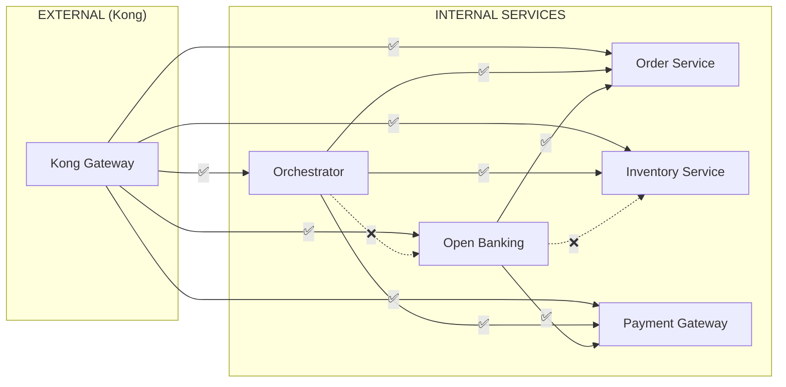

| FROM \ TO | Order | Inventory | Payment | Open Banking |
|---|---|---|---|---|
| **Kong (External)** | ALLOW | ALLOW | ALLOW | ALLOW |
| **Orchestrator** | ALLOW | ALLOW | ALLOW | DENY |
| **Open Banking** | ALLOW | DENY | ALLOW | — |
| **All Others** | DENY | DENY | DENY | DENY |

### Application Security

| Control | Implementation |
|---|---|
| **Authentication** | OAuth2 JWT validation (Kong + Spring Security Resource Server) |
| **Authorization** | RBAC with `@PreAuthorize` — 3 roles (ADMIN, OPERATOR, VIEWER), 6 permissions |
| **Webhook Verification** | Stripe: HMAC-SHA256 with `Stripe-Signature` header; PayPal: RSA-SHA256 with certificate; Adyen: HMAC-SHA256; Square: webhook signature verification |
| **Input Validation** | Bean Validation (JSR-380) annotations on all DTOs |
| **CORS** | Configured per-service, restricted origins |
| **CSRF** | Disabled for API-only services (stateless JWT) |
| **Security Headers** | HSTS, X-Frame-Options: DENY, X-Content-Type-Options: nosniff, CSP |

### Data Security

| Control | Technology | Details |
|---|---|---|
| **Multi-Tenant Isolation** | PostgreSQL RLS | `CREATE POLICY tenant_isolation ON payment_requests USING (tenant_id = current_setting('app.tenant_id'))` |
| **Encryption at Rest** | AES-256 | Aurora PostgreSQL encryption, EBS volume encryption |
| **Encryption in Transit** | TLS 1.2+ | All external connections; mTLS for internal |
| **Credential Rotation** | AWS Secrets Manager | 90-day rotation policy, External Secrets Operator sync |
| **Audit Trail** | Event Store | Immutable, trigger-protected, 7-year retention |
| **Temporal Isolation** | Namespace isolation | `payment-saga` namespace with authentication |

### Security Monitoring

| Alert | Metric | Threshold | Severity |
|---|---|---|---|
| Authentication Failures | `security_auth_failure_total` | >10/min | WARNING |
| Webhook Signature Failures | `webhook_signature_failure_total` | >5/min | CRITICAL |
| Unauthorized IP Access | `webhook_unauthorized_ip_total` | >1/min | CRITICAL |
| RLS Policy Violations | `rls_violation_total` | >0 | CRITICAL |
| Certificate Expiry | `istio_cert_expiry_seconds` | <7 days | WARNING |
| Rate Limit Breaches | `kong_rate_limit_exceeded_total` | >50/min | WARNING |

### User Management

| Attribute | Specification |
|---|---|
| **Authentication** | OAuth2 introspection via enterprise IdP |
| **Token Format** | JWT with claims: `sub`, `tenant_id`, `roles[]`, `permissions[]` |
| **Roles** | `ADMIN` (full access), `OPERATOR` (transactions + monitoring), `VIEWER` (read-only) |
| **Permissions** | `payment:create`, `payment:read`, `payment:cancel`, `webhook:manage`, `admin:config`, `audit:read` |
| **Session** | Stateless (JWT), no server-side sessions |
| **Token Expiry** | Access token: 15 min, Refresh token: 24 hours |

### Security Risk Assessment

| # | Risk | Likelihood | Impact | Mitigation | Residual Risk |
|---|---|---|---|---|---|
| **SR-1** | DDoS attack on payment endpoints | HIGH | HIGH | AWS Shield + WAF + Kong rate limiting + Istio circuit breaking | LOW |
| **SR-2** | Webhook replay attack from compromised PSP keys | MEDIUM | HIGH | Timestamp validation (5 min window), idempotency keys, signature verification | LOW |
| **SR-3** | Cross-tenant data leakage | LOW | CRITICAL | PostgreSQL RLS, tenant_id in JWT claims, application-level validation | VERY LOW |
| **SR-4** | Secret/credential exposure | MEDIUM | CRITICAL | AWS Secrets Manager, External Secrets Operator, 90-day rotation, no secrets in code/config | LOW |
| **SR-5** | Man-in-the-middle on internal traffic | LOW | HIGH | Istio mTLS STRICT mode, SPIFFE identities, auto certificate rotation | VERY LOW |

---

# III. DAB LIGHT ASSESSMENT

## Application and Software

| Criterion | Assessment |
|---|---|
| **Architecture Pattern** | Hybrid SAGA: Temporal (workflow orchestration) + Spring State Machine (business state). 9 Maven modules with strict dependency rules. |
| **Technology Maturity** | Java 21 LTS (8+ year support), Spring Boot 3.2.1 (GA), Temporal 1.22.3 (production-proven at Uber, Netflix, Snap). All components are GA releases. |
| **Code Quality** | 413 automated tests across 32+ test classes. Categories: Workflow (12), Activity (25), State Machine (20), Service (75), Repository (51), Outbox (23), Webhook Kafka (21), Integration (20), Config (24). TestContainers for real database/Kafka testing. |
| **Build & Deployment** | Maven multi-module build. Docker images per service. Kubernetes manifests with Kustomize overlays (base, EKS). Zero-downtime rolling updates with PodDisruptionBudget. |
| **State Management** | Temporal manages workflow state (durable, replay-safe). Spring State Machine manages business state (PENDING → COMPLETED, 10 states). Minimal workflow state pattern — only IDs stored in workflow, full data in database. |

## Software Integration

| Integration Type | Technology | Details |
|---|---|---|
| **Synchronous (REST)** | Spring Cloud OpenFeign | Profile-based service discovery: direct URLs (local), Docker DNS (docker), K8s DNS (k8s/eks), Mesh-aware (istio) |
| **Asynchronous (Events)** | Apache Kafka + Debezium CDC | Transactional outbox → PostgreSQL WAL → Debezium → Kafka. <10ms latency. 8 topics, 12 partitions max. |
| **Workflow (gRPC)** | Temporal Server | Durable workflow execution, signal/query/cancel. gRPC communication between workers and Temporal server. |
| **External (Webhooks)** | 4 PSPs: Stripe, PayPal, Adyen, Square | Signature verification per provider, CDC outbox for reliable processing, consumer idempotency with Redis. |

## Security Design

| Layer | Controls |
|---|---|
| **Edge** | AWS WAF (OWASP rules) + Shield (DDoS) |
| **Gateway** | Kong: JWT auth, rate limiting (100/min), security headers, correlation ID |
| **Application** | RBAC (@PreAuthorize), webhook signature verification (HMAC-SHA256/RSA-SHA256), Bean Validation |
| **Service Mesh** | Istio: mTLS STRICT, AuthorizationPolicy (service access matrix), circuit breaking |
| **Network** | Namespace isolation, pod-level network policies, B3 header propagation |
| **Data** | PostgreSQL RLS (tenant isolation), AES-256 at rest, TLS 1.2+ in transit, 90-day credential rotation |

## Data Integration

| Aspect | Details |
|---|---|
| **Database Strategy** | Database-per-service: 4 PostgreSQL databases (saga_db, order_db, inventory_db, payment_db) |
| **Event Sourcing** | Transactional outbox pattern with Debezium CDC for guaranteed event delivery |
| **Event Store** | Immutable event log with trigger-protected retention (7 years for financial events) |
| **Schema Migration** | Flyway versioned migrations: V1–V14 across services, forward-only |
| **Data Isolation** | PostgreSQL RLS with `tenant_id`, enforced via `SET LOCAL` session variables |
| **Consistency Model** | Eventual consistency across services, strong consistency within each database |

## Technology Stack and Hardware

| Aspect | Assessment |
|---|---|
| **Open Source** | All components are open source (Java, Spring Boot, Temporal, Kafka, PostgreSQL, Redis, Kong, Istio) or AWS managed services |
| **LTS Support** | Java 21 LTS (Sept 2023 – Sept 2031+), Spring Boot 3.x (commercial support available), PostgreSQL 16 (Nov 2023 – Nov 2028) |
| **Cloud Platform** | AWS EKS (managed Kubernetes), Aurora PostgreSQL Serverless v2, Amazon MSK, ElastiCache Redis |
| **Scaling** | HPA with 8-50 pods (orchestrator), customer-hash sharding across 36 task queues, Aurora ACU auto-scaling (2-64 ACU) |
| **Vendor Lock-in** | LOW — all core components are portable. AWS services (Aurora, MSK, ElastiCache) have OSS equivalents (PostgreSQL, Kafka, Redis) |

## Complexity Criteria

| Complexity | Area | Justification |
|---|---|---|
| **HIGH** | SAGA Compensation | LIFO compensation stack with continue-on-failure semantics across 4 services. Partial compensation handling with DLT escalation. |
| **HIGH** | CDC Exactly-Once Delivery | Debezium WAL capture → Kafka → Consumer with dual-layer idempotency. Requires correct PostgreSQL replication slot management. |
| **MEDIUM** | RLS Multi-Tenancy | PostgreSQL Row-Level Security policies per table. Requires careful session variable management and testing. |
| **MEDIUM** | Open Banking Compliance | SBV Circular 64 TPP tiering, consent management, SCA. Regulatory requirements still evolving. |
| **MEDIUM** | Priority-Based Sharding | Customer-hash sharding across 36 task queues. Hot-spot mitigation for VIP customers. |
| **LOW** | CRUD Operations | Standard REST CRUD within individual services. Well-established Spring Boot patterns. |

## Offline Stakeholder Alignment

| Stakeholder Team | Alignment Topic | Status |
|---|---|---|
| **Architecture** | Hybrid SAGA pattern (Temporal + State Machine), microservice boundaries, module dependency rules | PENDING |
| **Security** | 6-layer defense-in-depth, PCI-DSS 4.0.1 controls, RLS multi-tenancy, webhook signature verification | PENDING |
| **DBA** | Database-per-service strategy, Aurora Serverless v2 sizing, Flyway migration management, RLS policies | PENDING |
| **Infrastructure** | EKS cluster topology, HPA configuration, Aurora/MSK/ElastiCache sizing, Temporal cluster deployment | PENDING |
| **Compliance** | SBV Circular 64 Open Banking requirements, PCI-DSS 4.0.1 audit controls, 7-year retention policy | PENDING |
| **Operations** | Observability stack (Prometheus/Grafana/Zipkin), alerting rules, runbook for DLT/compensation failures | PENDING |

---

*End of DAB Document — Payment SAGA Platform v1.0*
