# Observability and Monitoring

This document details the observability strategy for the Payment SAGA Platform, covering correlation tracking, metrics collection, alerting, and visualization.

## Table of Contents

- [Overview](#overview)
- [Architecture](#architecture)
- [Correlation ID Propagation](#correlation-id-propagation)
- [Structured Logging Architecture](#structured-logging-architecture)
- [Webhook Trace Resumption](#webhook-trace-resumption)
- [Metrics Collection](#metrics-collection)
- [Dashboards](#dashboards)
- [Alerting](#alerting)
- [Implementation Details](#implementation-details)
- [Best Practices](#best-practices)
- [Troubleshooting](#troubleshooting)
- [References](#references)

---

## Overview

The observability system provides three pillars of monitoring:

| Pillar | Technology | Purpose |
|--------|------------|---------|
| **Tracing** | Zipkin + Correlation IDs | End-to-end request tracking across sync/async boundaries |
| **Metrics** | Prometheus + Micrometer | Business and infrastructure health metrics |
| **Logging** | SLF4J + MDC | Structured logs with correlation context (see [Logging Standards](LOGGING_STANDARDS.md)) |

### Key Capabilities

1. **End-to-End Correlation** - Track a single payment request across HTTP calls, Kafka messages, Temporal workflows, and async thread pools
2. **Business Metrics** - Success/failure rates by payment channel, funnel stage conversion, compensation triggers
3. **Infrastructure Metrics** - JVM health, database connection pools, Kafka consumer lag, thread pool utilization
4. **Proactive Alerting** - Automated alerts for high failure rates, circuit breaker trips, and resource exhaustion

---

## Architecture

### High-Level Observability Flow

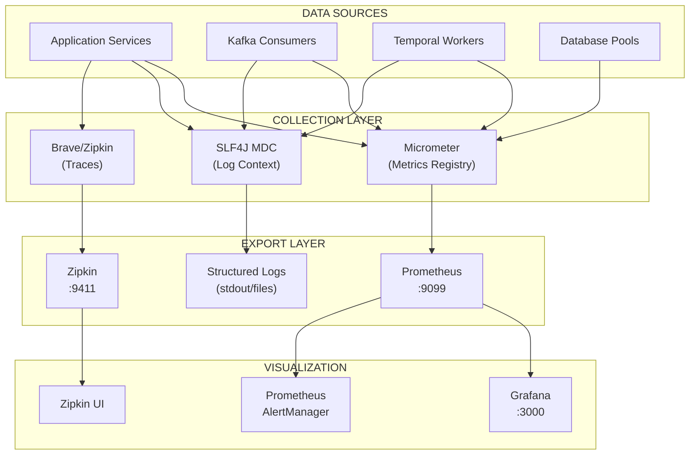

### Correlation ID Flow Across Boundaries

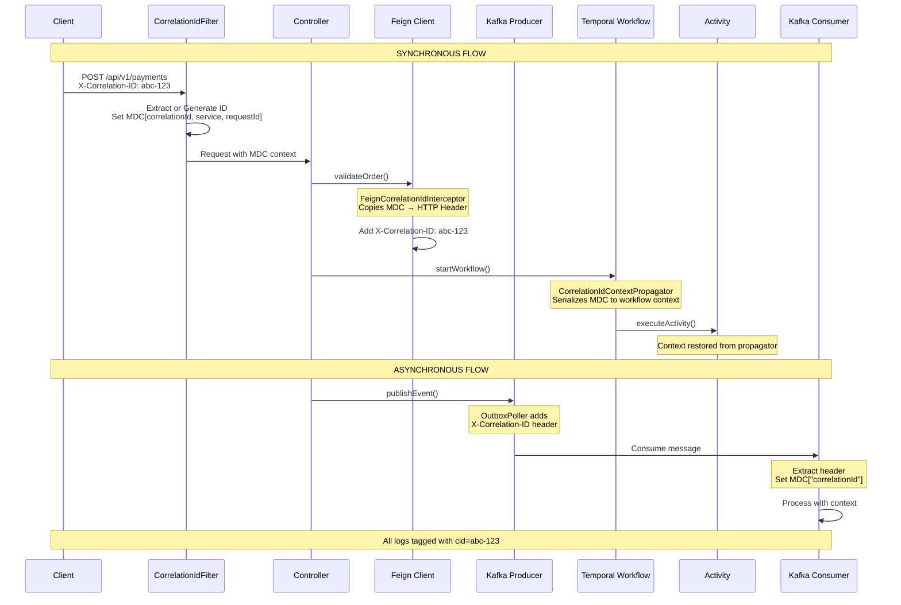

---

## Correlation ID Propagation

### Problem Statement

In a distributed system with sync HTTP calls, async Kafka messages, and durable Temporal workflows, maintaining request context is challenging. Without correlation IDs:

- Logs from different services cannot be linked
- Debugging failures requires manual timestamp matching
- Metrics cannot be attributed to specific requests

### Solution: Multi-Layer Propagation

```mermaid
flowchart TB
    subgraph Layer1["LAYER 1: HTTP Ingress"]
        Filter["CorrelationIdFilter<br/>(Servlet Filter)"]
        Extract["Extract from Header<br/>or Generate UUID"]
        MDC1["Set MDC Context"]
        Filter --> Extract --> MDC1
    end

    subgraph Layer2["LAYER 2: Inter-Service (Feign)"]
        Interceptor["FeignCorrelationIdInterceptor<br/>(RequestInterceptor)"]
        CopyMDC["Read MDC[correlationId]"]
        AddHeader["Add X-Correlation-ID<br/>to outgoing request"]
        Interceptor --> CopyMDC --> AddHeader
    end

    subgraph Layer3["LAYER 3: Async Thread Pools"]
        Decorator["MdcTaskDecorator<br/>(TaskDecorator)"]
        Capture["Capture MDC map<br/>before submission"]
        Restore["Restore MDC map<br/>in worker thread"]
        Decorator --> Capture --> Restore
    end

    subgraph Layer4["LAYER 4: Kafka Messages"]
        Producer["OutboxPoller"]
        Header["Add X-Correlation-ID<br/>to ProducerRecord headers"]
        Consumer["WebhookEventConsumer"]
        ExtractHeader["Extract from headers<br/>Set MDC"]
        Producer --> Header
        Consumer --> ExtractHeader
    end

    subgraph Layer5["LAYER 5: Temporal Workflows"]
        Propagator["CorrelationIdContextPropagator<br/>(ContextPropagator)"]
        Serialize["Serialize MDC to<br/>workflow context"]
        Deserialize["Restore MDC in<br/>activity threads"]
        Propagator --> Serialize --> Deserialize
    end

    Layer1 --> Layer2
    Layer1 --> Layer3
    Layer1 --> Layer4
    Layer1 --> Layer5
```

### Implementation Components

**Shared Components (payment-saga-common):**

| Component | Location | Purpose |
|-----------|----------|---------|
| `LoggingConstants` | `payment-saga-common/.../observability/` | Centralized MDC keys, HTTP headers, log prefix constants |
| `CorrelationIdFilter` | `payment-saga-common/.../observability/` | Servlet filter that extracts/generates correlation ID, sets MDC |
| `MdcTaskDecorator` | `payment-saga-common/.../observability/` | Propagates MDC context to async executor threads |
| `CorrelationRegistry` | `payment-saga-common/.../correlation/` | Interface for correlation context storage/lookup |
| `RedisCorrelationRegistry` | `payment-saga-common/.../correlation/` | Redis implementation with 7-day TTL |

**Orchestrator Components:**

| Component | Location | Purpose |
|-----------|----------|---------|
| `CorrelationIdFilter` | `observability/` | Extends common filter, adds workflow ID support |
| `FeignCorrelationIdInterceptor` | `config/` | Injects correlation ID into Feign client requests |
| `CorrelationIdContextPropagator` | `observability/` | Propagates context across Temporal workflow boundaries |
| `TraceContextRestorer` | `observability/` | Resumes Zipkin traces for async webhook processing |
| `OutboxPoller` | `outbox/` | Injects correlation ID header into Kafka messages |
| `WebhookEventConsumer` | `consumer/` | Extracts correlation/trace headers and resumes traces |

**Service Components:**

| Component | Location | Purpose |
|-----------|----------|---------|
| `ObservabilityConfig` | Each service (`config/`) | Registers CorrelationIdFilter with Spring Boot |
| `WebhookKafkaOutboxPoller` | `payment-gateway-service/` | Injects B3 trace headers into webhook Kafka messages |

### Log Output Format

All services use the unified log pattern (see [Structured Logging Architecture](#structured-logging-architecture)):

```
%d{yyyy-MM-dd HH:mm:ss.SSS} [%thread] [svc=%X{service:-}] [cid=%X{correlationId:-}] [tid=%X{traceId:-}] %-5level %logger{36} - %msg%n
```

**Example Output:**
```
2024-01-15 10:30:45.123 [http-nio-9090-exec-1] [svc=payment-saga-orchestrator] [cid=abc-123-def] [tid=xyz-789] [wf=payment-ORD-001] INFO PaymentController - [API] Processing payment
```

**MDC Keys:**
| Key | Description |
|-----|-------------|
| `svc` | Service name (e.g., `order-service`, `inventory-service`) |
| `cid` | Correlation ID - tracks single request across all services |
| `tid` | Trace ID - Zipkin distributed trace identifier |
| `wf` | Workflow ID - Temporal SAGA workflow instance (orchestrator only) |

---

## Structured Logging Architecture

This section describes the standardized logging approach across all services, ensuring consistent log patterns for debugging, monitoring, and log aggregation.

### Design Principles

The structured logging system follows these core principles:

| Principle | Description | Benefit |
|-----------|-------------|---------|
| **Unified Pattern** | All services use identical log format | Easy parsing by log aggregation tools |
| **Context Propagation** | MDC context flows across service boundaries | End-to-end request tracing |
| **Layer Identification** | Standardized prefixes identify component layers | Quick filtering by architectural layer |
| **Centralized Constants** | Shared module defines all logging constants | Consistency and easy maintenance |
| **Sensitive Data Protection** | Never log credentials, tokens, or PII | Security compliance |

### Unified Log Pattern

All services use this standardized log pattern:

```
%d{yyyy-MM-dd HH:mm:ss.SSS} [%thread] [svc=%X{service:-}] [cid=%X{correlationId:-}] [tid=%X{traceId:-}] %-5level %logger{36} - %msg%n
```

**Pattern Breakdown:**

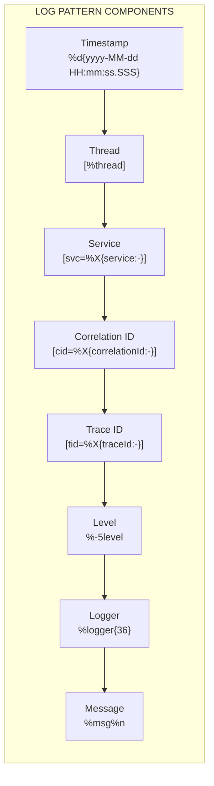

**Example Output:**

```
2024-01-15 10:30:45.123 [http-nio-9090-exec-1] [svc=payment-saga-orchestrator] [cid=abc-123-def] [tid=xyz-789] INFO  PaymentController - [API] Processing payment: orderId=ORD-001
```

### MDC Context Architecture

The MDC (Mapped Diagnostic Context) provides thread-local storage for logging context that automatically propagates across the request lifecycle:

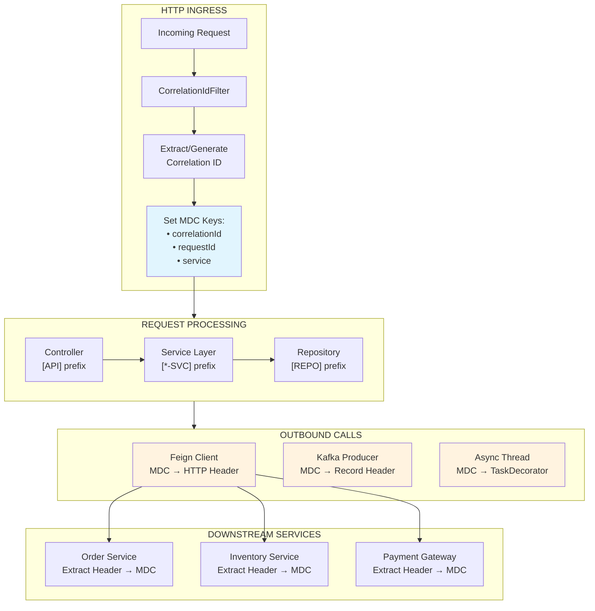

### MDC Keys Reference

| MDC Key | Source | Propagation | Purpose |
|---------|--------|-------------|---------|
| `correlationId` | `X-Correlation-ID` header or generated UUID | HTTP headers, Kafka headers, Temporal context | Cross-service request tracing |
| `requestId` | Generated UUID per request | Internal only | Unique request identifier |
| `service` | `spring.application.name` | N/A (set per service) | Identify source service in logs |
| `traceId` | Micrometer Tracing / Zipkin | B3 headers | Distributed tracing |
| `workflowId` | Temporal workflow ID | Temporal context | SAGA workflow tracking |

### Log Prefix Conventions

Standardized prefixes categorize log messages by architectural layer:

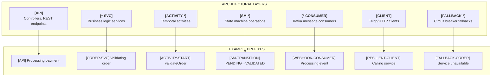

**Service-Specific Prefixes:**

| Service | Prefix | Example |
|---------|--------|---------|
| Order Service | `[ORDER-SVC]` | `[ORDER-SVC] Order validated: orderId=ORD-123` |
| Inventory Service | `[INVENTORY-SVC]` | `[INVENTORY-SVC] Stock reserved: sku=PROD-001` |
| Payment Gateway | `[PAYMENT-SVC]` | `[PAYMENT-SVC] Payment authorized: authId=AUTH-456` |
| Orchestrator API | `[API]` | `[API] Processing payment request` |
| Webhook Handler | `[WEBHOOK]` | `[WEBHOOK] Received stripe webhook` |

**Activity Prefixes (Orchestrator):**

| Prefix | Trigger | Example |
|--------|---------|---------|
| `[ACTIVITY-START]` | Activity begins | `[ACTIVITY-START] validateOrder: id=ORD-123` |
| `[ACTIVITY-END]` | Activity completes | `[ACTIVITY-END] validateOrder: id=ORD-123 duration=45ms` |
| `[ACTIVITY-FAILED]` | Activity fails | `[ACTIVITY-FAILED] validateOrder: error=Order not found` |
| `[ACTIVITY-IDEMPOTENT]` | Duplicate detected | `[ACTIVITY-IDEMPOTENT] Already validated: orderId=ORD-123` |

### Cross-Service Log Correlation Flow

This diagram shows how a single request flows through the system with consistent correlation:

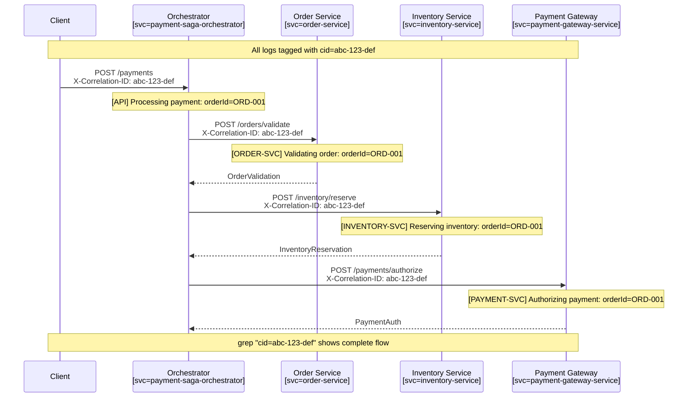

**Resulting Log Output (aggregated):**

```
# All logs for correlation ID abc-123-def across all services:

10:30:45.100 [svc=payment-saga-orchestrator] [cid=abc-123-def] INFO  PaymentController - [API] Processing payment: orderId=ORD-001
10:30:45.150 [svc=order-service]             [cid=abc-123-def] INFO  OrderServiceImpl - [ORDER-SVC] Validating order: orderId=ORD-001
10:30:45.180 [svc=order-service]             [cid=abc-123-def] INFO  OrderServiceImpl - [ORDER-SVC] Order created: orderId=ORD-001
10:30:45.200 [svc=inventory-service]         [cid=abc-123-def] INFO  InventoryServiceImpl - [INVENTORY-SVC] Reserving inventory: orderId=ORD-001
10:30:45.250 [svc=inventory-service]         [cid=abc-123-def] INFO  InventoryServiceImpl - [INVENTORY-SVC] Reserved: sku=PROD-001 quantity=2
10:30:45.300 [svc=payment-gateway-service]   [cid=abc-123-def] INFO  PaymentGatewayServiceImpl - [PAYMENT-SVC] Authorizing payment: orderId=ORD-001
10:30:45.350 [svc=payment-gateway-service]   [cid=abc-123-def] INFO  PaymentGatewayServiceImpl - [PAYMENT-SVC] Authorization approved: authId=AUTH-789
```

### Shared Logging Infrastructure

The logging components are centralized in `payment-saga-common` for consistency:

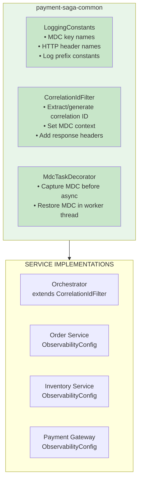

**Key Files:**

| File | Module | Purpose |
|------|--------|---------|
| `LoggingConstants.java` | payment-saga-common | Centralized MDC keys, headers, prefixes |
| `CorrelationIdFilter.java` | payment-saga-common | Shared servlet filter implementation |
| `MdcTaskDecorator.java` | payment-saga-common | Async thread context propagation |
| `ObservabilityConfig.java` | Each service | Registers filter with Spring Boot |

### Log Aggregation Queries

**Filter by Correlation ID:**

```bash
# Docker Compose
docker compose logs | grep "cid=abc-123-def"

# Kubernetes
kubectl logs -l app=payment-saga --all-containers | grep "cid=abc-123-def"
```

**Kibana (ELK Stack):**

```json
{
  "query": {
    "bool": {
      "must": [
        { "match": { "correlationId": "abc-123-def" } }
      ]
    }
  },
  "sort": [{ "@timestamp": "asc" }]
}
```

**Grafana Loki:**

```logql
{service=~".*-service|payment-saga-orchestrator"} |= "cid=abc-123-def" | logfmt
```

**Filter by Layer:**

```bash
# All API layer logs
grep "\[API\]" /var/log/payment-saga/*.log

# All service layer logs
grep "\[-SVC\]" /var/log/payment-saga/*.log

# All activity logs
grep "\[ACTIVITY-" /var/log/payment-saga/*.log

# All error/fallback logs
grep "\[FALLBACK-\|ERROR\]" /var/log/payment-saga/*.log
```

For detailed logging conventions, error handling guidelines, and sensitive data policies, see the [Logging Standards](LOGGING_STANDARDS.md) documentation.

---

## Webhook Trace Resumption

### Problem Statement

When integrating with external payment gateways (Stripe, PayPal, etc.), responses often arrive asynchronously via webhooks hours or days after the initial request. This breaks trace continuity:

```
Original Request (cid=abc-123) → Payment Gateway → [hours/days pass] → Webhook arrives → NEW cid generated
```

Without trace resumption:
- Webhook processing appears as a disconnected trace in Zipkin
- Logs cannot be linked back to the original payment request
- End-to-end latency metrics are incomplete

### Solution: Correlation Registry Pattern

The solution persists correlation context at payment initiation and restores it when webhooks arrive:

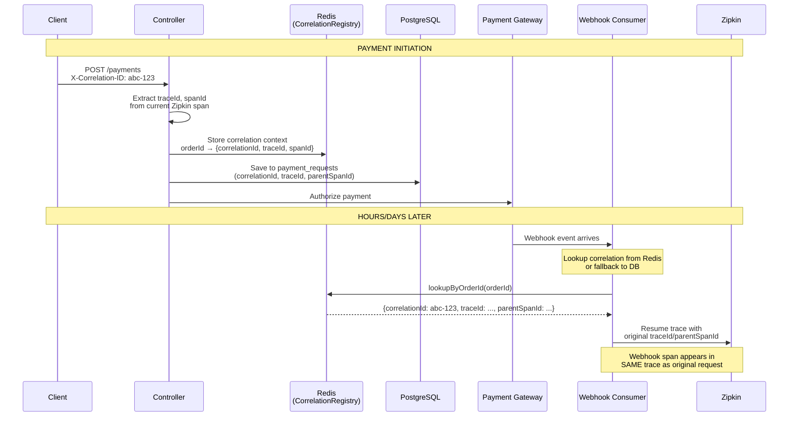

### Implementation Components

| Component | Location | Purpose |
|-----------|----------|---------|
| `CorrelationContext` | `payment-saga-common/.../correlation/` | DTO storing correlationId, traceId, parentSpanId, orderId |
| `CorrelationRegistry` | `payment-saga-common/.../correlation/` | Interface for correlation storage/lookup |
| `RedisCorrelationRegistry` | `payment-saga-common/.../correlation/` | Redis implementation with 7-day TTL |
| `TraceContextRestorer` | `payment-saga-orchestrator/.../observability/` | Utility to resume Zipkin traces |
| `PaymentRequestEntity` | `payment-saga-orchestrator/.../entity/` | DB entity with correlation fields |

### Storage Strategy

**Redis (Primary - Fast Cross-Service Lookup):**
```
correlation:order:{orderId}     → JSON CorrelationContext
correlation:ref:{authId}        → orderId (pointer)
correlation:ref:{captureId}     → orderId (pointer)
```

**PostgreSQL (Fallback):**
```sql
ALTER TABLE payment_requests ADD COLUMN correlation_id VARCHAR(100);
ALTER TABLE payment_requests ADD COLUMN trace_id VARCHAR(32);
ALTER TABLE payment_requests ADD COLUMN parent_span_id VARCHAR(16);
```

### Trace Resumption Flow

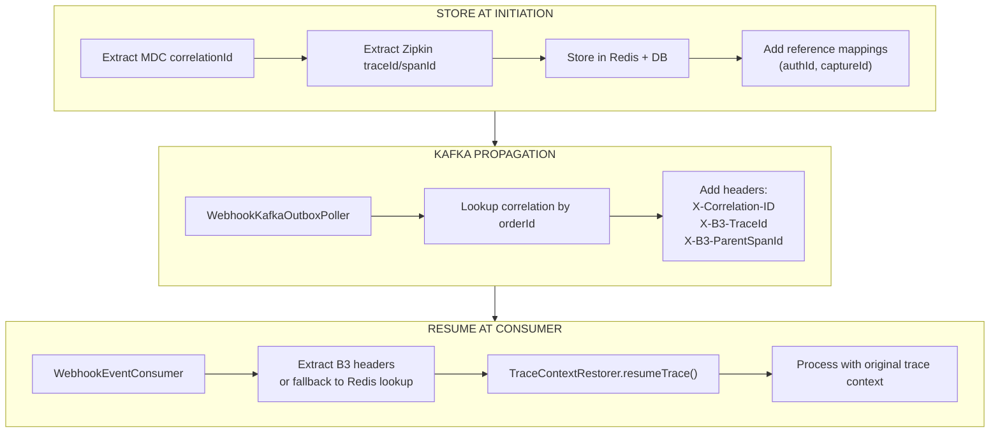

### Key Code Snippets

**Storing Correlation at Payment Initiation (PaymentController.java):**
```java
// Extract correlation context
String correlationId = MDC.get(CorrelationIdFilter.CORRELATION_ID_MDC_KEY);
String traceId = traceContextRestorer.getCurrentTraceId();
String spanId = traceContextRestorer.getCurrentSpanId();

// Store in Redis for cross-service lookup
correlationRegistry.store(orderId, CorrelationContext.builder()
    .correlationId(correlationId)
    .traceId(traceId)
    .parentSpanId(spanId)
    .orderId(orderId)
    .workflowId(workflowId)
    .build());

// Also save to DB via PaymentRequestService
paymentRequestService.savePaymentRequest(workflowId, request, correlationId, traceId, spanId);
```

**Adding Reference Mappings (PaymentActivitiesImpl.java):**
```java
// After successful authorization
correlationRegistry.addReference(orderId, auth.getAuthId());

// After successful capture
correlationRegistry.addReference(orderId, capture.getCaptureId());
```

**Injecting Kafka Headers (WebhookKafkaOutboxPoller.java):**
```java
Optional<CorrelationContext> ctx = correlationRegistry.lookupByOrderId(event.getOrderId());
if (ctx.isPresent()) {
    record.headers().add("X-Correlation-ID", ctx.get().getCorrelationId().getBytes(UTF_8));
    record.headers().add("X-B3-TraceId", ctx.get().getTraceId().getBytes(UTF_8));
    record.headers().add("X-B3-ParentSpanId", ctx.get().getParentSpanId().getBytes(UTF_8));
}
```

**Resuming Trace (WebhookEventConsumer.java):**
```java
// Extract headers or fallback to Redis lookup
String traceId = extractHeader(record, "X-B3-TraceId");
String parentSpanId = extractHeader(record, "X-B3-ParentSpanId");

if (traceId == null && event.getOrderId() != null) {
    Optional<CorrelationContext> ctx = correlationRegistry.lookupByOrderId(event.getOrderId());
    if (ctx.isPresent()) {
        traceId = ctx.get().getTraceId();
        parentSpanId = ctx.get().getParentSpanId();
    }
}

// Resume Zipkin trace
Span span = traceContextRestorer.resumeTrace(traceId, parentSpanId, "webhook-consume");
try (Tracer.SpanInScope ws = traceContextRestorer.withSpanInScope(span)) {
    // Process webhook with original trace context
}
```

### Verification

**Check trace continuity in Zipkin:**
```bash
# 1. Make a payment request with correlation ID
curl -X POST http://localhost:9090/api/v1/payments \
  -H "Content-Type: application/json" \
  -H "X-Correlation-ID: test-trace-123" \
  -d '{"orderId":"ORD-001","customerId":"CUST-001",...}'

# 2. Note the trace ID in Zipkin UI
open http://localhost:9411

# 3. After webhook arrives, verify it appears in the SAME trace
# The webhook span should be a child of the original payment span
```

**Verify correlation in logs:**
```bash
# All logs for a payment should have the same correlation ID
docker compose logs payment-saga-orchestrator | grep "test-trace-123"
docker compose logs payment-gateway-service | grep "test-trace-123"
```

---

## Metrics Collection

### Metrics Architecture

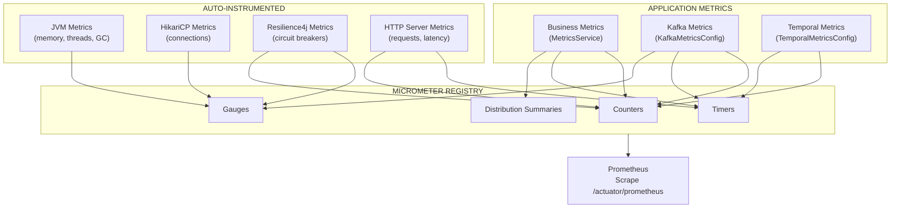

### Business Metrics

| Metric | Type | Tags | Description |
|--------|------|------|-------------|
| `payment_funnel_initiated_total` | Counter | `payment_method` | Payments started |
| `payment_funnel_completed_total` | Counter | `payment_method` | Successful payments |
| `payment_funnel_failed_total` | Counter | `payment_method`, `error_code`, `error_category` | Failed payments |
| `payment_funnel_duration_seconds` | Timer | `payment_method`, `outcome` | End-to-end payment duration |
| `payment_funnel_stage_total` | Counter | `stage`, `payment_method`, `outcome` | Funnel stage transitions |
| `payment_compensation_started_total` | Counter | `trigger_reason` | Compensation flows initiated |
| `payment_compensation_completed_total` | Counter | `outcome` | Compensation completions |
| `webhook_received_total` | Counter | `channel`, `event_type` | Webhooks received |
| `webhook_processed_total` | Counter | `channel`, `event_type`, `outcome` | Webhooks processed |
| `webhook_processing_duration_seconds` | Timer | `channel`, `event_type` | Webhook processing time |

### Infrastructure Metrics

| Metric | Source | Description |
|--------|--------|-------------|
| `jvm_memory_used_bytes` | Micrometer | JVM heap and non-heap memory usage |
| `jvm_threads_live_threads` | Micrometer | Current live thread count |
| `jvm_gc_pause_seconds` | Micrometer | GC pause duration |
| `hikaricp_connections_active` | HikariCP | Active database connections |
| `hikaricp_connections_pending` | HikariCP | Pending connection requests |
| `kafka_consumer_lag` | KafkaMetricsConfig | Consumer lag by topic/partition |
| `kafka_consumer_messages_consumed` | KafkaMetricsConfig | Messages consumed count |
| `resilience4j_circuitbreaker_state` | Resilience4j | Circuit breaker state (0=closed, 1=open, 2=half-open) |
| `resilience4j_circuitbreaker_failure_rate` | Resilience4j | Circuit breaker failure rate |
| `executor_pool_size_threads` | Micrometer | Thread pool size |
| `executor_active_threads` | Micrometer | Active threads in pool |

### Metrics Collection Flow

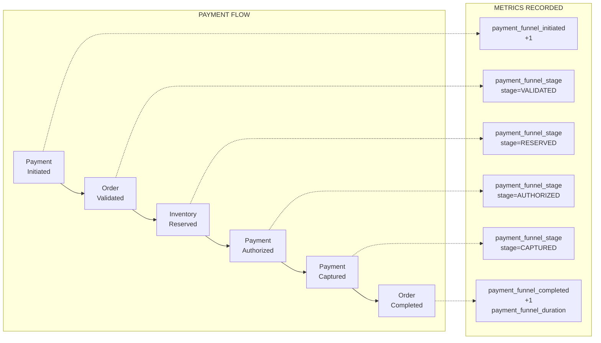

---

## Dashboards

### Payment Business Metrics Dashboard

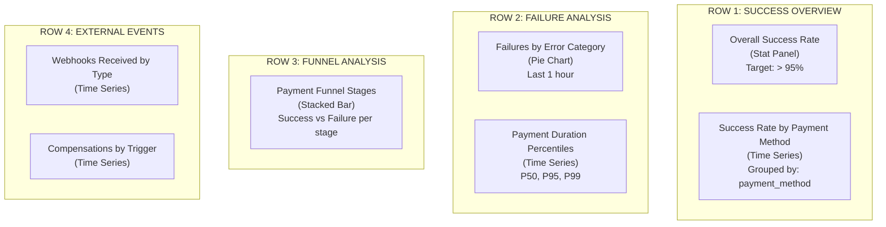

**Key Queries:**

```promql
# Overall Success Rate
sum(rate(payment_funnel_completed_total[5m])) /
sum(rate(payment_funnel_initiated_total[5m]))

# Success Rate by Payment Method
sum(rate(payment_funnel_completed_total[5m])) by (payment_method) /
sum(rate(payment_funnel_initiated_total[5m])) by (payment_method)

# Payment Duration P95
histogram_quantile(0.95, sum(rate(payment_funnel_duration_seconds_bucket[5m])) by (le, payment_method))

# Failure Distribution
sum(increase(payment_funnel_failed_total[1h])) by (error_category)
```

### Payment Infrastructure Dashboard

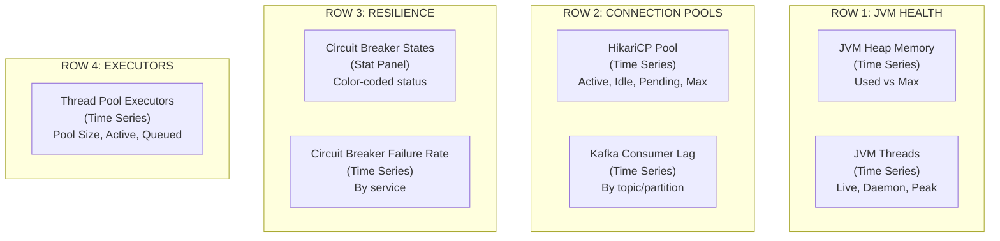

**Key Queries:**

```promql
# JVM Heap Used
jvm_memory_used_bytes{application="payment-saga-orchestrator", area="heap"}

# HikariCP Active Connections
hikaricp_connections_active{application="payment-saga-orchestrator"}

# Circuit Breaker State
resilience4j_circuitbreaker_state{application="payment-saga-orchestrator"}

# Kafka Consumer Lag
kafka_consumer_lag
```

---

## Alerting

### Alert Categories

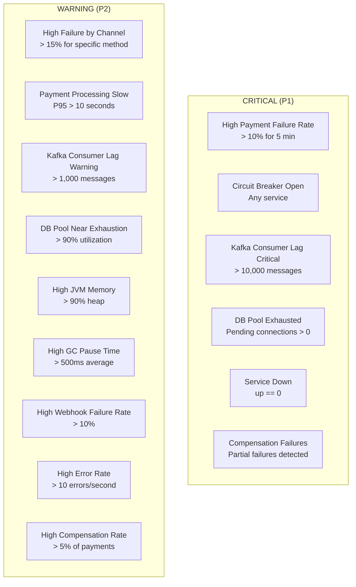

### Alert Definitions

| Alert | Expression | Severity | Duration |
|-------|------------|----------|----------|
| `HighPaymentFailureRate` | `failure_rate > 0.1` | Critical | 5m |
| `HighPaymentFailureRateByChannel` | `channel_failure_rate > 0.15` | Warning | 5m |
| `PaymentProcessingSlowdown` | `p95_latency > 10s` | Warning | 5m |
| `CircuitBreakerOpen` | `state == "open"` | Warning | 1m |
| `HighKafkaConsumerLag` | `lag > 1000` | Warning | 10m |
| `KafkaConsumerLagCritical` | `lag > 10000` | Critical | 5m |
| `DBConnectionPoolExhausted` | `pending > 0` | Critical | 5m |
| `DBConnectionPoolNearExhaustion` | `active/max > 0.9` | Warning | 5m |
| `HighJVMMemoryUsage` | `heap_used/heap_max > 0.9` | Warning | 5m |
| `HighWebhookFailureRate` | `failure_rate > 0.1` | Warning | 5m |
| `CompensationFailures` | `partial_failures > 0` | Critical | 5m |
| `ServiceDown` | `up == 0` | Critical | 1m |

### Alert Flow

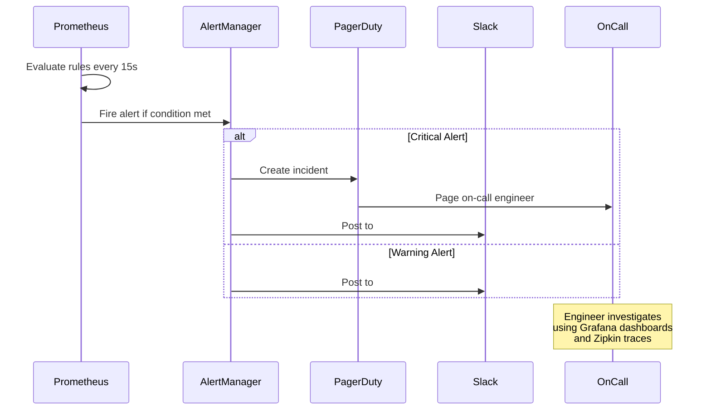

---

## Implementation Details

### File Structure

```
payment-saga/
├── payment-saga-common/
│   └── src/main/java/com/payment/saga/common/
│       ├── observability/                            # SHARED LOGGING INFRASTRUCTURE
│       │   ├── LoggingConstants.java                 # MDC keys, headers, log prefixes
│       │   ├── CorrelationIdFilter.java              # Base servlet filter
│       │   └── MdcTaskDecorator.java                 # Async thread context propagation
│       └── correlation/
│           ├── CorrelationContext.java               # Correlation context DTO
│           ├── CorrelationRegistry.java              # Storage interface
│           └── RedisCorrelationRegistry.java         # Redis implementation with 7-day TTL
│
├── payment-saga-orchestrator/
│   └── src/main/java/com/payment/saga/
│       ├── config/
│       │   └── FeignCorrelationIdInterceptor.java    # Feign header injection
│       ├── observability/
│       │   ├── CorrelationIdFilter.java              # Extends common filter (adds workflowId)
│       │   ├── CorrelationIdContextPropagator.java   # Temporal propagator
│       │   ├── MdcTaskDecorator.java                 # Extends common decorator
│       │   ├── TraceContextRestorer.java             # Zipkin trace resumption
│       │   ├── KafkaMetricsConfig.java               # Kafka consumer metrics
│       │   └── TemporalMetricsConfig.java            # Temporal workflow metrics
│       ├── entity/
│       │   └── PaymentRequestEntity.java             # Includes correlation fields
│       ├── service/
│       │   ├── MetricsService.java                   # Business metrics interface
│       │   └── impl/MetricsServiceImpl.java          # Business metrics impl
│       ├── outbox/
│       │   └── OutboxPoller.java                     # Kafka header injection
│       └── consumer/
│           └── WebhookEventConsumer.java             # Kafka header extraction + trace resumption
│
├── order-service/
│   └── src/main/java/com/payment/order/
│       └── config/
│           └── ObservabilityConfig.java              # Registers CorrelationIdFilter
│
├── inventory-service/
│   └── src/main/java/com/inventory/
│       └── config/
│           └── ObservabilityConfig.java              # Registers CorrelationIdFilter
│
├── payment-gateway-service/
│   └── src/main/java/com/payment/gateway/
│       ├── config/
│       │   └── ObservabilityConfig.java              # Registers CorrelationIdFilter
│       └── webhook/kafka/
│           └── WebhookKafkaOutboxPoller.java         # Correlation header injection
│
├── docs/
│   └── LOGGING_STANDARDS.md                          # Detailed logging conventions
│
└── observability/
    ├── prometheus/
    │   ├── prometheus.yml                            # Scrape configuration
    │   └── alerting-rules.yml                        # Alert definitions
    └── grafana/
        └── provisioning/
            └── dashboards/
                └── json/
                    ├── payment-business-metrics.json     # Business dashboard
                    └── payment-infrastructure.json       # Infrastructure dashboard
```

### Configuration

**Unified Log Pattern (all services):**

```yaml
# application.yml - Standard services (order, inventory, payment-gateway)
logging:
  pattern:
    console: "%d{yyyy-MM-dd HH:mm:ss.SSS} [%thread] [svc=%X{service:-}] [cid=%X{correlationId:-}] [tid=%X{traceId:-}] %-5level %logger{36} - %msg%n"
```

```yaml
# application.yml - Orchestrator (includes workflowId)
logging:
  pattern:
    console: "%d{yyyy-MM-dd HH:mm:ss.SSS} [%thread] [svc=%X{service:-}] [cid=%X{correlationId:-}] [tid=%X{traceId:-}] [wf=%X{workflowId:-}] %-5level %logger{36} - %msg%n"
```

**Actuator & Metrics Configuration:**

```yaml
management:
  endpoints:
    web:
      exposure:
        include: health,info,prometheus,circuitbreakers,ratelimiters
  metrics:
    tags:
      application: ${spring.application.name}
    export:
      prometheus:
        enabled: true
  tracing:
    sampling:
      probability: 1.0
```

### Accessing Observability Tools

| Tool | URL | Credentials |
|------|-----|-------------|
| Grafana | http://localhost:3000 | admin / admin |
| Prometheus | http://localhost:9099 | - |
| Zipkin | http://localhost:9411 | - |
| Actuator | http://localhost:9090/actuator | - |

### Useful Commands

```bash
# View all metrics
curl http://localhost:9090/actuator/prometheus

# View payment-specific metrics
curl http://localhost:9090/actuator/prometheus | grep "payment_"

# View circuit breaker states
curl http://localhost:9090/actuator/circuitbreakers | jq

# View Kafka consumer metrics
curl http://localhost:9090/actuator/prometheus | grep "kafka_consumer"

# Search traces by correlation ID in Zipkin
# Open: http://localhost:9411/zipkin/?serviceName=payment-saga-orchestrator&tags=correlationId%3Dabc-123
```

---

## Best Practices

### Correlation ID Guidelines

1. **Always extract from incoming requests** - Check `X-Correlation-ID` header first
2. **Generate UUID if missing** - Never leave correlation ID empty
3. **Propagate to all outbound calls** - HTTP, Kafka, Temporal, async threads
4. **Include in all log statements** - Via MDC pattern in log format
5. **Return in response headers** - Allow clients to track their requests

### Logging Guidelines

1. **Use standardized prefixes** - Match the layer convention:
   - Controllers: `[API]`
   - Services: `[ORDER-SVC]`, `[INVENTORY-SVC]`, `[PAYMENT-SVC]`
   - Activities: `[ACTIVITY-START]`, `[ACTIVITY-END]`, `[ACTIVITY-FAILED]`
   - Consumers: `[WEBHOOK-CONSUMER]`, `[DEBIT-CONSUMER]`
   - Fallbacks: `[FALLBACK-ORDER]`, `[FALLBACK-PAYMENT]`

2. **Include contextual identifiers** - Always log relevant IDs:
   ```java
   log.info("[ORDER-SVC] Order validated: orderId={} customerId={}", orderId, customerId);
   ```

3. **Use appropriate log levels**:
   - `ERROR` - System failures requiring attention
   - `WARN` - Unexpected but recoverable situations (retries, fallbacks)
   - `INFO` - Business operations, state changes
   - `DEBUG` - Detailed diagnostic information

4. **Never log sensitive data** - No passwords, tokens, full card numbers, PII

5. **Use centralized constants** - Import from `LoggingConstants`:
   ```java
   import static com.payment.saga.common.observability.LoggingConstants.*;
   ```

### Metrics Guidelines

1. **Use consistent naming** - Follow Prometheus naming conventions (`snake_case`)
2. **Include relevant tags** - But avoid high-cardinality tags (no user IDs)
3. **Use appropriate metric types** - Counters for totals, gauges for current values, histograms for latencies
4. **Set meaningful buckets** - For histograms, align with SLA boundaries
5. **Document all metrics** - Include description in metric registration

### Alerting Guidelines

1. **Alert on symptoms, not causes** - "High error rate" not "Database slow"
2. **Set appropriate thresholds** - Based on historical data and SLAs
3. **Include runbook links** - In alert annotations
4. **Avoid alert fatigue** - Don't alert on every spike
5. **Test alerts regularly** - Verify they fire correctly

---

## Troubleshooting

### Common Issues

| Issue | Symptoms | Resolution |
|-------|----------|------------|
| Missing correlation IDs | Logs show `cid=` (empty) | Verify `CorrelationIdFilter` is registered via `ObservabilityConfig` |
| Missing service name | Logs show `svc=` (empty) | Verify `spring.application.name` is set in application.yml |
| Correlation lost in async | Child threads have different `cid` | Verify `MdcTaskDecorator` on executor |
| Inconsistent log prefixes | Logs use `[ORDER-SERVICE]` instead of `[ORDER-SVC]` | Update to standardized prefixes per [Logging Standards](LOGGING_STANDARDS.md) |
| Kafka messages lack correlation | Consumer logs show new UUID | Verify `OutboxPoller` header injection |
| Temporal activities lose context | Activity logs have different `cid` | Verify `CorrelationIdContextPropagator` |
| Webhook trace not resumed | Webhook appears as new trace in Zipkin | Verify `CorrelationRegistry` stores context at initiation |
| Webhook missing B3 headers | Consumer falls back to new trace | Check `WebhookKafkaOutboxPoller` header injection |
| Redis correlation lookup fails | Consumer logs "No correlation context found" | Verify Redis connection and 7-day TTL hasn't expired |
| Metrics not appearing | `/actuator/prometheus` missing metrics | Verify `MeterRegistry` injection |
| Dashboards empty | Grafana panels show "No data" | Verify Prometheus scrape targets |

### Debug Commands

**Log Correlation Verification:**

```bash
# Check if correlation filter is active (look for X-Correlation-ID in response)
curl -v http://localhost:9090/api/v1/payments -H "X-Correlation-ID: test-123" 2>&1 | grep -i correlation

# Trace a request across all services by correlation ID
docker compose logs | grep "cid=test-123"

# Filter logs by service
docker compose logs | grep "svc=order-service"

# Filter logs by layer prefix
docker compose logs | grep "\[API\]"
docker compose logs | grep "\[ORDER-SVC\]"
docker compose logs | grep "\[ACTIVITY-"
```

**Kafka & Trace Verification:**

```bash
# Verify Kafka message headers (check for B3 trace headers)
docker exec payment-saga-kafka kafka-console-consumer \
  --bootstrap-server localhost:9092 \
  --topic webhook.payment.events \
  --from-beginning \
  --property print.headers=true \
  --max-messages 1

# Check correlation context in Redis
docker exec payment-saga-redis redis-cli GET "correlation:order:ORD-001"

# Check reference mappings in Redis
docker exec payment-saga-redis redis-cli GET "correlation:ref:auth-123"

# Verify correlation stored in database
docker exec -it payment-saga-postgres psql -U postgres -d saga_db \
  -c "SELECT order_id, correlation_id, trace_id, parent_span_id FROM payment_requests WHERE order_id='ORD-001'"
```

**Metrics & Tracing:**

```bash
# Verify metrics endpoint
curl -s http://localhost:9090/actuator/prometheus | head -50

# Search for trace in Zipkin by correlation ID
# Open: http://localhost:9411/zipkin/?serviceName=payment-saga-orchestrator&tags=correlationId%3Dtest-123

# Enable debug logging for Temporal (add to application.yml)
# logging.level.io.temporal=DEBUG
```

---

## References

- [Logging Standards](LOGGING_STANDARDS.md) - Detailed logging conventions and MDC key definitions
- [Micrometer Documentation](https://micrometer.io/docs)
- [Prometheus Best Practices](https://prometheus.io/docs/practices/naming/)
- [Grafana Dashboard Best Practices](https://grafana.com/docs/grafana/latest/dashboards/best-practices/)
- [OpenTelemetry Context Propagation](https://opentelemetry.io/docs/concepts/context-propagation/)
- [Temporal Context Propagation](https://docs.temporal.io/develop/java/observability#context-propagation)
