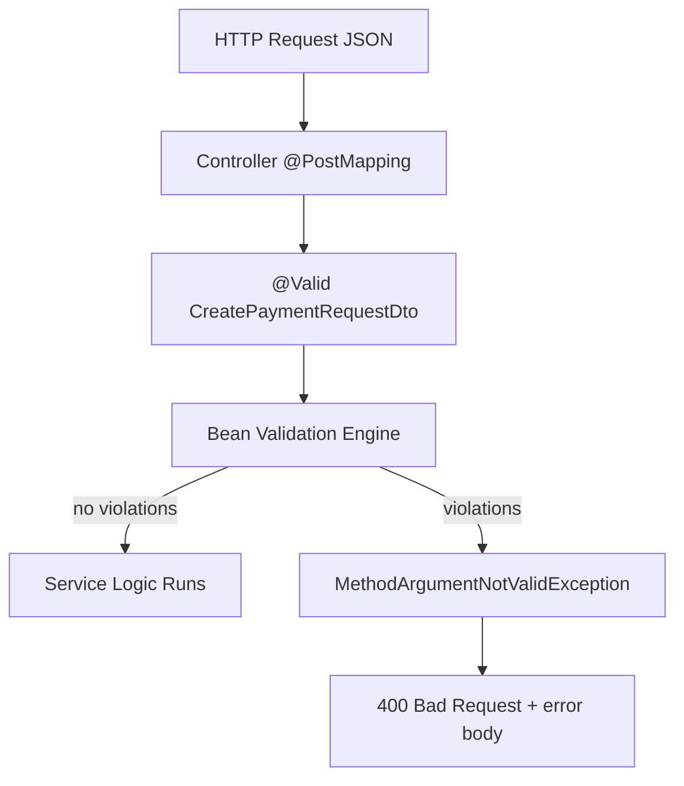
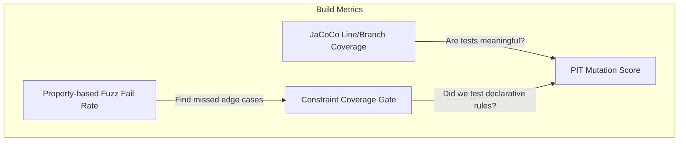
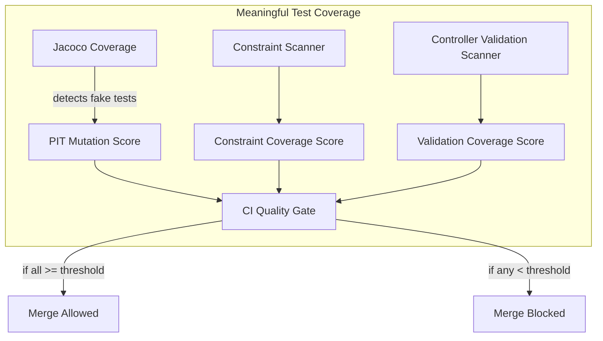
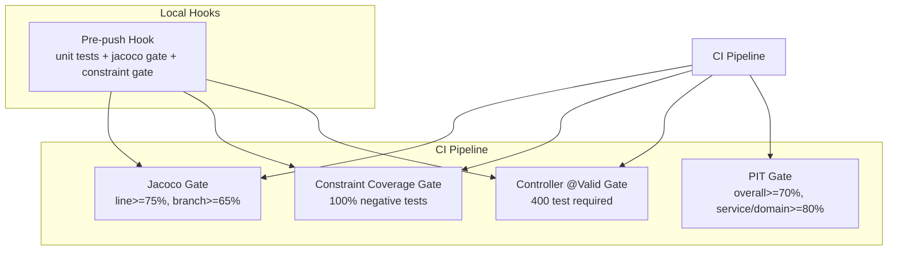

# **QUALITY.md**

### _Engineering Quality Framework — Shared Services Platform (AHSS)_

_Version 1.0 — Enforced Across All Teams_

---

# **1. Purpose**

This document defines the **quality gates, testing requirements, and review expectations** for all backend code submitted to this repository. These standards ensure:

- predictable quality
- meaningful tests (not coverage-padding)
- safe scaling as the platform grows
- provable correctness in validation, domain logic, and API boundaries
- confidence when integrating payments, identity, and multi-tenant features

This is **binding** for all engineers and enforced through CI, PR reviews, and automated gates.

---

# **2. Quality Gates (mandatory for merge)**

All pull requests and CI pipelines must pass the following four gates:

---

## **2.1 JaCoCo Code Coverage Gate**

| Metric              | Minimum Requirement |
| ------------------- | ------------------- |
| **Line coverage**   | ≥ **75%**           |
| **Branch coverage** | ≥ **65%**           |

```java
plugins {
    id 'java'
    id 'jacoco'
    id 'info.solidsoft.pitest' version '1.15.0'
}

jacoco {
    toolVersion = "0.8.12"
}

tasks.test {
    useJUnitPlatform()
    finalizedBy jacocoTestReport, jacocoTestCoverageVerification
}

jacocoTestReport {
    dependsOn test
    reports {
        xml.required = true
        html.required = true
        csv.required = false
    }
}

jacocoTestCoverageVerification {
    dependsOn test
    violationRules {
        rule {
            element = 'BUNDLE'
            limits {
                limit {
                    counter = 'LINE'
                    value = 'COVEREDRATIO'
                    minimum = 0.75
                }
                limit {
                    counter = 'BRANCH'
                    value = 'COVEREDRATIO'
                    minimum = 0.65
                }
            }
        }
        // Optional: exclude DTO/config from Jacoco gate
        rule {
            element = 'CLASS'
            excludes = [
                    'com.ahss.dto.*',
                    '**.*Config*',
                    '**.*Application*'
            ]
        }
    }
}
```

**Notes**

- DTOs, Config, and Application classes are excluded from this gate.
- High coverage cannot be substituted for meaningful assertions.

Run manually:

```bash
./gradlew jacocoTestReport jacocoTestCoverageVerification
```

---

## **2.2 Mutation Testing Gate (PIT)**

`build.gradle`

```groovy
pitest {
    junit5PluginVersion = "1.2.1"
    targetClasses = ["com.ahss.*"]
    targetTests   = ["com.ahss.*"]
    threads = 4
    outputFormats = ["HTML", "XML"]
    timestampedReports = false
    mutators = ["STRONGER"]

    // Keep PIT focused and fast
    excludedClasses = [
            "com.ahss.dto.*",        // declarative; tested via constraint gate
            "**/*Configuration*",
            "**/*Config*",
            "**/*Application*",
    ]
    excludedTestClasses = [
            "**/*IT*",
            "**/*IntegrationTest*"
    ]
}
```

```groovy
import groovy.xml.XmlSlurper

tasks.register("pitestGate") {
    dependsOn tasks.pitest
    doLast {
        def report = file("$buildDir/reports/pitest/mutations.xml")
        if (!report.exists()) {
            throw new GradleException("PIT report not found at: $report")
        }

        def xml = new XmlSlurper().parse(report)
        def mutations = xml.mutation
        def total = mutations.size()
        def killed = mutations.findAll { it.status.text() in ["KILLED", "TIMED_OUT"] }.size()
        def overallScore = total == 0 ? 0 : (killed / total)

        if (overallScore < 0.70) {
            throw new GradleException("PIT overall mutation score ${overallScore} < 0.70")
        }

        // service/domain subsets
        def serviceMutations = mutations.findAll { it.mutatedClass.text().contains(".service.") }
        def domainMutations  = mutations.findAll { it.mutatedClass.text().contains(".domain.") || it.mutatedClass.text().contains(".entity.") }

        def subsetScore = { subset ->
            if (subset.isEmpty()) return 1.0
            def st = subset.size()
            def sk = subset.findAll { it.status.text() in ["KILLED", "TIMED_OUT"] }.size()
            return sk / st
        }

        def serviceScore = subsetScore(serviceMutations)
        def domainScore  = subsetScore(domainMutations)

        if (serviceScore < 0.80) {
            throw new GradleException("PIT service mutation score ${serviceScore} < 0.80")
        }
        if (domainScore < 0.80) {
            throw new GradleException("PIT domain/entity mutation score ${domainScore} < 0.80")
        }

        println "✅ PIT gates passed. overall=${overallScore}, service=${serviceScore}, domain/entity=${domainScore}"
    }
}
```

Mutation testing validates **test effectiveness**, not test quantity.

| Scope                                        | Required PIT Score |
| -------------------------------------------- | ------------------ |
| **Overall project**                          | ≥ **70%**          |
| **service/** and **entity/domain/** packages | ≥ **80%**          |

Failing this gate signals weak assertions or insufficient negative testing.

Run manually:

```bash
./gradlew pitest pitestGate
```

---

## **2.3 Constraint Coverage Gate (Jakarta Bean Validation)**

In `build.gradle`

```groovy
dependencies {
    // already in Spring Boot starter test typically
    testImplementation "org.assertj:assertj-core"
    testImplementation "org.reflections:reflections:0.10.2"
    testImplementation "org.springframework.boot:spring-boot-starter-validation"
}
```

Create: `src/test/java/com/ahss/validation/ConstraintCoverageTest.java`

```java
package com.ahss.validation;

import jakarta.validation.Constraint;
import org.junit.jupiter.api.Test;
import org.reflections.Reflections;

import java.lang.annotation.Annotation;
import java.lang.reflect.Field;
import java.lang.reflect.Method;
import java.util.*;
import java.util.stream.Collectors;

import static org.assertj.core.api.Assertions.assertThat;

public class ConstraintCoverageTest {

    private static final String DTO_PACKAGE = "com.ahss.dto";

    @Test
    void all_constraints_have_negative_tests() {
        Reflections reflections = new Reflections(DTO_PACKAGE);

        Set<Class<?>> dtoClasses = reflections.getSubTypesOf(Object.class).stream()
                .filter(c -> c.getPackageName().startsWith(DTO_PACKAGE))
                .filter(c -> c.getSimpleName().endsWith("Dto")
                        || c.getSimpleName().endsWith("Request")
                        || c.getSimpleName().endsWith("Response"))
                .collect(Collectors.toSet());

        Set<String> required = new HashSet<>();

        for (Class<?> dto : dtoClasses) {
            for (Field f : dto.getDeclaredFields()) {
                for (Annotation a : f.getAnnotations()) {
                    if (a.annotationType().isAnnotationPresent(Constraint.class)) {
                        required.add(testName(dto, f, a));
                    }
                }
            }
        }

        Set<String> actual = allTestMethodNames();

        Set<String> missing = required.stream()
                .filter(r -> !actual.contains(r))
                .collect(Collectors.toSet());

        assertThat(missing)
                .as("Missing negative tests for constraints: " + missing)
                .isEmpty();
    }

    private Set<String> allTestMethodNames() {
        Reflections reflections = new Reflections("com.ahss");
        return reflections.getMethodsAnnotatedWith(Test.class).stream()
                .map(m -> m.getDeclaringClass().getSimpleName() + "#" + m.getName())
                .collect(Collectors.toSet());
    }

    private String testName(Class<?> dto, Field f, Annotation a) {
        return dto.getSimpleName()
                + "#invalid_" + f.getName()
                + "_" + a.annotationType().getSimpleName()
                + "_fails";
    }
}
```

Because validation annotations do not execute code (and Jacoco does not detect them), we require **100% negative test coverage** for all Jakarta constraints.

### **Naming Convention (must follow)**

For every constraint on a DTO field:

```
invalid_<fieldName>_<ConstraintName>_fails
```

Example for `@NotBlank` on `title`:

```
invalid_title_NotBlank_fails
```

**The gate scans all DTOs and will fail CI if any Jakarta constraint lacks a negative test.**

This ensures correctness across:

```
src/main/java/com/ahss/dto/**
```

Gate runs automatically in `./gradlew test`.

---

## **2.4 Controller Validation Wiring Gate**

Every controller endpoint using `@Valid` must have at least **one** test verifying:

```
invalid payload → 400 BAD REQUEST
```

Naming convention:

```
<ControllerName>ValidationTest#invalidPayload_returns400
```

Create a light gate test: `src/test/java/com/ahss/validation/ControllerValidationCoverageTest.java`

```java
package com.ahss.validation;

import jakarta.validation.Valid;
import org.junit.jupiter.api.Test;
import org.reflections.Reflections;
import org.springframework.web.bind.annotation.RestController;

import java.lang.reflect.Method;
import java.lang.reflect.Parameter;
import java.util.Set;
import java.util.stream.Collectors;

import static org.assertj.core.api.Assertions.assertThat;

public class ControllerValidationCoverageTest {

    @Test
    void all_validated_controller_methods_have_400_tests() {
        Reflections reflections = new Reflections("com.ahss.controller");
        Set<Class<?>> controllers = reflections.getTypesAnnotatedWith(RestController.class);

        Set<String> requiredTests = controllers.stream()
                .flatMap(c -> Set.of(c.getDeclaredMethods()).stream()
                        .filter(this::hasValidParameter)
                        .map(m -> c.getSimpleName() + "ValidationTest#invalidPayload_returns400"))
                .collect(Collectors.toSet());

        Reflections testReflections = new Reflections("com.ahss");
        Set<String> actualTests = testReflections.getMethodsAnnotatedWith(Test.class).stream()
                .map(m -> m.getDeclaringClass().getSimpleName() + "#" + m.getName())
                .collect(Collectors.toSet());

        Set<String> missing = requiredTests.stream()
                .filter(r -> !actualTests.contains(r))
                .collect(Collectors.toSet());

        assertThat(missing)
                .as("Missing controller 400 validation tests: " + missing)
                .isEmpty();
    }

    private boolean hasValidParameter(Method m) {
        for (Parameter p : m.getParameters()) {
            if (p.isAnnotationPresent(Valid.class)) return true;
        }
        return false;
    }
}
```

This enforces correct Spring validation wiring and ensures error payload consistency across services.

---

# **3. PR Requirements (non-negotiable)**

Every pull request must comply with:

### **3.1 Test Requirements Checklist**

- [ ] Unit tests added or updated
- [ ] Negative tests provided for every new/changed Jakarta constraint
- [ ] Controller validation tests updated if @Valid DTO changed
- [ ] At least one passing + one failing test for each newly added constraint
- [ ] Mutation score impact considered (especially in domain/service)

### **3.2 Evidence Required**

Paste or link:

- Unit test results
- Jacoco coverage report
- PIT mutation report (if applicable)
- Any manual test notes for functional change
- Request/response examples for new endpoints

### **3.3 Code Quality Expectations**

- No dead code
- Clear naming
- Explicit error handling
- DTOs validated with Jakarta constraints (no manual null checks unless mandated by business rules)
- No leaking entities into API responses
- No using tests to satisfy “coverage”—tests must assert **behavior**, not “that code runs”

---

# **4. Developer Guide — Writing Validation Negative Tests**

Every Jakarta constraint requires explicit negative coverage.

### **4.1 Build a Valid Baseline DTO**

```java
CreatePaymentRequestDto dto = new CreatePaymentRequestDto();
dto.setTitle("Valid Title");
dto.setAmount(new BigDecimal("10.00"));
dto.setCurrency("USD");
dto.setPayerName("Dennis");
dto.setPayerEmail("dennis@example.com");
dto.setAllowedPaymentMethods(List.of(PaymentMethodType.CARD));
dto.setTenantId(1L);
dto.setExpiresAt(LocalDateTime.now().plusDays(1));
```

### **4.2 Apply Negative Case**

Example for `@NotBlank`:

```java
@Test
void invalid_title_NotBlank_fails() {
    var dto = validDto();
    dto.setTitle("  ");

    var violations = validator.validate(dto);

    assertThat(violations)
        .anyMatch(v -> v.getPropertyPath().toString().equals("title"));
}
```

### **4.3 Constraints to cover**

Common annotations and patterns:

| Annotation             | Negative Tests Required          |
| ---------------------- | -------------------------------- |
| `@NotNull`             | field = null                     |
| `@NotBlank`            | blank / whitespace               |
| `@Size`                | length < min or > max            |
| `@Email`               | invalid format                   |
| `@Digits`              | too many integer/fraction digits |
| `@DecimalMin`          | below min value                  |
| `@NotEmpty`            | empty list or array              |
| `@Future`              | past date                        |
| Custom / `@AssertTrue` | predicate returns false          |

### **4.4 Positive Test (baseline)**

Every DTO validator test must include:

```java
@Test
void validDto_hasNoViolations() {
    assertThat(validator.validate(validDto())).isEmpty();
}
```

---

# **5. Local Developer Workflow**

### **5.1 Before pushing (auto-enforced)**

A lightweight `pre-push` hook runs:

```
./gradlew test jacocoTestCoverageVerification
```

This ensures:

- unit tests pass
- constraint coverage gate passes
- controller validation gate passes
- basic coverage thresholds pass

### **5.2 CI runs full verification**

```
./gradlew clean test jacocoTestCoverageVerification pitest pitestGate
```

CI is the ultimate source of truth.

---

# **6. Quality Gates Architecture (MermaidJs)**

## 6.1 Validation flow



**Bottom line**

- Jacoco is necessary but not sufficient.
- The DTO you showed absolutely needs explicit Bean Validation tests.

### 6.1.1 Systematic “constraint coverage” for Jakarta annotations

Goal: fail the build if any constraint is untested. **Jacoco won’t help because annotations don’t execute. Bean Validation is declarative.**

**Approach**

1. Reflect over DTO fields
2. Collect all constraint annotations
3. Verify there is a test method referencing each (naming convention)
4. If any missing → fail

**You enforce a rule like:** For every constraint on `CreatePaymentRequestDto.field`, there must be a test named
`invalid_<field>_<constraint>_fails`

**Example rule-test (JUnit 5)**

```java
package com.ahss.dto.validation;

import jakarta.validation.Constraint;
import org.junit.jupiter.api.Test;

import java.lang.annotation.Annotation;
import java.lang.reflect.Field;
import java.lang.reflect.Method;
import java.util.*;
import java.util.stream.Collectors;

import static org.assertj.core.api.Assertions.assertThat;

class DtoConstraintCoverageTest {

    // Add DTOs you want enforced here (or scan package)
    private static final List<Class<?>> DTOS = List.of(
        com.ahss.dto.request.CreatePaymentRequestDto.class
    );

    @Test
    void all_constraints_have_negative_tests() {
        Set<String> requiredTests = new HashSet<>();

        for (Class<?> dto : DTOS) {
            for (Field f : dto.getDeclaredFields()) {
                for (Annotation a : f.getAnnotations()) {
                    if (isConstraint(a)) {
                        String constraint = a.annotationType().getSimpleName();
                        requiredTests.add("invalid_" + f.getName() + "_" + constraint + "_fails");
                    }
                }
            }
        }

        Set<String> actualTests = Arrays.stream(getClass().getDeclaredMethods())
            .filter(m -> m.isAnnotationPresent(Test.class))
            .map(Method::getName)
            .collect(Collectors.toSet());

        Set<String> missing = requiredTests.stream()
            .filter(r -> !actualTests.contains(r))
            .collect(Collectors.toSet());

        assertThat(missing)
            .as("Missing negative tests for constraints: " + missing)
            .isEmpty();
    }

    private boolean isConstraint(Annotation a) {
        return a.annotationType().isAnnotationPresent(Constraint.class);
    }

    // --------------------------
    // REQUIRED negative tests
    // --------------------------

    @Test void invalid_title_NotBlank_fails() {}
    @Test void invalid_title_Size_fails() {}
    @Test void invalid_amount_NotNull_fails() {}
    @Test void invalid_amount_DecimalMin_fails() {}
    @Test void invalid_amount_Digits_fails() {}
    @Test void invalid_currency_NotBlank_fails() {}
    @Test void invalid_currency_Size_fails() {}
    @Test void invalid_payerName_NotBlank_fails() {}
    @Test void invalid_payerName_Size_fails() {}
    @Test void invalid_payerEmail_NotBlank_fails() {}
    @Test void invalid_payerEmail_Email_fails() {}
    @Test void invalid_payerPhone_Size_fails() {}
    @Test void invalid_allowedPaymentMethods_NotEmpty_fails() {}
    @Test void invalid_expiresAt_Future_fails() {}
    @Test void invalid_tenantId_NotNull_fails() {}
}
```

**How to use this:**

- Replace empty methods with real validation asserts
- Any time someone adds @NotNull etc and forgets tests → build fails.

This becomes your internal “constraint coverage” gate.

### 6.1.2 Optional but strong: Property-based testing for DTO validation

Why: Humans miss edge cases. Generators don’t. Use `jqwik` or `QuickTheories` to fuzz invalid values.

**Example fuzz test (invalid email always fails):**

```java
import com.ahss.dto.request.CreatePaymentRequestDto;
import jakarta.validation.Validation;
import jakarta.validation.Validator;
import net.jqwik.api.*;
import java.util.List;

import static org.assertj.core.api.Assertions.assertThat;

class CreatePaymentRequestDtoFuzzTest {

    Validator validator = Validation.buildDefaultValidatorFactory().getValidator();

    private CreatePaymentRequestDto validDto() {
        // same builder as before
        // ...
        return new CreatePaymentRequestDto(/* fill valid */);
    }

    @Property
    void invalidEmails_fail_validation(@ForAll("badEmails") String badEmail) {
        var dto = validDto();
        dto.setPayerEmail(badEmail);

        var v = validator.validate(dto);
        assertThat(v).anyMatch(cv -> cv.getPropertyPath().toString().equals("payerEmail"));
    }

    @Provide
    Arbitrary<String> badEmails() {
        return Arbitraries.strings()
            .alpha().numeric().withChars("._-")
            .ofMinLength(1).ofMaxLength(30)
            .filter(s -> !s.contains("@")); // guarantee invalid
    }
}
```

Property tests won’t replace deterministic cases, but they catch _surprises_.

## 6.2 How these metrics fit together



**What I’d enforce (practical gates)**

1. JaCoCo

   - line ≥ 75%, branch ≥ 65% (baseline)

2. PIT score

   - mutation ≥ 70% overall
   - ≥ 80% for service/ and domain/

3. Constraint coverage gate

   - 100% of constraints have at least one negative test (rule-test above)

4. PR checklist
   - “Any new/changed constraint? Show failing test + passing test.”

**Blunt truth: if a team can’t meet #2 and #3, they’re writing tests for coverage, not correctness.**

## 6.3 The System as a Measurement Architecture

### 6.3.1 The 3-pillar “Meaningful Test Coverage” Framework

In an enterprise system like yours, the only reliable, systematic way to measure meaningfulness of tests is this triad:

#### PILLAR A — Mutation Testing Score (PIT)

- Measures whether tests detect wrong behaviour.
- Detects fake tests, tests that only check happy paths, or tests that don’t assert anything meaningful.

#### Metric:

- mutation_score ≥ 70% (global)
- mutation_score ≥ 80% (service layer)

#### PILLAR B — Constraint Coverage Score (Jakarta Bean Validation)

Because annotations never show up in Jacoco, you must enforce this separately.

**Your measurement rule (simple, measurable):** For every field with a constraint annotation, you must have at least one test that intentionally violates it.

```
Constraint coverage = tested_constraints / total_declared_constraints
```

We enforce this programmatically across all DTOs under:

```
src/main/java/com/ahss/dto/request/
src/main/java/com/ahss/dto/response/
src/main/java/com/ahss/dto/
```

#### PILLAR C — Controller Validation Coverage

This ensures your `@Valid` is actually wired correctly in MVC.

Metrics:

- Each validation error type must be asserted in at least one controller test.
- Enforced via mandatory tests in src/test/java/com/ahss/controller/\*.

### 6.3.2 The System as a Measurement Architecture



| Metric                         | Source             | Meaningful? | Build Gate                                 |
| ------------------------------ | ------------------ | ----------- | ------------------------------------------ |
| **Line coverage**              | Jacoco             | ❌ No       | 75% baseline                               |
| **Mutation score**             | PIT                | ✔ Yes       | ≥ 70–80%                                   |
| **Constraint coverage %**      | Automated scanner  | ✔ Yes       | 100% (all constraints must have tests)     |
| **Validation wiring coverage** | Controller scanner | ✔ Yes       | 100% (every @Valid must have invalid test) |

This is the **only way** to get a truly objective measure that your tests are:

- meaningful
- assertive
- defensive
- complete for validation logic
- not just “coverage-padding” tests

## 6.3 Gates Architecture



---

# **7. Interpretation Guide: What This System Means**

### **7.1 Line coverage is NOT meaningful**

Jacoco is only a _baseline gate_ for minimal safety.

### **7.2 Mutation testing IS meaningful**

If PIT fails:

- tests are not asserting behavior
- incorrect logic could ship undetected
- developers are testing _because they must_, not _what matters_

### **7.3 Constraint coverage prevents silent bugs**

Validation errors must be caught at the DTO level, not at runtime.

### **7.4 Controller validation tests enforce API safety**

All clients rely on consistent 400-error semantics.

### **7.5 Overall**

If a team cannot reliably pass:

- **PIT ≥ 70–80%**
- **constraint coverage 100%**

…then they are writing tests for _appearance_, not _correctness_.

---

# **8. Enforcement Levels**

| Gate                  | Enforced Where | Severity |
| --------------------- | -------------- | -------- |
| JaCoCo                | Pre-push + CI  | High     |
| PIT                   | CI only        | Critical |
| Constraint coverage   | Pre-push + CI  | Critical |
| Controller validation | Pre-push + CI  | High     |
| PR checklist          | Code review    | High     |

Critical gates block merges.

---

# **9. Exceptions Process**

Rare exceptions (e.g., temporary skip of PIT on a massive refactor) require:

1. CTO approval
2. Documented reason
3. Ticket link
4. Follow-up issue to restore coverage within 1 sprint

No exceptions for constraint coverage (too risky in fintech/payments).

---

# **10. Final Note**

This framework is the standard.
It exists not to slow developers down, but to **protect correctness, reliability, and trust** across a platform that handles authentication, payments, permissions, and sensitive tenant data.

Teams following this will naturally produce:

- safer code
- fewer regressions
- predictable delivery speed
- higher confidence in releases

Your tests should give you **confidence**, not just **coverage**.
