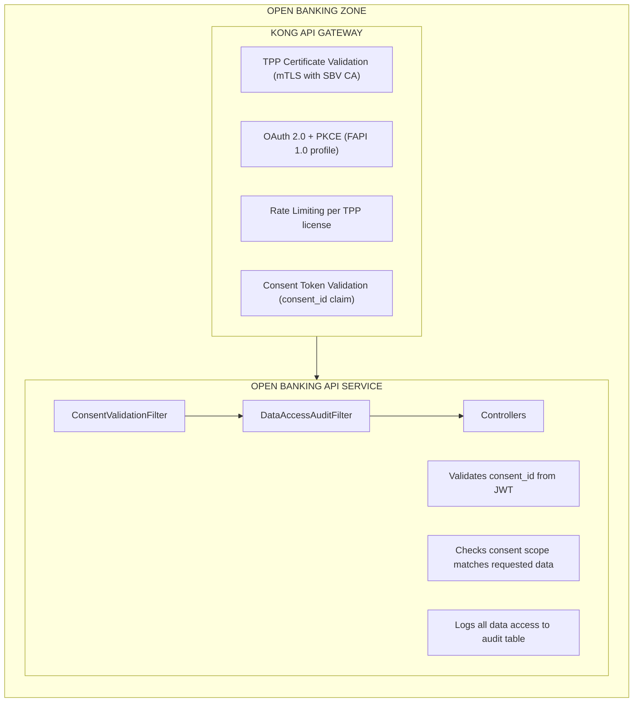

# SBV Circular 64 Open Banking Compliance

## Overview

This document outlines Paylink's compliance strategy for **SBV Circular 64/2024/TT-NHNN** - Vietnam's Open Banking regulatory framework issued by the State Bank of Vietnam (SBV).

### Key Deadlines

| Milestone | Deadline | Status |
|-----------|----------|--------|
| API Catalog Submission | July 1, 2025 | Pending |
| Full Compliance | March 1, 2027 | Pending |

---

## Mandatory Technical Standards

### 1. OpenAPI Specification (OAS 3.0) - MANDATORY

All bank APIs must be documented using OpenAPI 3.0 specification:

| Requirement | Implementation |
|-------------|----------------|
| Machine-readable API contracts (JSON/YAML) | SpringDoc 2.3.0 with export plugin |
| Standardized endpoint definitions | @Operation, @ApiResponse annotations |
| Automated validation and testing | Spring Cloud Contract |
| Developer portal with interactive documentation | Swagger UI at `/swagger-ui.html` |

### 2. Authentication & Security Standards

| Standard | Requirement | Implementation |
|----------|-------------|----------------|
| **OAuth 2.0** (RFC 6749) | Mandatory for third-party access | Spring Security OAuth2 Resource Server |
| **TLS 1.2+** | Encrypted communications | Kong Gateway + Spring Boot TLS |
| **Strong Customer Authentication (SCA)** | Two-factor for payment initiation | FIDO2/WebAuthn integration |
| **Financial-grade API (FAPI)** | Security profiles for banking | FAPI 1.0 Advanced profile |

### 3. Data Standards

| Standard | Description | Status |
|----------|-------------|--------|
| **ISO 20022** | Payment messaging | Planned (Phase 5) |
| **ISO 8583** | Financial transaction data | Not required (REST-based) |
| **JSON over RESTful HTTP** | API format | Implemented |
| **RFC 3339** | Date/time formats | Implemented (JavaTimeModule) |

### 4. API Categories (Required Implementation)

#### Tier 1 - Information Query APIs
- Account information (balance, transactions)
- Product information (rates, fees)
- Branch/ATM locations

#### Tier 2 - Consent-Based Access (AIS)
- Account Information Services
- Customer data with consent
- Transaction history access

#### Tier 3 - Payment Initiation (PIS)
- Payment Initiation Services
- Fund transfer initiation
- Payment status inquiry

### 5. Compliance Requirements

| Requirement | Description | Implementation |
|-------------|-------------|----------------|
| **Customer Consent** | Granular, revocable, time-bound | ConsentEntity with 90-day max |
| **Audit Logging** | All API access tracked | DataAccessAuditEntity |
| **TPP Registration** | Third-party certification | ThirdPartyProviderEntity |
| **SBV Reporting** | Regulatory monitoring | Compliance reporting APIs |

---

## Gap Analysis

| Requirement | SBV Circular 64 | Current State | Gap Severity |
|-------------|-----------------|---------------|--------------|
| **OpenAPI 3.0** | Mandatory documentation | 46% coverage | MEDIUM |
| **Security Scheme** | OAuth 2.0 documented | No @SecurityScheme | LOW |
| **Consent Management** | Granular, revocable | ✅ Implemented (`open-banking-api/consent/`) | CLOSED |
| **Audit Logging** | All API access tracked | ✅ Implemented (`open-banking-api/audit/`) | CLOSED |
| **TPP Registration** | Provider management | ✅ Implemented (`open-banking-api/tpp/`) | CLOSED |
| **ISO 20022** | pain.001/pain.002 | ✅ Implemented (`open-banking-api/iso20022/`) | CLOSED |
| **API Tiering** | Tier 1/2/3 classification | ✅ Implemented (Tier 1/2/3 controllers) | CLOSED |
| **SCA/FAPI** | Strong Customer Auth | 3DSecure only | MEDIUM |

---

## Implementation Architecture

### Open Banking Module

```
open-banking-api/
├── api/v1/
│   ├── ConsentController.java           # Consent management
│   ├── TppController.java               # TPP registration
│   ├── AccountInfoController.java       # Tier 1: AIS
│   ├── TransactionController.java       # Tier 2: Transactions
│   └── PaymentInitiationController.java # Tier 3: PIS
├── consent/
│   ├── entity/ConsentEntity.java
│   ├── repository/ConsentRepository.java
│   └── service/ConsentService.java
├── tpp/
│   ├── entity/ThirdPartyProviderEntity.java
│   ├── repository/TppRepository.java
│   └── service/TppRegistrationService.java
├── audit/
│   ├── entity/DataAccessAuditEntity.java
│   └── service/DataAccessAuditService.java
└── security/
    ├── ConsentValidationFilter.java
    ├── DataAccessAuditFilter.java
    └── OpenBankingSecurityConfig.java
```

### Security Flow



---

## Database Schema

### Consent Management

```sql
CREATE TABLE consents (
    consent_id VARCHAR(36) PRIMARY KEY,
    customer_id VARCHAR(50) NOT NULL,
    tpp_id VARCHAR(36) NOT NULL,
    consent_type VARCHAR(20) NOT NULL,      -- AIS, PIS, CBPII
    status VARCHAR(20) NOT NULL,            -- AWAITING_AUTH, AUTHORIZED, REVOKED, EXPIRED
    valid_from TIMESTAMP NOT NULL,
    valid_until TIMESTAMP NOT NULL,         -- Max 90 days per SBV
    created_at TIMESTAMP NOT NULL DEFAULT NOW(),
    authorized_at TIMESTAMP,
    revoked_at TIMESTAMP,
    revoked_reason VARCHAR(255),
    CONSTRAINT fk_consent_tpp FOREIGN KEY (tpp_id) REFERENCES third_party_providers(tpp_id)
);

CREATE TABLE consent_permissions (
    id SERIAL PRIMARY KEY,
    consent_id VARCHAR(36) REFERENCES consents(consent_id),
    permission_type VARCHAR(50) NOT NULL,   -- ACCOUNTS, TRANSACTIONS, BALANCES
    account_id VARCHAR(50)                  -- Optional: specific account restriction
);

CREATE INDEX idx_consents_customer ON consents(customer_id);
CREATE INDEX idx_consents_tpp ON consents(tpp_id);
CREATE INDEX idx_consents_status ON consents(status);
CREATE INDEX idx_consents_expiry ON consents(valid_until);
```

### TPP Registration

```sql
CREATE TABLE third_party_providers (
    tpp_id VARCHAR(36) PRIMARY KEY,
    organization_name VARCHAR(255) NOT NULL,
    sbv_license_number VARCHAR(50) UNIQUE NOT NULL,
    license_expiry TIMESTAMP NOT NULL,
    api_key_hash VARCHAR(128) NOT NULL,
    certificate_thumbprint VARCHAR(64),
    status VARCHAR(20) NOT NULL,            -- PENDING, ACTIVE, SUSPENDED, REVOKED
    contact_email VARCHAR(255),
    webhook_url VARCHAR(500),
    registered_at TIMESTAMP NOT NULL DEFAULT NOW(),
    last_verified_at TIMESTAMP
);

CREATE TABLE tpp_api_access (
    id SERIAL PRIMARY KEY,
    tpp_id VARCHAR(36) REFERENCES third_party_providers(tpp_id),
    api_tier VARCHAR(20) NOT NULL,          -- TIER_1, TIER_2, TIER_3
    rate_limit INTEGER DEFAULT 1000,
    daily_quota INTEGER DEFAULT 10000
);

CREATE INDEX idx_tpp_license ON third_party_providers(sbv_license_number);
CREATE INDEX idx_tpp_status ON third_party_providers(status);
```

### Data Access Audit

```sql
CREATE TABLE data_access_audit (
    id BIGSERIAL PRIMARY KEY,
    timestamp TIMESTAMP NOT NULL DEFAULT NOW(),
    customer_id VARCHAR(50),
    tpp_id VARCHAR(36),
    consent_id VARCHAR(36),
    api_endpoint VARCHAR(255) NOT NULL,
    http_method VARCHAR(10) NOT NULL,
    resource_type VARCHAR(50),              -- ACCOUNT, TRANSACTION, BALANCE, PAYMENT
    account_ids JSONB,                      -- Array of accessed account IDs
    response_status INTEGER,
    ip_address INET,
    user_agent TEXT,
    correlation_id VARCHAR(36),
    data_classification VARCHAR(20)         -- PII, FINANCIAL
);

CREATE INDEX idx_audit_customer ON data_access_audit(customer_id);
CREATE INDEX idx_audit_tpp ON data_access_audit(tpp_id);
CREATE INDEX idx_audit_timestamp ON data_access_audit(timestamp);
CREATE INDEX idx_audit_consent ON data_access_audit(consent_id);

-- Immutability: Prevent updates and deletes
CREATE OR REPLACE FUNCTION prevent_audit_modification()
RETURNS TRIGGER AS $$
BEGIN
    RAISE EXCEPTION 'Audit records cannot be modified or deleted';
END;
$$ LANGUAGE plpgsql;

CREATE TRIGGER audit_immutable
    BEFORE UPDATE OR DELETE ON data_access_audit
    FOR EACH ROW
    EXECUTE FUNCTION prevent_audit_modification();
```

---

## API Endpoints

### Consent Management

| Method | Endpoint | Description | Auth |
|--------|----------|-------------|------|
| POST | `/open-banking/v1/consents` | TPP requests consent | TPP mTLS |
| GET | `/open-banking/v1/consents/{id}` | Get consent details | TPP mTLS |
| DELETE | `/open-banking/v1/consents/{id}` | Revoke consent | Customer JWT |
| GET | `/open-banking/v1/consents` | List customer consents | Customer JWT |

### TPP Registration

| Method | Endpoint | Description | Auth |
|--------|----------|-------------|------|
| POST | `/open-banking/v1/tpp/register` | Register TPP | SBV Certificate |
| GET | `/open-banking/v1/tpp/{id}` | Get TPP details | Admin |
| POST | `/open-banking/v1/tpp/{id}/credentials` | Rotate credentials | TPP mTLS |
| PUT | `/open-banking/v1/tpp/{id}/status` | Update status | Admin |

### Tier 1 - Information Query (Public with Consent)

| Method | Endpoint | Description |
|--------|----------|-------------|
| GET | `/open-banking/v1/accounts` | List accounts |
| GET | `/open-banking/v1/accounts/{id}` | Account details |
| GET | `/open-banking/v1/accounts/{id}/balance` | Account balance |
| GET | `/open-banking/v1/products` | Product catalog |

### Tier 2 - Account Information Services (Consent Required)

| Method | Endpoint | Description |
|--------|----------|-------------|
| GET | `/open-banking/v1/accounts/{id}/transactions` | Transaction history |
| GET | `/open-banking/v1/accounts/{id}/standing-orders` | Standing orders |
| GET | `/open-banking/v1/accounts/{id}/direct-debits` | Direct debits |

### Tier 3 - Payment Initiation Services (Consent + SCA)

| Method | Endpoint | Description |
|--------|----------|-------------|
| POST | `/open-banking/v1/payments` | Initiate payment |
| GET | `/open-banking/v1/payments/{id}` | Payment status |
| POST | `/open-banking/v1/payments/{id}/confirm` | Confirm with SCA |

---

## Implementation Timeline

| Phase | Duration | Deliverables | Deadline |
|-------|----------|--------------|----------|
| **Phase 0** | 2 weeks | OpenAPI @SecurityScheme, 100% docs | Immediate |
| **Phase 1** | 4 weeks | Consent Management | May 2025 |
| **Phase 2** | 4 weeks | TPP Registration | June 2025 |
| **Milestone** | - | **API Catalog Submission** | **July 1, 2025** |
| **Phase 3** | 3 weeks | Data Access Audit | Aug 2025 |
| **Phase 4** | 6 weeks | Open Banking APIs (Tier 1/2/3) | Oct 2025 |
| **Phase 5** | 4 weeks | ISO 20022 Support | Dec 2025 |
| **Phase 6** | 4 weeks | Testing & Certification | Feb 2026 |
| **Final** | - | **Full Compliance** | **March 1, 2027** |

---

## Compliance Checklist

### Documentation
- [ ] OpenAPI 3.0 specification exported to YAML/JSON
- [ ] All endpoints documented with @Operation + @SecurityRequirement
- [ ] @SecurityScheme defines OAuth 2.0 JWT flow
- [ ] API catalog submitted to SBV

### Consent Management
- [x] Consent APIs: create, read, revoke functional (`ConsentController`)
- [x] Consent expiry enforced (max 90 days per SBV) (`ConsentEntity.validUntil`)
- [ ] Customer consent portal accessible
- [x] Consent scope validation on API access (`ConsentValidationFilter`)

### TPP Management
- [x] TPP registration requires SBV license number (`TppController.registerTpp()`)
- [x] TPP certificate validation implemented (Kong mTLS plugin)
- [x] API tier restrictions enforced (`TppApiAccessEntity`)
- [x] Credential rotation supported (`TppRegistrationService.rotateCredentials()`)

### Audit & Compliance
- [x] Data access audit captures all required fields (`DataAccessAuditEntity`)
- [x] Audit records immutable (no UPDATE/DELETE) (DB trigger)
- [x] SBV reporting API functional (`DataAccessAuditService.getAuditLogForPeriod()`)
- [ ] 7-year audit retention (requires partitioning setup)

### Security
- [ ] OAuth 2.0 + PKCE for all external APIs
- [ ] Strong Customer Authentication for Tier 3
- [x] mTLS for TPP communication (Kong mTLS plugin)
- [ ] FAPI 1.0 security profile

---

## References

- [SBV Circular 64/2024/TT-NHNN](https://sbv.gov.vn/)
- [Vietnam Open Banking Framework](https://openbankingforum.org/vietnam/)
- [OpenAPI Specification 3.0](https://swagger.io/specification/)
- [OAuth 2.0 RFC 6749](https://datatracker.ietf.org/doc/html/rfc6749)
- [FAPI 1.0 Security Profile](https://openid.net/specs/openid-financial-api-part-1-1_0.html)
- [ISO 20022 Standards](https://www.iso20022.org/)
