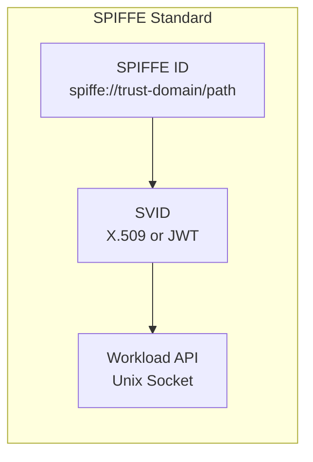
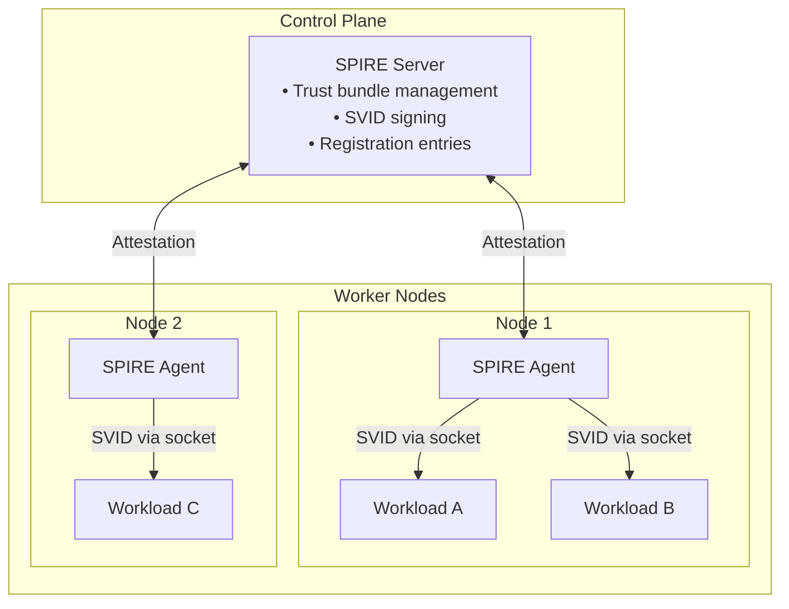
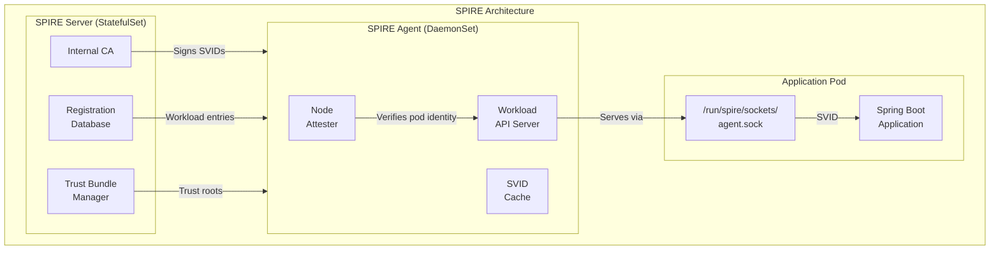
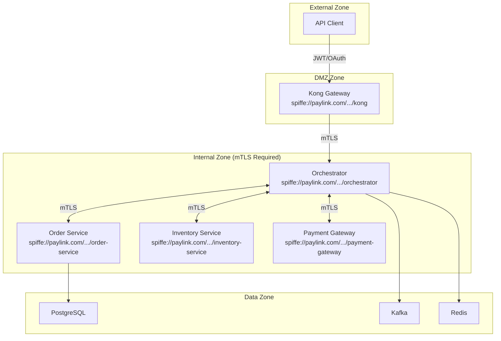
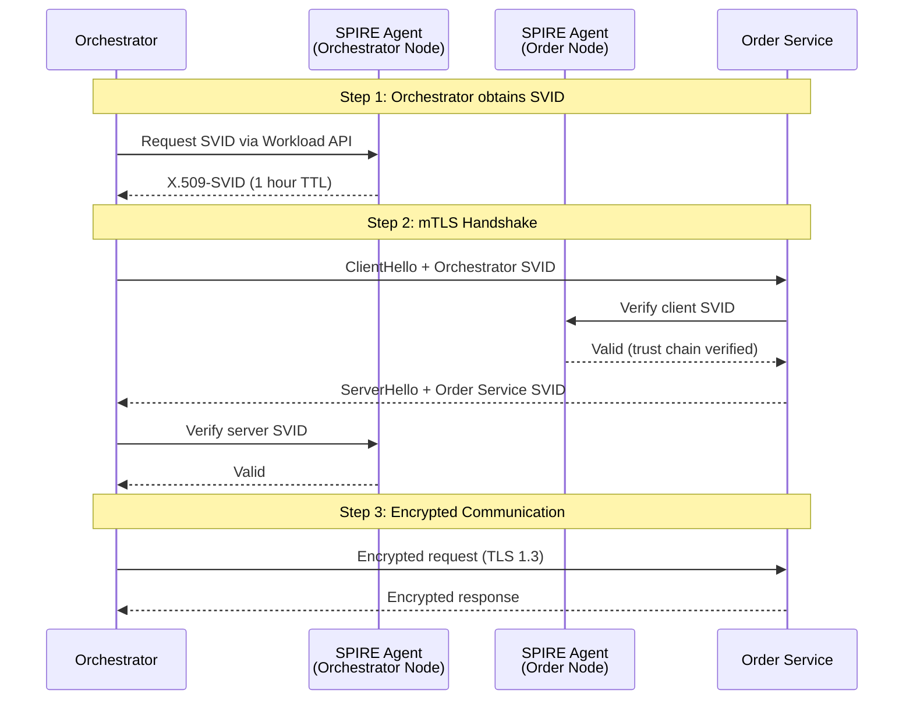
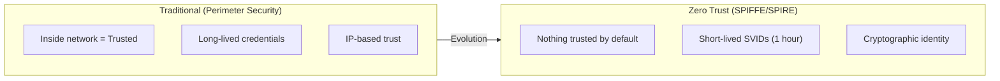
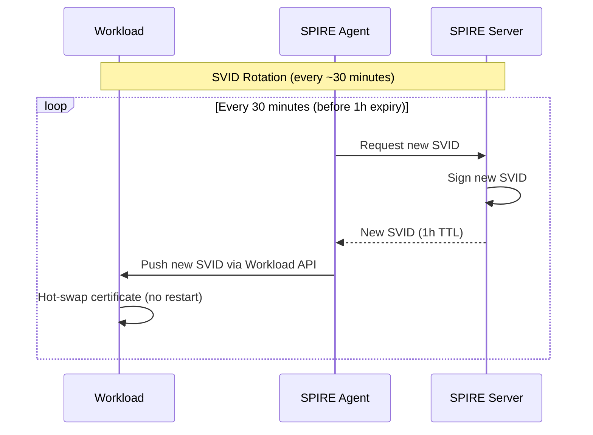
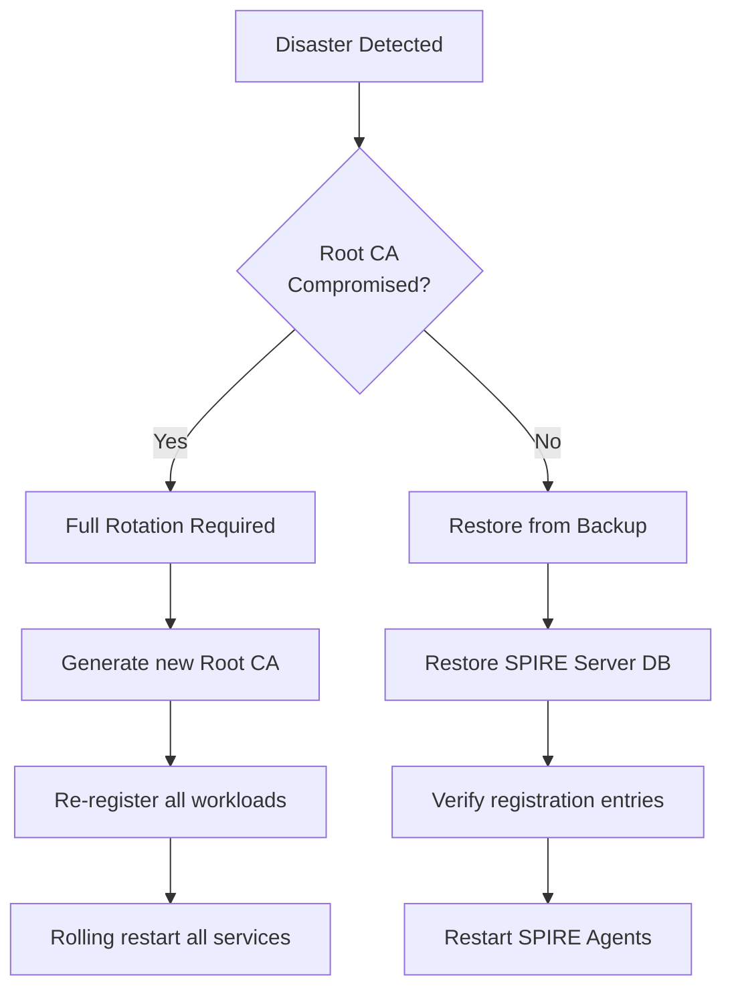

# SPIFFE/SPIRE Implementation Guide

This document provides a comprehensive guide to SPIFFE and SPIRE for service mesh security in the Payment SAGA platform. It serves as a detailed sub-section of the [Security Architecture](Security.md).

## Table of Contents

- [Overview](#overview)
  - [What is SPIFFE?](#what-is-spiffe)
  - [What is SPIRE?](#what-is-spire)
  - [Why Use SPIFFE/SPIRE?](#why-use-spiffespire)
- [Architecture](#architecture)
  - [SPIFFE ID Format](#spiffe-id-format)
  - [SPIRE Components](#spire-components)
  - [SVIDs (SPIFFE Verifiable Identity Documents)](#svids-spiffe-verifiable-identity-documents)
- [Integration with Payment SAGA](#integration-with-payment-saga)
  - [Service Identity Mapping](#service-identity-mapping)
  - [mTLS Flow Between Microservices](#mtls-flow-between-microservices)
  - [Integration with Kong API Gateway](#integration-with-kong-api-gateway)
- [Implementation Guide](#implementation-guide)
  - [SPIRE Server Deployment](#spire-server-deployment)
  - [SPIRE Agent Deployment](#spire-agent-deployment)
  - [Workload Registration](#workload-registration)
  - [Spring Boot Integration](#spring-boot-integration)
- [Principal Guidelines](#principal-guidelines)
  - [Zero Trust Principles](#zero-trust-principles)
  - [Certificate Rotation Policies](#certificate-rotation-policies)
  - [Attestation Strategies](#attestation-strategies)
  - [Security Best Practices](#security-best-practices)
- [Operational Considerations](#operational-considerations)
  - [Monitoring and Observability](#monitoring-and-observability)
  - [Troubleshooting](#troubleshooting)
  - [Disaster Recovery](#disaster-recovery)
  - [Performance Impact](#performance-impact)
- [References](#references)

---

## Overview

### What is SPIFFE?

**SPIFFE** (Secure Production Identity Framework For Everyone) is an open standard that provides a secure identity framework for workloads in dynamic and heterogeneous environments. It defines:

1. **SPIFFE ID** - A URI-based identifier for workloads
2. **SVID** - SPIFFE Verifiable Identity Document (X.509 certificate or JWT)
3. **Workload API** - A local API for workloads to obtain their identity



**Key Benefits:**
- Platform-agnostic workload identity
- No secrets stored in code or configuration
- Automatic credential rotation
- Cross-platform interoperability

### What is SPIRE?

**SPIRE** (SPIFFE Runtime Environment) is the reference implementation of SPIFFE. It provides:

| Component | Function |
|:----------|:---------|
| **SPIRE Server** | Central authority that manages identities and issues SVIDs |
| **SPIRE Agent** | Node-level component that attests workloads and delivers SVIDs |
| **Workload API** | Unix socket interface for workloads to request SVIDs |



### Why Use SPIFFE/SPIRE?

| Traditional Approach | SPIFFE/SPIRE Approach |
|:---------------------|:----------------------|
| Secrets in config files | No secrets to manage |
| Manual certificate rotation | Automatic rotation (default: 1 hour) |
| Static IP/DNS trust | Cryptographic identity verification |
| Shared service accounts | Per-workload identity |
| Network perimeter security | Zero Trust at every hop |

**For Payment SAGA specifically:**
- **Compliance**: Meets PCI-DSS 4.0.1 requirements for encryption in transit
- **Zero Trust**: Implements Principle 13 (Zero Trust Service Communication)
- **Auditability**: Every service call is cryptographically authenticated

---

## Architecture

### SPIFFE ID Format

SPIFFE IDs follow a URI structure:

```
spiffe://<trust-domain>/<workload-path>
```

**Payment SAGA Identity Scheme:**

| Service | SPIFFE ID |
|:--------|:----------|
| Orchestrator | `spiffe://paylink.com/ns/payment-saga/sa/orchestrator` |
| Order Service | `spiffe://paylink.com/ns/payment-saga/sa/order-service` |
| Inventory Service | `spiffe://paylink.com/ns/payment-saga/sa/inventory-service` |
| Payment Gateway | `spiffe://paylink.com/ns/payment-saga/sa/payment-gateway` |

**URI Components:**
- `paylink.com` - Trust domain (organization identifier)
- `ns/payment-saga` - Kubernetes namespace
- `sa/<service>` - Service account name

### SPIRE Components



### SVIDs (SPIFFE Verifiable Identity Documents)

An SVID is a cryptographically signed document that proves workload identity. SPIRE supports two formats:

#### X.509-SVID (Primary for mTLS)

```
Certificate:
    Subject: O=SPIRE, CN=orchestrator
    Issuer: O=SPIRE, CN=paylink.com
    Serial Number: 1234567890
    Validity:
        Not Before: 2026-02-01 10:00:00 UTC
        Not After:  2026-02-01 11:00:00 UTC  (1 hour!)
    Subject Alternative Name:
        URI: spiffe://paylink.com/ns/payment-saga/sa/orchestrator
    X509v3 Key Usage:
        Digital Signature, Key Encipherment
    X509v3 Extended Key Usage:
        TLS Web Server Authentication
        TLS Web Client Authentication
```

#### JWT-SVID (For API authentication)

```json
{
  "alg": "RS256",
  "typ": "JWT",
  "kid": "abc123"
}
{
  "iss": "spiffe://paylink.com",
  "sub": "spiffe://paylink.com/ns/payment-saga/sa/orchestrator",
  "aud": ["spiffe://paylink.com/ns/payment-saga/sa/order-service"],
  "exp": 1706785200,
  "iat": 1706781600
}
```

---

## Integration with Payment SAGA

### Service Identity Mapping



### mTLS Flow Between Microservices

When the Orchestrator calls Order Service:



### Integration with Kong API Gateway

Kong validates external requests and initiates internal mTLS:

```yaml
# Kong mTLS configuration for internal services
apiVersion: configuration.konghq.com/v1
kind: KongPlugin
metadata:
  name: mtls-auth-internal
  namespace: payment-saga
plugin: mtls-auth
config:
  # Kong presents its SVID to upstream services
  client_certificate: ${KONG_SVID_CERTIFICATE}
  client_certificate_key: ${KONG_SVID_PRIVATE_KEY}

  # Verify upstream service SVID
  ca_certificates:
    - ${SPIFFE_TRUST_BUNDLE}

  # Verify SPIFFE ID in SAN
  verify_client_cert: true
```

---

## Implementation Guide

### SPIRE Server Deployment

```yaml
# k8s/base/spire/spire-server.yaml
apiVersion: apps/v1
kind: StatefulSet
metadata:
  name: spire-server
  namespace: spire
spec:
  replicas: 3  # HA deployment
  serviceName: spire-server
  selector:
    matchLabels:
      app: spire-server
  template:
    metadata:
      labels:
        app: spire-server
    spec:
      serviceAccountName: spire-server
      containers:
        - name: spire-server
          image: ghcr.io/spiffe/spire-server:1.9.0
          ports:
            - containerPort: 8081  # SPIRE API
          volumeMounts:
            - name: spire-config
              mountPath: /run/spire/config
              readOnly: true
            - name: spire-data
              mountPath: /run/spire/data
          livenessProbe:
            exec:
              command:
                - /opt/spire/bin/spire-server
                - healthcheck
            initialDelaySeconds: 15
            periodSeconds: 60
      volumes:
        - name: spire-config
          configMap:
            name: spire-server-config
  volumeClaimTemplates:
    - metadata:
        name: spire-data
      spec:
        accessModes: ["ReadWriteOnce"]
        resources:
          requests:
            storage: 1Gi
---
apiVersion: v1
kind: ConfigMap
metadata:
  name: spire-server-config
  namespace: spire
data:
  server.conf: |
    server {
      bind_address = "0.0.0.0"
      bind_port = "8081"
      trust_domain = "paylink.com"
      data_dir = "/run/spire/data"
      log_level = "INFO"

      ca_ttl = "168h"        # 7 days for CA certificates
      default_x509_svid_ttl = "1h"   # 1 hour for workload SVIDs
      default_jwt_svid_ttl = "5m"    # 5 minutes for JWT SVIDs
    }

    plugins {
      DataStore "sql" {
        plugin_data {
          database_type = "postgres"
          connection_string = "dbname=spire user=spire password=${SPIRE_DB_PASSWORD} host=postgres-spire sslmode=require"
        }
      }

      NodeAttestor "k8s_psat" {
        plugin_data {
          clusters = {
            "payment-saga-cluster" = {
              service_account_allow_list = ["spire:spire-agent"]
            }
          }
        }
      }

      KeyManager "disk" {
        plugin_data {
          keys_path = "/run/spire/data/keys.json"
        }
      }

      UpstreamAuthority "disk" {
        plugin_data {
          key_file_path = "/run/spire/secrets/ca.key"
          cert_file_path = "/run/spire/secrets/ca.crt"
        }
      }
    }
```

### SPIRE Agent Deployment

```yaml
# k8s/base/spire/spire-agent.yaml
apiVersion: apps/v1
kind: DaemonSet
metadata:
  name: spire-agent
  namespace: spire
spec:
  selector:
    matchLabels:
      app: spire-agent
  template:
    metadata:
      labels:
        app: spire-agent
    spec:
      hostPID: true
      hostNetwork: true
      dnsPolicy: ClusterFirstWithHostNet
      serviceAccountName: spire-agent
      containers:
        - name: spire-agent
          image: ghcr.io/spiffe/spire-agent:1.9.0
          volumeMounts:
            - name: spire-config
              mountPath: /run/spire/config
              readOnly: true
            - name: spire-sockets
              mountPath: /run/spire/sockets
            - name: spire-token
              mountPath: /var/run/secrets/tokens
          livenessProbe:
            exec:
              command:
                - /opt/spire/bin/spire-agent
                - healthcheck
                - -socketPath
                - /run/spire/sockets/agent.sock
            initialDelaySeconds: 15
            periodSeconds: 60
      volumes:
        - name: spire-config
          configMap:
            name: spire-agent-config
        - name: spire-sockets
          hostPath:
            path: /run/spire/sockets
            type: DirectoryOrCreate
        - name: spire-token
          projected:
            sources:
              - serviceAccountToken:
                  path: spire-agent
                  expirationSeconds: 7200
                  audience: spire-server
---
apiVersion: v1
kind: ConfigMap
metadata:
  name: spire-agent-config
  namespace: spire
data:
  agent.conf: |
    agent {
      data_dir = "/run/spire/data"
      log_level = "INFO"
      server_address = "spire-server"
      server_port = "8081"
      socket_path = "/run/spire/sockets/agent.sock"
      trust_domain = "paylink.com"
    }

    plugins {
      NodeAttestor "k8s_psat" {
        plugin_data {
          cluster = "payment-saga-cluster"
          token_path = "/var/run/secrets/tokens/spire-agent"
        }
      }

      KeyManager "memory" {
        plugin_data {}
      }

      WorkloadAttestor "k8s" {
        plugin_data {
          skip_kubelet_verification = true
        }
      }
    }
```

### Workload Registration

Register each Payment SAGA service with SPIRE:

```bash
#!/bin/bash
# scripts/register-workloads.sh

SPIRE_SERVER_POD=$(kubectl get pod -n spire -l app=spire-server -o jsonpath='{.items[0].metadata.name}')

# Register Orchestrator
kubectl exec -n spire $SPIRE_SERVER_POD -- \
  /opt/spire/bin/spire-server entry create \
  -spiffeID spiffe://paylink.com/ns/payment-saga/sa/orchestrator \
  -parentID spiffe://paylink.com/spire/agent/k8s_psat/payment-saga-cluster \
  -selector k8s:ns:payment-saga \
  -selector k8s:sa:orchestrator-sa \
  -ttl 3600

# Register Order Service
kubectl exec -n spire $SPIRE_SERVER_POD -- \
  /opt/spire/bin/spire-server entry create \
  -spiffeID spiffe://paylink.com/ns/payment-saga/sa/order-service \
  -parentID spiffe://paylink.com/spire/agent/k8s_psat/payment-saga-cluster \
  -selector k8s:ns:payment-saga \
  -selector k8s:sa:order-service-sa \
  -ttl 3600

# Register Inventory Service
kubectl exec -n spire $SPIRE_SERVER_POD -- \
  /opt/spire/bin/spire-server entry create \
  -spiffeID spiffe://paylink.com/ns/payment-saga/sa/inventory-service \
  -parentID spiffe://paylink.com/spire/agent/k8s_psat/payment-saga-cluster \
  -selector k8s:ns:payment-saga \
  -selector k8s:sa:inventory-service-sa \
  -ttl 3600

# Register Payment Gateway
kubectl exec -n spire $SPIRE_SERVER_POD -- \
  /opt/spire/bin/spire-server entry create \
  -spiffeID spiffe://paylink.com/ns/payment-saga/sa/payment-gateway \
  -parentID spiffe://paylink.com/spire/agent/k8s_psat/payment-saga-cluster \
  -selector k8s:ns:payment-saga \
  -selector k8s:sa:payment-gateway-sa \
  -ttl 3600
```

### Spring Boot Integration

```java
package com.payment.saga.security.mtls;

import io.netty.handler.ssl.SslContext;
import io.netty.handler.ssl.SslContextBuilder;
import io.spiffe.provider.SpiffeKeyManager;
import io.spiffe.provider.SpiffeTrustManager;
import io.spiffe.workloadapi.DefaultX509Source;
import io.spiffe.workloadapi.X509Source;
import org.springframework.beans.factory.annotation.Value;
import org.springframework.context.annotation.Bean;
import org.springframework.context.annotation.Configuration;
import org.springframework.context.annotation.Profile;
import org.springframework.http.client.reactive.ReactorClientHttpConnector;
import org.springframework.web.reactive.function.client.WebClient;
import reactor.netty.http.client.HttpClient;

/**
 * mTLS Configuration using SPIFFE/SPIRE
 *
 * This configuration enables mutual TLS for all service-to-service
 * communication using SPIFFE identities issued by SPIRE.
 *
 * Prerequisites:
 * - SPIRE Agent running on the node
 * - Workload registered with SPIRE Server
 * - Socket available at /run/spire/sockets/agent.sock
 */
@Configuration
@Profile({"k8s", "eks"})  // Only active in Kubernetes environments
public class MtlsConfiguration {

    @Value("${spiffe.socket.path:/run/spire/sockets/agent.sock}")
    private String spiffeSocketPath;

    @Value("${spiffe.timeout.seconds:30}")
    private int spiffeTimeoutSeconds;

    /**
     * X509Source connects to SPIRE Agent's Workload API
     * and automatically fetches/rotates SVIDs.
     */
    @Bean
    public X509Source x509Source() throws Exception {
        return DefaultX509Source.newSource(
            DefaultX509Source.X509SourceOptions.builder()
                .spiffeSocketPath(spiffeSocketPath)
                .build()
        );
    }

    /**
     * SSL Context configured with SPIFFE credentials.
     * Uses TLS 1.3 for strongest encryption.
     */
    @Bean
    public SslContext sslContext(X509Source x509Source) throws Exception {
        return SslContextBuilder.forClient()
            .keyManager(new SpiffeKeyManager(x509Source))
            .trustManager(new SpiffeTrustManager(x509Source))
            .protocols("TLSv1.3")
            .build();
    }

    /**
     * WebClient builder with mTLS enabled.
     * Use this for any service-to-service HTTP calls.
     */
    @Bean
    public WebClient.Builder mtlsWebClientBuilder(SslContext sslContext) {
        HttpClient httpClient = HttpClient.create()
            .secure(spec -> spec.sslContext(sslContext));

        return WebClient.builder()
            .clientConnector(new ReactorClientHttpConnector(httpClient));
    }
}
```

**Feign Client with mTLS:**

```java
package com.payment.saga.client.config;

import feign.Client;
import io.spiffe.workloadapi.X509Source;
import org.apache.http.conn.ssl.NoopHostnameVerifier;
import org.apache.http.impl.client.CloseableHttpClient;
import org.apache.http.impl.client.HttpClients;
import org.apache.http.ssl.SSLContextBuilder;
import org.springframework.context.annotation.Bean;
import org.springframework.context.annotation.Configuration;
import org.springframework.context.annotation.Profile;

import javax.net.ssl.SSLContext;

@Configuration
@Profile({"k8s", "eks"})
public class FeignMtlsConfiguration {

    @Bean
    public Client feignClient(X509Source x509Source) throws Exception {
        SSLContext sslContext = SSLContextBuilder.create()
            .loadKeyMaterial(
                x509Source.getX509Svid().getPrivateKey(),
                x509Source.getX509Svid().getChain()
            )
            .loadTrustMaterial(x509Source.getBundleForTrustDomain())
            .build();

        CloseableHttpClient httpClient = HttpClients.custom()
            .setSSLContext(sslContext)
            // Use SPIFFE ID verification instead of hostname
            .setSSLHostnameVerifier(new SpiffeHostnameVerifier())
            .build();

        return new feign.httpclient.ApacheHttpClient(httpClient);
    }
}
```

---

## Principal Guidelines

### Zero Trust Principles

SPIFFE/SPIRE implements Zero Trust through:

| Principle | Implementation |
|:----------|:---------------|
| **Never Trust, Always Verify** | Every request includes SVID, verified on every call |
| **Least Privilege** | SVIDs scoped to specific workload identity |
| **Assume Breach** | Short-lived certificates (1 hour default) limit blast radius |
| **Verify Explicitly** | Cryptographic verification, not network location |



### Certificate Rotation Policies

| Certificate Type | Default TTL | Recommended | Rationale |
|:-----------------|:------------|:------------|:----------|
| Root CA | 10 years | 5 years | Long-lived, carefully managed |
| Intermediate CA | 1 year | 6 months | Regular rotation |
| X.509-SVID | 1 hour | 1 hour | Short-lived for security |
| JWT-SVID | 5 minutes | 5 minutes | Very short-lived for APIs |

**Rotation Flow:**



### Attestation Strategies

SPIRE supports multiple attestation methods:

| Attestor | Use Case | Security Level |
|:---------|:---------|:---------------|
| **k8s_psat** | Kubernetes workloads | High (uses projected service account tokens) |
| **k8s_sat** | Kubernetes (legacy) | Medium (uses mounted service account tokens) |
| **aws_iid** | AWS EC2 instances | High (uses instance identity document) |
| **gcp_iit** | GCP instances | High (uses instance identity token) |
| **azure_msi** | Azure VMs | High (uses managed identity) |

**For Payment SAGA (EKS):**

```
Node Attestation:  k8s_psat (Kubernetes Projected Service Account Token)
                   + aws_iid (AWS Instance Identity Document)

Workload Attestation: k8s (Kubernetes pod metadata)
                      - Namespace
                      - Service Account
                      - Pod Labels
```

### Security Best Practices

1. **Use Projected Service Account Tokens (PSAT)**
   ```yaml
   # Pod spec
   volumes:
     - name: spire-agent-socket
       hostPath:
         path: /run/spire/sockets
         type: Directory
   ```

2. **Implement SVID Validation in Code**
   ```java
   // Verify caller's SPIFFE ID matches expected service
   public void validateCaller(X509Certificate cert) {
       String spiffeId = extractSpiffeId(cert);
       if (!ALLOWED_CALLERS.contains(spiffeId)) {
           throw new SecurityException("Unauthorized caller: " + spiffeId);
       }
   }
   ```

3. **Use NetworkPolicies as Defense-in-Depth**
   ```yaml
   # Even with mTLS, limit network access
   apiVersion: networking.k8s.io/v1
   kind: NetworkPolicy
   metadata:
     name: orchestrator-egress
   spec:
     podSelector:
       matchLabels:
         app: orchestrator
     egress:
       - to:
           - podSelector:
               matchLabels:
                 app: order-service
   ```

4. **Monitor SVID Issuance**
   ```promql
   # Alert on unusual SVID issuance rates
   rate(spire_server_svid_issued_total[5m]) > 100
   ```

---

## Operational Considerations

### Monitoring and Observability

**Key Metrics:**

| Metric | Description | Alert Threshold |
|:-------|:------------|:----------------|
| `spire_agent_svid_expiration_seconds` | Time until SVID expires | < 300 seconds |
| `spire_server_registration_entries` | Total registered workloads | Sudden drop |
| `spire_agent_workload_attestation_total` | Attestation attempts | High failure rate |
| `spire_server_ca_manager_x509_ca_ttl` | CA certificate TTL | < 30 days |

**Prometheus Alerting Rules:**

```yaml
groups:
  - name: spire-alerts
    rules:
      - alert: SPIRESVIDExpiringSOon
        expr: spire_agent_svid_expiration_seconds < 300
        for: 1m
        labels:
          severity: critical
        annotations:
          summary: "SVID expiring in less than 5 minutes"

      - alert: SPIREAgentDown
        expr: up{job="spire-agent"} == 0
        for: 1m
        labels:
          severity: critical
        annotations:
          summary: "SPIRE Agent is down on node {{ $labels.node }}"

      - alert: SPIREAttestationFailures
        expr: rate(spire_agent_workload_attestation_errors_total[5m]) > 0.1
        for: 5m
        labels:
          severity: warning
        annotations:
          summary: "High rate of workload attestation failures"
```

### Troubleshooting

**Common Issues:**

| Issue | Symptom | Resolution |
|:------|:--------|:-----------|
| SVID not issued | Connection refused | Check workload registration, agent socket |
| Certificate validation fails | TLS handshake error | Verify trust bundle, SPIFFE ID format |
| Agent can't reach server | Agent logs show connection errors | Check NetworkPolicy, server address |
| Workload not attested | "no identity issued" | Verify selectors match pod labels/SA |

**Debugging Commands:**

```bash
# Check SPIRE Server health
kubectl exec -n spire spire-server-0 -- \
  /opt/spire/bin/spire-server healthcheck

# List all registration entries
kubectl exec -n spire spire-server-0 -- \
  /opt/spire/bin/spire-server entry show

# Check agent status
kubectl exec -n spire $(kubectl get pod -n spire -l app=spire-agent -o jsonpath='{.items[0].metadata.name}') -- \
  /opt/spire/bin/spire-agent healthcheck -socketPath /run/spire/sockets/agent.sock

# Fetch SVID for debugging
kubectl exec -n spire $(kubectl get pod -n spire -l app=spire-agent -o jsonpath='{.items[0].metadata.name}') -- \
  /opt/spire/bin/spire-agent api fetch x509 -socketPath /run/spire/sockets/agent.sock
```

### Disaster Recovery

**Backup Strategy:**

1. **SPIRE Server Database** - Regular PostgreSQL backups
2. **Root CA Key** - Stored in AWS Secrets Manager (HSM-backed)
3. **Registration Entries** - Exported to Git (Infrastructure as Code)

**Recovery Procedure:**



### Performance Impact

**Overhead Analysis:**

| Operation | Latency Added | CPU Impact |
|:----------|:--------------|:-----------|
| SVID fetch (cached) | < 1ms | Negligible |
| SVID rotation | ~50ms | Low (every 30 min) |
| mTLS handshake | ~5-10ms | Low |
| Certificate validation | ~1ms | Negligible |

**Optimizations:**

1. **SVID Caching** - Agent caches SVIDs, workloads don't hit server
2. **Connection Pooling** - Reuse mTLS connections
3. **Session Resumption** - TLS session tickets reduce handshake overhead

---

## References

### Internal Documentation

- [Security Architecture](Security.md) - Overall security design
- [README - Principle 13](../README.md#principle-13-zero-trust-service-communication) - Zero Trust architecture

### External Resources

- [SPIFFE Official Documentation](https://spiffe.io/docs/)
- [SPIRE GitHub Repository](https://github.com/spiffe/spire)
- [SPIFFE/SPIRE Concepts](https://spiffe.io/docs/latest/spiffe-about/spiffe-concepts/)
- [Kubernetes Workload Attestor](https://github.com/spiffe/spire/blob/main/doc/plugin_agent_workloadattestor_k8s.md)
- [Java SPIFFE Library](https://github.com/spiffe/java-spiffe)

### Standards

- [SPIFFE Specification](https://github.com/spiffe/spiffe/blob/main/standards/SPIFFE.md)
- [X.509-SVID Specification](https://github.com/spiffe/spiffe/blob/main/standards/X509-SVID.md)
- [JWT-SVID Specification](https://github.com/spiffe/spiffe/blob/main/standards/JWT-SVID.md)
