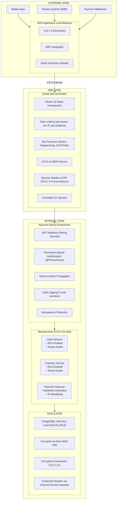
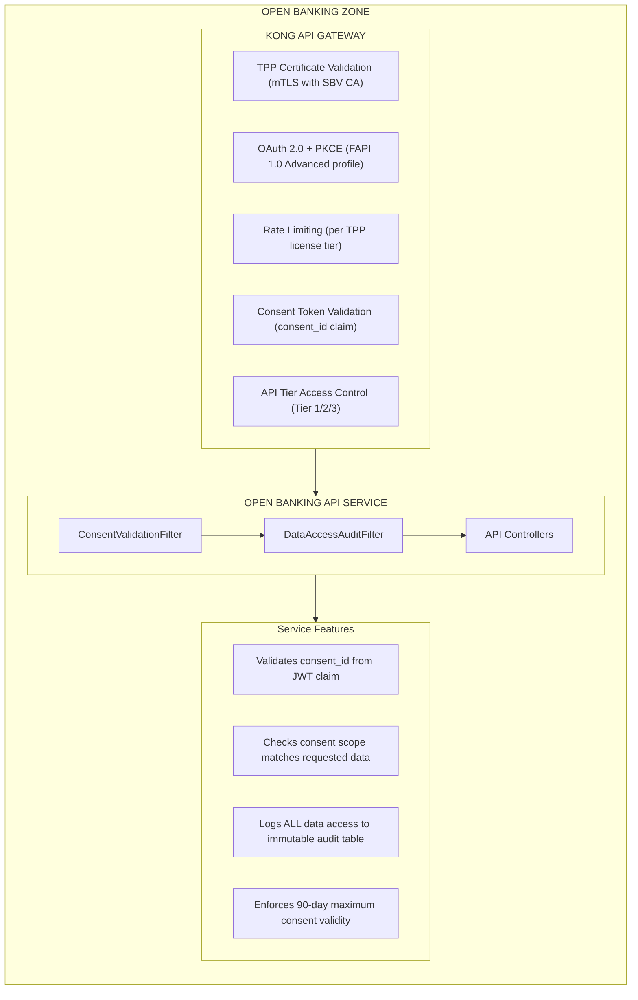

# Security Architecture

This document defines the comprehensive security architecture for the Paylink Payment Platform, covering authentication, authorization, internal systems integration, external payment channels, and compliance requirements.

## Table of Contents

- [Overview](#overview)
- [Security Architecture Layers](#security-architecture-layers)
- [Authentication & Authorization](#authentication--authorization)
  - [API Gateway (Kong)](#api-gateway-kong)
  - [Application-Level Security (Spring Security)](#application-level-security-spring-security)
  - [Permission-Based Access Control](#permission-based-access-control)
- [Internal Systems Integration Security](#internal-systems-integration-security)
  - [Mutual TLS (mTLS)](#mutual-tls-mtls)
  - [Zero Trust Network Policies](#zero-trust-network-policies)
  - [Tenant Context Propagation](#tenant-context-propagation)
- [External Payment Channel Security](#external-payment-channel-security)
  - [Webhook Signature Verification](#webhook-signature-verification)
  - [IP Allowlisting](#ip-allowlisting)
  - [Rate Limiting](#rate-limiting)
- [Secrets Management](#secrets-management)
- [Multi-Tenant Data Isolation](#multi-tenant-data-isolation)
- [Open Banking Security (SBV Circular 64)](#open-banking-security-sbv-circular-64)
- [PCI-DSS 4.0.1 Compliance](#pci-dss-401-compliance)
- [Security Monitoring & Alerting](#security-monitoring--alerting)

---

## Overview

The Paylink payment platform implements a defense-in-depth security strategy with multiple layers of protection:



---

## Security Architecture Layers

| Layer | Technology | Purpose |
|-------|------------|---------|
| **Edge** | AWS ALB + WAF | TLS termination, DDoS protection, WAF rules |
| **Gateway** | Kong API Gateway | Authentication, rate limiting, request validation |
| **Application** | Spring Security | JWT validation, RBAC, audit logging |
| **Service** | Istio Service Mesh (mTLS) | Service-to-service encryption and authentication |
| **Network** | Istio AuthorizationPolicies | Zero Trust service access control |
| **Data** | PostgreSQL RLS | Tenant isolation at database level |
| **Secrets** | Kubernetes Secrets (ESO in production) | Secure credential management |

---

## Authentication & Authorization

### API Gateway (Kong)

Kong serves as the first line of defense, handling authentication at the edge:

#### OAuth 2.0 Token Introspection

```yaml
# k8s/base/kong/plugins/oauth2-introspection.yaml
apiVersion: configuration.konghq.com/v1
kind: KongPlugin
metadata:
  name: oauth2-introspection
  namespace: payment-saga
config:
  introspection_url: "https://auth.paylink.com/oauth2/introspect"
  client_id: "${KONG_OAUTH_CLIENT_ID}"
  client_secret: "${KONG_OAUTH_CLIENT_SECRET}"
  token_type_hint: "access_token"
  ttl: 300  # Cache valid tokens for 5 minutes
  custom_claims_forward:
    - tenant_id
    - roles
    - permissions
    - customer_tier
plugin: oauth2-introspection
```

#### Phantom Token Pattern

For enhanced security, we implement the Phantom Token pattern:

1. **External tokens** (opaque) are validated by Kong via introspection
2. **Internal tokens** (JWT) are issued by Kong with full claims
3. Services only see JWT with necessary claims, never the original token

```
Client → [Opaque Token] → Kong → [Introspect] → Auth Server
                           ↓
                    [Generate Internal JWT]
                           ↓
              Services ← [Internal JWT with claims]
```

### Application-Level Security (Spring Security)

Defense-in-depth requires application-level validation even after Kong authentication:

```java
@Configuration
@EnableWebSecurity
@EnableMethodSecurity
public class SecurityConfiguration {

    @Bean
    public SecurityFilterChain filterChain(HttpSecurity http) throws Exception {
        return http
            .csrf(csrf -> csrf.disable())
            .sessionManagement(session ->
                session.sessionCreationPolicy(SessionCreationPolicy.STATELESS))
            .authorizeHttpRequests(auth -> auth
                // Public endpoints
                .requestMatchers("/actuator/health/**").permitAll()
                .requestMatchers("/actuator/info").permitAll()
                // Payment operations require specific roles
                .requestMatchers("/api/v1/payments/**").hasRole("PAYMENT_PROCESSOR")
                .requestMatchers("/api/v1/admin/**").hasRole("ADMIN")
                .requestMatchers("/api/v1/reports/**").hasAnyRole("ADMIN", "ANALYST")
                // All other endpoints require authentication
                .anyRequest().authenticated()
            )
            .oauth2ResourceServer(oauth2 -> oauth2
                .jwt(jwt -> jwt
                    .jwtAuthenticationConverter(jwtAuthenticationConverter())
                    .decoder(jwtDecoder())
                )
            )
            .exceptionHandling(ex -> ex
                .authenticationEntryPoint(new BearerTokenAuthenticationEntryPoint())
                .accessDeniedHandler(new BearerTokenAccessDeniedHandler())
            )
            .build();
    }

    @Bean
    public JwtAuthenticationConverter jwtAuthenticationConverter() {
        JwtGrantedAuthoritiesConverter grantedAuthoritiesConverter =
            new JwtGrantedAuthoritiesConverter();
        grantedAuthoritiesConverter.setAuthoritiesClaimName("permissions");
        grantedAuthoritiesConverter.setAuthorityPrefix("PERMISSION_");

        JwtAuthenticationConverter converter = new JwtAuthenticationConverter();
        converter.setJwtGrantedAuthoritiesConverter(grantedAuthoritiesConverter);
        converter.setPrincipalClaimName("sub");
        return converter;
    }
}
```

### Permission-Based Access Control

Fine-grained permissions for payment operations:

```java
public final class PaymentPermissions {
    // Payment operations
    public static final String PAYMENT_CREATE = "payment:create";
    public static final String PAYMENT_READ = "payment:read";
    public static final String PAYMENT_CANCEL = "payment:cancel";
    public static final String PAYMENT_REFUND = "payment:refund";

    // Administrative operations
    public static final String PAYMENT_ADMIN = "payment:admin";
    public static final String PAYMENT_VOID = "payment:void";
    public static final String PAYMENT_FORCE_CAPTURE = "payment:force_capture";

    // Reporting
    public static final String REPORT_VIEW = "report:view";
    public static final String REPORT_EXPORT = "report:export";
}
```

Controller with permission checks:

```java
@RestController
@RequestMapping("/api/v1/payments")
public class PaymentController {

    @PostMapping
    @PreAuthorize("hasAuthority('PERMISSION_payment:create')")
    public ResponseEntity<PaymentResponse> processPayment(
            @Valid @RequestBody OrderRequest request) {
        // Process payment
    }

    @PostMapping("/{paymentId}/refund")
    @PreAuthorize("hasAuthority('PERMISSION_payment:refund')")
    public ResponseEntity<RefundResponse> refundPayment(
            @PathVariable String paymentId,
            @Valid @RequestBody RefundRequest request) {
        // Process refund
    }

    @PostMapping("/{paymentId}/void")
    @PreAuthorize("hasAuthority('PERMISSION_payment:void')")
    public ResponseEntity<VoidResponse> voidPayment(
            @PathVariable String paymentId) {
        // Void authorization
    }
}
```

---

## Internal Systems Integration Security

### Mutual TLS (mTLS)

All service-to-service communication uses mTLS via **Istio Service Mesh**. Istio's Envoy sidecars automatically handle certificate management, rotation, and mTLS enforcement.

> **📘 For comprehensive Istio configuration**, see the Kubernetes manifests in `k8s/base/istio/`.

#### Istio Service Identity

Istio uses SPIFFE-compatible identities derived from Kubernetes service accounts:

```
spiffe://cluster.local/ns/payment-saga/sa/orchestrator
spiffe://cluster.local/ns/payment-saga/sa/order-service
spiffe://cluster.local/ns/payment-saga/sa/inventory-service
spiffe://cluster.local/ns/payment-saga/sa/payment-gateway
```

#### Configuration

mTLS is enforced via Istio PeerAuthentication (STRICT mode):

```yaml
# k8s/base/istio/peer-authentication.yaml
apiVersion: security.istio.io/v1beta1
kind: PeerAuthentication
metadata:
  name: default
  namespace: payment-saga
spec:
  mtls:
    mode: STRICT
```

For local development without Istio, optional mTLS can be configured:

```java
@Configuration
@Profile("!k8s & !istio")  // Only active without Istio
public class MtlsConfiguration {
    // Optional certificate-based mTLS for Feign clients
    // In production, Istio handles mTLS at the sidecar level
}
```

### Zero Trust Service Access Control

Istio AuthorizationPolicies enforce least-privilege communication. This provides the same security as Kubernetes NetworkPolicies but with richer L7 controls.

```yaml
# k8s/base/istio/authorization-policies.yaml
apiVersion: security.istio.io/v1beta1
kind: AuthorizationPolicy
metadata:
  name: orchestrator-access
  namespace: payment-saga
spec:
  selector:
    matchLabels:
      app: payment-saga-orchestrator
  rules:
    # Allow Kong Gateway
    - from:
        - source:
            principals: ["cluster.local/ns/kong/sa/kong-gateway"]
    # Allow health checks
    - to:
        - operation:
            paths: ["/actuator/health/*"]
```

**Service Access Matrix** (enforced by Istio AuthorizationPolicies):

| FROM \ TO | Order | Inventory | Payment | Temporal | Kafka |
|-----------|-------|-----------|---------|----------|-------|
| Kong Gateway | ✅ | ✅ | ✅ | ❌ | ❌ |
| Orchestrator | ✅ | ✅ | ✅ | ✅ | ✅ |
| Order Service | - | ❌ | ❌ | ❌ | ✅ |
| Inventory Service | ❌ | - | ❌ | ❌ | ✅ |
| Payment Gateway | ❌ | ❌ | - | ❌ | ✅ |

### Tenant Context Propagation

Tenant isolation requires consistent context propagation across all service boundaries:

```java
@Component
@Order(Ordered.HIGHEST_PRECEDENCE + 1)
public class TenantContextFilter extends OncePerRequestFilter {

    private static final String TENANT_HEADER = "X-Tenant-ID";

    @Override
    protected void doFilterInternal(HttpServletRequest request,
                                    HttpServletResponse response,
                                    FilterChain filterChain)
            throws ServletException, IOException {
        try {
            String tenantId = extractTenantId(request);

            if (tenantId == null) {
                response.sendError(HttpServletResponse.SC_BAD_REQUEST,
                    "Tenant ID is required");
                return;
            }

            TenantContext.setCurrentTenant(tenantId);
            MDC.put("tenantId", tenantId);

            // Set tenant in PostgreSQL session for RLS
            setPostgresTenantContext(tenantId);

            filterChain.doFilter(request, response);
        } finally {
            TenantContext.clear();
            MDC.remove("tenantId");
        }
    }

    private String extractTenantId(HttpServletRequest request) {
        // 1. Try header (set by Kong from JWT claim)
        String tenantHeader = request.getHeader(TENANT_HEADER);
        if (StringUtils.hasText(tenantHeader)) {
            return tenantHeader;
        }

        // 2. Try JWT claim directly
        Authentication auth = SecurityContextHolder.getContext().getAuthentication();
        if (auth instanceof JwtAuthenticationToken jwtAuth) {
            return jwtAuth.getToken().getClaimAsString("tenant_id");
        }

        return null;
    }
}
```

---

## External Payment Channel Security

### Webhook Signature Verification

All payment provider webhooks must be verified using provider-specific signatures:

| Provider | Algorithm | Header | Key Features |
|----------|-----------|--------|--------------|
| Stripe | HMAC-SHA256 | `Stripe-Signature` | Timestamp validation (5-min), constant-time comparison |
| PayPal | RSA-SHA256 | `PayPal-Transmission-Sig` | Certificate-based verification, cert URL validation, caching |
| Adyen | HMAC-SHA256 | `X-Adyen-Hmac-256` | Constant-time comparison |
| Square | HMAC-SHA256 | `X-Square-Signature` | Constant-time comparison |

#### Stripe Webhook Verification

```java
@Component
public class StripeWebhookProcessor implements WebhookProcessor {

    @Value("${webhook.stripe.secret}")
    private String webhookSecret;

    @Override
    public boolean verifySignature(String payload, Map<String, String> headers) {
        String signature = headers.get("stripe-signature");
        if (signature == null) {
            return false;
        }

        try {
            // Stripe SDK handles timestamp validation (5-minute tolerance)
            Webhook.constructEvent(payload, signature, webhookSecret);
            return true;
        } catch (SignatureVerificationException e) {
            log.warn("Stripe webhook signature verification failed", e);
            return false;
        }
    }
}
```

#### PayPal Webhook Verification

PayPal uses RSA-SHA256 certificate-based verification. The implementation fetches and caches PayPal's public certificate for signature verification:

```java
@Component
public class PayPalSignatureVerifier implements WebhookSignatureVerifier {

    private static final String SIGNATURE_ALGORITHM = "SHA256withRSA";
    private static final long TOLERANCE_SECONDS = 300; // 5 minutes
    private static final Duration CERTIFICATE_CACHE_TTL = Duration.ofHours(24);

    @Override
    public boolean verify(String rawBody, Map<String, String> headers) {
        // 1. Extract required headers
        String transmissionId = headers.get("paypal-transmission-id");
        String transmissionTime = headers.get("paypal-transmission-time");
        String transmissionSig = headers.get("paypal-transmission-sig");
        String certUrl = headers.get("paypal-cert-url");

        // 2. Validate timestamp (prevent replay attacks)
        if (!validateTimestamp(transmissionTime)) {
            return false;
        }

        // 3. Validate cert URL is from PayPal domain
        if (!isValidPayPalCertUrl(certUrl)) {
            return false;
        }

        // 4. Fetch and cache PayPal's certificate
        X509Certificate certificate = getCertificate(certUrl);
        certificate.checkValidity();

        // 5. Construct expected message: transmissionId|transmissionTime|webhookId|crc32(body)
        CRC32 crc = new CRC32();
        crc.update(rawBody.getBytes(StandardCharsets.UTF_8));
        String expectedMessage = String.format("%s|%s|%s|%d",
                transmissionId, transmissionTime, webhookId, crc.getValue());

        // 6. Verify RSA-SHA256 signature
        Signature signature = Signature.getInstance(SIGNATURE_ALGORITHM);
        signature.initVerify(certificate.getPublicKey());
        signature.update(expectedMessage.getBytes(StandardCharsets.UTF_8));
        return signature.verify(Base64.getDecoder().decode(transmissionSig));
    }

    private boolean isValidPayPalCertUrl(String certUrl) {
        URI uri = URI.create(certUrl);
        String host = uri.getHost();
        return host != null && host.endsWith("api.paypal.com") &&
               "https".equalsIgnoreCase(uri.getScheme());
    }
}
```

### IP Allowlisting

Webhook endpoints only accept requests from known payment provider IP ranges:

```java
@Component
public class WebhookSecurityFilter extends OncePerRequestFilter {

    private static final Map<String, Set<String>> PROVIDER_IPS = Map.of(
        "stripe", Set.of(
            "54.187.174.169", "54.187.205.235", "54.187.216.72",
            "54.241.31.99", "54.241.31.102", "54.241.34.107"
        ),
        "paypal", Set.of(
            "64.4.240.0/21", "91.243.72.0/21", "173.0.80.0/20"
        ),
        "adyen", Set.of(
            "195.206.108.0/24", "185.16.56.0/22"
        ),
        "square", Set.of(
            "74.122.184.0/21", "35.196.0.0/14"
        )
    );

    @Override
    protected void doFilterInternal(HttpServletRequest request,
                                    HttpServletResponse response,
                                    FilterChain filterChain)
            throws ServletException, IOException {

        if (request.getRequestURI().startsWith("/api/webhooks/")) {
            String provider = extractProvider(request.getRequestURI());
            String clientIp = getClientIp(request);

            if (!isAllowedIp(provider, clientIp)) {
                log.warn("[SECURITY] Webhook from unauthorized IP: {} for {}",
                    clientIp, provider);
                response.sendError(HttpServletResponse.SC_FORBIDDEN,
                    "Unauthorized IP address");
                return;
            }
        }

        filterChain.doFilter(request, response);
    }

    private String getClientIp(HttpServletRequest request) {
        String xForwardedFor = request.getHeader("X-Forwarded-For");
        if (xForwardedFor != null && !xForwardedFor.isEmpty()) {
            return xForwardedFor.split(",")[0].trim();
        }
        return request.getRemoteAddr();
    }
}
```

### Rate Limiting

Webhook endpoints have specific rate limits to prevent abuse:

```yaml
# k8s/base/kong/plugins/webhook-rate-limiting.yaml
apiVersion: configuration.konghq.com/v1
kind: KongPlugin
metadata:
  name: webhook-rate-limiting
config:
  minute: 1000        # 1000 requests per minute
  hour: 50000         # 50000 requests per hour
  policy: redis
  redis_host: redis
  redis_port: 6379
  fault_tolerant: true
  hide_client_headers: false
plugin: rate-limiting
```

---

## Secrets Management

### External Secrets Operator

All secrets are managed through AWS Secrets Manager with External Secrets Operator:

```yaml
# k8s/base/external-secrets/cluster-secret-store.yaml
apiVersion: external-secrets.io/v1beta1
kind: ClusterSecretStore
metadata:
  name: aws-secrets-manager
spec:
  provider:
    aws:
      service: SecretsManager
      region: us-east-1
      auth:
        jwt:
          serviceAccountRef:
            name: external-secrets-sa
            namespace: external-secrets
```

```yaml
# k8s/base/external-secrets/payment-secrets.yaml
apiVersion: external-secrets.io/v1beta1
kind: ExternalSecret
metadata:
  name: payment-gateway-secrets
  namespace: payment-saga
spec:
  refreshInterval: 1h
  secretStoreRef:
    name: aws-secrets-manager
    kind: ClusterSecretStore
  target:
    name: payment-gateway-secrets
    creationPolicy: Owner
  data:
    - secretKey: stripe-api-key
      remoteRef:
        key: paylink/payment-gateway/stripe
        property: api_key
    - secretKey: stripe-webhook-secret
      remoteRef:
        key: paylink/payment-gateway/stripe
        property: webhook_secret
    - secretKey: paypal-client-id
      remoteRef:
        key: paylink/payment-gateway/paypal
        property: client_id
    - secretKey: paypal-client-secret
      remoteRef:
        key: paylink/payment-gateway/paypal
        property: client_secret
```

### Secret Rotation

Automatic credential rotation with zero downtime:

1. AWS Secrets Manager rotates credentials on schedule
2. External Secrets Operator syncs new values to Kubernetes secrets
3. Applications reload credentials via Spring Cloud Config refresh

```yaml
# AWS Secrets Manager rotation configuration
{
  "RotationRules": {
    "AutomaticallyAfterDays": 90
  },
  "RotationLambdaARN": "arn:aws:lambda:us-east-1:123456789:function:rotate-credentials"
}
```

---

## Multi-Tenant Data Isolation

### PostgreSQL Row-Level Security (RLS)

All tenant data is isolated at the database level. RLS policies are defined in `V10__row_level_security.sql`:

```sql
-- Enable RLS on payment tables
ALTER TABLE payment_requests ENABLE ROW LEVEL SECURITY;
ALTER TABLE payment_requests FORCE ROW LEVEL SECURITY;

-- Tenant isolation policy (uses PostgreSQL session variable)
CREATE POLICY tenant_isolation_policy ON payment_requests
    USING (tenant_id = current_setting('app.current_tenant', true))
    WITH CHECK (tenant_id = current_setting('app.current_tenant', true));

-- Bypass policy for system operations
CREATE POLICY bypass_rls_policy ON payment_requests
    USING (current_setting('app.bypass_rls', true) = 'true');

-- Helper function for setting tenant context
CREATE FUNCTION set_tenant_context(p_tenant_id VARCHAR) RETURNS VOID AS $$
BEGIN
    PERFORM set_config('app.current_tenant', p_tenant_id, false);
END;
$$ LANGUAGE plpgsql;
```

### Tenant Context Integration

The tenant context is automatically set at the start of each transaction via `TenantAwareTransactionAspect`:

```java
@Aspect
@Component
@Order(Ordered.HIGHEST_PRECEDENCE + 1)
public class TenantAwareTransactionAspect {

    @Around("@annotation(org.springframework.transaction.annotation.Transactional)")
    public Object setTenantContext(ProceedingJoinPoint joinPoint) throws Throwable {
        String tenantId = TenantContext.getCurrentTenant();

        if (tenantId != null && !tenantId.isBlank()) {
            // Set PostgreSQL session variable for RLS
            jdbcTemplate.execute("SELECT set_config('app.current_tenant', '" +
                    escapeSqlString(tenantId) + "', false)");
        } else if (TenantContext.isBypassRls()) {
            // Enable RLS bypass for system operations
            jdbcTemplate.execute("SELECT set_config('app.bypass_rls', 'true', false)");
        }

        return joinPoint.proceed();
    }
}
```

### TenantContext API

```java
// Set tenant (from TenantContextFilter after JWT validation)
TenantContext.setCurrentTenant("tenant-abc");

// Get current tenant
String tenantId = TenantContext.getCurrentTenant();

// Bypass RLS for system operations (use with caution!)
TenantContext.setBypassRls(true);

// Clear context (always in finally block)
TenantContext.clear();
```

---

## Open Banking Security (SBV Circular 64)

The platform implements security controls required by **SBV Circular 64/2024/TT-NHNN** - Vietnam's Open Banking regulatory framework.

### Regulatory Overview

| Requirement | Deadline | Status |
|-------------|----------|--------|
| API Catalog Submission | July 1, 2025 | In Progress |
| Full Compliance | March 1, 2027 | Planned |

### Open Banking Security Architecture



### Third-Party Provider (TPP) Authentication

TPPs must be registered with SBV and authenticated via mTLS:

```yaml
# k8s/base/kong/plugins/tpp-mtls-auth.yaml
apiVersion: configuration.konghq.com/v1
kind: KongPlugin
metadata:
  name: tpp-mtls-auth
  namespace: payment-saga
config:
  # Require client certificate
  client_certificate: required
  # SBV-issued Certificate Authority
  ca_certificates:
    - ${SBV_CA_CERTIFICATE_ID}
  # Map certificate CN to TPP identity
  consumer_by:
    - username
  # Check certificate revocation (OCSP)
  revocation_check_mode: SKIP  # Use OCSP in production
plugin: mtls-auth
```

#### TPP Registration Flow

```java
@RestController
@RequestMapping("/open-banking/v1/tpp")
public class TppController {

    @PostMapping("/register")
    @PreAuthorize("hasAuthority('PERMISSION_tpp:register')")
    public ResponseEntity<TppRegistrationResponse> registerTpp(
            @Valid @RequestBody TppRegistrationRequest request) {
        // 1. Validate SBV license number format
        if (!sbvLicenseValidator.isValid(request.getSbvLicenseNumber())) {
            throw new InvalidLicenseException("Invalid SBV license format");
        }

        // 2. Verify license with SBV registry (optional integration)
        // sbvRegistryClient.verifyLicense(request.getSbvLicenseNumber());

        // 3. Generate API credentials
        TppCredentials credentials = tppService.generateCredentials();

        // 4. Store TPP with PENDING status
        ThirdPartyProviderEntity tpp = tppService.register(request, credentials);

        return ResponseEntity.status(HttpStatus.CREATED)
            .body(TppRegistrationResponse.from(tpp, credentials));
    }
}
```

### Consent Management Security

Customer consent must be explicit, granular, and time-bound:

```java
@Entity
@Table(name = "consents")
public class ConsentEntity {

    @Id
    private String consentId;

    @Column(nullable = false)
    private String customerId;

    @Column(nullable = false)
    private String tppId;

    @Enumerated(EnumType.STRING)
    @Column(nullable = false)
    private ConsentType consentType;  // AIS, PIS, CBPII

    @Enumerated(EnumType.STRING)
    @Column(nullable = false)
    private ConsentStatus status;  // AWAITING_AUTH, AUTHORIZED, REVOKED, EXPIRED

    @Column(nullable = false)
    private Instant validFrom;

    @Column(nullable = false)
    private Instant validUntil;  // Maximum 90 days per SBV Circular 64

    @OneToMany(mappedBy = "consent", cascade = CascadeType.ALL)
    private List<ConsentPermissionEntity> permissions;
}
```

#### Consent Validation Filter

```java
@Component
public class ConsentValidationFilter extends OncePerRequestFilter {

    @Override
    protected void doFilterInternal(HttpServletRequest request,
                                    HttpServletResponse response,
                                    FilterChain filterChain)
            throws ServletException, IOException {

        // Skip non-Open Banking endpoints
        if (!request.getRequestURI().startsWith("/open-banking/")) {
            filterChain.doFilter(request, response);
            return;
        }

        // Extract consent_id from JWT claim
        String consentId = extractConsentId(request);
        if (consentId == null) {
            sendError(response, HttpStatus.FORBIDDEN, "Consent ID required");
            return;
        }

        // Validate consent exists and is active
        ConsentEntity consent = consentRepository.findById(consentId)
            .orElseThrow(() -> new ConsentNotFoundException(consentId));

        if (consent.getStatus() != ConsentStatus.AUTHORIZED) {
            sendError(response, HttpStatus.FORBIDDEN, "Consent not authorized");
            return;
        }

        // Check consent hasn't expired
        if (Instant.now().isAfter(consent.getValidUntil())) {
            consent.setStatus(ConsentStatus.EXPIRED);
            consentRepository.save(consent);
            sendError(response, HttpStatus.FORBIDDEN, "Consent expired");
            return;
        }

        // Validate requested resource is within consent scope
        String resourceType = extractResourceType(request);
        if (!hasPermission(consent, resourceType)) {
            sendError(response, HttpStatus.FORBIDDEN, "Permission not granted");
            return;
        }

        // Set consent context for downstream processing
        ConsentContext.setCurrent(consent);
        filterChain.doFilter(request, response);
    }
}
```

### Strong Customer Authentication (SCA)

Tier 3 (Payment Initiation) APIs require Strong Customer Authentication:

```java
@RestController
@RequestMapping("/open-banking/v1/payments")
public class PaymentInitiationController {

    @PostMapping
    @PreAuthorize("hasAuthority('PERMISSION_pis:initiate')")
    public ResponseEntity<PaymentInitiationResponse> initiatePayment(
            @Valid @RequestBody PaymentInitiationRequest request) {

        // Payment initiated - requires SCA confirmation
        PaymentInitiation payment = paymentInitiationService.create(request);

        return ResponseEntity.status(HttpStatus.CREATED)
            .body(PaymentInitiationResponse.builder()
                .paymentId(payment.getPaymentId())
                .status(PaymentStatus.REQUIRES_SCA)
                .scaUrl(generateScaUrl(payment))
                .build());
    }

    @PostMapping("/{paymentId}/confirm")
    @PreAuthorize("hasAuthority('PERMISSION_pis:confirm')")
    public ResponseEntity<PaymentConfirmationResponse> confirmPayment(
            @PathVariable String paymentId,
            @Valid @RequestBody ScaConfirmationRequest scaRequest) {

        // Validate SCA (FIDO2/WebAuthn or SMS OTP)
        if (!scaService.verify(scaRequest)) {
            throw new ScaVerificationFailedException("SCA verification failed");
        }

        // Process payment after SCA
        PaymentResult result = paymentInitiationService.confirm(paymentId);

        return ResponseEntity.ok(PaymentConfirmationResponse.from(result));
    }
}
```

### Data Access Audit

All customer data access must be logged to an immutable audit table:

```sql
-- Immutable audit table
CREATE TABLE data_access_audit (
    id BIGSERIAL PRIMARY KEY,
    timestamp TIMESTAMP NOT NULL DEFAULT NOW(),
    customer_id VARCHAR(50),
    tpp_id VARCHAR(36),
    consent_id VARCHAR(36),
    api_endpoint VARCHAR(255) NOT NULL,
    http_method VARCHAR(10) NOT NULL,
    resource_type VARCHAR(50),
    account_ids JSONB,
    response_status INTEGER,
    ip_address INET,
    correlation_id VARCHAR(36),
    data_classification VARCHAR(20)  -- PII, FINANCIAL
);

-- Prevent modifications
CREATE OR REPLACE FUNCTION prevent_audit_modification()
RETURNS TRIGGER AS $$
BEGIN
    RAISE EXCEPTION 'Audit records cannot be modified or deleted';
END;
$$ LANGUAGE plpgsql;

CREATE TRIGGER audit_immutable
    BEFORE UPDATE OR DELETE ON data_access_audit
    FOR EACH ROW
    EXECUTE FUNCTION prevent_audit_modification();

-- Indexes for compliance reporting
CREATE INDEX idx_audit_customer ON data_access_audit(customer_id);
CREATE INDEX idx_audit_tpp ON data_access_audit(tpp_id);
CREATE INDEX idx_audit_timestamp ON data_access_audit(timestamp);

-- Partition by month for 7-year retention management
CREATE TABLE data_access_audit_2025_01 PARTITION OF data_access_audit
    FOR VALUES FROM ('2025-01-01') TO ('2025-02-01');
```

#### Audit Filter

```java
@Component
public class DataAccessAuditFilter extends OncePerRequestFilter {

    @Override
    protected void doFilterInternal(HttpServletRequest request,
                                    HttpServletResponse response,
                                    FilterChain filterChain)
            throws ServletException, IOException {

        // Only audit Open Banking endpoints
        if (!request.getRequestURI().startsWith("/open-banking/")) {
            filterChain.doFilter(request, response);
            return;
        }

        ContentCachingResponseWrapper responseWrapper =
            new ContentCachingResponseWrapper(response);

        try {
            filterChain.doFilter(request, responseWrapper);
        } finally {
            // Log audit record (async to not block response)
            auditService.logAsync(DataAccessAuditRecord.builder()
                .timestamp(Instant.now())
                .customerId(extractCustomerId(request))
                .tppId(extractTppId(request))
                .consentId(ConsentContext.getCurrentConsentId())
                .apiEndpoint(request.getRequestURI())
                .httpMethod(request.getMethod())
                .resourceType(extractResourceType(request))
                .responseStatus(responseWrapper.getStatus())
                .ipAddress(getClientIp(request))
                .correlationId(MDC.get("correlationId"))
                .dataClassification(classifyData(request))
                .build());

            responseWrapper.copyBodyToResponse();
        }
    }
}
```

### API Tiering Security

Open Banking APIs are classified into tiers with progressive security requirements:

| Tier | APIs | TPP Registration | Consent | SCA |
|------|------|------------------|---------|-----|
| **Tier 1** | Account list, Products, Branches | ✅ Required | ❌ Not required | ❌ Not required |
| **Tier 2** | Balances, Transactions, Standing Orders | ✅ Required | ✅ Required | ❌ Not required |
| **Tier 3** | Payment Initiation, Payment Status | ✅ Required | ✅ Required | ✅ Required |

```java
@Configuration
public class OpenBankingSecurityConfig {

    @Bean
    @Order(1)  // Process before main security chain
    public SecurityFilterChain openBankingFilterChain(HttpSecurity http) throws Exception {
        return http
            .securityMatcher("/open-banking/**")
            .authorizeHttpRequests(auth -> auth
                // Tier 1: TPP authentication only
                .requestMatchers("/open-banking/v1/accounts").hasAuthority("TPP_TIER_1")
                .requestMatchers("/open-banking/v1/products/**").hasAuthority("TPP_TIER_1")

                // Tier 2: TPP + Consent required
                .requestMatchers("/open-banking/v1/accounts/*/balance").hasAuthority("TPP_TIER_2")
                .requestMatchers("/open-banking/v1/accounts/*/transactions").hasAuthority("TPP_TIER_2")

                // Tier 3: TPP + Consent + SCA required
                .requestMatchers("/open-banking/v1/payments/**").hasAuthority("TPP_TIER_3")

                .anyRequest().authenticated()
            )
            .oauth2ResourceServer(oauth2 -> oauth2
                .jwt(jwt -> jwt.jwtAuthenticationConverter(tppJwtConverter()))
            )
            .addFilterAfter(consentValidationFilter, JwtAuthenticationFilter.class)
            .addFilterAfter(dataAccessAuditFilter, ConsentValidationFilter.class)
            .build();
    }
}
```

### FAPI 1.0 Security Profile

Financial-grade API security for Open Banking:

| FAPI Requirement | Implementation |
|------------------|----------------|
| **OAuth 2.0 + PKCE** | Authorization Code flow with S256 challenge |
| **mTLS Client Auth** | TPP certificate binding to access tokens |
| **Request Object Signing** | JWS-signed authorization requests |
| **Token Binding** | Certificate-bound access tokens (RFC 8705) |
| **Response Mode** | `jwt` response mode for authorization responses |

```yaml
# OAuth 2.0 Resource Server with FAPI configuration
spring:
  security:
    oauth2:
      resourceserver:
        jwt:
          jwk-set-uri: ${OAUTH_JWKS_URI}
          issuer-uri: ${OAUTH_ISSUER_URI}

# FAPI-specific validation
fapi:
  enabled: true
  require-mtls-token-binding: true
  require-request-object: true
  allowed-signature-algorithms:
    - PS256
    - ES256
```

### Compliance Checklist

| Requirement | SBV Circular 64 | Implementation | Status |
|-------------|-----------------|----------------|--------|
| **OpenAPI 3.0** | Mandatory documentation | SpringDoc with @SecurityScheme | ✅ Implemented |
| **OAuth 2.0** | Token-based auth | Spring Security OAuth2 Resource Server | ✅ Implemented |
| **mTLS** | TPP certificate auth | Kong mTLS plugin | ✅ Implemented |
| **Consent Management** | Granular, revocable | ConsentEntity with 90-day max | ✅ Implemented |
| **Audit Logging** | All API access tracked | DataAccessAuditEntity (immutable) | ✅ Implemented |
| **TPP Registration** | SBV license validation | ThirdPartyProviderEntity | ✅ Implemented |
| **API Tiering** | Tier 1/2/3 classification | OpenBankingSecurityConfig | ✅ Implemented |
| **SCA** | FIDO2/WebAuthn for PIS | ScaService integration | 🚧 In Progress |
| **FAPI 1.0** | Financial-grade security | Token binding, request signing | 🚧 In Progress |
| **ISO 20022** | Payment messaging | Pain001/Pain002 mappers | 📋 Planned |

### Related Documentation

- [SBV Circular 64 Compliance](SBV_CIRCULAR_64_COMPLIANCE.md) - Detailed compliance roadmap
- [Architecture Principles](../README.md#architecture-principles) - Principles 17-20 (Open Banking)

---

## PCI-DSS 4.0.1 Compliance

### Compliance Checklist

| Requirement | Implementation | Status |
|-------------|----------------|--------|
| **1.x Network Security** | Kong WAF, NetworkPolicies | Implemented |
| **2.x Secure Configurations** | CIS benchmarks, immutable containers | Implemented |
| **3.x Account Data Protection** | No PAN storage, tokenization | Implemented |
| **4.x Encrypt Transmission** | TLS 1.2+, mTLS internal | Implemented |
| **5.x Malware Protection** | Container scanning (Trivy) | Implemented |
| **6.x Secure Development** | SAST/DAST, dependency scanning | Implemented |
| **7.x Restrict Access** | RBAC, least privilege | Implemented |
| **8.x Identify Users** | MFA, strong passwords | Implemented |
| **9.x Physical Access** | AWS data centers (SOC 2) | N/A (Cloud) |
| **10.x Log/Monitor** | Audit logging, SIEM integration | Implemented |
| **11.x Regular Testing** | Penetration testing, vulnerability scans | Scheduled |
| **12.x Security Policies** | Documented policies and procedures | In Progress |

### PCI-DSS 4.0.1 New Requirements

| New Requirement | Implementation |
|-----------------|----------------|
| **MFA for all access** | Okta/Auth0 with TOTP/WebAuthn |
| **12+ character passwords** | Enforced via identity provider |
| **Automated log review** | Splunk with ML-based anomaly detection |
| **Authenticated vulnerability scans** | Qualys with service account access |
| **Change management for scripts** | GitOps with approval workflows |

---

## Security Monitoring & Alerting

### Security Events

| Event | Severity | Alert Channel |
|-------|----------|---------------|
| Failed authentication (>10/min) | HIGH | PagerDuty |
| Webhook signature failure | MEDIUM | Slack |
| Rate limit exceeded | LOW | Datadog |
| Circuit breaker opened | MEDIUM | Slack |
| Unauthorized IP access | HIGH | PagerDuty + SIEM |
| RLS policy violation | CRITICAL | PagerDuty + SIEM |

### Prometheus Alerting Rules

```yaml
groups:
  - name: security-alerts
    rules:
      - alert: HighAuthenticationFailureRate
        expr: |
          sum(rate(auth_failures_total[5m])) > 10
        for: 2m
        labels:
          severity: high
        annotations:
          summary: High authentication failure rate detected

      - alert: WebhookSignatureFailure
        expr: |
          sum(rate(webhook_signature_failures_total[5m])) > 5
        for: 1m
        labels:
          severity: medium
        annotations:
          summary: Multiple webhook signature verification failures

      - alert: UnauthorizedIPAccess
        expr: |
          sum(rate(unauthorized_ip_access_total[1m])) > 0
        for: 0m
        labels:
          severity: high
        annotations:
          summary: Access attempt from unauthorized IP address
```

---

## Related Documentation

- [Architecture Principles](../README.md#architecture-principles) - Security-related principles (12-20)
- [SBV Circular 64 Compliance](SBV_CIRCULAR_64_COMPLIANCE.md) - Vietnam Open Banking regulatory compliance
- [Observability Guide](Observability.md) - Correlation tracking and audit logging
- [Logging Standards](LOGGING_STANDARDS.md) - Security event logging patterns
- [Kong Migration Plan](KONG_MIGRATION_PLAN.md) - API Gateway security configuration
