# T24 Core Banking Integration Architecture

This document describes the architecture design and principles for integrating the Payment SAGA Platform with Temenos T24 Core Banking System, addressing blocking process issues through the SAGA pattern.

## Table of Contents

- [Executive Summary](#executive-summary)
- [Why SAGA Pattern for Core Banking](#why-saga-pattern-for-core-banking)
  - [Why NOT Traditional 2PC](#why-not-traditional-2pc-two-phase-commit)
  - [Why NOT TCC Pattern](#why-not-tcc-try-confirm-cancel-pattern)
  - [SAGA Pattern Advantages](#saga-pattern-advantages-for-t24-integration)
- [T24 Integration Challenges](#t24-integration-challenges)
- [Architecture Design](#architecture-design)
- [Integration Principles](#integration-principles)
- [T24 Adapter Design](#t24-adapter-design)
- [Compensation Strategies](#compensation-strategies)
- [Implementation Patterns](#implementation-patterns)
- [Monitoring and Reconciliation](#monitoring-and-reconciliation)
- [Summary](#summary)

---

## Executive Summary

### The Problem

Temenos T24 core banking systems present unique integration challenges:

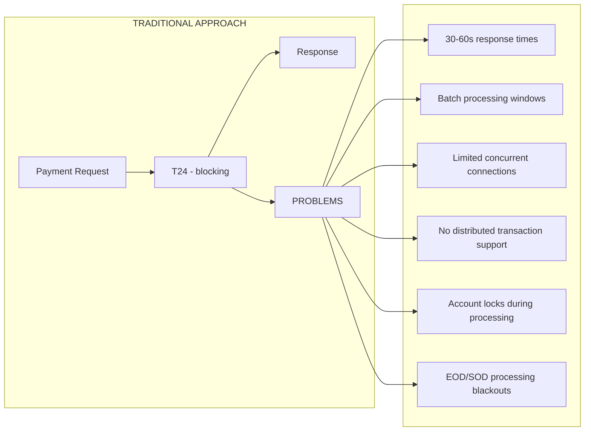

### The Solution

Apply SAGA pattern with asynchronous T24 integration:

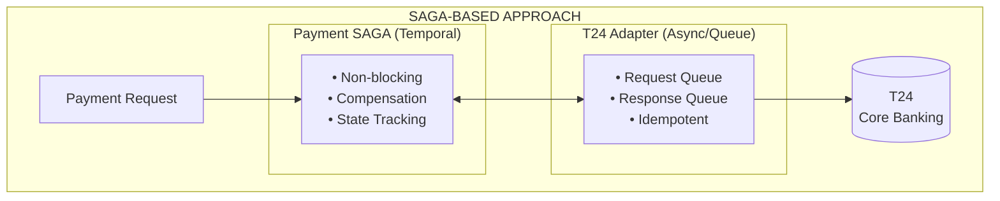

---

## Why SAGA Pattern for Core Banking

### Core Banking Characteristics vs SAGA Benefits

| T24 Characteristic | Challenge | SAGA Solution |
|-------------------|-----------|---------------|
| **Slow Response (30-60s)** | HTTP timeouts, blocked threads | Async activities with durable state |
| **Batch Processing Windows** | Operations fail during EOD | Queue-based retry with backpressure |
| **Limited Concurrency** | Connection pool exhaustion | Bulkhead + rate limiting per account |
| **No Distributed Transactions** | Partial failures leave inconsistent state | Compensation-based rollback |
| **Account Locks** | Concurrent operations deadlock | Workflow-level serialization |
| **Non-Idempotent Operations** | Duplicate debits on retry | Idempotency keys + transaction reference |

### Why NOT Traditional 2PC (Two-Phase Commit)

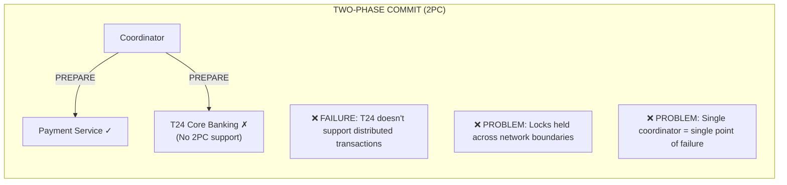

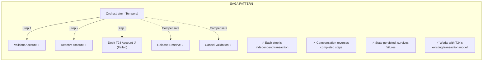

### Why NOT TCC (Try-Confirm-Cancel) Pattern

TCC is another distributed transaction pattern that appears suitable at first glance but presents fundamental incompatibilities with T24's operational model.

#### How TCC Works

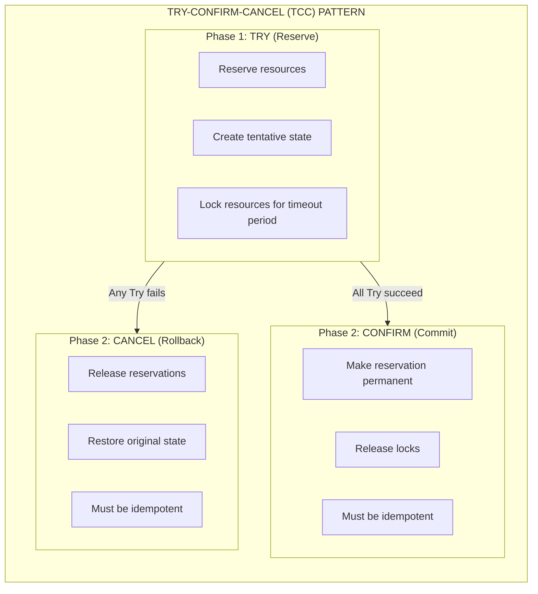

#### TCC vs T24: Fundamental Incompatibilities

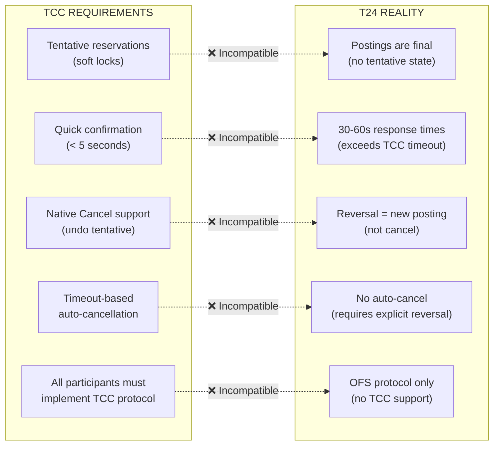

#### Detailed Analysis: Why TCC Fails with T24

| TCC Requirement | T24 Behavior | Problem |
|-----------------|--------------|---------|
| **Tentative Reservations** | T24 postings are immediately final. There is no "tentative" state - once a debit posts, funds are moved. | Cannot implement true TRY phase without custom T24 modifications |
| **Quick Confirmation** | T24 operations take 30-60 seconds. TCC assumes sub-second TRY phase with quick CONFIRM. | TCC timeout would expire before T24 responds |
| **Native Cancel** | T24 has no "cancel" - only reversal postings. A cancel in T24 creates a new offsetting transaction. | "Cancel" leaves audit trail, doesn't truly undo |
| **Resource Locking** | T24 locks accounts during posting, but releases immediately after. TCC requires holding locks until CONFIRM/CANCEL. | Cannot extend T24's lock duration |
| **Coordinator Timeout** | TCC coordinators auto-cancel after timeout. T24 during EOD may not respond for hours. | Mass cancellations during batch windows |
| **Protocol Support** | TCC requires all participants to implement Try/Confirm/Cancel interfaces. T24 uses OFS messaging. | Would require building TCC facade over OFS |

#### TCC Implementation Attempt with T24

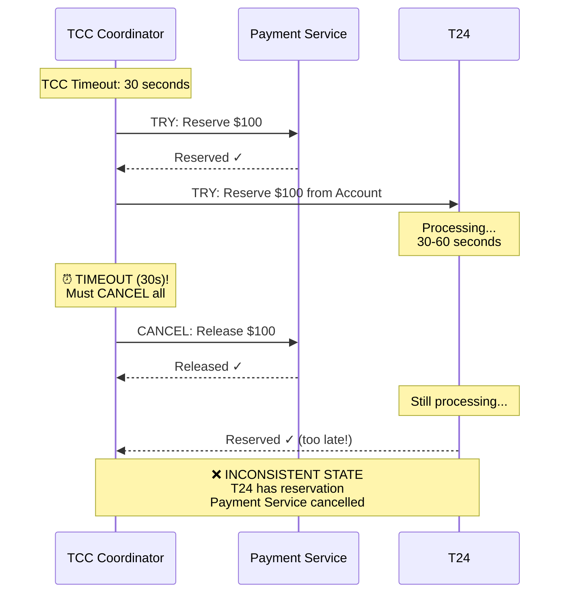

#### The "Pseudo-TCC" Anti-Pattern

Some teams attempt to build TCC over T24 using this approach:

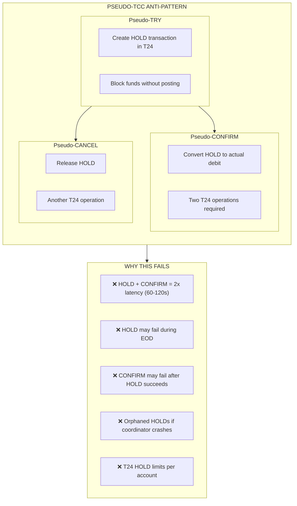

**Problems with Pseudo-TCC:**
1. **Double Latency**: TRY (hold) + CONFIRM (post) = 60-120 seconds total
2. **Partial Failures**: HOLD succeeds but CONFIRM fails during EOD
3. **Orphaned Holds**: Coordinator crash leaves funds locked
4. **Hold Limits**: T24 has limits on concurrent holds per account
5. **Complexity**: More failure modes than direct posting

#### Why SAGA is Superior to TCC for T24

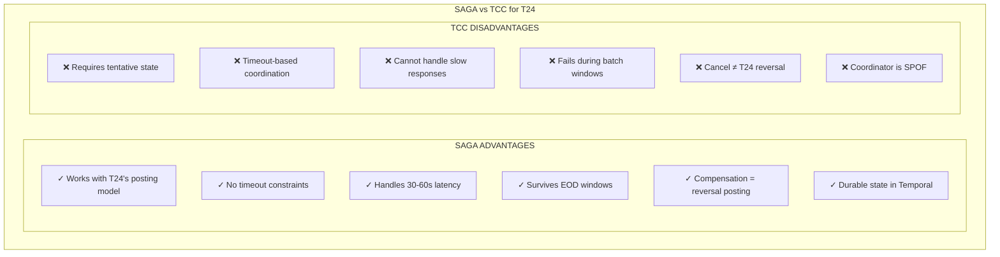

| Aspect | TCC | SAGA | Winner for T24 |
|--------|-----|------|----------------|
| **Latency Tolerance** | Low (seconds) | High (hours/days) | SAGA |
| **T24 Protocol** | Requires custom facade | Works with OFS directly | SAGA |
| **EOD/SOD Handling** | Times out, mass cancels | Queues, retries automatically | SAGA |
| **Failure Recovery** | Coordinator must be available | Temporal persists state | SAGA |
| **Audit Trail** | TRY + CONFIRM/CANCEL | Single posting + reversal if needed | SAGA |
| **Implementation Effort** | High (build TCC over T24) | Low (use T24 as-is) | SAGA |
| **Operational Complexity** | High (orphaned reservations) | Low (compensation is explicit) | SAGA |

#### Summary: TCC is Not Suitable for T24

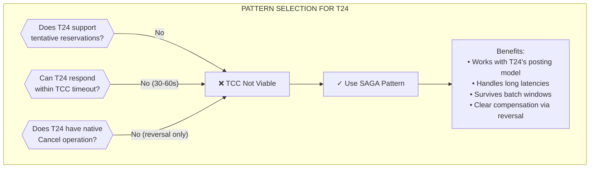

**Key Takeaway**: TCC assumes a world of fast, tentative operations with native cancel support. T24 operates in a world of slow, final postings with reversal-based compensation. SAGA's "execute and compensate" model aligns perfectly with T24's "post and reverse" model.

### SAGA Pattern Advantages for T24 Integration

1. **Loose Coupling**
   - T24 operations remain self-contained transactions
   - No need to modify T24's internal transaction handling
   - Each service manages its own data consistency

2. **Failure Isolation**
   - T24 failures don't lock up Payment SAGA resources
   - Circuit breaker prevents cascade to healthy services
   - Workflow state preserved during T24 outages

3. **Long-Running Operations**
   - Temporal durably stores workflow state
   - Activities can wait for T24 batch completion
   - Human intervention points for manual approval

4. **Visibility & Auditability**
   - Every step recorded in workflow history
   - Compensation actions logged for compliance
   - Full trace from payment request to T24 posting

5. **Graceful Degradation**
   - Payments queued when T24 unavailable
   - Automatic retry when T24 returns online
   - Priority-based processing for critical payments

---

## T24 Integration Challenges

### Challenge 1: Blocking API Calls

**Problem:** T24 operations take 30-60 seconds, causing thread exhaustion.

**Solution:** Async Activity with Heartbeat

```java
@ActivityMethod
public T24Response debitAccount(T24DebitRequest request) {
    // Submit to T24 request queue
    String transactionRef = t24Gateway.submitDebit(request);

    // Poll for completion with heartbeat (keeps workflow alive)
    while (!t24Gateway.isComplete(transactionRef)) {
        Activity.getExecutionContext().heartbeat(
            "Waiting for T24: ref=" + transactionRef);
        Thread.sleep(Duration.ofSeconds(5));
    }

    return t24Gateway.getResult(transactionRef);
}
```

### Challenge 2: Batch Processing Windows (EOD/SOD)

**Problem:** T24 rejects operations during End-of-Day processing.

**Solution:** Backpressure Queue with Scheduled Retry

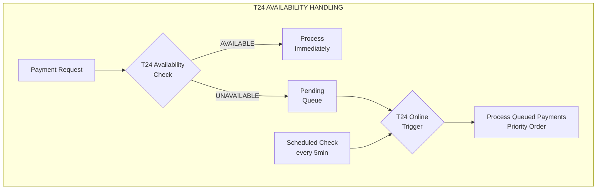

### Challenge 3: Non-Idempotent Operations

**Problem:** Retrying a debit creates duplicate transactions.

**Solution:** T24 Transaction Reference + External Idempotency Key

```java
public class T24DebitRequest {
    private String idempotencyKey;      // Our unique key
    private String t24TransactionRef;   // T24's reference (if known)
    private String accountNumber;
    private BigDecimal amount;
    private String currency;
    private String narrative;

    // T24 checks: Has this idempotencyKey been processed?
    // If yes: Return existing transaction reference
    // If no: Process and return new reference
}
```

### Challenge 4: Account-Level Locking

**Problem:** Concurrent operations on same account cause deadlocks.

**Solution:** Customer/Account-Based Sharding

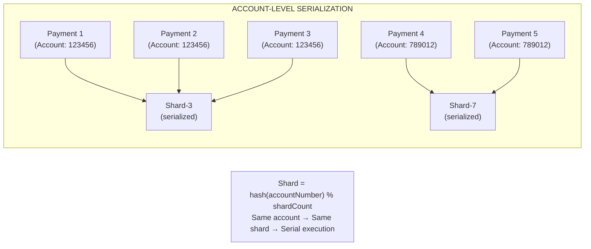

### Challenge 5: Partial Failures

**Problem:** Debit succeeds but credit fails (or vice versa).

**Solution:** Compensating Transactions

```
SCENARIO: Transfer $100 from Account A to Account B

Forward Flow:
1. Reserve $100 from Account A (soft hold)
2. Debit $100 from Account A → T24 posting
3. Credit $100 to Account B → T24 posting
4. Release reservation on Account A

If Step 3 (Credit) fails AFTER Step 2 (Debit) succeeded:

Compensation Flow:
1. Reverse Debit on Account A (T24 REVERSAL posting)
2. Release reservation on Account A
3. Mark workflow as COMPENSATED

T24 Reversal = New posting that negates original posting
```

---

## Architecture Design

### High-Level Architecture

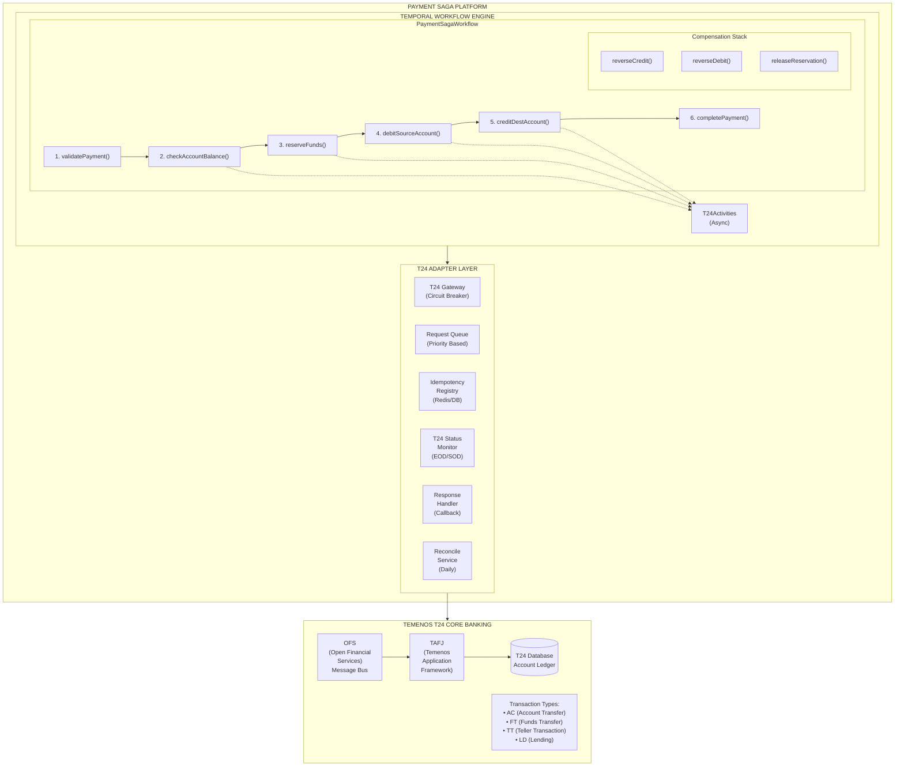

### Sequence Diagram: Payment with T24 Integration

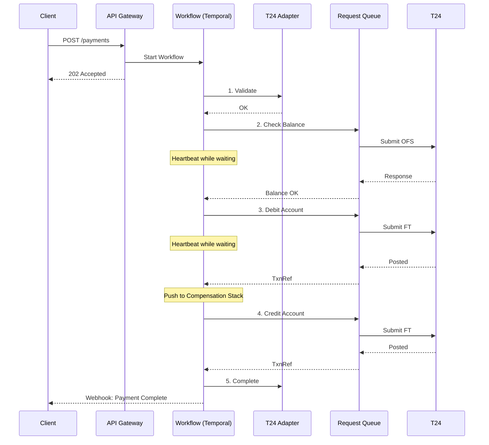

---

## Integration Principles

### Principle 1: Asynchronous by Default

**Never make synchronous blocking calls to T24.**

```java
// ❌ BAD: Synchronous blocking call
public T24Response debitAccount(T24Request request) {
    return t24Client.debit(request);  // Blocks for 30-60s
}

// ✓ GOOD: Async with polling
public T24Response debitAccount(T24Request request) {
    String txnRef = t24Gateway.submitAsync(request);

    while (!isComplete(txnRef)) {
        Activity.getExecutionContext().heartbeat(txnRef);
        sleep(5000);
    }

    return t24Gateway.getResult(txnRef);
}
```

### Principle 2: Idempotency at Every Layer

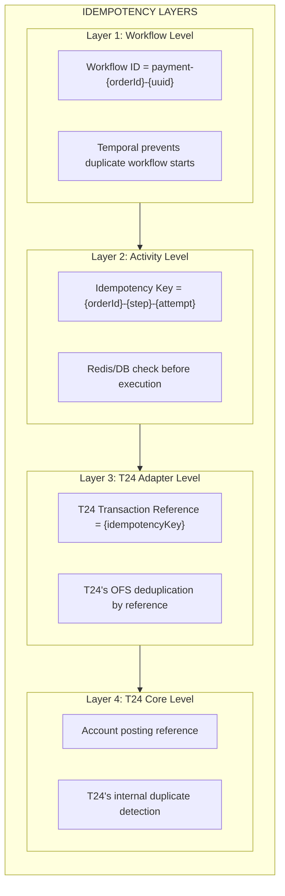

### Principle 3: Compensation Over Rollback

**Design compensation, not rollback.**

| Operation | Compensation | Notes |
|-----------|--------------|-------|
| Reserve Funds | Release Reserve | Soft hold → Released |
| Debit Account | Reversal Posting | New credit entry |
| Credit Account | Reversal Posting | New debit entry |
| Update Status | Revert Status | Status = CANCELLED |

```java
// Compensation is a NEW transaction, not an UNDO
public void compensateDebit(String originalTxnRef) {
    T24ReversalRequest reversal = T24ReversalRequest.builder()
        .originalReference(originalTxnRef)
        .reversalType(ReversalType.FULL)
        .narrative("SAGA compensation: " + workflowId)
        .build();

    t24Gateway.postReversal(reversal);  // Creates new posting
}
```

### Principle 4: Fail-Open for Compensations

**Compensation failures should not block other compensations.**

```java
private void compensate() {
    int successCount = 0;
    int failureCount = 0;

    for (CompensationAction action : compensationStack) {
        try {
            action.execute();
            successCount++;
        } catch (Exception e) {
            failureCount++;
            // LOG but CONTINUE - don't throw
            log.error("[COMPENSATION-FAILED] {} - manual reconciliation required",
                action.getName(), e);
            alertService.raiseCompensationFailure(workflowId, action);
        }
    }

    // Even with failures, workflow completes (for visibility)
    // Failed compensations trigger manual reconciliation
}
```

### Principle 5: Account-Level Serialization

**Serialize operations on the same account to prevent deadlocks.**

```java
// Shard by account number ensures same-account operations are serialized
public String calculateTaskQueue(String accountNumber, PaymentPriority priority) {
    int shardId = Math.abs(accountNumber.hashCode()) % shardCount;
    return String.format("t24-saga-queue-%s-shard-%d",
        priority.name().toLowerCase(), shardId);
}
```

### Principle 6: Eventual Consistency with Reconciliation

**Accept eventual consistency, implement daily reconciliation.**

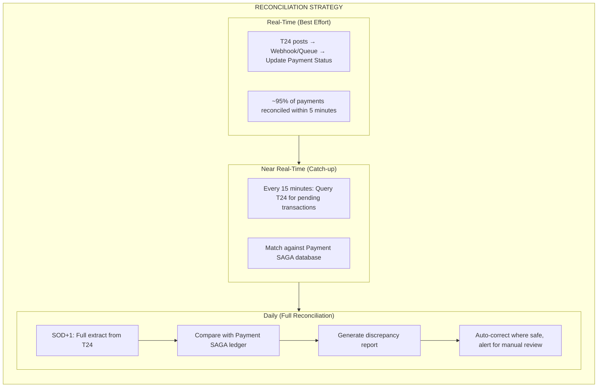

### Principle 7: Circuit Breaker for T24 Protection

```yaml
resilience4j:
  circuitbreaker:
    instances:
      t24-gateway:
        slidingWindowType: COUNT_BASED
        slidingWindowSize: 20
        minimumNumberOfCalls: 10
        failureRateThreshold: 50
        waitDurationInOpenState: 120s  # T24 recovery time
        permittedNumberOfCallsInHalfOpenState: 5
        slowCallDurationThreshold: 30s  # T24 is slow
        slowCallRateThreshold: 80
```

---

## T24 Adapter Design

### T24 Gateway Interface

```java
public interface T24Gateway {

    // Account Operations
    T24BalanceResponse getAccountBalance(String accountNumber);
    T24AccountResponse getAccountDetails(String accountNumber);

    // Transaction Operations
    String submitDebit(T24DebitRequest request);    // Returns txnRef
    String submitCredit(T24CreditRequest request);  // Returns txnRef
    String submitTransfer(T24TransferRequest request);

    // Transaction Status
    T24TransactionStatus getTransactionStatus(String txnRef);
    boolean isTransactionComplete(String txnRef);
    T24TransactionResponse getTransactionResult(String txnRef);

    // Reversal Operations
    String submitReversal(T24ReversalRequest request);

    // System Status
    T24SystemStatus getSystemStatus();  // EOD, SOD, ONLINE
    boolean isSystemAvailable();
}
```

### T24 Activities Implementation

```java
@Component
public class T24ActivitiesImpl implements T24Activities {

    private final T24Gateway t24Gateway;
    private final IdempotencyService idempotencyService;
    private final T24StatusMonitor statusMonitor;

    @Override
    public T24DebitResponse debitAccount(T24DebitRequest request) {
        String idempotencyKey = buildIdempotencyKey(
            "debit", request.getAccountNumber(), request.getAmount());

        // Check idempotency
        if (idempotencyService.isProcessed(idempotencyKey)) {
            return idempotencyService.getCachedResult(
                idempotencyKey, T24DebitResponse.class);
        }

        // Check T24 availability
        if (!statusMonitor.isAvailable()) {
            throw new T24UnavailableException(
                "T24 is in " + statusMonitor.getStatus() + " mode");
        }

        // Submit to T24
        String txnRef = t24Gateway.submitDebit(request);

        // Poll for completion with heartbeat
        while (!t24Gateway.isTransactionComplete(txnRef)) {
            Activity.getExecutionContext().heartbeat(
                Map.of("txnRef", txnRef, "status", "PENDING"));
            Thread.sleep(Duration.ofSeconds(5));
        }

        // Get result
        T24TransactionResponse t24Response = t24Gateway.getTransactionResult(txnRef);

        if (!t24Response.isSuccess()) {
            throw new T24TransactionException(t24Response.getErrorCode(),
                t24Response.getErrorMessage());
        }

        T24DebitResponse response = T24DebitResponse.builder()
            .transactionReference(txnRef)
            .postingDate(t24Response.getPostingDate())
            .valueDate(t24Response.getValueDate())
            .build();

        // Cache for idempotency
        idempotencyService.markProcessed(idempotencyKey, response);

        return response;
    }

    @Override
    public void reverseDebit(String originalTxnRef) {
        T24ReversalRequest reversal = T24ReversalRequest.builder()
            .originalReference(originalTxnRef)
            .reversalType(ReversalType.FULL)
            .build();

        // Reversal must be idempotent too
        String reversalKey = "reversal-" + originalTxnRef;
        if (idempotencyService.isProcessed(reversalKey)) {
            return;
        }

        String reversalRef = t24Gateway.submitReversal(reversal);

        // Wait for reversal completion
        while (!t24Gateway.isTransactionComplete(reversalRef)) {
            Activity.getExecutionContext().heartbeat(
                Map.of("reversalRef", reversalRef));
            Thread.sleep(Duration.ofSeconds(5));
        }

        idempotencyService.markProcessed(reversalKey, reversalRef);
    }
}
```

### T24 System Status Monitor

```java
@Component
public class T24StatusMonitor {

    private volatile T24SystemStatus currentStatus = T24SystemStatus.UNKNOWN;
    private volatile Instant lastCheck = Instant.MIN;

    @Scheduled(fixedRate = 30000)  // Check every 30 seconds
    public void checkStatus() {
        try {
            currentStatus = t24Gateway.getSystemStatus();
            lastCheck = Instant.now();

            if (currentStatus == T24SystemStatus.EOD_PROCESSING) {
                log.warn("[T24-STATUS] T24 is in EOD processing mode");
                metricsService.recordEodStart();
            } else if (currentStatus == T24SystemStatus.ONLINE) {
                log.info("[T24-STATUS] T24 is online");
            }
        } catch (Exception e) {
            currentStatus = T24SystemStatus.UNAVAILABLE;
            log.error("[T24-STATUS] Failed to check T24 status", e);
        }
    }

    public boolean isAvailable() {
        return currentStatus == T24SystemStatus.ONLINE;
    }

    public T24SystemStatus getStatus() {
        return currentStatus;
    }
}

public enum T24SystemStatus {
    ONLINE,           // Normal operations
    EOD_PROCESSING,   // End of Day batch
    SOD_PROCESSING,   // Start of Day batch
    MAINTENANCE,      // Scheduled maintenance
    UNAVAILABLE,      // Connection issues
    UNKNOWN           // Status check failed
}
```

---

## Compensation Strategies

### Strategy Matrix

| Scenario | Detection | Compensation | Recovery |
|----------|-----------|--------------|----------|
| Debit succeeded, Credit failed | Workflow state | Reverse debit | Automatic |
| Credit succeeded, Debit failed | Workflow state | Reverse credit | Automatic |
| T24 timeout during debit | No confirmation | Query T24 status | Manual if ambiguous |
| T24 EOD during operation | EOD status | Queue for SOD+1 | Automatic retry |
| Double posting detected | Reconciliation | Reverse duplicate | Manual approval |
| Account locked | T24 error code | Retry with backoff | Automatic |

### Compensation Flow

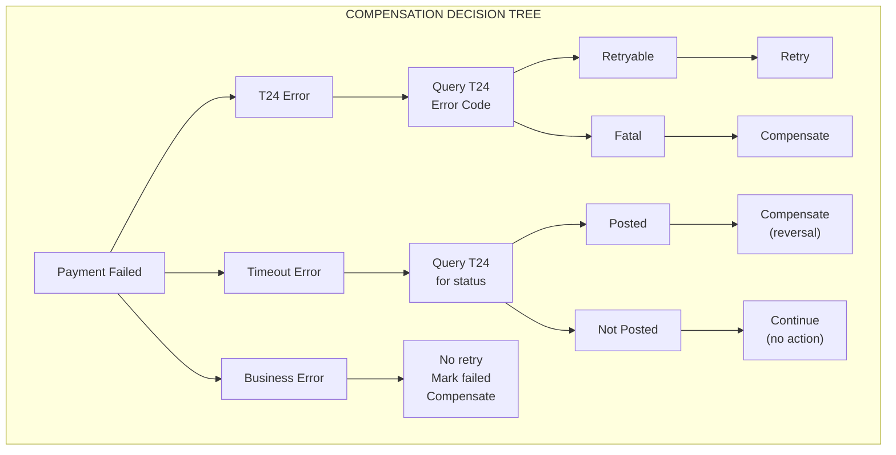

---

## Implementation Patterns

### Pattern 1: Reserve-Execute-Confirm (REC)

```java
public PaymentResult processT24Payment(String orderId) {

    // STEP 1: Reserve (soft hold)
    T24ReservationResponse reservation =
        t24Activities.reserveFunds(accountNumber, amount);
    compensationStack.push(() ->
        t24Activities.releaseReservation(reservation.getReservationId()));

    // STEP 2: Execute (actual posting)
    T24DebitResponse debit =
        t24Activities.debitAccount(request);
    compensationStack.push(() ->
        t24Activities.reverseDebit(debit.getTransactionReference()));

    T24CreditResponse credit =
        t24Activities.creditAccount(request);
    compensationStack.push(() ->
        t24Activities.reverseCredit(credit.getTransactionReference()));

    // STEP 3: Confirm (release reservation, already posted)
    t24Activities.releaseReservation(reservation.getReservationId());

    return PaymentResult.success();
}
```

### Pattern 2: Try-Confirm-Cancel (TCC)

```java
// Try Phase: Tentative reservation
T24TryResponse tryResult = t24Activities.tryReservation(request);

// Confirm Phase: Make reservation permanent
if (allStepsSucceeded) {
    t24Activities.confirmReservation(tryResult.getReservationId());
}

// Cancel Phase: Release reservation
else {
    t24Activities.cancelReservation(tryResult.getReservationId());
}
```

### Pattern 3: Outbox for T24 Commands

```java
// Write T24 command to outbox (transactional with business data)
@Transactional
public void submitT24Command(T24Command command) {
    // Save business state
    paymentRepository.save(payment);

    // Save T24 command to outbox
    t24OutboxRepository.save(T24OutboxEntry.builder()
        .commandType(command.getType())
        .payload(objectMapper.writeValueAsString(command))
        .status(OutboxStatus.PENDING)
        .createdAt(Instant.now())
        .build());
}

// Poller sends to T24
@Scheduled(fixedRate = 100)
public void pollT24Outbox() {
    List<T24OutboxEntry> pending = t24OutboxRepository
        .findPendingForUpdate(batchSize);

    for (T24OutboxEntry entry : pending) {
        try {
            t24Gateway.submit(entry.getPayload());
            entry.setStatus(OutboxStatus.SENT);
        } catch (Exception e) {
            entry.incrementRetryCount();
            if (entry.getRetryCount() > maxRetries) {
                entry.setStatus(OutboxStatus.FAILED);
            }
        }
        t24OutboxRepository.save(entry);
    }
}
```

---

## Monitoring and Reconciliation

### Key Metrics

```yaml
metrics:
  t24_transaction_duration_seconds:
    type: histogram
    labels: [operation, status]
    buckets: [1, 5, 10, 30, 60, 120]

  t24_circuit_breaker_state:
    type: gauge
    labels: [state]  # CLOSED, OPEN, HALF_OPEN

  t24_pending_transactions:
    type: gauge
    labels: [type]  # DEBIT, CREDIT, REVERSAL

  t24_compensation_total:
    type: counter
    labels: [operation, result]  # success, failure

  t24_reconciliation_discrepancies:
    type: counter
    labels: [type]  # MISSING_IN_T24, MISSING_IN_SAGA, AMOUNT_MISMATCH
```

### Reconciliation Report

```sql
-- Daily Reconciliation Query
SELECT
    p.payment_id,
    p.amount,
    p.status as saga_status,
    t.transaction_ref,
    t.posting_status as t24_status,
    CASE
        WHEN t.transaction_ref IS NULL THEN 'MISSING_IN_T24'
        WHEN p.payment_id IS NULL THEN 'MISSING_IN_SAGA'
        WHEN p.amount != t.amount THEN 'AMOUNT_MISMATCH'
        WHEN p.status != t24_to_saga_status(t.posting_status) THEN 'STATUS_MISMATCH'
        ELSE 'MATCHED'
    END as reconciliation_status
FROM payments p
FULL OUTER JOIN t24_transactions t
    ON p.t24_transaction_ref = t.transaction_ref
WHERE p.created_at >= CURRENT_DATE - 1
    AND (p.status != 'COMPLETED' OR t.posting_status != 'POSTED'
         OR p.amount != t.amount);
```

---

## Summary

### Pattern Comparison: 2PC vs TCC vs SAGA for T24

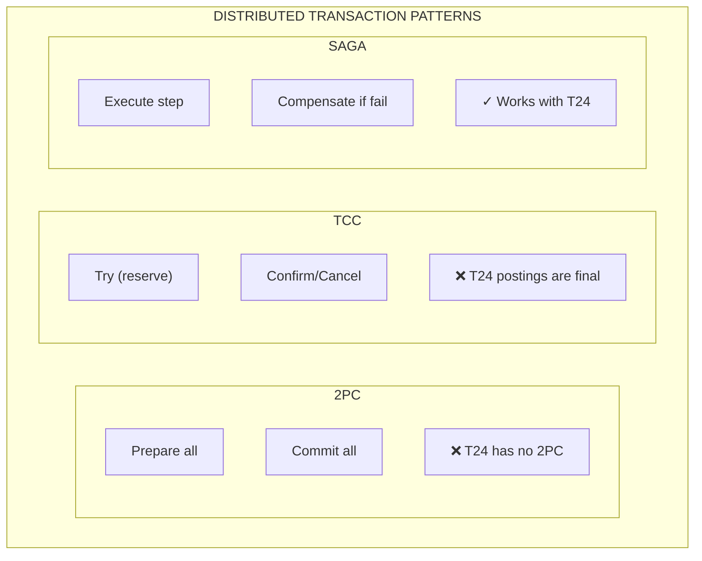

| Criteria | 2PC | TCC | SAGA |
|----------|-----|-----|------|
| **T24 Compatibility** | ❌ No XA support | ❌ No tentative state | ✓ Works with OFS |
| **Latency Tolerance** | ❌ Seconds | ❌ Seconds | ✓ Hours/Days |
| **EOD/SOD Handling** | ❌ Blocks | ❌ Times out | ✓ Queues & retries |
| **Failure Recovery** | ❌ Coordinator SPOF | ❌ Coordinator SPOF | ✓ Durable workflow |
| **Resource Locking** | ❌ Holds locks | ❌ Requires tentative locks | ✓ No locks held |
| **Implementation** | ❌ Impossible | ❌ Complex facade needed | ✓ Direct integration |
| **Cancel/Rollback** | Rollback | Cancel tentative | Compensate (reversal) |
| **Verdict for T24** | **Not viable** | **Not recommended** | **Recommended** |

### Why SAGA Pattern is the Right Fit for T24

| Challenge | SAGA Solution | Benefit |
|-----------|---------------|---------|
| Long-running T24 operations | Durable workflow state | No timeout issues |
| T24 batch windows (EOD/SOD) | Queue-based retry | Automatic recovery |
| No distributed transactions | Compensation-based rollback | Consistent outcomes |
| Account-level locking | Customer-hash sharding | No deadlocks |
| Non-idempotent operations | Multi-layer idempotency | Safe retries |
| Partial failures | LIFO compensation stack | Clean rollback |
| Visibility requirements | Workflow history | Full audit trail |

### Architecture Principles Summary

1. **Asynchronous by Default** - Never block on T24 calls
2. **Idempotency at Every Layer** - Safe retries guaranteed
3. **Compensation Over Rollback** - Forward-only transaction design
4. **Fail-Open for Compensations** - Don't compound failures
5. **Account-Level Serialization** - Prevent deadlocks
6. **Eventual Consistency** - Accept with reconciliation
7. **Circuit Breaker Protection** - Protect both systems

---

## Related Documentation

- [TEMPORAL_SCALING_ARCHITECTURE.md](TEMPORAL_SCALING_ARCHITECTURE.md) - Scaling for high throughput
- [Observability.md](Observability.md) - Monitoring and tracing
- [CLAUDE.md](../CLAUDE.md) - Development guide
