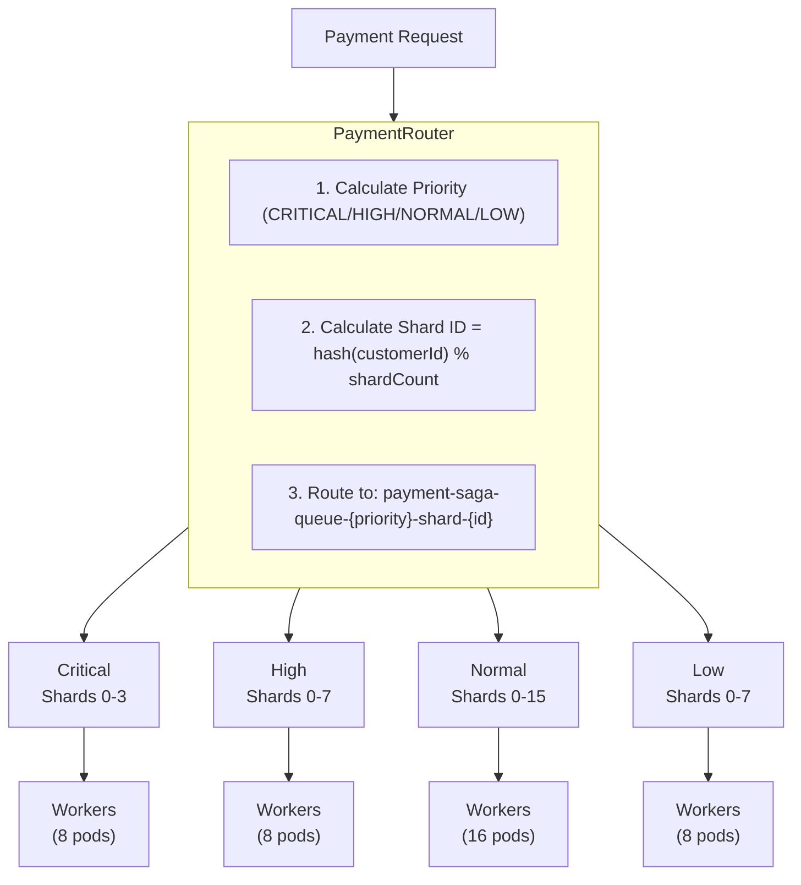
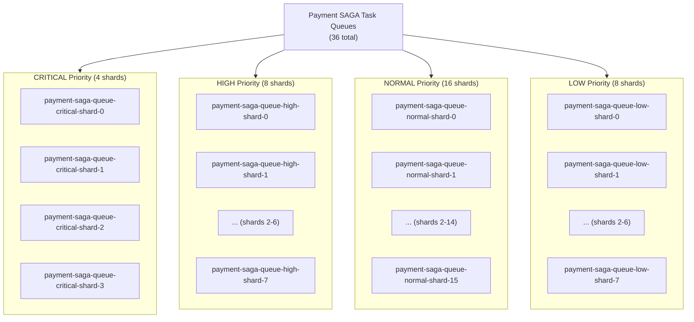
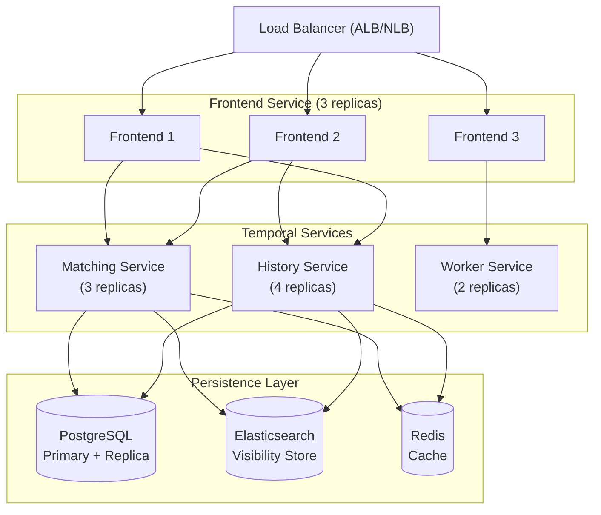
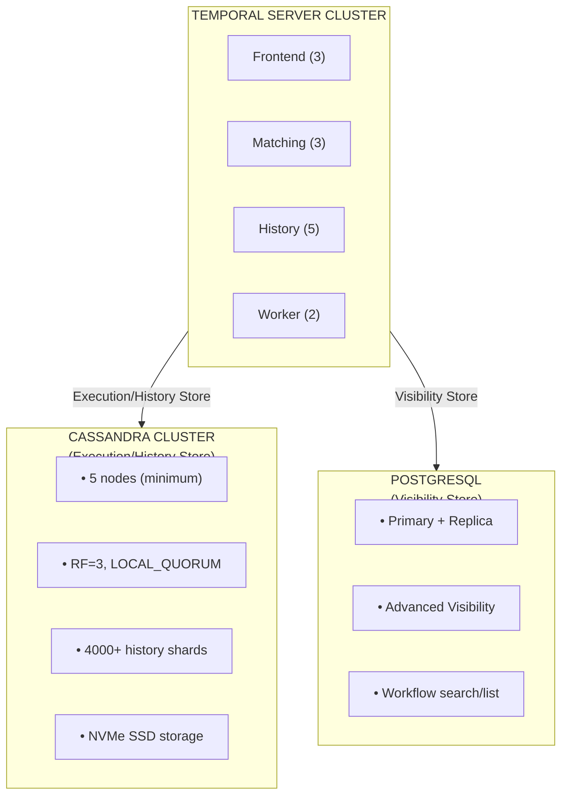
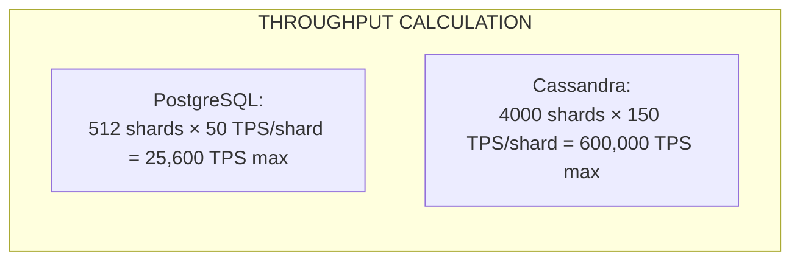
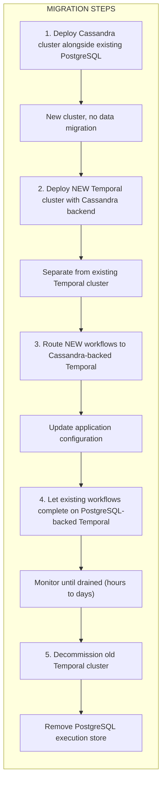

# Temporal Scaling Architecture

This document describes the scaling strategy for the Payment SAGA Platform to achieve 500+ TPS (immediate) with a path to 10K-100K+ TPS (future) using customer-hash sharding and Cassandra persistence.

## Table of Contents

- [Executive Summary](#executive-summary)
- [Sharding Strategy](#sharding-strategy)
- [Task Queue Architecture](#task-queue-architecture)
- [Worker Deployment Model](#worker-deployment-model)
- [Auto-Scaling Configuration](#auto-scaling-configuration)
- [Temporal Server Clustering](#temporal-server-clustering)
- [Capacity Planning](#capacity-planning)
- [Monitoring and Metrics](#monitoring-and-metrics)
- [Cassandra Persistence (10K+ TPS)](#cassandra-persistence-10k-tps)

---

## Executive Summary

### Problem Statement

The Payment SAGA Platform requires scaling from ~80 TPS (current) to 500+ TPS to support bank-wide payment processing. The current single-worker, single-queue architecture creates bottlenecks that prevent horizontal scaling.

### Solution Overview

Implement **Customer-Hash Sharding** combined with **Priority-Based Routing** to distribute workflows across multiple task queues, enabling true horizontal scaling.



### Key Benefits

| Benefit | Description |
|---------|-------------|
| **Horizontal Scaling** | Add workers = linear throughput increase |
| **Customer Affinity** | Same customer always routes to same shard |
| **Hot-Spot Prevention** | Consistent hashing distributes load evenly |
| **Priority Isolation** | VIP/Critical payments never blocked by batch |
| **Simple Mental Model** | Developers can predict shard from customerId |

---

## Sharding Strategy

### Shard Calculation Formula

```java
int shardId = Math.abs(customerId.hashCode()) % shardCount;
String taskQueue = String.format("payment-saga-queue-%s-shard-%d",
    priority.name().toLowerCase(), shardId);
```

### Example Routing

```
Input:
  customerId = "CUST-12345"
  priority = NORMAL
  shardCount = 16

Calculation:
  hash("CUST-12345") = 789456123
  shardId = 789456123 % 16 = 11

Result:
  taskQueue = "payment-saga-queue-normal-shard-11"
```

### Why Customer-Hash Sharding?

| Alternative | Pros | Cons | Decision |
|-------------|------|------|----------|
| **Random** | Even distribution | No affinity, unpredictable | Rejected |
| **Round-Robin** | Simple | No affinity, ordering issues | Rejected |
| **Order-ID Hash** | Per-order isolation | Same customer may hit different shards | Rejected |
| **Customer-ID Hash** | Customer affinity, predictable | Requires good hash function | **Selected** |
| **Geographic** | Regional isolation | Complex, requires location data | Future |

### Hot-Spot Mitigation

1. **Consistent Hashing**: Uses Java's `hashCode()` which provides good distribution
2. **VIP Spreading**: VIP customers use secondary hash to spread across CRITICAL shards
3. **Overflow Routing**: If a shard is overwhelmed, circuit breaker routes to alternate shard

```java
// VIP customer distribution across CRITICAL shards
if (isVipCustomer(customerId)) {
    int vipShardId = Math.abs((customerId + orderId).hashCode()) % 4;
    return "payment-saga-queue-critical-shard-" + vipShardId;
}
```

---

## Task Queue Architecture

### Queue Layout



### Priority Configuration

| Priority | Shard Count | Target SLA | Use Cases |
|----------|-------------|------------|-----------|
| CRITICAL | 4 | 5 seconds | VIP customers, >$5,000 transactions |
| HIGH | 8 | 10 seconds | Subscriptions, >$1,000 transactions |
| NORMAL | 16 | 30 seconds | Standard payments (60-70% of traffic) |
| LOW | 8 | 60 seconds | Batch payments, scheduled transactions |

### Queue Naming Convention

```
Pattern: payment-saga-queue-{priority}-shard-{id}

Components:
  - payment-saga-queue: Base prefix (identifies payment workflows)
  - {priority}: Priority level (critical, high, normal, low)
  - shard-{id}: Shard identifier (0 to shardCount-1)

Examples:
  - payment-saga-queue-critical-shard-0
  - payment-saga-queue-normal-shard-15
  - payment-saga-queue-low-shard-7
```

---

## Worker Deployment Model

### Worker Configuration per Priority

| Priority | Workers/Shard | Total Workers | Concurrent WF | Concurrent Activities |
|----------|---------------|---------------|---------------|----------------------|
| CRITICAL | 2 | 8 | 50 | 30 |
| HIGH | 1 | 8 | 100 | 40 |
| NORMAL | 1 | 16 | 200 | 50 |
| LOW | 1 | 8 | 300 | 100 |
| **Total** | - | **40** | - | - |

### Worker Registration (ShardedWorkerFactory)

```java
@Component
public class ShardedWorkerFactory {

    @PostConstruct
    public void registerShardedWorkers() {
        for (PaymentPriority priority : PaymentPriority.values()) {
            int shardCount = priority.getShardCount();

            for (int shardId = 0; shardId < shardCount; shardId++) {
                String taskQueue = priority.getShardedTaskQueue(shardId);
                WorkerOptions options = buildWorkerOptions(priority);

                Worker worker = workerFactory.newWorker(taskQueue, options);
                worker.registerWorkflowImplementationTypes(PaymentSagaWorkflowImpl.class);
                worker.registerActivitiesImplementations(
                    paymentActivities,
                    stateMachineActivities,
                    dataActivities
                );

                log.info("[TEMPORAL] Registered worker: taskQueue={}", taskQueue);
            }
        }
    }

    private WorkerOptions buildWorkerOptions(PaymentPriority priority) {
        return WorkerOptions.newBuilder()
            .setMaxConcurrentWorkflowTaskExecutionSize(priority.getMaxConcurrentWorkflows())
            .setMaxConcurrentActivityExecutionSize(priority.getMaxConcurrentActivities())
            .build();
    }
}
```

### Pod Distribution Strategy

```yaml
# Kubernetes topology spread for even distribution
topologySpreadConstraints:
  - maxSkew: 1
    topologyKey: topology.kubernetes.io/zone
    whenUnsatisfiable: ScheduleAnyway
    labelSelector:
      matchLabels:
        app: payment-saga-orchestrator
```

---

## Auto-Scaling Configuration

### Horizontal Pod Autoscaler (HPA)

```yaml
apiVersion: autoscaling/v2
kind: HorizontalPodAutoscaler
metadata:
  name: payment-saga-orchestrator-hpa
  namespace: payment-saga
spec:
  scaleTargetRef:
    apiVersion: apps/v1
    kind: Deployment
    name: payment-saga-orchestrator
  minReplicas: 8
  maxReplicas: 50
  behavior:
    scaleUp:
      stabilizationWindowSeconds: 60
      policies:
        - type: Percent
          value: 50
          periodSeconds: 60
        - type: Pods
          value: 4
          periodSeconds: 60
      selectPolicy: Max
    scaleDown:
      stabilizationWindowSeconds: 300
      policies:
        - type: Percent
          value: 25
          periodSeconds: 120
  metrics:
    - type: Resource
      resource:
        name: cpu
        target:
          type: Utilization
          averageUtilization: 70
    - type: Resource
      resource:
        name: memory
        target:
          type: Utilization
          averageUtilization: 80
```

### Scaling Metrics

| Metric | Scale Up Threshold | Scale Down Threshold |
|--------|-------------------|---------------------|
| CPU Utilization | >70% | <40% |
| Memory Utilization | >80% | <50% |
| Task Queue Depth | >100 pending | <20 pending |
| Schedule-to-Start Latency | >1 second | <200ms |

### Resource Allocation per Pod

```yaml
resources:
  requests:
    memory: "1Gi"
    cpu: "500m"
  limits:
    memory: "2Gi"
    cpu: "2000m"
```

---

## Temporal Server Clustering

### Production Architecture



### History Shards Configuration

```
TEMPORAL_NUM_HISTORY_SHARDS=512
```

**Why 512 shards?**
- Allows horizontal scaling of history service
- Each shard handles ~1 TPS (512 shards = 512 TPS capacity)
- Cannot be changed after cluster creation

### Database Optimization (PostgreSQL)

```sql
-- postgresql.conf optimizations for Temporal
max_connections = 500
shared_buffers = 4GB
effective_cache_size = 12GB
maintenance_work_mem = 1GB
checkpoint_completion_target = 0.9
wal_buffers = 64MB
random_page_cost = 1.1
effective_io_concurrency = 200
min_wal_size = 2GB
max_wal_size = 8GB
```

---

## Capacity Planning

### Throughput Formula

```
TPS = (total_workers × concurrent_workflows_per_worker) / avg_workflow_duration

Variables:
  - total_workers: Number of worker pods × workers per pod
  - concurrent_workflows_per_worker: From WorkerOptions
  - avg_workflow_duration: ~2.5 seconds for payment saga
```

### Capacity Calculator

| Configuration | Workers | Concurrent WF | Avg Duration | Estimated TPS |
|---------------|---------|---------------|--------------|---------------|
| **Current** | 2 | 200 | 2.5s | 160 |
| **Phase 1** | 6 | 400 | 2.5s | 960 |
| **Phase 2** | 40 | varies | 2.5s | 1,500+ |
| **Phase 3** | 40-50 (HPA) | varies | 2.5s | 2,000+ |

### Connection Pool Sizing

| Component | Current | Scaled | Per-Pod | Total (40 pods) |
|-----------|---------|--------|---------|-----------------|
| PostgreSQL (saga_db) | 30 | 50 | 50 | 2,000 |
| PostgreSQL (Temporal) | default | 500 | N/A | 500 |
| Redis | 32 | 64 | 64 | 2,560 |
| Kafka consumers | 3 | 12 | 12 | 480 |

### Resource Requirements

| Component | CPU Request | CPU Limit | Memory Request | Memory Limit |
|-----------|-------------|-----------|----------------|--------------|
| Orchestrator Pod | 500m | 2000m | 1Gi | 2Gi |
| Temporal Frontend | 500m | 2000m | 1Gi | 4Gi |
| Temporal History | 1000m | 4000m | 2Gi | 8Gi |
| Temporal Matching | 500m | 2000m | 1Gi | 4Gi |
| PostgreSQL | 2000m | 8000m | 8Gi | 32Gi |

---

## Monitoring and Metrics

### Key Metrics Dashboard

| Metric | Query | Alert Threshold |
|--------|-------|-----------------|
| Workflow TPS | `rate(temporal_workflow_completed_total[1m])` | <400 (warning) |
| Task Queue Depth | `temporal_workflow_task_queue_pending_task_count` | >100 (warning) |
| Schedule-to-Start Latency | `histogram_quantile(0.99, temporal_workflow_task_schedule_to_start_latency_bucket)` | >1s (critical) |
| Worker Utilization | `temporal_worker_task_slots_used / temporal_worker_task_slots_available` | >90% (warning) |
| Error Rate | `rate(temporal_workflow_failed_total[5m]) / rate(temporal_workflow_completed_total[5m])` | >1% (critical) |

### Per-Shard Monitoring

```promql
# Task queue depth per shard
temporal_workflow_task_queue_pending_task_count{task_queue=~"payment-saga-queue-.*-shard-.*"}

# Workflow latency per priority
histogram_quantile(0.99,
  sum(rate(temporal_workflow_task_schedule_to_start_latency_bucket[5m]))
  by (le, task_queue)
)
```

### Alerting Rules

```yaml
groups:
  - name: payment-saga-scaling
    rules:
      - alert: HighTaskQueueDepth
        expr: temporal_workflow_task_queue_pending_task_count > 100
        for: 2m
        labels:
          severity: warning
        annotations:
          summary: "Task queue {{ $labels.task_queue }} has high pending count"

      - alert: WorkerSaturation
        expr: temporal_worker_task_slots_used / temporal_worker_task_slots_available > 0.9
        for: 5m
        labels:
          severity: warning
        annotations:
          summary: "Workers are >90% utilized, consider scaling"

      - alert: HighWorkflowLatency
        expr: histogram_quantile(0.99, temporal_workflow_task_schedule_to_start_latency_bucket) > 1
        for: 1m
        labels:
          severity: critical
        annotations:
          summary: "Workflow schedule-to-start latency >1s"
```

---

## Implementation Phases

### Phase 1: Configuration Tuning (Day 1-2)
- Increase worker concurrency limits
- Scale to 6 replicas
- Increase connection pools
- **Target: 200+ TPS**

### Phase 2: Sharding Implementation (Week 1)
- Implement ShardingConfiguration
- Create ShardedWorkerFactory
- Update PaymentRouter with shard calculation
- **Target: 400+ TPS**

### Phase 3: Auto-Scaling (Week 2)
- Deploy HPA configuration
- Add custom metrics adapter
- Configure scale behaviors
- **Target: 500+ TPS**

### Phase 4: Temporal Clustering (Week 3-4)
- Deploy Temporal cluster on Kubernetes
- Configure 512 history shards
- Add Elasticsearch visibility
- **Target: 600+ TPS with HA**

### Phase 5: Cassandra Migration (Month 2-3)
- Deploy Cassandra cluster (5 nodes)
- Migrate Temporal persistence to Cassandra
- Keep PostgreSQL for Visibility store
- **Target: 10K-100K+ TPS**

---

## Cassandra Persistence (10K+ TPS)

For bank-wide payment processing requiring 10,000+ TPS, Cassandra provides significantly higher throughput than PostgreSQL.

### PostgreSQL vs Cassandra Comparison

| Factor | PostgreSQL | Cassandra |
|--------|------------|-----------|
| **Max TPS** | 5K-25K | 50K-100K+ |
| **Latency (P99)** | 10-50ms | 5-20ms |
| **Write Scaling** | Limited (read replicas) | Linear (add nodes) |
| **Multi-Region** | Complex (logical replication) | Native |
| **Operational Complexity** | Low | High |
| **Cost** | Lower | Higher (more nodes) |

### When to Use Cassandra

**Use Cassandra when:**
- Targeting 10,000+ TPS sustained throughput
- Multi-region active-active deployment required
- Bank-wide platform with extreme durability requirements
- Write-heavy workload (Temporal is 50% writes via LWT)

**Stay with PostgreSQL when:**
- 500-5,000 TPS is sufficient
- Single region deployment
- Operational simplicity is priority
- Cost optimization is critical

### Cassandra Architecture



**Critical Constraint:** Cassandra CANNOT be used for Visibility store (deprecated in Temporal v1.21+). You must use PostgreSQL or Elasticsearch for Visibility.

### Cassandra Cluster Configuration

#### Node Sizing

| Component | Specification |
|-----------|---------------|
| Nodes | 5 minimum (3 seed + 2) |
| CPU | 16 cores per node |
| Memory | 32GB RAM (8GB JVM heap max) |
| Storage | NVMe SSD, 1TB per node |
| Network | 10Gbps |

#### Keyspace Configuration

```cql
-- Production keyspace with NetworkTopologyStrategy
CREATE KEYSPACE IF NOT EXISTS temporal
WITH replication = {
  'class' : 'NetworkTopologyStrategy',
  'dc1' : 3
};

-- For multi-region deployment
CREATE KEYSPACE IF NOT EXISTS temporal
WITH replication = {
  'class' : 'NetworkTopologyStrategy',
  'dc1' : 3,
  'dc2' : 3
};
```

#### Consistency Levels

| Operation | Consistency Level |
|-----------|-------------------|
| Read | LOCAL_QUORUM |
| Write | LOCAL_QUORUM |
| Lightweight Transactions | LOCAL_SERIAL |

### History Shards (Critical Decision)

**Cannot be changed after cluster creation!**

| Database | Recommended Shards | Max TPS per Shard |
|----------|-------------------|-------------------|
| PostgreSQL | 512 | ~10-50 |
| Cassandra | 4,000-16,000 | ~100-200 |



### Kubernetes Deployment with K8ssandra

```yaml
# k8s/base/cassandra/cassandra-cluster.yaml
apiVersion: cassandra.datastax.com/v1beta1
kind: CassandraCluster
metadata:
  name: temporal-cassandra
  namespace: temporal
spec:
  cassandraImage:
    repository: cassandra
    tag: "4.1.0"
  size: 5
  datacenters:
    - name: dc1
      size: 5
      storageConfig:
        cassandraDataVolumeClaimSpec:
          storageClassName: fast-ssd
          accessModes:
            - ReadWriteOnce
          resources:
            requests:
              storage: 1Ti
  config:
    cluster_name: temporal-cassandra
    num_tokens: 256
    authenticator: PasswordAuthenticator
    authorizer: CassandraAuthorizer
  resources:
    requests:
      cpu: "8"
      memory: "32Gi"
    limits:
      cpu: "16"
      memory: "32Gi"
```

### Temporal Server Configuration for Cassandra

```yaml
# temporal-config.yaml
persistence:
  defaultStore: cassandra
  visibilityStore: postgresql
  numHistoryShards: 4096

  datastores:
    cassandra:
      cassandra:
        hosts:
          - temporal-cassandra-dc1-0.temporal-cassandra.temporal.svc.cluster.local
          - temporal-cassandra-dc1-1.temporal-cassandra.temporal.svc.cluster.local
          - temporal-cassandra-dc1-2.temporal-cassandra.temporal.svc.cluster.local
          - temporal-cassandra-dc1-3.temporal-cassandra.temporal.svc.cluster.local
          - temporal-cassandra-dc1-4.temporal-cassandra.temporal.svc.cluster.local
        port: 9042
        keyspace: temporal
        user: temporal
        password: "${CASSANDRA_PASSWORD}"
        datacenter: "dc1"
        consistency:
          default:
            read: LOCAL_QUORUM
            write: LOCAL_QUORUM
        connectTimeout: 10s
        replicationFactor: 3

    postgresql:
      sql:
        driver: "postgres"
        host: "postgresql.temporal.svc.cluster.local"
        port: 5432
        database: "temporal_visibility"
        user: "temporal"
        password: "${DB_PASSWORD}"
        maxConns: 50
        connectTimeout: 10s
```

### Migration Strategy

Since Cassandra uses different schema and cannot migrate existing data:



### Cassandra Operational Considerations

#### Monitoring Critical Metrics

```yaml
Cassandra Metrics:
  - cassandra_gc_pause_seconds{quantile="0.99"} < 0.1
  - cassandra_compaction_pending_tasks < 100
  - cassandra_read_latency_seconds{quantile="0.99"} < 0.05
  - cassandra_write_latency_seconds{quantile="0.99"} < 0.02
  - cassandra_heap_usage_ratio < 0.75
  - cassandra_disk_usage_ratio < 0.70
```

#### Backup and Recovery

```bash
# Using Medusa (K8ssandra backup solution)
kubectl apply -f - <<EOF
apiVersion: cassandra.datastax.com/v1alpha1
kind: CassandraBackup
metadata:
  name: temporal-backup-daily
spec:
  cluster: temporal-cassandra
  schedule: "0 2 * * *"  # Daily at 2 AM
  type: s3
  s3Config:
    bucket: temporal-cassandra-backups
    region: us-east-1
EOF
```

#### Repair Schedule

```bash
# Weekly repair via Reaper
kubectl apply -f - <<EOF
apiVersion: reaper.cassandra.datastax.com/v1alpha1
kind: Reaper
metadata:
  name: temporal-reaper
spec:
  clusterRef:
    name: temporal-cassandra
  repairSchedules:
    - keyspace: temporal
      scheduleDaysBetween: 7
      intensity: 0.5
EOF
```

### Throughput Scaling Summary

| Phase | Database | History Shards | Max TPS | Timeline |
|-------|----------|----------------|---------|----------|
| 1-4 | PostgreSQL | 512 | 5K-25K | Month 1 |
| 5 | Cassandra | 4,096 | 50K-100K+ | Month 2-3 |

---

## Related Documentation

- [CLAUDE.md](../CLAUDE.md) - Development guide
- [Observability.md](Observability.md) - Monitoring strategy
- [temporal-kafka-integration.md](temporal-kafka-integration.md) - Temporal + Kafka architecture
