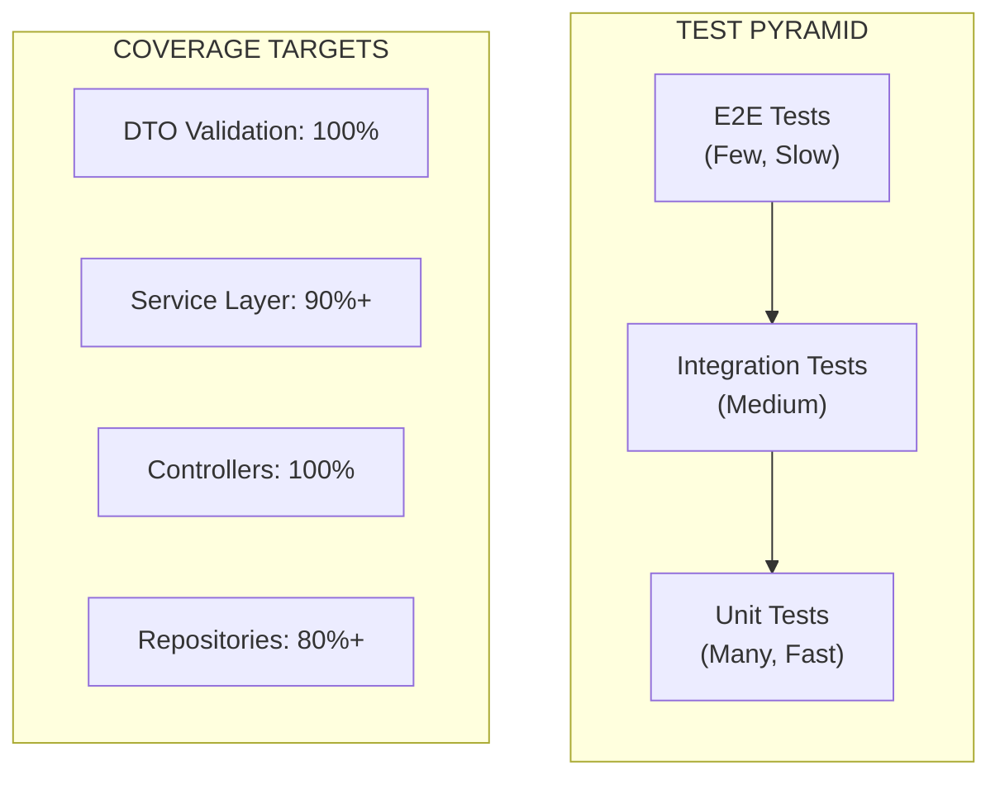
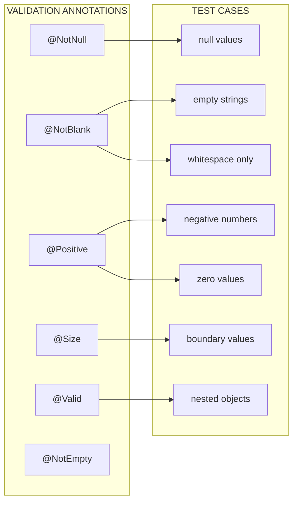
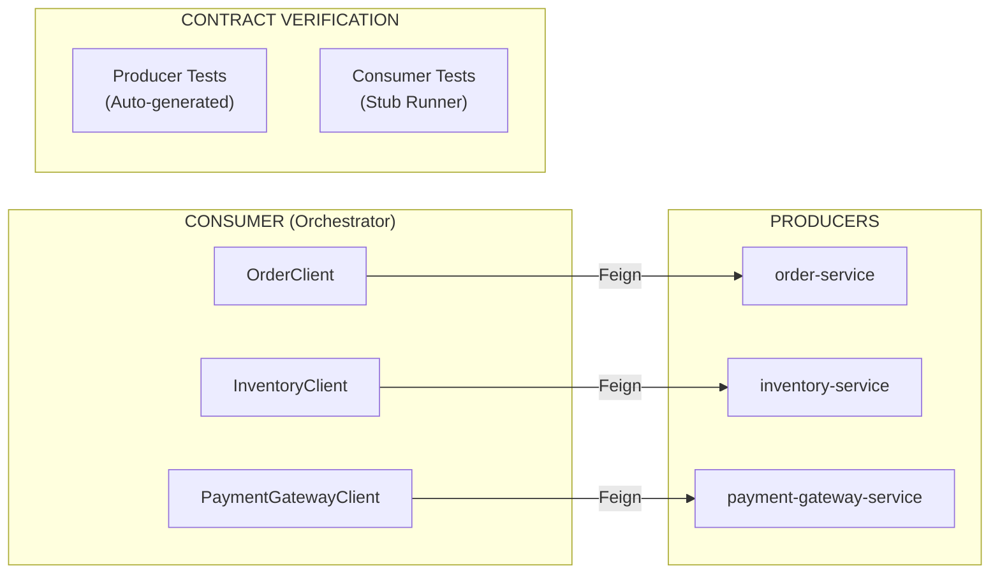

# Testing Strategy for Payment SAGA Platform

This document defines the comprehensive testing strategy for the Paylink Payment SAGA Platform, emphasizing DTO validation, service layer isolation, controller tests, and integration tests.

## Table of Contents

- [Overview](#overview)
- [Quality Gates (Quality.md Compliance)](#quality-gates-qualitymd-compliance)
- [Test Architecture](#test-architecture)
- [Test Categories](#test-categories)
- [DTO Validation Testing](#dto-validation-testing)
- [Service Layer Testing](#service-layer-testing)
- [Controller Testing](#controller-testing)
- [Integration Testing](#integration-testing)
- [Contract Testing](#contract-testing)
- [Test Utilities](#test-utilities)
- [Test Execution](#test-execution)
- [CI/CD Integration](#cicd-integration)

---

## Overview

### Testing Philosophy

As a bank-critical payment platform, Paylink requires comprehensive testing at every layer:



### Test Stack

| Framework | Purpose |
|-----------|---------|
| **JUnit 5** | Test framework with parameterized tests |
| **Mockito** | Mocking for unit test isolation |
| **AssertJ** | Fluent assertions |
| **TestContainers** | PostgreSQL, Kafka, Redis containers |
| **Spring Boot Test** | Integration testing |
| **Temporal Testing** | Workflow unit testing |
| **MockMvc** | Controller slice testing |
| **Spring Cloud Contract** | Consumer-driven contract testing |

---

## Quality Gates (Quality.md Compliance)

This section aligns with the [Quality.md](Quality.md) engineering framework. All PRs must pass these mandatory gates.

### Gate Summary

| Gate | Requirement | Enforcement |
|------|-------------|-------------|
| **JaCoCo Line Coverage** | ≥ 75% | Pre-push + CI |
| **JaCoCo Branch Coverage** | ≥ 65% | Pre-push + CI |
| **PIT Mutation Score (Overall)** | ≥ 70% | CI |
| **PIT Mutation Score (service/domain)** | ≥ 80% | CI |
| **Constraint Coverage** | 100% | Pre-push + CI |
| **Controller @Valid Coverage** | 100% | Pre-push + CI |

### 1. JaCoCo Configuration (Maven)

```xml
<!-- pom.xml -->
<plugin>
    <groupId>org.jacoco</groupId>
    <artifactId>jacoco-maven-plugin</artifactId>
    <version>0.8.12</version>
    <executions>
        <execution>
            <id>prepare-agent</id>
            <goals><goal>prepare-agent</goal></goals>
        </execution>
        <execution>
            <id>report</id>
            <phase>test</phase>
            <goals><goal>report</goal></goals>
        </execution>
        <execution>
            <id>check</id>
            <goals><goal>check</goal></goals>
            <configuration>
                <rules>
                    <rule>
                        <element>BUNDLE</element>
                        <limits>
                            <limit>
                                <counter>LINE</counter>
                                <value>COVEREDRATIO</value>
                                <minimum>0.75</minimum>
                            </limit>
                            <limit>
                                <counter>BRANCH</counter>
                                <value>COVEREDRATIO</value>
                                <minimum>0.65</minimum>
                            </limit>
                        </limits>
                    </rule>
                </rules>
                <excludes>
                    <exclude>**/*Dto.*</exclude>
                    <exclude>**/*Config.*</exclude>
                    <exclude>**/*Application.*</exclude>
                </excludes>
            </configuration>
        </execution>
    </executions>
</plugin>
```

### 2. PIT Mutation Testing (Maven)

```xml
<!-- pom.xml -->
<plugin>
    <groupId>org.pitest</groupId>
    <artifactId>pitest-maven</artifactId>
    <version>1.15.0</version>
    <dependencies>
        <dependency>
            <groupId>org.pitest</groupId>
            <artifactId>pitest-junit5-plugin</artifactId>
            <version>1.2.1</version>
        </dependency>
    </dependencies>
    <configuration>
        <targetClasses>
            <param>com.payment.*</param>
        </targetClasses>
        <targetTests>
            <param>com.payment.*</param>
        </targetTests>
        <mutators>
            <mutator>STRONGER</mutator>
        </mutators>
        <excludedClasses>
            <param>**.*Dto</param>
            <param>**.*Config*</param>
            <param>**.*Application*</param>
        </excludedClasses>
        <excludedTestClasses>
            <param>**.*IT*</param>
            <param>**.*IntegrationTest*</param>
        </excludedTestClasses>
        <threads>4</threads>
        <outputFormats>
            <outputFormat>HTML</outputFormat>
            <outputFormat>XML</outputFormat>
        </outputFormats>
        <timestampedReports>false</timestampedReports>
        <mutationThreshold>70</mutationThreshold>
    </configuration>
</plugin>
```

**Run mutation testing:**
```bash
mvn org.pitest:pitest-maven:mutationCoverage
```

### 3. Constraint Coverage Gate

Automated scanner ensures 100% negative test coverage for all Jakarta Bean Validation constraints.

**Naming Convention (mandatory):**
```
invalid_<fieldName>_<ConstraintName>_fails
```

**Example:**
```java
@Test
void invalid_orderId_NotBlank_fails() {
    var dto = TestDataBuilder.validOrderRequest().orderId("").build();
    var violations = validator.validate(dto);
    assertThat(violations)
        .extracting(v -> v.getPropertyPath().toString())
        .contains("orderId");
}
```

**Automated Scanner: `ConstraintCoverageTest.java`**

```java
package com.payment.saga.validation;

import jakarta.validation.Constraint;
import org.junit.jupiter.api.Test;
import org.reflections.Reflections;

import java.lang.annotation.Annotation;
import java.lang.reflect.Field;
import java.util.*;
import java.util.stream.Collectors;

import static org.assertj.core.api.Assertions.assertThat;

public class ConstraintCoverageTest {

    private static final String[] DTO_PACKAGES = {
        "com.payment.saga.api.dto",
        "com.payment.order.api.dto",
        "com.payment.inventory.api.dto",
        "com.payment.gateway.api.dto"
    };

    @Test
    void all_constraints_have_negative_tests() {
        Set<String> required = new HashSet<>();

        for (String pkg : DTO_PACKAGES) {
            Reflections reflections = new Reflections(pkg);
            Set<Class<?>> dtoClasses = reflections.getSubTypesOf(Object.class).stream()
                .filter(c -> c.getSimpleName().endsWith("Request")
                          || c.getSimpleName().endsWith("Response")
                          || c.getSimpleName().endsWith("Details"))
                .collect(Collectors.toSet());

            for (Class<?> dto : dtoClasses) {
                for (Field f : dto.getDeclaredFields()) {
                    for (Annotation a : f.getAnnotations()) {
                        if (a.annotationType().isAnnotationPresent(Constraint.class)) {
                            required.add(testName(dto, f, a));
                        }
                    }
                }
            }
        }

        Set<String> actual = allTestMethodNames();
        Set<String> missing = required.stream()
            .filter(r -> !actual.contains(r))
            .collect(Collectors.toSet());

        assertThat(missing)
            .as("Missing negative tests for constraints: " + missing)
            .isEmpty();
    }

    private Set<String> allTestMethodNames() {
        Reflections reflections = new Reflections("com.payment");
        return reflections.getMethodsAnnotatedWith(Test.class).stream()
            .map(m -> m.getDeclaringClass().getSimpleName() + "#" + m.getName())
            .collect(Collectors.toSet());
    }

    private String testName(Class<?> dto, Field f, Annotation a) {
        return dto.getSimpleName() + "#invalid_" + f.getName()
             + "_" + a.annotationType().getSimpleName() + "_fails";
    }
}
```

### 4. Controller Validation Coverage Gate

Every controller endpoint with `@Valid` must have a 400 error test.

**Naming Convention (mandatory):**
```
<ControllerName>ValidationTest#invalidPayload_returns400
```

**Automated Scanner: `ControllerValidationCoverageTest.java`**

```java
package com.payment.saga.validation;

import jakarta.validation.Valid;
import org.junit.jupiter.api.Test;
import org.reflections.Reflections;
import org.springframework.web.bind.annotation.RestController;

import java.lang.reflect.Method;
import java.lang.reflect.Parameter;
import java.util.Set;
import java.util.stream.Collectors;

import static org.assertj.core.api.Assertions.assertThat;

public class ControllerValidationCoverageTest {

    @Test
    void all_validated_controller_methods_have_400_tests() {
        Reflections reflections = new Reflections("com.payment");
        Set<Class<?>> controllers = reflections.getTypesAnnotatedWith(RestController.class);

        Set<String> requiredTests = controllers.stream()
            .flatMap(c -> Set.of(c.getDeclaredMethods()).stream()
                .filter(this::hasValidParameter)
                .map(m -> c.getSimpleName() + "ValidationTest#invalidPayload_returns400"))
            .collect(Collectors.toSet());

        Set<String> actualTests = reflections.getMethodsAnnotatedWith(Test.class).stream()
            .map(m -> m.getDeclaringClass().getSimpleName() + "#" + m.getName())
            .collect(Collectors.toSet());

        Set<String> missing = requiredTests.stream()
            .filter(r -> !actualTests.contains(r))
            .collect(Collectors.toSet());

        assertThat(missing)
            .as("Missing controller 400 validation tests: " + missing)
            .isEmpty();
    }

    private boolean hasValidParameter(Method m) {
        for (Parameter p : m.getParameters()) {
            if (p.isAnnotationPresent(Valid.class)) return true;
        }
        return false;
    }
}
```

### Quality Gate Verification Commands

```bash
# Run all quality gates
mvn clean test jacoco:check

# Run mutation testing
mvn org.pitest:pitest-maven:mutationCoverage

# Check constraint coverage
mvn test -Dtest=ConstraintCoverageTest

# Check controller validation coverage
mvn test -Dtest=ControllerValidationCoverageTest

# Full quality verification
mvn clean verify org.pitest:pitest-maven:mutationCoverage
```

---

## Test Architecture

### Package Structure

```
src/test/java/
├── com/payment/saga/
│   ├── validation/           # DTO validation unit tests
│   │   ├── OrderRequestValidationTest.java
│   │   ├── OrderItemValidationTest.java
│   │   └── PaymentDetailsValidationTest.java
│   ├── api/                  # Controller slice tests
│   │   └── PaymentControllerTest.java
│   ├── service/impl/         # Service unit tests
│   │   ├── PaymentRequestServiceImplTest.java
│   │   └── CompensationServiceImplTest.java
│   ├── workflow/             # Temporal workflow tests
│   │   └── PaymentSagaWorkflowTest.java
│   ├── integration/          # Integration tests
│   │   ├── ValidationIntegrationTest.java
│   │   └── PaymentSagaEndToEndTest.java
│   ├── config/               # Test configurations
│   │   ├── TestContainersConfig.java
│   │   └── WebMvcTestConfig.java
│   └── testutil/             # Shared test utilities
│       ├── TestDataBuilder.java
│       ├── TemporalTestUtil.java
│       └── WorkflowAssertions.java
```

### Test Naming Conventions

```java
// Pattern: methodName_scenario_expectedResult
@Test
void processPayment_validRequest_returnsAccepted() { }

@Test
void validateOrder_missingOrderId_returns400WithFieldError() { }

@Test
void debitAccount_insufficientBalance_throwsInsufficientFundsException() { }
```

---

## Test Categories

### Category Tags

```java
@Tag("unit")        // Fast, isolated unit tests
@Tag("integration") // Tests requiring containers
@Tag("e2e")         // End-to-end workflow tests
@Tag("validation")  // DTO validation tests
@Tag("controller")  // Controller slice tests
@Tag("contract")    // Consumer-driven contract tests
```

### Execution Matrix

| Category | Run Frequency | Duration | Dependencies |
|----------|---------------|----------|--------------|
| Unit | Every commit | < 30s | None |
| Validation | Every commit | < 10s | None |
| Controller | Every commit | < 1min | None |
| Contract | Every commit | < 2min | Producer stubs |
| Integration | PR merge | 5-10min | TestContainers |
| E2E | Nightly | 15-20min | Full infrastructure |

---

## DTO Validation Testing

### Validation Annotations Coverage

All DTOs use Jakarta Bean Validation annotations that must be tested:



### DTO Test Matrix

| DTO | Field | Annotation | Test Cases |
|-----|-------|------------|------------|
| **OrderRequest** | orderId | @NotBlank | null, empty, whitespace |
| | customerId | @NotBlank | null, empty, whitespace |
| | amount | @NotNull, @Positive | null, 0, -1, -0.01 |
| | currency | @NotBlank, @Size(3,3) | null, empty, "US", "USDD" |
| | items | @NotEmpty, @Valid | null, [], invalid items |
| | paymentDetails | @NotNull, @Valid | null, invalid nested |
| **OrderItem** | sku | @NotBlank | null, empty |
| | price | @NotNull, @PositiveOrZero | null, -1 |
| | quantity | @Positive | 0, -1 |
| **PaymentDetails** | paymentMethod | @NotNull | null |
| | amount | @NotNull, @Positive | null, 0, -1 |
| | currency | @NotBlank, @Size(3,3) | null, "X", "XXXX" |

### Validation Test Pattern

```java
@ExtendWith(MockitoExtension.class)
@Tag("unit")
@Tag("validation")
@DisplayName("OrderRequest DTO Validation")
class OrderRequestValidationTest {

    private static Validator validator;

    @BeforeAll
    static void setUp() {
        ValidatorFactory factory = Validation.buildDefaultValidatorFactory();
        validator = factory.getValidator();
    }

    @Nested
    @DisplayName("orderId validation")
    class OrderIdValidation {

        @ParameterizedTest
        @NullAndEmptySource
        @ValueSource(strings = {"", "   ", "\t", "\n"})
        @DisplayName("must not be blank")
        void mustNotBeBlank(String orderId) {
            OrderRequest request = TestDataBuilder.validOrderRequest()
                .orderId(orderId)
                .build();

            Set<ConstraintViolation<OrderRequest>> violations = validator.validate(request);

            assertThat(violations)
                .extracting(v -> v.getPropertyPath().toString())
                .contains("orderId");
        }

        @Test
        @DisplayName("valid orderId passes validation")
        void validOrderIdPasses() {
            OrderRequest request = TestDataBuilder.validOrderRequest()
                .orderId("ORD-12345")
                .build();

            Set<ConstraintViolation<OrderRequest>> violations = validator.validate(request);

            assertThat(violations)
                .filteredOn(v -> v.getPropertyPath().toString().equals("orderId"))
                .isEmpty();
        }
    }

    @Nested
    @DisplayName("amount validation")
    class AmountValidation {

        @ParameterizedTest
        @ValueSource(doubles = {0, -1, -100, -0.01})
        @DisplayName("must be positive")
        void mustBePositive(double amount) {
            OrderRequest request = TestDataBuilder.validOrderRequest()
                .amount(BigDecimal.valueOf(amount))
                .build();

            Set<ConstraintViolation<OrderRequest>> violations = validator.validate(request);

            assertThat(violations)
                .extracting(v -> v.getPropertyPath().toString())
                .contains("amount");
        }

        @Test
        @DisplayName("must not be null")
        void mustNotBeNull() {
            OrderRequest request = TestDataBuilder.validOrderRequest()
                .amount(null)
                .build();

            Set<ConstraintViolation<OrderRequest>> violations = validator.validate(request);

            assertThat(violations)
                .extracting(v -> v.getPropertyPath().toString())
                .contains("amount");
        }
    }
}
```

### Nested Object Validation

```java
@Nested
@DisplayName("items validation (nested @Valid)")
class ItemsValidation {

    @Test
    @DisplayName("invalid nested item triggers validation error")
    void invalidNestedItemTriggersError() {
        OrderRequest request = TestDataBuilder.validOrderRequest()
            .items(List.of(
                OrderItem.builder()
                    .sku(null)           // @NotBlank violation
                    .price(BigDecimal.valueOf(-10))  // @PositiveOrZero violation
                    .quantity(0)         // @Positive violation
                    .build()
            ))
            .build();

        Set<ConstraintViolation<OrderRequest>> violations = validator.validate(request);

        assertThat(violations)
            .extracting(v -> v.getPropertyPath().toString())
            .containsExactlyInAnyOrder(
                "items[0].sku",
                "items[0].price",
                "items[0].quantity"
            );
    }
}
```

---

## Service Layer Testing

### Service Test Pattern

```java
@ExtendWith(MockitoExtension.class)
@Tag("unit")
@DisplayName("PaymentRequestService Tests")
class PaymentRequestServiceImplTest {

    @Mock
    private PaymentRequestRepository repository;

    @Mock
    private OutboxPublisher outboxPublisher;

    @InjectMocks
    private PaymentRequestServiceImpl service;

    @Captor
    private ArgumentCaptor<PaymentRequest> requestCaptor;

    @Nested
    @DisplayName("createPaymentRequest")
    class CreatePaymentRequest {

        @Test
        @DisplayName("saves request with PENDING status")
        void savesRequestWithPendingStatus() {
            // Given
            OrderRequest orderRequest = TestDataBuilder.validOrderRequest().build();
            when(repository.save(any())).thenAnswer(i -> i.getArgument(0));

            // When
            PaymentRequest result = service.createPaymentRequest(orderRequest);

            // Then
            verify(repository).save(requestCaptor.capture());
            assertThat(requestCaptor.getValue().getStatus()).isEqualTo(PaymentStatus.PENDING);
        }

        @Test
        @DisplayName("publishes event to outbox")
        void publishesEventToOutbox() {
            // Given
            OrderRequest orderRequest = TestDataBuilder.validOrderRequest().build();
            when(repository.save(any())).thenAnswer(i -> i.getArgument(0));

            // When
            service.createPaymentRequest(orderRequest);

            // Then
            verify(outboxPublisher).publish(any(PaymentCreatedEvent.class));
        }
    }

    @Nested
    @DisplayName("Exception Handling")
    class ExceptionHandling {

        @Test
        @DisplayName("wraps database exceptions")
        void wrapsDatabaseExceptions() {
            // Given
            when(repository.findById(anyString()))
                .thenThrow(new DataAccessException("Connection failed") {});

            // When/Then
            assertThatThrownBy(() -> service.getPaymentRequest("order-1"))
                .isInstanceOf(PaymentSystemException.class)
                .hasMessageContaining("Database error");
        }
    }
}
```

---

## Controller Testing

### WebMvcTest Configuration

To resolve Spring Cloud Kubernetes conflicts with @WebMvcTest:

```java
@TestConfiguration
@EnableAutoConfiguration(exclude = {
    DataSourceAutoConfiguration.class,
    HibernateJpaAutoConfiguration.class,
    FlywayAutoConfiguration.class,
    RedisAutoConfiguration.class,
    KafkaAutoConfiguration.class
})
public class WebMvcTestConfig {
    // Exclusions only - no additional beans
}
```

### Controller Test Pattern

```java
@WebMvcTest(PaymentController.class)
@Import({WebMvcTestConfig.class, GlobalExceptionHandler.class})
@ActiveProfiles("webmvctest")
@Tag("controller")
@DisplayName("Payment Controller Tests")
class PaymentControllerTest {

    @Autowired
    private MockMvc mockMvc;

    @Autowired
    private ObjectMapper objectMapper;

    @MockBean
    private WorkflowClient workflowClient;

    @MockBean
    private PaymentRequestService paymentRequestService;

    @MockBean
    private PaymentRouter paymentRouter;

    @Nested
    @DisplayName("POST /api/v1/payments")
    class ProcessPayment {

        @Test
        @DisplayName("valid request returns 202 Accepted")
        void validRequestReturns202() throws Exception {
            // Given
            OrderRequest request = TestDataBuilder.validOrderRequest().build();
            PaymentResult expectedResult = PaymentResult.accepted("workflow-123");

            when(paymentRouter.route(any())).thenReturn(mockRoutingContext());
            when(workflowClient.newWorkflowStub(any(), any())).thenReturn(mockWorkflow());

            // When/Then
            mockMvc.perform(post("/api/v1/payments")
                    .contentType(MediaType.APPLICATION_JSON)
                    .content(objectMapper.writeValueAsString(request)))
                .andExpect(status().isAccepted())
                .andExpect(jsonPath("$.workflowId").exists());
        }

        @Test
        @DisplayName("missing orderId returns 400 with field error")
        void missingOrderIdReturns400() throws Exception {
            // Given
            OrderRequest request = TestDataBuilder.validOrderRequest()
                .orderId(null)
                .build();

            // When/Then
            mockMvc.perform(post("/api/v1/payments")
                    .contentType(MediaType.APPLICATION_JSON)
                    .content(objectMapper.writeValueAsString(request)))
                .andExpect(status().isBadRequest())
                .andExpect(jsonPath("$.errorCode").value("VAL-1001"))
                .andExpect(jsonPath("$.fieldErrors[0].field").value("orderId"));
        }

        @Test
        @DisplayName("negative amount returns 400 with field error")
        void negativeAmountReturns400() throws Exception {
            // Given
            OrderRequest request = TestDataBuilder.validOrderRequest()
                .amount(BigDecimal.valueOf(-100))
                .build();

            // When/Then
            mockMvc.perform(post("/api/v1/payments")
                    .contentType(MediaType.APPLICATION_JSON)
                    .content(objectMapper.writeValueAsString(request)))
                .andExpect(status().isBadRequest())
                .andExpect(jsonPath("$.fieldErrors[?(@.field=='amount')]").exists());
        }

        @Test
        @DisplayName("nested validation errors return multiple field errors")
        void nestedValidationErrorsReturnMultipleFieldErrors() throws Exception {
            // Given
            OrderRequest request = TestDataBuilder.validOrderRequest()
                .items(List.of(OrderItem.builder()
                    .sku(null)
                    .price(BigDecimal.valueOf(-10))
                    .quantity(0)
                    .build()))
                .build();

            // When/Then
            mockMvc.perform(post("/api/v1/payments")
                    .contentType(MediaType.APPLICATION_JSON)
                    .content(objectMapper.writeValueAsString(request)))
                .andExpect(status().isBadRequest())
                .andExpect(jsonPath("$.fieldErrors.length()").value(3));
        }
    }
}
```

---

## Integration Testing

### TestContainers Setup

```java
@TestConfiguration
public class TestContainersConfig {

    @Container
    @ServiceConnection
    static PostgreSQLContainer<?> postgres = new PostgreSQLContainer<>("postgres:16-alpine")
        .withDatabaseName("test_db")
        .withUsername("test")
        .withPassword("test")
        .withReuse(true);

    @Container
    static KafkaContainer kafka = new KafkaContainer(
        DockerImageName.parse("confluentinc/cp-kafka:7.5.0"))
        .withReuse(true);

    @Container
    static GenericContainer<?> redis = new GenericContainer<>("redis:7-alpine")
        .withExposedPorts(6379)
        .withReuse(true);

    @DynamicPropertySource
    static void configureProperties(DynamicPropertyRegistry registry) {
        registry.add("spring.kafka.bootstrap-servers", kafka::getBootstrapServers);
        registry.add("spring.data.redis.host", redis::getHost);
        registry.add("spring.data.redis.port", () -> redis.getMappedPort(6379));
    }
}
```

### Integration Test Pattern

```java
@SpringBootTest(webEnvironment = SpringBootTest.WebEnvironment.RANDOM_PORT)
@AutoConfigureMockMvc
@Import(TestContainersConfig.class)
@ActiveProfiles("test")
@Tag("integration")
@DisplayName("Validation Integration Tests")
class ValidationIntegrationTest {

    @Autowired
    private MockMvc mockMvc;

    @Autowired
    private ObjectMapper objectMapper;

    @MockBean
    private WorkflowClient workflowClient;

    @Test
    @DisplayName("Full validation error response structure")
    void fullValidationErrorResponseStructure() throws Exception {
        // Given - completely invalid request
        String invalidJson = """
            {
                "orderId": null,
                "amount": -100,
                "currency": "X",
                "items": [],
                "paymentDetails": null
            }
            """;

        // When/Then
        mockMvc.perform(post("/api/v1/payments")
                .contentType(MediaType.APPLICATION_JSON)
                .content(invalidJson))
            .andExpect(status().isBadRequest())
            .andExpect(jsonPath("$.errorCode").value("VAL-1001"))
            .andExpect(jsonPath("$.message").exists())
            .andExpect(jsonPath("$.category").value("VALIDATION"))
            .andExpect(jsonPath("$.timestamp").exists())
            .andExpect(jsonPath("$.path").value("/api/v1/payments"))
            .andExpect(jsonPath("$.fieldErrors").isArray())
            .andExpect(jsonPath("$.fieldErrors.length()").value(greaterThan(0)));
    }
}
```

---

## Contract Testing

### Overview

Spring Cloud Contract enables consumer-driven contract testing between the orchestrator (consumer) and microservices (producers). This ensures API compatibility across service boundaries.



### Contract Testing Architecture

| Component | Role | Tool |
|-----------|------|------|
| order-service | Producer | spring-cloud-contract-verifier |
| inventory-service | Producer | spring-cloud-contract-verifier |
| payment-gateway-service | Producer | spring-cloud-contract-verifier |
| payment-saga-orchestrator | Consumer | spring-cloud-contract-stub-runner |

### Dependencies

**Parent POM:**
```xml
<properties>
    <spring-cloud-contract.version>4.1.0</spring-cloud-contract.version>
</properties>

<dependencyManagement>
    <dependencies>
        <dependency>
            <groupId>org.springframework.cloud</groupId>
            <artifactId>spring-cloud-contract-dependencies</artifactId>
            <version>${spring-cloud-contract.version}</version>
            <type>pom</type>
            <scope>import</scope>
        </dependency>
    </dependencies>
</dependencyManagement>
```

**Producer Services:**
```xml
<dependency>
    <groupId>org.springframework.cloud</groupId>
    <artifactId>spring-cloud-starter-contract-verifier</artifactId>
    <scope>test</scope>
</dependency>

<build>
    <plugins>
        <plugin>
            <groupId>org.springframework.cloud</groupId>
            <artifactId>spring-cloud-contract-maven-plugin</artifactId>
            <version>${spring-cloud-contract.version}</version>
            <extensions>true</extensions>
            <configuration>
                <testFramework>JUNIT5</testFramework>
                <baseClassForTests>com.payment.order.contract.ContractTestBase</baseClassForTests>
            </configuration>
        </plugin>
    </plugins>
</build>
```

**Consumer (Orchestrator):**
```xml
<dependency>
    <groupId>org.springframework.cloud</groupId>
    <artifactId>spring-cloud-starter-contract-stub-runner</artifactId>
    <scope>test</scope>
</dependency>
```

### Contract Definition (Groovy DSL)

Contracts are defined in `src/test/resources/contracts/` in each producer service.

**Example: order-service/src/test/resources/contracts/order/validateOrder.groovy**
```groovy
package contracts.order

import org.springframework.cloud.contract.spec.Contract

Contract.make {
    name "validate_order_success"
    description "Should return validation result for valid order"

    request {
        method POST()
        url "/api/orders/validate"
        headers {
            contentType applicationJson()
        }
        body([
            orderId: $(consumer(regex('[A-Z]{3}-[0-9]{6}')), producer('ORD-123456')),
            customerId: $(consumer(regex('[A-Z]{4}-[0-9]{6}')), producer('CUST-000001')),
            amount: $(consumer(regex('[0-9]+\\.[0-9]{2}')), producer('100.00')),
            currency: $(consumer(regex('[A-Z]{3}')), producer('USD')),
            items: [[
                sku: 'PROD-001',
                name: 'Test Product',
                quantity: 2,
                price: 50.00
            ]]
        ])
    }

    response {
        status OK()
        headers {
            contentType applicationJson()
        }
        body([
            orderId: fromRequest().body('$.orderId'),
            valid: true,
            validationErrors: []
        ])
    }
}
```

**Example: inventory-service/src/test/resources/contracts/inventory/reserveInventory.groovy**
```groovy
Contract.make {
    name "reserve_inventory_success"

    request {
        method POST()
        url "/api/inventory/reserve"
        headers { contentType applicationJson() }
        body([
            orderId: $(consumer(regex('[A-Z]{3}-[0-9]+')), producer('ORD-123')),
            items: [[
                sku: 'PROD-001',
                quantity: 5
            ]]
        ])
    }

    response {
        status OK()
        body([
            reservationId: $(producer(regex('[a-f0-9-]{36}'))),
            orderId: fromRequest().body('$.orderId'),
            status: 'RESERVED',
            reservedItems: [[
                sku: 'PROD-001',
                reservedQuantity: 5
            ]]
        ])
    }
}
```

**Example: payment-gateway-service/src/test/resources/contracts/payment/authorizePayment.groovy**
```groovy
Contract.make {
    name "authorize_payment_success"

    request {
        method POST()
        url "/api/payments/authorize"
        headers { contentType applicationJson() }
        body([
            orderId: $(consumer(regex('[A-Z]{3}-[0-9]+')), producer('ORD-123')),
            amount: $(consumer(regex('[0-9]+\\.[0-9]{2}')), producer('100.00')),
            currency: 'USD',
            paymentMethod: 'CREDIT_CARD'
        ])
    }

    response {
        status OK()
        body([
            authorizationId: $(producer(regex('AUTH-[A-Z0-9]{8}'))),
            orderId: fromRequest().body('$.orderId'),
            status: 'AUTHORIZED',
            authorizedAmount: fromRequest().body('$.amount')
        ])
    }
}
```

### Producer Base Test Class

Each producer service needs a base test class for contract verification:

```java
package com.payment.order.contract;

import com.payment.order.controller.OrderController;
import com.payment.order.service.OrderService;
import io.restassured.module.mockmvc.RestAssuredMockMvc;
import org.junit.jupiter.api.BeforeEach;
import org.springframework.beans.factory.annotation.Autowired;
import org.springframework.boot.test.context.SpringBootTest;
import org.springframework.boot.test.mock.mockito.MockBean;
import org.springframework.test.context.ActiveProfiles;

import static org.mockito.ArgumentMatchers.any;
import static org.mockito.Mockito.when;

@SpringBootTest(webEnvironment = SpringBootTest.WebEnvironment.MOCK)
@ActiveProfiles("contract-test")
public abstract class ContractTestBase {

    @Autowired
    private OrderController orderController;

    @MockBean
    private OrderService orderService;

    @BeforeEach
    void setup() {
        RestAssuredMockMvc.standaloneSetup(orderController);

        // Setup mock responses for contract scenarios
        when(orderService.validateOrder(any())).thenAnswer(invocation -> {
            var request = invocation.getArgument(0);
            return createValidationResult(request);
        });
    }

    private OrderValidationResult createValidationResult(Object request) {
        // Return appropriate mock response based on request
        return OrderValidationResult.builder()
            .orderId("ORD-123456")
            .valid(true)
            .validationErrors(List.of())
            .build();
    }
}
```

### Consumer Stub Runner Test

The orchestrator verifies Feign clients against producer stubs:

```java
package com.payment.saga.contract;

import com.payment.saga.client.OrderClient;
import com.payment.saga.client.InventoryClient;
import com.payment.saga.client.PaymentGatewayClient;
import org.junit.jupiter.api.Test;
import org.springframework.beans.factory.annotation.Autowired;
import org.springframework.boot.test.context.SpringBootTest;
import org.springframework.cloud.contract.stubrunner.spring.AutoConfigureStubRunner;
import org.springframework.cloud.contract.stubrunner.spring.StubRunnerProperties;
import org.springframework.test.context.ActiveProfiles;

import static org.assertj.core.api.Assertions.assertThat;

@SpringBootTest(webEnvironment = SpringBootTest.WebEnvironment.NONE)
@AutoConfigureStubRunner(
    ids = {
        "com.payment:order-service:+:stubs:8081",
        "com.payment:inventory-service:+:stubs:8082",
        "com.payment:payment-gateway-service:+:stubs:8083"
    },
    stubsMode = StubRunnerProperties.StubsMode.LOCAL
)
@ActiveProfiles("contract-test")
@Tag("contract")
class FeignClientContractTest {

    @Autowired
    private OrderClient orderClient;

    @Autowired
    private InventoryClient inventoryClient;

    @Autowired
    private PaymentGatewayClient paymentGatewayClient;

    @Test
    void orderClient_validateOrder_matchesContract() {
        var request = createValidOrderRequest();
        var response = orderClient.validateOrder(request);

        assertThat(response.isValid()).isTrue();
        assertThat(response.getValidationErrors()).isEmpty();
    }

    @Test
    void inventoryClient_reserveInventory_matchesContract() {
        var request = createReservationRequest();
        var response = inventoryClient.reserveInventory(request);

        assertThat(response.getStatus()).isEqualTo("RESERVED");
        assertThat(response.getReservationId()).isNotBlank();
    }

    @Test
    void paymentGatewayClient_authorizePayment_matchesContract() {
        var request = createAuthorizationRequest();
        var response = paymentGatewayClient.authorizePayment(request);

        assertThat(response.getStatus()).isEqualTo("AUTHORIZED");
        assertThat(response.getAuthorizationId()).matches("AUTH-[A-Z0-9]+");
    }

    @Test
    void paymentGatewayClient_capturePayment_matchesContract() {
        var request = createCaptureRequest();
        var response = paymentGatewayClient.capturePayment(request);

        assertThat(response.getStatus()).isEqualTo("CAPTURED");
    }
}
```

### Contract Scenario Matrix

| Service | Endpoint | Success Contract | Error Contract |
|---------|----------|-----------------|----------------|
| order-service | POST /api/orders/validate | validateOrder.groovy | validateOrderInvalid.groovy |
| order-service | PUT /api/orders/{id}/status | updateOrderStatus.groovy | - |
| order-service | POST /api/orders/{id}/cancel | cancelOrder.groovy | - |
| inventory-service | POST /api/inventory/reserve | reserveInventory.groovy | reserveInventoryInsufficient.groovy |
| inventory-service | POST /api/inventory/release | releaseInventory.groovy | - |
| payment-gateway | POST /api/payments/authorize | authorizePayment.groovy | authorizePaymentDeclined.groovy |
| payment-gateway | POST /api/payments/capture | capturePayment.groovy | - |
| payment-gateway | POST /api/payments/void | voidPayment.groovy | - |
| payment-gateway | POST /api/payments/refund | refundPayment.groovy | - |

### Contract Test Profile

**application-contract-test.yml:**
```yaml
spring:
  cloud:
    discovery:
      enabled: false
  main:
    lazy-initialization: true

# For consumer tests - point Feign clients to stub ports
order-service:
  ribbon:
    listOfServers: localhost:8081
inventory-service:
  ribbon:
    listOfServers: localhost:8082
payment-gateway-service:
  ribbon:
    listOfServers: localhost:8083
```

### Running Contract Tests

```bash
# Generate stubs from producer services
mvn clean install -pl order-service,inventory-service,payment-gateway-service

# Run consumer contract tests
mvn test -pl payment-saga-orchestrator -Dtest="FeignClientContractTest"

# Run all contract tests
mvn test -Dgroups=contract

# Verify stub generation
ls order-service/target/stubs/
ls inventory-service/target/stubs/
ls payment-gateway-service/target/stubs/
```

---

## Test Utilities

### TestDataBuilder

```java
@UtilityClass
public class TestDataBuilder {

    // ========== Valid Request Builders ==========

    public static OrderRequest.OrderRequestBuilder validOrderRequest() {
        return OrderRequest.builder()
            .orderId("ORD-" + UUID.randomUUID().toString().substring(0, 8))
            .customerId("CUST-" + UUID.randomUUID().toString().substring(0, 8))
            .amount(BigDecimal.valueOf(100.00))
            .currency("USD")
            .items(List.of(validOrderItem().build()))
            .paymentDetails(validPaymentDetails().build());
    }

    public static OrderItem.OrderItemBuilder validOrderItem() {
        return OrderItem.builder()
            .sku("SKU-001")
            .name("Test Product")
            .price(BigDecimal.valueOf(100.00))
            .quantity(1);
    }

    public static PaymentDetails.PaymentDetailsBuilder validPaymentDetails() {
        return PaymentDetails.builder()
            .paymentMethod(PaymentMethod.CREDIT_CARD)
            .amount(BigDecimal.valueOf(100.00))
            .currency("USD");
    }

    // ========== Invalid Request Builders ==========

    public static OrderRequest.OrderRequestBuilder orderRequestWithoutOrderId() {
        return validOrderRequest().orderId(null);
    }

    public static OrderRequest.OrderRequestBuilder orderRequestWithNegativeAmount() {
        return validOrderRequest().amount(BigDecimal.valueOf(-100));
    }

    public static OrderRequest.OrderRequestBuilder orderRequestWithInvalidCurrency() {
        return validOrderRequest().currency("INVALID");
    }

    public static OrderRequest.OrderRequestBuilder orderRequestWithEmptyItems() {
        return validOrderRequest().items(List.of());
    }

    public static OrderRequest.OrderRequestBuilder orderRequestWithInvalidNestedItems() {
        return validOrderRequest().items(List.of(
            OrderItem.builder()
                .sku(null)
                .price(BigDecimal.valueOf(-10))
                .quantity(0)
                .build()
        ));
    }

    // ========== Boundary Value Builders ==========

    public static OrderRequest.OrderRequestBuilder orderRequestWithMinAmount() {
        return validOrderRequest().amount(BigDecimal.valueOf(0.01));
    }

    public static OrderRequest.OrderRequestBuilder orderRequestWithMaxAmount() {
        return validOrderRequest().amount(BigDecimal.valueOf(999999.99));
    }

    public static OrderItem.OrderItemBuilder orderItemWithMaxQuantity() {
        return validOrderItem().quantity(Integer.MAX_VALUE);
    }
}
```

---

## Test Execution

### Maven Commands

```bash
# Run all tests
mvn test

# Run only unit tests
mvn test -Dgroups=unit

# Run only validation tests
mvn test -Dgroups=validation

# Run only controller tests
mvn test -Dgroups=controller

# Run only contract tests
mvn test -Dgroups=contract

# Generate producer stubs and run consumer contract tests
mvn clean install -pl order-service,inventory-service,payment-gateway-service
mvn test -pl payment-saga-orchestrator -Dtest="FeignClientContractTest"

# Run only integration tests
mvn test -Dgroups=integration

# Run specific test class
mvn test -Dtest=OrderRequestValidationTest

# Run with coverage report
mvn test jacoco:report
```

### Test Profiles

```yaml
# application-test.yml
spring:
  cloud:
    kubernetes:
      enabled: false
    discovery:
      enabled: false
  jpa:
    hibernate:
      ddl-auto: create-drop

# application-webmvctest.yml
spring:
  autoconfigure:
    exclude:
      - org.springframework.boot.autoconfigure.data.redis.RedisAutoConfiguration
      - org.springframework.boot.autoconfigure.kafka.KafkaAutoConfiguration
```

---

## CI/CD Integration

### GitHub Actions Pipeline

```yaml
name: Test Pipeline

on: [push, pull_request]

jobs:
  unit-tests:
    runs-on: ubuntu-latest
    steps:
      - uses: actions/checkout@v4
      - uses: actions/setup-java@v4
        with:
          java-version: '21'
          distribution: 'temurin'
      - name: Run Unit Tests
        run: mvn test -Dgroups=unit,validation,controller

  contract-tests:
    needs: unit-tests
    runs-on: ubuntu-latest
    steps:
      - uses: actions/checkout@v4
      - uses: actions/setup-java@v4
        with:
          java-version: '21'
          distribution: 'temurin'
      - name: Generate Producer Stubs
        run: mvn clean install -pl order-service,inventory-service,payment-gateway-service -DskipTests=false
      - name: Run Consumer Contract Tests
        run: mvn test -pl payment-saga-orchestrator -Dgroups=contract

  integration-tests:
    needs: contract-tests
    runs-on: ubuntu-latest
    steps:
      - uses: actions/checkout@v4
      - uses: actions/setup-java@v4
        with:
          java-version: '21'
          distribution: 'temurin'
      - name: Run Integration Tests
        run: mvn test -Dgroups=integration

  e2e-tests:
    needs: integration-tests
    runs-on: ubuntu-latest
    if: github.ref == 'refs/heads/main'
    steps:
      - uses: actions/checkout@v4
      - uses: actions/setup-java@v4
        with:
          java-version: '21'
          distribution: 'temurin'
      - name: Start Infrastructure
        run: docker-compose up -d
      - name: Run E2E Tests
        run: mvn test -Dgroups=e2e
```

### Coverage Thresholds

```xml
<!-- pom.xml JaCoCo configuration -->
<plugin>
    <groupId>org.jacoco</groupId>
    <artifactId>jacoco-maven-plugin</artifactId>
    <configuration>
        <rules>
            <rule>
                <element>BUNDLE</element>
                <limits>
                    <limit>
                        <counter>LINE</counter>
                        <value>COVEREDRATIO</value>
                        <minimum>0.80</minimum>
                    </limit>
                </limits>
            </rule>
        </rules>
    </configuration>
</plugin>
```

---

## Related Documentation

- [CLAUDE.md](../CLAUDE.md) - Development guide with test commands
- [TEMPORAL_SCALING_ARCHITECTURE.md](TEMPORAL_SCALING_ARCHITECTURE.md) - Scaling architecture
- [T24_CORE_BANKING_INTEGRATION.md](T24_CORE_BANKING_INTEGRATION.md) - T24 integration patterns
