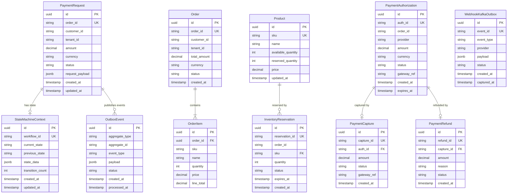

# II.3 Data Design

[< Back to Index](../DAB_Payment_SAGA_Platform.md) | [← Previous: II.2 High-level Architecture](03-high-level-architecture.md)

---

## Entity and Domain Modeling

## Schema Detailed Design

| Database | Port | Tables | Migration Range | Key Features |
|---|---|---|---|---|
| **saga_db** | 5436 | payment_requests, state_machine_context, outbox_events, event_store | V1–V14 | RLS policies, event sourcing, JSONB payloads |
| **order_db** | 5432 | orders, order_items | V1–V4 | Composite indexes on customer_id + status |
| **inventory_db** | 5434 | products, inventory_reservations | V1–V5 | Optimistic locking, reservation TTL |
| **payment_db** | 5435 | payment_authorizations, payment_captures, payment_refunds, webhook_kafka_outbox | V1–V8 | CDC publication, FOR UPDATE SKIP LOCKED |

## Table Detailed Design

### Table: `payment_requests` (saga_db)

| Column | Type | Constraints | Description |
|---|---|---|---|
| `id` | UUID | PK, DEFAULT gen_random_uuid() | Primary key |
| `order_id` | VARCHAR(50) | NOT NULL, UNIQUE | Order reference |
| `customer_id` | VARCHAR(50) | NOT NULL | Customer reference |
| `tenant_id` | VARCHAR(50) | NOT NULL | Tenant for RLS |
| `amount` | DECIMAL(19,4) | NOT NULL, CHECK > 0 | Payment amount |
| `currency` | VARCHAR(3) | NOT NULL | ISO 4217 currency |
| `status` | VARCHAR(30) | NOT NULL, DEFAULT 'PENDING' | Current status |
| `request_payload` | JSONB | NOT NULL | Full request (for audit) |
| `idempotency_key` | VARCHAR(100) | UNIQUE | Deduplication key |
| `created_at` | TIMESTAMPTZ | NOT NULL, DEFAULT NOW() | Creation timestamp |
| `updated_at` | TIMESTAMPTZ | NOT NULL, DEFAULT NOW() | Last update |

**Indexes:** `idx_payment_requests_order_id`, `idx_payment_requests_customer_id`, `idx_payment_requests_status`, `idx_payment_requests_tenant_id`

### Table: `state_machine_context` (saga_db)

| Column | Type | Constraints | Description |
|---|---|---|---|
| `id` | UUID | PK | Primary key |
| `workflow_id` | VARCHAR(100) | NOT NULL, UNIQUE | Temporal workflow ID |
| `order_id` | VARCHAR(50) | NOT NULL | Order reference |
| `current_state` | VARCHAR(40) | NOT NULL | Current PaymentState |
| `previous_state` | VARCHAR(40) | | Previous PaymentState |
| `state_data` | JSONB | | Transition context data |
| `transition_count` | INTEGER | NOT NULL, DEFAULT 0 | Number of transitions |
| `created_at` | TIMESTAMPTZ | NOT NULL | Creation timestamp |
| `updated_at` | TIMESTAMPTZ | NOT NULL | Last update |

### Table: `outbox_events` (saga_db)

| Column | Type | Constraints | Description |
|---|---|---|---|
| `id` | UUID | PK | Primary key |
| `aggregate_type` | VARCHAR(100) | NOT NULL | Entity type |
| `aggregate_id` | VARCHAR(100) | NOT NULL | Entity ID |
| `event_type` | VARCHAR(100) | NOT NULL | Domain event type |
| `payload` | JSONB | NOT NULL | Event payload |
| `status` | VARCHAR(20) | NOT NULL, DEFAULT 'PENDING' | PENDING / CAPTURED / PROCESSED |
| `created_at` | TIMESTAMPTZ | NOT NULL, DEFAULT NOW() | Creation timestamp |
| `processed_at` | TIMESTAMPTZ | | When Debezium captured |

### Table: `webhook_kafka_outbox` (payment_db)

| Column | Type | Constraints | Description |
|---|---|---|---|
| `id` | UUID | PK | Primary key |
| `event_id` | VARCHAR(100) | NOT NULL, UNIQUE | PSP event ID |
| `event_type` | VARCHAR(100) | NOT NULL | Webhook event type |
| `provider` | VARCHAR(30) | NOT NULL | PSP name |
| `order_id` | VARCHAR(50) | | Extracted order ID |
| `payload` | JSONB | NOT NULL | Full webhook body |
| `status` | VARCHAR(20) | NOT NULL, DEFAULT 'PENDING' | CDC capture status |
| `created_at` | TIMESTAMPTZ | NOT NULL, DEFAULT NOW() | Creation timestamp |
| `captured_at` | TIMESTAMPTZ | | CDC capture timestamp |

**CDC Configuration:** `FOR UPDATE SKIP LOCKED` query for concurrent outbox processing. Publication: `CREATE PUBLICATION outbox_pub FOR TABLE webhook_kafka_outbox WITH (publish = 'insert');`

### Table: `inventory_reservations` (inventory_db)

| Column | Type | Constraints | Description |
|---|---|---|---|
| `id` | UUID | PK | Primary key |
| `reservation_id` | VARCHAR(50) | NOT NULL, UNIQUE | Reservation reference |
| `order_id` | VARCHAR(50) | NOT NULL | Order reference |
| `sku` | VARCHAR(50) | NOT NULL, FK → products | Product SKU |
| `quantity` | INTEGER | NOT NULL, CHECK > 0 | Reserved quantity |
| `status` | VARCHAR(20) | NOT NULL | RESERVED / RELEASED / CONFIRMED |
| `expires_at` | TIMESTAMPTZ | NOT NULL | Auto-release time |
| `created_at` | TIMESTAMPTZ | NOT NULL, DEFAULT NOW() | Creation timestamp |

### Table: `payment_authorizations` (payment_db)

| Column | Type | Constraints | Description |
|---|---|---|---|
| `id` | UUID | PK | Primary key |
| `auth_id` | VARCHAR(100) | NOT NULL, UNIQUE | Authorization reference |
| `order_id` | VARCHAR(50) | NOT NULL | Order reference |
| `provider` | VARCHAR(30) | NOT NULL | PSP (stripe/paypal/adyen/square) |
| `amount` | DECIMAL(19,4) | NOT NULL | Authorized amount |
| `currency` | VARCHAR(3) | NOT NULL | ISO 4217 currency |
| `status` | VARCHAR(20) | NOT NULL | AUTHORIZED / CAPTURED / VOIDED |
| `gateway_ref` | VARCHAR(200) | | PSP reference ID |
| `created_at` | TIMESTAMPTZ | NOT NULL | Creation timestamp |
| `expires_at` | TIMESTAMPTZ | NOT NULL | Authorization expiry |

---

**Previous:** [← II.2 High-level Architecture](03-high-level-architecture.md) | **Next:** [II.4 Detailed Design →](05-detailed-design.md)
