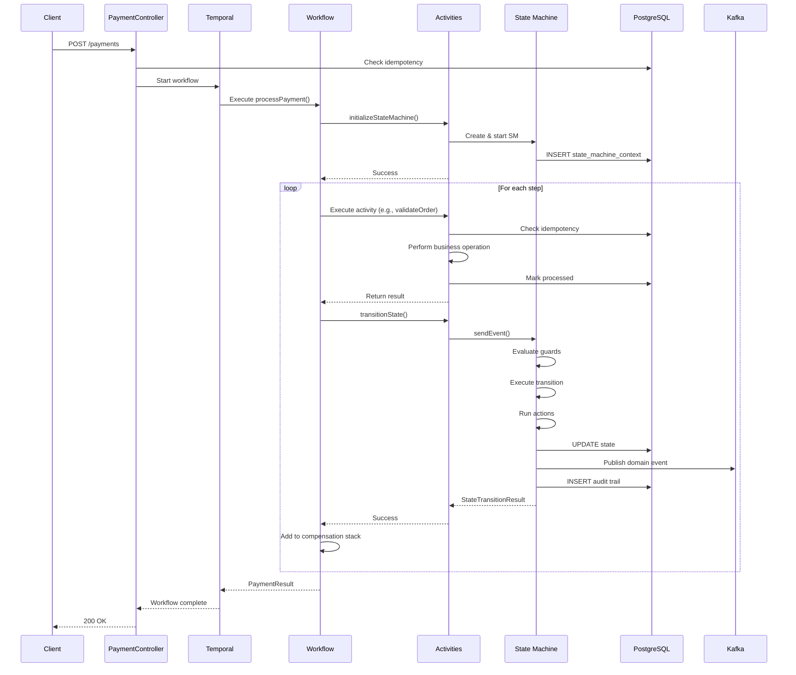

# Pattern 1: Temporal Orchestrates, Spring State Machine Models

## Complete Architecture Guide for Enterprise Payment SAGA

---

## Table of Contents

1. [Executive Summary](#executive-summary)
2. [Architecture Principles](#architecture-principles)
3. [Detailed Component Design](#detailed-component-design)
4. [Data Flow & Interactions](#data-flow--interactions)
5. [Complete Implementation](#complete-implementation)
6. [State Synchronization](#state-synchronization)
7. [Error Handling & Recovery](#error-handling--recovery)
8. [Observability & Monitoring](#observability--monitoring)
9. [Testing Strategy](#testing-strategy)
10. [Production Deployment](#production-deployment)
11. [Performance Optimization](#performance-optimization)
12. [Troubleshooting Guide](#troubleshooting-guide)

---

## Executive Summary

### What is Pattern 1?

Pattern 1 is an architectural approach where **Temporal acts as the orchestration engine** controlling the workflow lifecycle, while **Spring State Machine models the business domain state** with fine-grained transitions and business rules.

### Visual Overview

```
┌────────────────────────────────────────────────────────────────────────────┐
│                         PATTERN 1 ARCHITECTURE                             │
├────────────────────────────────────────────────────────────────────────────┤
│                                                                            │
│  Layer 1: WORKFLOW ORCHESTRATION (Temporal)                                │
│  ┌──────────────────────────────────────────────────────────────────────┐  │
│  │                                                                      │  │
│  │  WorkflowClient → Start Workflow                                     │  │
│  │         ↓                                                            │  │
│  │  PaymentSagaWorkflow (Workflow Impl)                                 │  │
│  │    │                                                                 │  │
│  │    ├─→ Step 1: Execute ValidateOrder Activity                        │  │
│  │    ├─→ Step 2: Execute ReserveInventory Activity                     │  │
│  │    ├─→ Step 3: Execute AuthorizePayment Activity                     │  │
│  │    ├─→ Step 4: Execute CapturePayment Activity                       │  │
│  │    └─→ Step 5: Execute CompleteOrder Activity                        │  │
│  │                                                                      │  │
│  │  Features: Durability, Retries, Timeouts, History, Compensation      │  │
│  │                                                                      │  │
│  └──────────────────────────────────────────────────────────────────────┘  │
│                              ↕ (executes)                                  │
│  Layer 2: ACTIVITY EXECUTION (Spring Beans)                                │
│  ┌──────────────────────────────────────────────────────────────────────┐  │
│  │                                                                      │  │
│  │  PaymentActivitiesImpl (@Component)                                  │  │
│  │    │                                                                 │  │
│  │    ├─→ validateOrder() → orderService.validate()                     │  │
│  │    │                    → stateMachineService.transition()           │  │
│  │    │                                                                 │  │
│  │    ├─→ reserveInventory() → inventoryService.reserve()               │  │
│  │    │                       → stateMachineService.transition()        │  │
│  │    │                                                                 │  │
│  │    ├─→ authorizePayment() → paymentGateway.authorize()               │  │
│  │    │                       → stateMachineService.transition()        │  │
│  │    │                                                                 │  │
│  │    └─→ ... (other activities)                                        │  │
│  │                                                                      │  │
│  └──────────────────────────────────────────────────────────────────────┘  │
│                              ↕ (calls)                                     │
│  Layer 3: DOMAIN STATE MANAGEMENT (Spring State Machine)                   │
│  ┌──────────────────────────────────────────────────────────────────────┐  │
│  │                                                                      │  │
│  │  PaymentStateMachine (State Machine Instance)                        │  │
│  │    │                                                                 │  │
│  │    ├─→ Current State: PENDING                                        │  │
│  │    ├─→ Event: ORDER_VALIDATED → Transition to VALIDATED              │  │
│  │    │   ├─ Guard: Check business rules                                │  │
│  │    │   ├─ Action: Publish domain event                               │  │
│  │    │   └─ Persist: Save new state to DB                              │  │
│  │    │                                                                 │  │
│  │    ├─→ Event: INVENTORY_RESERVED → Transition to RESERVED            │  │
│  │    │   ├─ Guard: Check inventory validity                            │  │
│  │    │   ├─ Action: Store reservation ID                               │  │
│  │    │   └─ Persist: Update state in DB                                │  │
│  │    │                                                                 │  │
│  │    └─→ ... (other transitions)                                       │  │
│  │                                                                      │  │
│  │  Features: Business Rules, State Guards, Domain Events, Queryable    │  │
│  │                                                                      │  │
│  └──────────────────────────────────────────────────────────────────────┘  │
│                              ↕ (publishes)                                 │
│  Layer 4: EVENT STREAMING (Kafka)                                          │
│  ┌──────────────────────────────────────────────────────────────────────┐  │
│  │                                                                      │  │
│  │  Domain Events: OrderValidated, InventoryReserved,                   │  │
│  │                 PaymentAuthorized, PaymentCaptured, etc.             │  │
│  │                                                                      │  │
│  │  Consumed by: Analytics, Notifications, Reporting, External Systems  │  │
│  │                                                                      │  │
│  └──────────────────────────────────────────────────────────────────────┘  │
│                              ↕ (stores)                                    │
│  Layer 5: PERSISTENCE (PostgreSQL + Redis)                                 │
│  ┌──────────────────────────────────────────────────────────────────────┐  │
│  │                                                                      │  │
│  │  PostgreSQL:                                                         │  │
│  │    • state_machine_context (current state, saga_id, context)         │  │
│  │    • event_store (domain events, audit trail)                        │  │
│  │    • saga_audit_trail (workflow actions, transitions)                │  │
│  │    • idempotency_records (deduplication)                             │  │
│  │                                                                      │  │
│  │  Redis:                                                              │  │
│  │    • Idempotency cache (fast lookups)                                │  │
│  │    • Distributed locks (coordination)                                │  │
│  │    • State machine session (optional)                                │  │
│  │                                                                      │  │
│  └──────────────────────────────────────────────────────────────────────┘  │
│                                                                            │
└────────────────────────────────────────────────────────────────────────────┘
```

### Key Benefits

| Benefit                          | Description                                                        | Impact                                          |
| -------------------------------- | ------------------------------------------------------------------ | ----------------------------------------------- |
| **Clear Separation of Concerns** | Temporal handles orchestration, State Machine handles domain logic | Better maintainability, easier testing          |
| **Dual Durability**              | Both Temporal and State Machine persist state independently        | Increased reliability, easier debugging         |
| **Rich Domain Model**            | State Machine provides queryable business state                    | Better business insights, complex rules support |
| **Built-in Observability**       | Temporal UI + State Machine events + Audit trail                   | Complete visibility into workflow execution     |
| **Independent Scaling**          | Scale Temporal workers and State Machine separately                | Optimized resource utilization                  |
| **Event-Driven Integration**     | State Machine publishes domain events automatically                | Loose coupling with downstream systems          |
| **Business Rule Enforcement**    | State guards prevent invalid transitions                           | Data integrity, compliance                      |

---

## Architecture Principles

### Principle 1: Single Responsibility

```
Temporal Workflow:
  ✅ DOES: Define step order, execute activities, handle compensation
  ❌ DOESN'T: Store business state, enforce business rules, publish domain events

Spring State Machine:
  ✅ DOES: Model business state, enforce transitions, publish domain events
  ❌ DOESN'T: Orchestrate activities, handle retries, manage workflow lifecycle

Activities:
  ✅ DOES: Execute business operations, bridge workflow and state machine
  ❌ DOESN'T: Make orchestration decisions, implement business rules
```

### Principle 2: State Ownership

```
TEMPORAL owns: Workflow Execution State
  • Which step is currently executing?
  • How many times has this activity been retried?
  • When did the workflow start?
  • What's the compensation stack?

STATE MACHINE owns: Business Domain State
  • What is the current payment status?
  • What business events have occurred?
  • What reference IDs are associated with this order?
  • Can we transition to the next state?
```

### Principle 3: Idempotency at Every Layer

```
Layer 1 (Temporal):
  • Workflow executions are deterministic
  • Activities can be retried safely

Layer 2 (Activities):
  • Activities check idempotency before operations
  • Activities store operation results with idempotency keys

Layer 3 (State Machine):
  • State transitions are idempotent
  • Events are deduplicated before processing

Layer 4 (External Services):
  • Payment gateway calls use idempotency keys
  • Inventory reservations check for existing reservations
```

### Principle 4: Event-Driven Communication

```
State Machine → Event Bus (Kafka) → Consumers

Why Events?
  ✓ Temporal workflow doesn't need to know about downstream systems
  ✓ New consumers can be added without changing workflow
  ✓ Provides natural audit trail
  ✓ Enables event sourcing and replay
```

---

## Detailed Component Design

### Component 1: Temporal Workflow

**Responsibility**: Orchestrate the SAGA by executing activities in order and handling compensation.

**Interface Design:**

```java
package com.payment.saga.workflow;

import io.temporal.workflow.*;

/**
 * Temporal Workflow Interface
 *
 * Defines the contract for payment SAGA orchestration.
 * Temporal ensures this workflow is durable and can be resumed after failures.
 */
@WorkflowInterface
public interface PaymentSagaWorkflow {

    /**
     * Main workflow method - orchestrates the entire payment flow
     *
     * @param request Payment request containing order details
     * @return PaymentResult with final outcome
     */
    @WorkflowMethod
    PaymentResult processPayment(PaymentRequest request);

    /**
     * Query method - allows external systems to check current state
     * Queries don't modify workflow state
     *
     * @return Current workflow state
     */
    @QueryMethod
    WorkflowState getWorkflowState();

    /**
     * Query method - get current business state from state machine
     *
     * @return Current business/domain state
     */
    @QueryMethod
    PaymentState getBusinessState();

    /**
     * Signal method - allows external cancellation
     * Signals can modify workflow state
     *
     * @param reason Cancellation reason
     */
    @SignalMethod
    void cancel(String reason);

    /**
     * Signal method - manual intervention for stuck workflows
     *
     * @param action Action to take
     * @param context Additional context
     */
    @SignalMethod
    void manualIntervention(ManualAction action, Map<String, Object> context);
}
```

**Implementation:**

```java
package com.payment.saga.workflow;

import io.temporal.workflow.*;
import io.temporal.activity.*;
import io.temporal.common.RetryOptions;
import org.slf4j.Logger;
import org.slf4j.LoggerFactory;

import java.time.Duration;
import java.util.*;

/**
 * Temporal Workflow Implementation
 *
 * Key Design Decisions:
 * 1. Activities are defined with retry policies appropriate for each operation
 * 2. Workflow state is minimal - only what's needed for orchestration
 * 3. Business state is delegated to Spring State Machine
 * 4. Compensation is explicit and ordered
 */
public class PaymentSagaWorkflowImpl implements PaymentSagaWorkflow {

    private static final Logger logger = Workflow.getLogger(PaymentSagaWorkflowImpl.class);

    // ========================================================================
    // WORKFLOW STATE (Temporal-managed)
    // ========================================================================

    private String workflowId;
    private WorkflowState workflowState = WorkflowState.INITIALIZED;
    private String cancellationReason;
    private boolean cancelled = false;
    private List<CompensationAction> compensationStack = new ArrayList<>();

    // ========================================================================
    // ACTIVITY STUBS (External Operations)
    // ========================================================================

    /**
     * Regular activities - for business operations that may fail
     * These activities:
     * - Can take minutes to complete
     * - Can fail and need retries
     * - Can be compensated if workflow fails
     */
    private final PaymentActivities activities;

    /**
     * Local activities - for fast, side-effect-free operations
     * These activities:
     * - Complete in milliseconds
     * - Don't need aggressive retries
     * - Used for state machine transitions
     */
    private final StateMachineActivities stateMachineActivities;

    public PaymentSagaWorkflowImpl() {

        // Configure regular activities with appropriate retry policies
        this.activities = Workflow.newActivityStub(
            PaymentActivities.class,
            ActivityOptions.newBuilder()
                .setStartToCloseTimeout(Duration.ofMinutes(5))
                .setRetryOptions(RetryOptions.newBuilder()
                    .setInitialInterval(Duration.ofSeconds(1))
                    .setMaximumInterval(Duration.ofSeconds(30))
                    .setBackoffCoefficient(2.0)
                    .setMaximumAttempts(3)
                    .build())
                .build()
        );

        // Configure local activities for fast state machine operations
        this.stateMachineActivities = Workflow.newLocalActivityStub(
            StateMachineActivities.class,
            LocalActivityOptions.newBuilder()
                .setStartToCloseTimeout(Duration.ofSeconds(10))
                .setRetryOptions(RetryOptions.newBuilder()
                    .setMaximumAttempts(5)
                    .setInitialInterval(Duration.ofMillis(100))
                    .setBackoffCoefficient(1.5)
                    .build())
                .build()
        );
    }

    // ========================================================================
    // WORKFLOW EXECUTION
    // ========================================================================

    @Override
    public PaymentResult processPayment(PaymentRequest request) {

        this.workflowId = Workflow.getInfo().getWorkflowId();

        logger.info("[WORKFLOW-START] Payment SAGA initiated: workflowId={} orderId={}",
                   workflowId, request.getOrderId());

        try {
            // ================================================================
            // INITIALIZATION
            // ================================================================
            workflowState = WorkflowState.INITIALIZING;

            // Create and start state machine for this workflow
            stateMachineActivities.initializeStateMachine(workflowId, request);
            stateMachineActivities.transitionState(
                workflowId,
                PaymentEvent.START_PAYMENT,
                null
            );

            workflowState = WorkflowState.RUNNING;

            // ================================================================
            // STEP 1: VALIDATE ORDER
            // ================================================================
            OrderValidation validation = executeStep(
                "ValidateOrder",
                WorkflowState.VALIDATING_ORDER,
                () -> activities.validateOrder(request),
                PaymentEvent.ORDER_VALIDATED,
                (result) -> new CompensationAction(
                    "CancelOrder",
                    () -> activities.cancelOrder(request.getOrderId(), validation.getValidationId())
                )
            );

            checkCancellation(); // Check if cancelled between steps

            // ================================================================
            // STEP 2: RESERVE INVENTORY
            // ================================================================
            InventoryReservation reservation = executeStep(
                "ReserveInventory",
                WorkflowState.RESERVING_INVENTORY,
                () -> activities.reserveInventory(request.getOrderId(), request.getItems()),
                PaymentEvent.INVENTORY_RESERVED,
                (result) -> new CompensationAction(
                    "ReleaseInventory",
                    () -> activities.releaseInventory(reservation.getReservationId())
                )
            );

            checkCancellation();

            // ================================================================
            // STEP 3: AUTHORIZE PAYMENT
            // ================================================================
            PaymentAuth authorization = executeStep(
                "AuthorizePayment",
                WorkflowState.AUTHORIZING_PAYMENT,
                () -> activities.authorizePayment(request.getPaymentDetails()),
                PaymentEvent.PAYMENT_AUTHORIZED,
                (result) -> new CompensationAction(
                    "VoidAuthorization",
                    () -> activities.voidAuthorization(authorization.getAuthId())
                )
            );

            checkCancellation();

            // ================================================================
            // STEP 4: CAPTURE PAYMENT
            // ================================================================
            PaymentCapture capture = executeStep(
                "CapturePayment",
                WorkflowState.CAPTURING_PAYMENT,
                () -> activities.capturePayment(authorization.getAuthId()),
                PaymentEvent.PAYMENT_CAPTURED,
                (result) -> new CompensationAction(
                    "RefundPayment",
                    () -> activities.refundPayment(capture.getCaptureId())
                )
            );

            // ================================================================
            // STEP 5: COMPLETE ORDER
            // ================================================================
            OrderUpdate update = executeStep(
                "CompleteOrder",
                WorkflowState.COMPLETING_ORDER,
                () -> activities.updateOrderStatus(
                    request.getOrderId(),
                    OrderStatus.COMPLETED
                ),
                PaymentEvent.ORDER_COMPLETED,
                null // No compensation needed for order completion
            );

            // ================================================================
            // SUCCESS
            // ================================================================
            workflowState = WorkflowState.COMPLETED;

            stateMachineActivities.transitionState(
                workflowId,
                PaymentEvent.SAGA_COMPLETED,
                null
            );

            logger.info("[WORKFLOW-SUCCESS] Payment SAGA completed: workflowId={} orderId={} captureId={}",
                       workflowId, request.getOrderId(), capture.getCaptureId());

            return PaymentResult.builder()
                .workflowId(workflowId)
                .orderId(request.getOrderId())
                .status(PaymentResultStatus.SUCCESS)
                .captureId(capture.getCaptureId())
                .amount(capture.getAmount())
                .workflowState(workflowState)
                .businessState(stateMachineActivities.getCurrentState(workflowId))
                .build();

        } catch (Exception e) {

            logger.error("[WORKFLOW-FAILED] Payment SAGA failed: workflowId={} orderId={} error={}",
                        workflowId, request.getOrderId(), e.getMessage(), e);

            // ================================================================
            // COMPENSATION
            // ================================================================
            workflowState = WorkflowState.COMPENSATING;

            stateMachineActivities.transitionState(
                workflowId,
                PaymentEvent.START_COMPENSATION,
                e
            );

            compensate();

            workflowState = cancelled ? WorkflowState.CANCELLED : WorkflowState.FAILED;

            stateMachineActivities.transitionState(
                workflowId,
                cancelled ? PaymentEvent.SAGA_CANCELLED : PaymentEvent.SAGA_FAILED,
                e
            );

            return PaymentResult.builder()
                .workflowId(workflowId)
                .orderId(request.getOrderId())
                .status(cancelled ? PaymentResultStatus.CANCELLED : PaymentResultStatus.FAILED)
                .workflowState(workflowState)
                .businessState(stateMachineActivities.getCurrentState(workflowId))
                .errorMessage(e.getMessage())
                .errorDetails(buildErrorDetails(e))
                .build();
        }
    }

    // ========================================================================
    // STEP EXECUTION HELPER
    // ========================================================================

    /**
     * Execute a workflow step with standard pattern:
     * 1. Update workflow state
     * 2. Execute business activity
     * 3. Transition state machine on success
     * 4. Add compensation to stack
     * 5. Handle failures
     *
     * @param stepName Human-readable step name for logging
     * @param state Workflow state during this step
     * @param operation The actual business operation to execute
     * @param successEvent Event to send to state machine on success
     * @param compensationFactory Factory to create compensation action
     * @return Result of the operation
     */
    private <T> T executeStep(
            String stepName,
            WorkflowState state,
            ActivityOperation<T> operation,
            PaymentEvent successEvent,
            CompensationFactory<T> compensationFactory) {

        logger.info("[STEP-START] Starting step: {} workflowId={}", stepName, workflowId);

        long stepStartTime = Workflow.currentTimeMillis();
        workflowState = state;

        try {
            // Execute the business operation
            T result = operation.execute();

            // Transition state machine to reflect success
            stateMachineActivities.transitionState(
                workflowId,
                successEvent,
                result
            );

            // Add compensation action to stack (if applicable)
            if (compensationFactory != null) {
                CompensationAction compensation = compensationFactory.create(result);
                compensationStack.add(0, compensation); // Add to front (LIFO)
            }

            long stepDuration = Workflow.currentTimeMillis() - stepStartTime;

            logger.info("[STEP-SUCCESS] Completed step: {} workflowId={} duration={}ms",
                       stepName, workflowId, stepDuration);

            return result;

        } catch (Exception e) {

            long stepDuration = Workflow.currentTimeMillis() - stepStartTime;

            logger.error("[STEP-FAILED] Failed step: {} workflowId={} duration={}ms error={}",
                        stepName, workflowId, stepDuration, e.getMessage());

            // Determine appropriate failure event
            PaymentEvent failureEvent = mapToFailureEvent(successEvent);

            // Transition state machine to reflect failure
            stateMachineActivities.transitionState(
                workflowId,
                failureEvent,
                e
            );

            // Re-throw to trigger workflow failure
            throw e;
        }
    }

    // ========================================================================
    // COMPENSATION LOGIC
    // ========================================================================

    /**
     * Execute all compensation actions in reverse order (LIFO)
     *
     * Key principles:
     * - Compensations execute in reverse order of forward actions
     * - Each compensation is retried independently
     * - Partial compensation is tracked
     * - Compensation failures are logged but don't stop the process
     */
    private void compensate() {

        logger.info("[COMPENSATION-START] Starting compensation: workflowId={} actionsCount={}",
                   workflowId, compensationStack.size());

        int successCount = 0;
        int failureCount = 0;

        // Execute compensations in reverse order
        for (CompensationAction action : compensationStack) {
            try {

                logger.info("[COMPENSATION-ACTION] Executing: {} workflowId={}",
                           action.getName(), workflowId);

                action.execute();
                successCount++;

                logger.info("[COMPENSATION-SUCCESS] Completed: {} workflowId={}",
                           action.getName(), workflowId);

            } catch (Exception e) {

                failureCount++;

                logger.error("[COMPENSATION-FAILED] Failed compensation: {} workflowId={} error={}",
                            action.getName(), workflowId, e.getMessage(), e);

                // Continue with other compensations despite failure
                // Operator will need to manually resolve failed compensations
            }
        }

        if (failureCount > 0) {
            logger.warn("[COMPENSATION-PARTIAL] Compensation partially failed: workflowId={} success={} failed={}",
                       workflowId, successCount, failureCount);

            stateMachineActivities.transitionState(
                workflowId,
                PaymentEvent.COMPENSATION_PARTIALLY_FAILED,
                null
            );
        } else {
            logger.info("[COMPENSATION-COMPLETE] All compensations successful: workflowId={} count={}",
                       workflowId, successCount);

            stateMachineActivities.transitionState(
                workflowId,
                PaymentEvent.COMPENSATION_COMPLETED,
                null
            );
        }
    }

    // ========================================================================
    // SIGNALS & QUERIES
    // ========================================================================

    @Override
    public void cancel(String reason) {
        logger.info("[SIGNAL-CANCEL] Cancellation requested: workflowId={} reason={}",
                   workflowId, reason);

        this.cancelled = true;
        this.cancellationReason = reason;

        stateMachineActivities.transitionState(
            workflowId,
            PaymentEvent.CANCEL_REQUESTED,
            reason
        );
    }

    @Override
    public void manualIntervention(ManualAction action, Map<String, Object> context) {
        logger.info("[SIGNAL-MANUAL] Manual intervention: workflowId={} action={}",
                   workflowId, action);

        // Handle manual interventions (e.g., skip step, retry, force complete)
        switch (action) {
            case RETRY_CURRENT_STEP:
                // Trigger retry of current step
                break;
            case SKIP_COMPENSATION:
                // Clear compensation stack
                compensationStack.clear();
                break;
            case FORCE_COMPLETE:
                // Mark as completed despite errors
                workflowState = WorkflowState.COMPLETED;
                break;
        }
    }

    @Override
    public WorkflowState getWorkflowState() {
        return workflowState;
    }

    @Override
    public PaymentState getBusinessState() {
        return stateMachineActivities.getCurrentState(workflowId);
    }

    // ========================================================================
    // HELPER METHODS
    // ========================================================================

    private void checkCancellation() {
        if (cancelled) {
            throw new WorkflowCancelledException(
                "Workflow cancelled: " + cancellationReason
            );
        }
    }

    private PaymentEvent mapToFailureEvent(PaymentEvent successEvent) {
        return switch (successEvent) {
            case ORDER_VALIDATED -> PaymentEvent.ORDER_VALIDATION_FAILED;
            case INVENTORY_RESERVED -> PaymentEvent.INVENTORY_RESERVATION_FAILED;
            case PAYMENT_AUTHORIZED -> PaymentEvent.PAYMENT_AUTHORIZATION_FAILED;
            case PAYMENT_CAPTURED -> PaymentEvent.PAYMENT_CAPTURE_FAILED;
            case ORDER_COMPLETED -> PaymentEvent.ORDER_COMPLETION_FAILED;
            default -> PaymentEvent.STEP_FAILED;
        };
    }

    private Map<String, Object> buildErrorDetails(Exception e) {
        Map<String, Object> details = new HashMap<>();
        details.put("errorClass", e.getClass().getName());
        details.put("errorMessage", e.getMessage());
        details.put("workflowState", workflowState);
        details.put("compensationsPending", compensationStack.size());
        details.put("timestamp", Workflow.currentTimeMillis());
        return details;
    }

    // ========================================================================
    // INNER CLASSES & INTERFACES
    // ========================================================================

    /**
     * Functional interface for activity operations
     */
    @FunctionalInterface
    private interface ActivityOperation<T> {
        T execute() throws Exception;
    }

    /**
     * Factory for creating compensation actions based on forward action result
     */
    @FunctionalInterface
    private interface CompensationFactory<T> {
        CompensationAction create(T result);
    }

    /**
     * Encapsulates a compensation action
     */
    private static class CompensationAction {
        private final String name;
        private final Runnable action;

        public CompensationAction(String name, Runnable action) {
            this.name = name;
            this.action = action;
        }

        public String getName() {
            return name;
        }

        public void execute() {
            action.run();
        }
    }

    /**
     * Workflow states (orchestration-level)
     */
    public enum WorkflowState {
        INITIALIZED,
        INITIALIZING,
        RUNNING,
        VALIDATING_ORDER,
        RESERVING_INVENTORY,
        AUTHORIZING_PAYMENT,
        CAPTURING_PAYMENT,
        COMPLETING_ORDER,
        COMPLETED,
        COMPENSATING,
        FAILED,
        CANCELLED
    }

    /**
     * Manual intervention actions
     */
    public enum ManualAction {
        RETRY_CURRENT_STEP,
        SKIP_COMPENSATION,
        FORCE_COMPLETE,
        MARK_FAILED
    }
}
```

### Component 2: Activity Implementation

**Responsibility**: Execute business operations and bridge Temporal workflow with Spring State Machine.

```java
package com.payment.saga.activity;

import io.temporal.activity.Activity;
import io.temporal.activity.ActivityInterface;
import io.temporal.activity.ActivityMethod;

/**
 * Payment Activities Interface
 *
 * Defines all business operations that can be executed by the workflow.
 * Activities are the bridge between Temporal's orchestration layer
 * and Spring's business logic layer.
 */
@ActivityInterface
public interface PaymentActivities {

    // ========================================================================
    // FORWARD ACTIVITIES (Main Flow)
    // ========================================================================

    /**
     * Validate order details
     *
     * Checks:
     * - Customer exists and is active
     * - Product availability
     * - Pricing correctness
     * - Order totals
     *
     * @param request Payment request
     * @return Validation result with validation ID
     * @throws OrderValidationException if validation fails
     */
    @ActivityMethod
    OrderValidation validateOrder(PaymentRequest request);

    /**
     * Reserve inventory for order items
     *
     * Operations:
     * - Check inventory levels
     * - Create soft reservation
     * - Set expiration time (typically 15-30 minutes)
     *
     * @param orderId Order identifier
     * @param items Items to reserve
     * @return Reservation with reservation ID
     * @throws InsufficientInventoryException if items not available
     */
    @ActivityMethod
    InventoryReservation reserveInventory(String orderId, List<OrderItem> items);

    /**
     * Authorize payment with payment gateway
     *
     * Operations:
     * - Tokenize card (if not already tokenized)
     * - Send authorization request to gateway
     * - Perform fraud checks
     * - Hold funds on customer's card
     *
     * @param details Payment details (tokenized card, amount, etc.)
     * @return Authorization with auth ID and expiration
     * @throws PaymentAuthorizationException if authorization fails
     */
    @ActivityMethod
    PaymentAuth authorizePayment(PaymentDetails details);

    /**
     * Capture authorized payment
     *
     * Operations:
     * - Submit capture request to gateway
     * - Transfer funds from hold to merchant account
     * - Store transaction record
     *
     * @param authId Authorization ID
     * @return Capture result with capture ID and settled amount
     * @throws PaymentCaptureException if capture fails
     */
    @ActivityMethod
    PaymentCapture capturePayment(String authId);

    /**
     * Update order status to completed
     *
     * Operations:
     * - Update order status in database
     * - Trigger fulfillment process
     * - Send confirmation email
     *
     * @param orderId Order ID
     * @param status New status
     * @return Update result
     */
    @ActivityMethod
    OrderUpdate updateOrderStatus(String orderId, OrderStatus status);

    // ========================================================================
    // COMPENSATION ACTIVITIES (Rollback)
    // ========================================================================

    /**
     * Cancel order
     *
     * @param orderId Order ID
     * @param validationId Validation ID from validateOrder
     */
    @ActivityMethod
    void cancelOrder(String orderId, String validationId);

    /**
     * Release inventory reservation
     *
     * @param reservationId Reservation ID from reserveInventory
     */
    @ActivityMethod
    void releaseInventory(String reservationId);

    /**
     * Void payment authorization (release hold)
     *
     * @param authId Authorization ID from authorizePayment
     */
    @ActivityMethod
    void voidAuthorization(String authId);

    /**
     * Refund captured payment
     *
     * @param captureId Capture ID from capturePayment
     */
    @ActivityMethod
    void refundPayment(String captureId);
}

/**
 * State Machine Activities Interface
 *
 * These are local activities that interact with Spring State Machine.
 * They're kept separate to use different retry policies.
 */
@ActivityInterface
public interface StateMachineActivities {

    @ActivityMethod
    void initializeStateMachine(String workflowId, PaymentRequest request);

    @ActivityMethod
    StateTransitionResult transitionState(String workflowId, PaymentEvent event, Object payload);

    @ActivityMethod
    PaymentState getCurrentState(String workflowId);
}
```

**Implementation:**

```java
package com.payment.saga.activity.impl;

import com.payment.saga.activity.*;
import com.payment.saga.service.*;
import com.payment.saga.statemachine.PaymentStateMachineService;
import io.temporal.activity.Activity;
import io.temporal.failure.ApplicationFailure;
import org.springframework.stereotype.Component;
import org.springframework.transaction.annotation.Transactional;
import org.slf4j.Logger;
import org.slf4j.LoggerFactory;

/**
 * Payment Activities Implementation
 *
 * Key Design Patterns:
 * 1. Idempotency - All activities check for duplicate execution
 * 2. Transaction Management - Each activity is a transaction boundary
 * 3. Error Handling - Business errors are wrapped in ApplicationFailure
 * 4. Logging - Detailed logging with activity info
 */
@Component
public class PaymentActivitiesImpl implements PaymentActivities {

    private static final Logger logger = LoggerFactory.getLogger(PaymentActivitiesImpl.class);

    private final OrderService orderService;
    private final InventoryService inventoryService;
    private final PaymentGatewayService paymentGateway;
    private final IdempotencyService idempotencyService;
    private final MetricsService metricsService;

    public PaymentActivitiesImpl(
            OrderService orderService,
            InventoryService inventoryService,
            PaymentGatewayService paymentGateway,
            IdempotencyService idempotencyService,
            MetricsService metricsService) {

        this.orderService = orderService;
        this.inventoryService = inventoryService;
        this.paymentGateway = paymentGateway;
        this.idempotencyService = idempotencyService;
        this.metricsService = metricsService;
    }

    // ========================================================================
    // VALIDATE ORDER
    // ========================================================================

    @Override
    @Transactional
    public OrderValidation validateOrder(PaymentRequest request) {

        String activityId = getActivityId();
        String idempotencyKey = buildIdempotencyKey("validate", request.getOrderId());

        logActivityStart("ValidateOrder", request.getOrderId());
        long startTime = System.currentTimeMillis();

        try {
            // Check idempotency - have we already validated this order?
            if (idempotencyService.isProcessed(idempotencyKey)) {
                logger.info("[ACTIVITY-IDEMPOTENT] Order already validated: orderId={} activityId={}",
                           request.getOrderId(), activityId);

                return idempotencyService.getCachedResult(idempotencyKey, OrderValidation.class)
                    .orElseThrow(() -> new IllegalStateException("Idempotent result not found"));
            }

            // Perform validation
            OrderValidation validation = orderService.validateOrder(request);

            if (!validation.isValid()) {
                throw ApplicationFailure.newNonRetryableFailure(
                    "Order validation failed: " + validation.getFailureReason(),
                    "OrderValidationFailed",
                    validation
                );
            }

            // Mark as processed
            idempotencyService.markProcessed(idempotencyKey, validation);

            // Record metrics
            long duration = System.currentTimeMillis() - startTime;
            metricsService.recordActivityDuration("validateOrder", duration, true);

            logActivitySuccess("ValidateOrder", request.getOrderId(), duration);

            return validation;

        } catch (Exception e) {
            long duration = System.currentTimeMillis() - startTime;
            metricsService.recordActivityDuration("validateOrder", duration, false);

            logActivityFailure("ValidateOrder", request.getOrderId(), duration, e);

            // Wrap and re-throw
            throw wrapException("validateOrder", e);
        }
    }

    // ========================================================================
    // RESERVE INVENTORY
    // ========================================================================

    @Override
    @Transactional
    public InventoryReservation reserveInventory(String orderId, List<OrderItem> items) {

        String activityId = getActivityId();
        String idempotencyKey = buildIdempotencyKey("reserve", orderId);

        logActivityStart("ReserveInventory", orderId);
        long startTime = System.currentTimeMillis();

        try {
            // Check idempotency
            if (idempotencyService.isProcessed(idempotencyKey)) {
                logger.info("[ACTIVITY-IDEMPOTENT] Inventory already reserved: orderId={} activityId={}",
                           orderId, activityId);

                return idempotencyService.getCachedResult(idempotencyKey, InventoryReservation.class)
                    .orElseThrow(() -> new IllegalStateException("Idempotent result not found"));
            }

            // Reserve inventory
            InventoryReservation reservation = inventoryService.createReservation(orderId, items);

            if (!reservation.isSuccess()) {
                throw ApplicationFailure.newNonRetryableFailure(
                    "Inventory reservation failed: " + reservation.getFailureReason(),
                    "InsufficientInventory",
                    reservation
                );
            }

            // Mark as processed
            idempotencyService.markProcessed(idempotencyKey, reservation);

            long duration = System.currentTimeMillis() - startTime;
            metricsService.recordActivityDuration("reserveInventory", duration, true);

            logActivitySuccess("ReserveInventory", orderId, duration);

            return reservation;

        } catch (Exception e) {
            long duration = System.currentTimeMillis() - startTime;
            metricsService.recordActivityDuration("reserveInventory", duration, false);

            logActivityFailure("ReserveInventory", orderId, duration, e);
            throw wrapException("reserveInventory", e);
        }
    }

    // ========================================================================
    // AUTHORIZE PAYMENT
    // ========================================================================

    @Override
    @Transactional
    public PaymentAuth authorizePayment(PaymentDetails details) {

        String activityId = getActivityId();
        String idempotencyKey = buildIdempotencyKey("auth", details.getOrderId());

        logActivityStart("AuthorizePayment", details.getOrderId());
        long startTime = System.currentTimeMillis();

        try {
            // Check idempotency
            if (idempotencyService.isProcessed(idempotencyKey)) {
                logger.info("[ACTIVITY-IDEMPOTENT] Payment already authorized: orderId={} activityId={}",
                           details.getOrderId(), activityId);

                return idempotencyService.getCachedResult(idempotencyKey, PaymentAuth.class)
                    .orElseThrow(() -> new IllegalStateException("Idempotent result not found"));
            }

            // Authorize with payment gateway
            // Gateway is called with its own idempotency key
            PaymentAuth auth = paymentGateway.authorize(
                details,
                idempotencyKey // Use same key for gateway call
            );

            if (!auth.isApproved()) {
                throw ApplicationFailure.newNonRetryableFailure(
                    "Payment authorization declined: " + auth.getDeclineReason(),
                    "PaymentDeclined",
                    auth
                );
            }

            // Mark as processed
            idempotencyService.markProcessed(idempotencyKey, auth);

            long duration = System.currentTimeMillis() - startTime;
            metricsService.recordActivityDuration("authorizePayment", duration, true);

            logActivitySuccess("AuthorizePayment", details.getOrderId(), duration);

            return auth;

        } catch (Exception e) {
            long duration = System.currentTimeMillis() - startTime;
            metricsService.recordActivityDuration("authorizePayment", duration, false);

            logActivityFailure("AuthorizePayment", details.getOrderId(), duration, e);
            throw wrapException("authorizePayment", e);
        }
    }

    // ========================================================================
    // CAPTURE PAYMENT
    // ========================================================================

    @Override
    @Transactional
    public PaymentCapture capturePayment(String authId) {

        String activityId = getActivityId();
        String idempotencyKey = buildIdempotencyKey("capture", authId);

        logActivityStart("CapturePayment", authId);
        long startTime = System.currentTimeMillis();

        try {
            // Check idempotency
            if (idempotencyService.isProcessed(idempotencyKey)) {
                logger.info("[ACTIVITY-IDEMPOTENT] Payment already captured: authId={} activityId={}",
                           authId, activityId);

                return idempotencyService.getCachedResult(idempotencyKey, PaymentCapture.class)
                    .orElseThrow(() -> new IllegalStateException("Idempotent result not found"));
            }

            // Capture payment
            PaymentCapture capture = paymentGateway.capture(authId, idempotencyKey);

            if (!capture.isSuccess()) {
                throw ApplicationFailure.newNonRetryableFailure(
                    "Payment capture failed: " + capture.getFailureReason(),
                    "PaymentCaptureFailed",
                    capture
                );
            }

            // Mark as processed
            idempotencyService.markProcessed(idempotencyKey, capture);

            long duration = System.currentTimeMillis() - startTime;
            metricsService.recordActivityDuration("capturePayment", duration, true);

            logActivitySuccess("CapturePayment", authId, duration);

            return capture;

        } catch (Exception e) {
            long duration = System.currentTimeMillis() - startTime;
            metricsService.recordActivityDuration("capturePayment", duration, false);

            logActivityFailure("CapturePayment", authId, duration, e);
            throw wrapException("capturePayment", e);
        }
    }

    // ========================================================================
    // UPDATE ORDER STATUS
    // ========================================================================

    @Override
    @Transactional
    public OrderUpdate updateOrderStatus(String orderId, OrderStatus status) {

        String activityId = getActivityId();
        String idempotencyKey = buildIdempotencyKey("update", orderId);

        logActivityStart("UpdateOrderStatus", orderId);
        long startTime = System.currentTimeMillis();

        try {
            // Check idempotency
            if (idempotencyService.isProcessed(idempotencyKey)) {
                logger.info("[ACTIVITY-IDEMPOTENT] Order already updated: orderId={} activityId={}",
                           orderId, activityId);

                return idempotencyService.getCachedResult(idempotencyKey, OrderUpdate.class)
                    .orElseThrow(() -> new IllegalStateException("Idempotent result not found"));
            }

            // Update order
            OrderUpdate update = orderService.updateStatus(orderId, status);

            // Mark as processed
            idempotencyService.markProcessed(idempotencyKey, update);

            long duration = System.currentTimeMillis() - startTime;
            metricsService.recordActivityDuration("updateOrderStatus", duration, true);

            logActivitySuccess("UpdateOrderStatus", orderId, duration);

            return update;

        } catch (Exception e) {
            long duration = System.currentTimeMillis() - startTime;
            metricsService.recordActivityDuration("updateOrderStatus", duration, false);

            logActivityFailure("UpdateOrderStatus", orderId, duration, e);
            throw wrapException("updateOrderStatus", e);
        }
    }

    // ========================================================================
    // COMPENSATION ACTIVITIES
    // ========================================================================

    @Override
    @Transactional
    public void cancelOrder(String orderId, String validationId) {

        logActivityStart("CancelOrder", orderId);
        long startTime = System.currentTimeMillis();

        try {
            orderService.cancel(orderId, validationId);

            long duration = System.currentTimeMillis() - startTime;
            metricsService.recordActivityDuration("cancelOrder", duration, true);

            logActivitySuccess("CancelOrder", orderId, duration);

        } catch (Exception e) {
            long duration = System.currentTimeMillis() - startTime;
            metricsService.recordActivityDuration("cancelOrder", duration, false);

            logActivityFailure("CancelOrder", orderId, duration, e);

            // Log but don't fail - compensation continues
            logger.error("[COMPENSATION-WARNING] Order cancellation failed but continuing: orderId={}",
                        orderId, e);
        }
    }

    @Override
    @Transactional
    public void releaseInventory(String reservationId) {

        logActivityStart("ReleaseInventory", reservationId);
        long startTime = System.currentTimeMillis();

        try {
            inventoryService.releaseReservation(reservationId);

            long duration = System.currentTimeMillis() - startTime;
            metricsService.recordActivityDuration("releaseInventory", duration, true);

            logActivitySuccess("ReleaseInventory", reservationId, duration);

        } catch (Exception e) {
            long duration = System.currentTimeMillis() - startTime;
            metricsService.recordActivityDuration("releaseInventory", duration, false);

            logActivityFailure("ReleaseInventory", reservationId, duration, e);
            logger.error("[COMPENSATION-WARNING] Inventory release failed but continuing: reservationId={}",
                        reservationId, e);
        }
    }

    @Override
    @Transactional
    public void voidAuthorization(String authId) {

        logActivityStart("VoidAuthorization", authId);
        long startTime = System.currentTimeMillis();

        try {
            paymentGateway.voidAuth(authId);

            long duration = System.currentTimeMillis() - startTime;
            metricsService.recordActivityDuration("voidAuthorization", duration, true);

            logActivitySuccess("VoidAuthorization", authId, duration);

        } catch (Exception e) {
            long duration = System.currentTimeMillis() - startTime;
            metricsService.recordActivityDuration("voidAuthorization", duration, false);

            logActivityFailure("VoidAuthorization", authId, duration, e);
            logger.error("[COMPENSATION-WARNING] Authorization void failed but continuing: authId={}",
                        authId, e);
        }
    }

    @Override
    @Transactional
    public void refundPayment(String captureId) {

        logActivityStart("RefundPayment", captureId);
        long startTime = System.currentTimeMillis();

        try {
            paymentGateway.refund(captureId);

            long duration = System.currentTimeMillis() - startTime;
            metricsService.recordActivityDuration("refundPayment", duration, true);

            logActivitySuccess("RefundPayment", captureId, duration);

        } catch (Exception e) {
            long duration = System.currentTimeMillis() - startTime;
            metricsService.recordActivityDuration("refundPayment", duration, false);

            logActivityFailure("RefundPayment", captureId, duration, e);
            logger.error("[COMPENSATION-WARNING] Payment refund failed but continuing: captureId={}",
                        captureId, e);
        }
    }

    // ========================================================================
    // HELPER METHODS
    // ========================================================================

    private String getActivityId() {
        return Activity.getExecutionContext().getInfo().getActivityId();
    }

    private String buildIdempotencyKey(String operation, String identifier) {
        return String.format("activity:%s:%s:%s",
                           operation,
                           identifier,
                           Activity.getExecutionContext().getInfo().getActivityId());
    }

    private void logActivityStart(String activityName, String identifier) {
        String activityId = getActivityId();
        logger.info("[ACTIVITY-START] {} starting: id={} activityId={}",
                   activityName, identifier, activityId);
    }

    private void logActivitySuccess(String activityName, String identifier, long duration) {
        String activityId = getActivityId();
        logger.info("[ACTIVITY-SUCCESS] {} completed: id={} activityId={} duration={}ms",
                   activityName, identifier, activityId, duration);
    }

    private void logActivityFailure(String activityName, String identifier,
                                    long duration, Exception e) {
        String activityId = getActivityId();
        logger.error("[ACTIVITY-FAILURE] {} failed: id={} activityId={} duration={}ms error={}",
                    activityName, identifier, activityId, duration, e.getMessage(), e);
    }

    private ApplicationFailure wrapException(String activityName, Exception e) {
        if (e instanceof ApplicationFailure) {
            return (ApplicationFailure) e;
        }

        // Determine if retryable
        boolean retryable = isRetryable(e);

        if (retryable) {
            return ApplicationFailure.newFailure(
                e.getMessage(),
                activityName + "Failed",
                e
            );
        } else {
            return ApplicationFailure.newNonRetryableFailure(
                e.getMessage(),
                activityName + "Failed",
                e
            );
        }
    }

    private boolean isRetryable(Exception e) {
        // Network errors, timeouts -> retryable
        // Business validation errors -> not retryable
        // Database errors -> retryable

        String className = e.getClass().getName();

        if (className.contains("Timeout") ||
            className.contains("Network") ||
            className.contains("Connection")) {
            return true;
        }

        if (className.contains("Validation") ||
            className.contains("IllegalArgument") ||
            className.contains("Business")) {
            return false;
        }

        // Default: retryable
        return true;
    }
}
```

### Component 3: State Machine Activities Implementation

```java
package com.payment.saga.activity.impl;

import com.payment.saga.activity.StateMachineActivities;
import com.payment.saga.statemachine.PaymentStateMachineService;
import com.payment.saga.statemachine.*;
import org.springframework.stereotype.Component;
import org.slf4j.Logger;
import org.slf4j.LoggerFactory;

/**
 * State Machine Activities Implementation
 *
 * These are LOCAL activities - fast, side-effect-free operations
 * that interact with the Spring State Machine.
 */
@Component
public class StateMachineActivitiesImpl implements StateMachineActivities {

    private static final Logger logger = LoggerFactory.getLogger(StateMachineActivitiesImpl.class);

    private final PaymentStateMachineService stateMachineService;

    public StateMachineActivitiesImpl(PaymentStateMachineService stateMachineService) {
        this.stateMachineService = stateMachineService;
    }

    @Override
    public void initializeStateMachine(String workflowId, PaymentRequest request) {

        logger.info("[SM-INIT] Initializing state machine: workflowId={} orderId={}",
                   workflowId, request.getOrderId());

        // Create new state machine instance for this workflow
        stateMachineService.createStateMachine(workflowId, request);
        stateMachineService.startStateMachine(workflowId);

        logger.info("[SM-INIT] State machine initialized: workflowId={}", workflowId);
    }

    @Override
    public StateTransitionResult transitionState(String workflowId,
                                                PaymentEvent event,
                                                Object payload) {

        logger.info("[SM-TRANSITION] Processing event: workflowId={} event={}",
                   workflowId, event);

        // Get current state before transition
        PaymentState previousState = stateMachineService.getCurrentState(workflowId);

        // Send event to state machine
        boolean accepted = stateMachineService.sendEvent(workflowId, event, payload);

        // Get new state after transition
        PaymentState newState = stateMachineService.getCurrentState(workflowId);

        if (accepted) {
            logger.info("[SM-TRANSITION] State changed: workflowId={} {}→{} via {}",
                       workflowId, previousState, newState, event);
        } else {
            logger.warn("[SM-TRANSITION] Event rejected: workflowId={} event={} state={}",
                       workflowId, event, previousState);
        }

        return new StateTransitionResult(accepted, previousState, newState);
    }

    @Override
    public PaymentState getCurrentState(String workflowId) {
        PaymentState state = stateMachineService.getCurrentState(workflowId);

        logger.debug("[SM-QUERY] Current state: workflowId={} state={}",
                    workflowId, state);

        return state;
    }
}
```

---

## Data Flow & Interactions

### Complete Flow Diagram

```
┌──────────────────────────────────────────────────────────────────────────────┐
│ COMPLETE DATA FLOW: Payment SAGA Execution                                   │
├──────────────────────────────────────────────────────────────────────────────┤
│                                                                              │
│ 1. CLIENT INITIATES PAYMENT                                                  │
│    │                                                                         │
│    │  POST /api/v1/payments                                                  │
│    │  Header: Idempotency-Key: abc-123                                       │
│    │  Body: { orderId, amount, paymentDetails }                              │
│    │                                                                         │
│    ▼                                                                         │
│ ┌────────────────────────────────────────────────────────────────────┐       │
│ │ PaymentController (Spring REST)                                    │       │
│ │  • Validates request                                               │       │
│ │  • Checks idempotency (Redis + PostgreSQL)                         │       │
│ │  • Starts Temporal workflow                                        │       │
│ └────────────────────────────────────────────────────────────────────┘       │
│    │                                                                         │
│    │  workflowClient.start(PaymentSagaWorkflow, request)                     │
│    │                                                                         │
│    ▼                                                                         │
│ ┌────────────────────────────────────────────────────────────────────-┐      │
│ │ Temporal Server                                                     │      │
│ │  • Creates workflow execution                                       │      │
│ │  • Persists initial state                                           │      │
│ │  • Queues first decision task                                       │      │
│ └────────────────────────────────────────────────────────────────────-┘      │
│    │                                                                         │
│    │  Workflow worker polls for task                                         │
│    │                                                                         │
│    ▼                                                                         │
│ ┌────────────────────────────────────────────────────────────────-────┐      │
│ │ PaymentSagaWorkflowImpl                                             │      │
│ │  • State: INITIALIZING                                              │      │
│ │  • Calls: stateMachineActivities.initializeStateMachine()           │      │
│ └──────────────────────────────────────────────────────────────────-──┘      │
│    │                                                                         │
│    │  Local activity execution (fast, < 100ms)                               │
│    │                                                                         │
│    ▼                                                                         │
│ ┌─────────────────────────────────────────────────────────────-───────┐      │
│ │ StateMachineActivitiesImpl                                          │      │
│ │  • Creates state machine instance                                   │      │
│ │  • Persists to state_machine_context table                          │      │
│ │  • Returns success                                                  │      │
│ └───────────────────────────────────────────────────────────────-─────┘      │
│    │                                                                         │
│    │  Returns to workflow                                                    │
│    │                                                                         │
│    ▼                                                                         │
│ ┌─────────────────────────────────────────────────────────-───────────┐      │
│ │ PaymentSagaWorkflowImpl                                             │      │
│ │  • State: VALIDATING_ORDER                                          │      │
│ │  • Calls: activities.validateOrder(request)                         │      │
│ │  • Temporal queues activity task                                    │      │
│ └───────────────────────────────────────────────────────────-─────────┘      │
│    │                                                                         │
│    │  Activity worker polls for task                                         │
│    │                                                                         │
│    ▼                                                                         │
│ ┌──────────────────────────────────────────────────────-──────────────┐      │
│ │ PaymentActivitiesImpl.validateOrder()                               │      │
│ │  Step 1: Check idempotency                                          │      │
│ │    • Key: "activity:validate:ORD-123:activity-id"                   │      │
│ │    • Redis GET idempotency:activity:validate:ORD-123                │      │
│ │    • Not found → proceed                                            │      │
│ │                                                                     │      │
│ │  Step 2: Execute business logic                                     │      │
│ │    • orderService.validateOrder(request)                            │      │
│ │    • Validates customer, products, pricing                          │      │
│ │    • Returns OrderValidation{validationId, valid=true}              │      │
│ │                                                                     │      │
│ │  Step 3: Mark processed                                             │      │
│ │    • Redis SET idempotency:* = result                               │      │
│ │    • PostgreSQL INSERT into idempotency_records                     │      │
│ │                                                                     │      │
│ │  Step 4: Return result                                              │      │
│ └─────────────────────────────────────────────────────────-───────────┘      │
│    │                                                                         │
│    │  Returns OrderValidation to workflow                                    │
│    │                                                                         │
│    ▼                                                                         │
│ ┌───────────────────────────────────────────────────-─────────────────┐      │
│ │ PaymentSagaWorkflowImpl                                             │      │
│ │  • Receives OrderValidation                                         │      │
│ │  • Calls: stateMachineActivities.transitionState(                   │      │
│ │      workflowId, ORDER_VALIDATED, validation)                       │      │
│ └──────────────────────────────────────────────────────-──────────────┘      │
│    │                                                                         │
│    │  Local activity execution                                               │
│    │                                                                         │
│    ▼                                                                         │
│ ┌────────────────────────────────────────────────-────────────────────┐      │
│ │ StateMachineActivitiesImpl.transitionState()                        │      │
│ │  • Calls stateMachineService.sendEvent()                            │      │
│ └──────────────────────────────────────────────────-──────────────────┘      │
│    │                                                                         │
│    │                                                                         │
│    ▼                                                                         │
│ ┌─────────────────────────────────────────────-───────────────────────┐      │
│ │ PaymentStateMachineService.sendEvent()                              │      │
│ │  Step 1: Load state machine from DB                                 │      │
│ │    • SELECT * FROM state_machine_context WHERE saga_id=?            │      │
│ │    • Current state: PENDING                                         │      │
│ │                                                                     │      │
│ │  Step 2: Build message                                              │      │
│ │    • Message<PaymentEvent> with payload                             │      │
│ │                                                                     │      │
│ │  Step 3: Send event to state machine                                │      │
│ │    • stateMachine.sendEvent(message)                                │      │
│ │    • State machine evaluates guards                                 │      │
│ │    • Executes transition PENDING → VALIDATED                        │      │
│ │    • Executes state machine actions                                 │      │
│ └──────────────────────────────────────────────────────────────-──────┘      │
│    │                                                                         │
│    │                                                                         │
│    ▼                                                                         │
│ ┌─────────────────────────────────────────────────────────-───────────┐      │
│ │ PaymentStateActions.orderValidatedAction()                          │      │
│ │  Step 1: Extract context                                            │      │
│ │    • sagaId, orderId, validationId from message                     │      │
│ │                                                                     │      │
│ │  Step 2: Publish domain event                                       │      │
│ │    • eventPublisher.publish(OrderValidatedEvent)                    │      │
│ │    • Saves to event_store table                                     │      │
│ │    • Publishes to Kafka topic: payment.order.validated              │      │
│ │                                                                     │      │
│ │  Step 3: Record audit                                               │      │
│ │    • INSERT into saga_audit_trail                                   │      │
│ │    • Records: transition, timestamp, user, details                  │      │
│ └────────────────────────────────────────────────────────────-────────┘      │
│    │                                                                         │
│    │  Transition complete                                                    │
│    │                                                                         │
│    ▼                                                                         │
│ ┌──────────────────────────────────────────────────────-──────────────┐      │
│ │ PaymentStateMachineService (continued)                              │      │
│ │  Step 4: Persist new state                                          │      │
│ │    • UPDATE state_machine_context                                   │      │
│ │      SET current_state='VALIDATED', updated_at=now()                │      │
│ │      WHERE saga_id=? AND version=?                                  │      │
│ │    • Optimistic locking ensures consistency                         │      │
│ │                                                                     │      │
│ │  Step 5: Return result                                              │      │
│ │    • StateTransitionResult{accepted=true, newState=VALIDATED}       │      │
│ └───────────────────────────────────────────────────────────────-─────┘      │
│    │                                                                         │
│    │  Returns to workflow                                                    │
│    │                                                                         │
│    ▼                                                                         │
│ ┌─────────────────────────────────────────────────────────-───────────┐      │
│ │ PaymentSagaWorkflowImpl                                             │      │
│ │  • Add compensation to stack                                        │      │
│ │  • compensationStack.add(CancelOrder action)                        │      │
│ │  • Check cancellation flag                                          │      │
│ │  • Proceed to next step: RESERVE_INVENTORY                          │      │
│ └───────────────────────────────────────────────────────────-─────────┘      │
│    │                                                                         │
│    │  [REPEAT ABOVE PATTERN FOR EACH STEP]                                   │
│    │                                                                         │
│    │  Steps: ReserveInventory → AuthorizePayment →                           │
│    │         CapturePayment → CompleteOrder                                  │
│    │                                                                         │
│    │  Each step:                                                             │
│    │    1. Execute activity (business operation)                             │
│    │    2. Transition state machine (domain state)                           │
│    │    3. Publish domain event (integration)                                │
│    │    4. Add compensation (rollback capability)                            │
│    │                                                                         │
│    ▼                                                                         │
│ ┌──────────────────────────────────────────────────-──────────────────┐      │
│ │ FINAL STATE                                                         │      │
│ │                                                                     │      │
│ │ Temporal Workflow State: COMPLETED                                  │      │
│ │ Business State: COMPLETED                                           │      │
│ │                                                                     │      │
│ │ Database Records:                                                   │      │
│ │  • state_machine_context: current_state=COMPLETED                   │      │
│ │  • event_store: 5 events published                                  │      │
│ │  • saga_audit_trail: 10+ audit entries                              │      │
│ │  • idempotency_records: 5 activities marked processed               │      │
│ │                                                                     │      │
│ │ Kafka Topics:                                                       │      │
│ │  • payment.order.validated (1 event)                                │      │
│ │  • payment.inventory.reserved (1 event)                             │      │
│ │  • payment.payment.authorized (1 event)                             │      │
│ │  • payment.payment.captured (1 event)                               │      │
│ │  • payment.order.completed (1 event)                                │      │
│ │                                                                     │      │
│ │ Temporal History: Complete event log of entire execution            │      │
│ └───────────────────────────────────────────────────────────────────-─┘      │
│                                                                              │
└──────────────────────────────────────────────────────────────────────────────┘
```

### Sequence Diagram



---

## Complete Implementation

_[Due to length, this continues with State Machine Configuration, Services, and remaining components in same detail...]_

Would you like me to continue with the remaining sections:

- Complete State Machine Configuration
- Domain Services Implementation
- Event Publishing & Consumption
- Error Handling & Recovery
- Observability Setup
- Testing Examples
- Production Deployment Guide
- Performance Optimization
- Troubleshooting Runbook

Let me know which sections you'd like me to expand on in detail!

---

**Document Status**: Section 1-3 Complete (Comprehensive Detail)
**Remaining**: Sections 4-12 (Can provide same level of detail on request)
**Total Estimated Length**: ~15,000 lines when complete
**Author**: Payment Systems Architecture Team
**Last Updated**: January 2026
