# Temporal vs Kafka: When to Use Each and How They Complement Each Other
## A Deep Dive into Orchestration vs Event Streaming in Payment Systems

---

## Table of Contents

1. [Executive Summary](#executive-summary)
2. [Temporal vs Kafka: Core Differences](#temporal-vs-kafka-core-differences)
3. [When You NEED Both](#when-you-need-both)
4. [Use Case 1: Debit Transaction Sequencing](#use-case-1-debit-transaction-sequencing)
5. [Use Case 2: Event-Driven Architecture](#use-case-2-event-driven-architecture)
6. [Use Case 3: Audit Trail & Compliance](#use-case-3-audit-trail--compliance)
7. [Use Case 4: Downstream System Integration](#use-case-4-downstream-system-integration)
8. [Use Case 5: Analytics & Reporting](#use-case-5-analytics--reporting)
9. [Integration Patterns](#integration-patterns)
10. [When to Skip Kafka](#when-to-skip-kafka)
11. [Architecture Recommendations](#architecture-recommendations)

---

## Executive Summary

### The Short Answer

**Yes, you still need Kafka even with Temporal. They solve different problems.**

```mermaid
flowchart TB
    subgraph TEMPORAL["TEMPORAL (Orchestrator)"]
        direction TB
        T1["'Do A, then B, then C'"]
        T2["Sequential Orchestration"]
        T3["**Examples:**<br/>• Process payment<br/>• Capture after auth<br/>• Retry on failure<br/>• Compensate on error"]
        T4["**Guarantees:**<br/>✓ Exactly-once execution<br/>✓ Durable state<br/>✓ Automatic retries<br/>✓ Workflow history"]
        T5["**Not Good For:**<br/>✗ Broadcasting events<br/>✗ Many consumers<br/>✗ Unknown consumers<br/>✗ Analytics/reporting"]
    end

    subgraph KAFKA["KAFKA (Event Bus)"]
        direction TB
        K1["'Something happened'"]
        K2["Broadcast to all interested parties"]
        K3["**Examples:**<br/>• Payment completed<br/>• Notify all systems<br/>• Anyone can subscribe<br/>• Decoupled consumers"]
        K4["**Guarantees:**<br/>✓ At-least-once delivery<br/>✓ Event ordering per topic<br/>✓ Event persistence<br/>✓ Multi-consumer support"]
        K5["**Not Good For:**<br/>✗ Workflow orchestration<br/>✗ State management<br/>✗ Retry logic<br/>✗ Compensation"]
    end
```

### When You Need BOTH

**Temporal + Kafka together = Production-grade payment system**

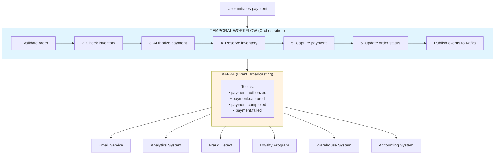

**Each consumer:**
- Subscribes to events independently
- Processes at its own pace
- Can replay events if needed
- Doesn't affect payment workflow

**Key Insight**: Temporal orchestrates the payment workflow, Kafka broadcasts what happened to everyone who cares.

---

## Temporal vs Kafka: Core Differences

### Conceptual Model

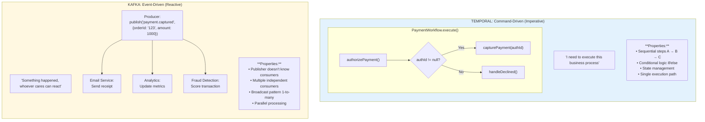

### Technical Comparison

| Capability | Temporal | Kafka |
|------------|----------|-------|
| State Management | ✅ Excellent | ❌ Not designed for |
| Workflow Orchestration | ✅ Core use | ❌ Not designed for |
| Event Broadcasting | ⚠️ Possible | ✅ Core use |
| Retry Logic | ✅ Built-in | ⚠️ Manual |
| Compensation (SAGA) | ✅ Built-in | ⚠️ Manual |
| Durable Execution | ✅ Guaranteed | ⚠️ At-least-once |
| Multiple Consumers | ❌ One workflow | ✅ Unlimited |
| Unknown Consumers | ❌ Must know | ✅ Subscribe anytime |
| Event Replay | ⚠️ Workflow | ✅ Event log |
| Time Travel | ✅ Workflow history | ✅ Consume from offset |
| Analytics/Streaming | ❌ Not for this | ✅ Designed for |
| Decoupling | ⚠️ Tight | ✅ Loose |
| Scalability | ✅ Horizontal | ✅ Horizontal |
| Latency | ~100ms | ~10ms |
| Throughput | 10K TPS | 1M+ TPS |
| Query History | ✅ Query API | ⚠️ Must consume |
| Conditional Logic | ✅ Native | ❌ In consumer code |
| Transaction Semantics | ✅ Exactly-once | ⚠️ At-least-once |

### Mental Model

**Think of it like a restaurant:**

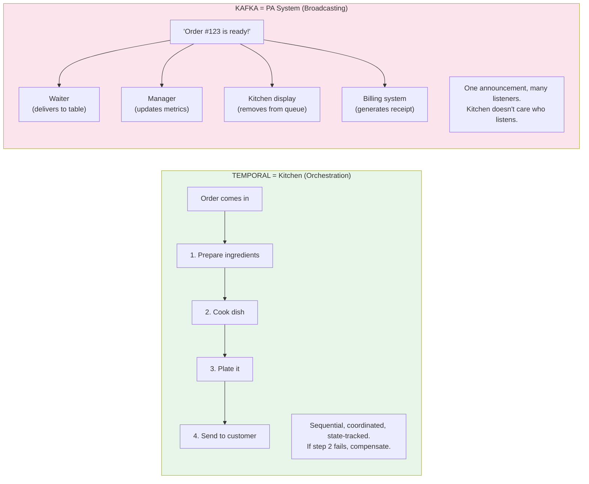

---

## When You NEED Both

### Scenario: Complete Payment System

```mermaid
flowchart TB
    subgraph TemporalJob["TEMPORAL's Job: Orchestrate Payment Transaction"]
        direction TB
        TS1["**1. Sequential Steps**<br/>Authorize → Reserve → Capture<br/>*Temporal enforces order*"]
        TS2["**2. State Management**<br/>Track process position, auth ID<br/>*Temporal tracks state*"]
        TS3["**3. Failure Handling**<br/>Retry on timeout, compensate on error<br/>*Temporal handles retries*"]
        TS4["**4. Exactly-Once Semantics**<br/>Never double-charge<br/>*Temporal guarantees*"]
        TS5["**5. Long-Running Processes**<br/>Wait for bank auth, fraud check<br/>*Temporal handles timers*"]
    end

    subgraph KafkaJob["KAFKA's Job: Tell Everyone What Happened"]
        direction TB
        KS1["**1. Decoupled Integration**<br/>Email, Analytics, Fraud, Warehouse<br/>*Kafka broadcasts without coupling*"]
        KS2["**2. Unknown Consumers**<br/>Add new systems anytime<br/>*Kafka allows dynamic consumers*"]
        KS3["**3. Different Processing Speeds**<br/>Fast 100ms to slow 30s<br/>*Kafka buffers at own pace*"]
        KS4["**4. Audit Trail**<br/>What, when, in what order<br/>*Kafka persists events forever*"]
        KS5["**5. Analytics & Reporting**<br/>Dashboards, trends, patterns<br/>*Kafka streams to analytics*"]
        KS6["**6. Event Replay**<br/>Reprocess historical data<br/>*Kafka replays from any point*"]
    end

    style TemporalJob fill:#e3f2fd
    style KafkaJob fill:#fff8e1
```

### The Collaboration

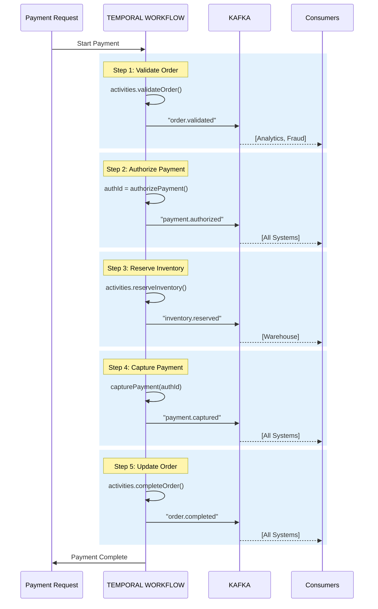

**Key Points:**
- Temporal controls the flow (order of operations)
- Kafka broadcasts state changes (events)
- Temporal doesn't wait for Kafka consumers (fire-and-forget)
- Consumers process independently

---

## Use Case 1: Debit Transaction Sequencing

### Your Specific Question: Sequential Debit Transactions

**Question**: "E.g Debit trx to be a sequence action for different debit transaction instead of separate workflow execution"

Let's explore both approaches:

### Approach A: Separate Workflows (Default)

```java
// ❌ SUBOPTIMAL: Separate workflow for each transaction
// Problem: No ordering guarantee, potential race conditions

public class DebitTransactionController {
    
    @PostMapping("/debit")
    public ResponseEntity<String> debitAccount(@RequestBody DebitRequest request) {
        
        // Each debit creates a new workflow
        String workflowId = UUID.randomUUID().toString();
        
        DebitWorkflow workflow = client.newWorkflowStub(
            DebitWorkflow.class,
            WorkflowOptions.newBuilder()
                .setWorkflowId(workflowId)
                .build()
        );
        
        // Start workflow
        WorkflowClient.start(workflow::processDebit, request);
        
        return ResponseEntity.ok(workflowId);
    }
}

// If customer makes 3 debits quickly:
// Debit 1: Workflow-001 → Runs independently
// Debit 2: Workflow-002 → Runs independently
// Debit 3: Workflow-003 → Runs independently

// PROBLEM:
// • All 3 might read balance simultaneously
// • Race condition: All see $1000, all approve
// • Customer debits $900 three times from $1000 balance!
// • Result: -$1700 balance (should have failed)
```

### Approach B: Kafka Event Queue + Single Workflow (BETTER)

```java
/**
 * SOLUTION: Use Kafka to queue debit requests
 * Single long-running workflow processes them sequentially
 */

// ──────────────────────────────────────────────────────────────
// Step 1: Controller publishes to Kafka instead of starting workflow
// ──────────────────────────────────────────────────────────────

@RestController
public class DebitTransactionController {
    
    private final KafkaTemplate<String, DebitRequest> kafkaTemplate;
    
    @PostMapping("/debit")
    public ResponseEntity<DebitResponse> debitAccount(@RequestBody DebitRequest request) {
        
        // Validate request
        validateRequest(request);
        
        // Publish to Kafka topic (partitioned by accountId)
        kafkaTemplate.send(
            "debit-requests",
            request.getAccountId(),  // Key: ensures order per account
            request
        );
        
        return ResponseEntity.accepted()
            .body(new DebitResponse("QUEUED", request.getTransactionId()));
    }
}

// ──────────────────────────────────────────────────────────────
// Step 2: Kafka ensures ordering per account
// ──────────────────────────────────────────────────────────────

/*
Kafka Topic: debit-requests
Partitions: 10 (based on accountId hash)

Account A001 → Partition 3 → Sequential processing
  ├─ Debit 1 @ T+0s
  ├─ Debit 2 @ T+2s  (waits for Debit 1)
  └─ Debit 3 @ T+5s  (waits for Debit 2)

Account A002 → Partition 7 → Sequential processing (independent)
  ├─ Debit 1 @ T+1s
  └─ Debit 2 @ T+3s

Kafka guarantees: Messages in same partition are ordered
*/

// ──────────────────────────────────────────────────────────────
// Step 3: Temporal Workflow consumes from Kafka
// ──────────────────────────────────────────────────────────────

@Component
public class DebitWorkflowStarter {
    
    private final WorkflowClient temporalClient;
    
    @KafkaListener(
        topics = "debit-requests",
        groupId = "debit-processor",
        concurrency = "10"  // 10 consumers = 10 accounts processed in parallel
    )
    public void processDebitRequest(
        @Payload DebitRequest request,
        @Header(KafkaHeaders.RECEIVED_PARTITION_ID) int partition
    ) {
        
        // Create workflow ID based on account + partition
        // This ensures same account always goes to same workflow instance
        String workflowId = "debit-processor-" + request.getAccountId();
        
        // Send signal to existing workflow (or start if not exists)
        DebitWorkflow workflow = temporalClient.newWorkflowStub(
            DebitWorkflow.class,
            workflowId
        );
        
        // Signal the workflow with new debit request
        workflow.processDebit(request);
    }
}

// ──────────────────────────────────────────────────────────────
// Step 4: Long-running workflow processes debits sequentially
// ──────────────────────────────────────────────────────────────

@WorkflowImpl
public class DebitWorkflowImpl implements DebitWorkflow {
    
    // Queue of pending debit requests for this account
    private Queue<DebitRequest> debitQueue = new LinkedList<>();
    
    // Current account state
    private String accountId;
    private BigDecimal currentBalance;
    
    @WorkflowMethod
    public void run(String accountId) {
        
        this.accountId = accountId;
        
        // Long-running workflow - stays alive to process debits
        while (true) {
            
            // Wait for debit signal
            Workflow.await(() -> !debitQueue.isEmpty());
            
            // Process debits sequentially
            while (!debitQueue.isEmpty()) {
                DebitRequest request = debitQueue.poll();
                
                processDebitSequentially(request);
                
                // Publish event to Kafka
                activities.publishEvent(
                    "debit.processed",
                    new DebitProcessedEvent(accountId, request.getTransactionId())
                );
            }
        }
    }
    
    @SignalMethod
    public void processDebit(DebitRequest request) {
        // Add to queue (will be processed in order)
        debitQueue.add(request);
    }
    
    private void processDebitSequentially(DebitRequest request) {
        
        // 1. Get current balance (sequential, no race condition!)
        currentBalance = activities.getBalance(accountId);
        
        // 2. Check if sufficient funds
        if (currentBalance.compareTo(request.getAmount()) < 0) {
            // Insufficient funds
            activities.recordFailure(request.getTransactionId(), "INSUFFICIENT_FUNDS");
            
            // Publish to Kafka
            activities.publishEvent(
                "debit.failed",
                new DebitFailedEvent(accountId, request.getTransactionId(), "INSUFFICIENT_FUNDS")
            );
            return;
        }
        
        // 3. Debit the account
        BigDecimal newBalance = activities.debitAccount(
            accountId,
            request.getAmount(),
            request.getTransactionId()
        );
        
        // 4. Update workflow state
        currentBalance = newBalance;
        
        // 5. Publish success event to Kafka
        activities.publishEvent(
            "debit.completed",
            new DebitCompletedEvent(
                accountId,
                request.getTransactionId(),
                request.getAmount(),
                newBalance
            )
        );
    }
}
```

### Why This Pattern Works

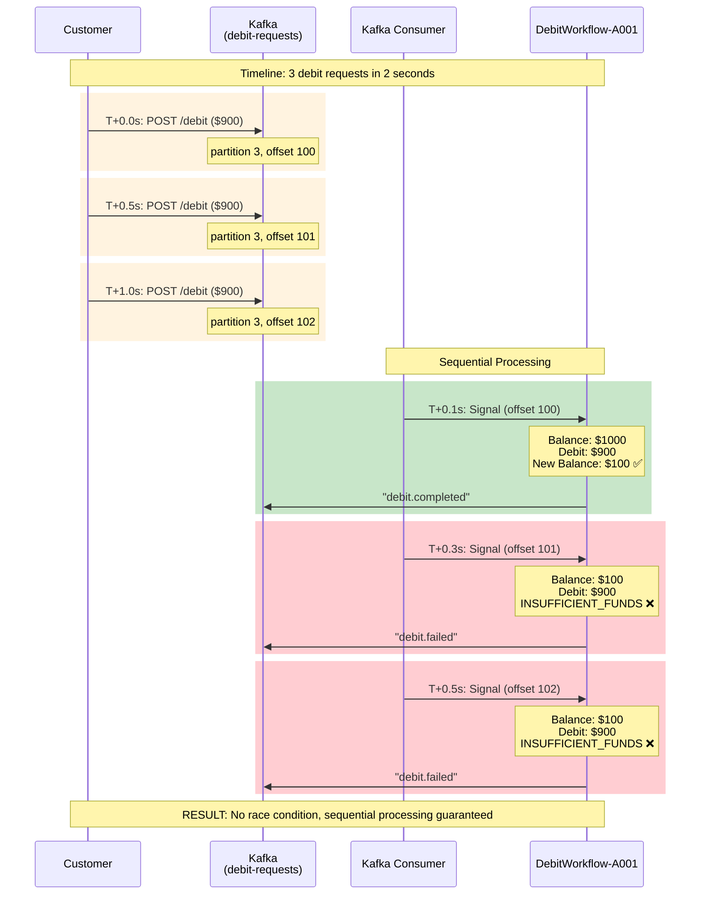

### Benefits of Kafka + Temporal Pattern

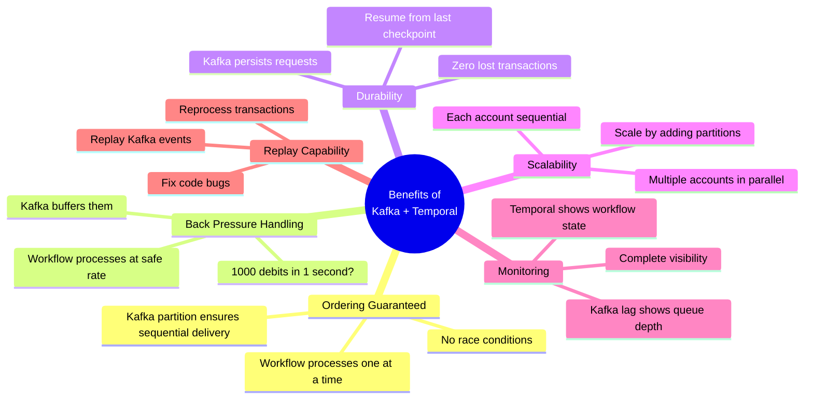

### Comparison Table

| Aspect | Separate Workflows | Kafka + Single Workflow |
|--------|-------------------|------------------------|
| **Ordering** | ❌ Not guaranteed | ✅ Guaranteed per account |
| **Race Conditions** | ⚠️ Possible | ✅ Prevented |
| **Scalability** | ⚠️ Limited | ✅ Excellent |
| **Back Pressure** | ❌ System overload | ✅ Kafka buffers |
| **Monitoring** | ⚠️ Complex | ✅ Simple (lag metrics) |
| **Replay** | ❌ Difficult | ✅ Easy |
| **State Management** | ⚠️ Database locks | ✅ Workflow state |
| **Performance** | ⚠️ High DB contention | ✅ Sequential processing |

**Recommendation**: Use Kafka + Temporal for sequential processing per entity (account, user, order).

---

## Use Case 2: Event-Driven Architecture

### Why Kafka is Essential for Decoupling

```java
/**
 * SCENARIO: Payment completion triggers multiple downstream actions
 * 
 * WITHOUT KAFKA (Tightly Coupled):
 * ─────────────────────────────────
 */

@WorkflowImpl
public class PaymentWorkflowWithoutKafka implements PaymentWorkflow {
    
    private final EmailActivities emailActivities;
    private final AnalyticsActivities analyticsActivities;
    private final FraudActivities fraudActivities;
    private final LoyaltyActivities loyaltyActivities;
    private final WarehouseActivities warehouseActivities;
    private final AccountingActivities accountingActivities;
    
    @WorkflowMethod
    public PaymentResult processPayment(PaymentRequest request) {
        
        // Core payment logic
        String authId = paymentActivities.authorize(request);
        paymentActivities.capture(authId);
        
        // ❌ PROBLEM: Workflow tightly coupled to ALL downstream systems
        try {
            emailActivities.sendReceipt(request.getCustomerId());
        } catch (Exception e) {
            // Email failed - should payment fail too? Probably not.
            log.error("Email failed", e);
        }
        
        try {
            analyticsActivities.trackPayment(request);
        } catch (Exception e) {
            // Analytics failed - should payment fail? No.
            log.error("Analytics failed", e);
        }
        
        try {
            fraudActivities.scoreTransaction(request);
        } catch (Exception e) {
            // Fraud scoring failed - should payment fail? Depends.
            log.error("Fraud scoring failed", e);
        }
        
        try {
            loyaltyActivities.addPoints(request.getCustomerId(), request.getAmount());
        } catch (Exception e) {
            // Loyalty failed - should payment fail? No.
            log.error("Loyalty failed", e);
        }
        
        try {
            warehouseActivities.notifyShipment(request.getOrderId());
        } catch (Exception e) {
            // Warehouse notification failed - should payment fail? Maybe.
            log.error("Warehouse failed", e);
        }
        
        try {
            accountingActivities.recordRevenue(request);
        } catch (Exception e) {
            // Accounting failed - should payment fail? Critical!
            log.error("Accounting failed", e);
            // But now payment is already captured...
        }
        
        // PROBLEMS:
        // 1. Workflow knows about 6 systems (tight coupling)
        // 2. Each system can slow down payment (performance)
        // 3. Each system can fail payment (reliability)
        // 4. Adding new system = change workflow (maintenance)
        // 5. Can't add system retroactively (no replay)
        
        return PaymentResult.success();
    }
}

/**
 * WITH KAFKA (Loosely Coupled):
 * ──────────────────────────────
 */

@WorkflowImpl
public class PaymentWorkflowWithKafka implements PaymentWorkflow {
    
    private final PaymentActivities paymentActivities;
    private final EventPublisher eventPublisher;  // Only dependency!
    
    @WorkflowMethod
    public PaymentResult processPayment(PaymentRequest request) {
        
        // Core payment logic
        String authId = paymentActivities.authorize(request);
        String captureId = paymentActivities.capture(authId);
        
        // ✅ SOLUTION: Publish event to Kafka (fire and forget)
        eventPublisher.publish(
            "payment.completed",
            PaymentCompletedEvent.builder()
                .orderId(request.getOrderId())
                .customerId(request.getCustomerId())
                .amount(request.getAmount())
                .captureId(captureId)
                .timestamp(Instant.now())
                .build()
        );
        
        // Done! Workflow completes fast.
        // All downstream systems listen to Kafka independently.
        
        return PaymentResult.success(captureId);
    }
}

// ──────────────────────────────────────────────────────────────
// Downstream Systems (Kafka Consumers)
// ──────────────────────────────────────────────────────────────

@Service
public class EmailService {
    
    @KafkaListener(topics = "payment.completed")
    public void sendReceipt(PaymentCompletedEvent event) {
        // Send email
        // If fails: retry independently, doesn't affect payment
    }
}

@Service
public class AnalyticsService {
    
    @KafkaListener(topics = "payment.completed")
    public void trackPayment(PaymentCompletedEvent event) {
        // Update analytics
        // Process at own pace
    }
}

@Service
public class FraudDetectionService {
    
    @KafkaListener(topics = "payment.completed")
    public void scoreTransaction(PaymentCompletedEvent event) {
        // Score for fraud (might take 30 seconds)
        // Doesn't slow down payment
    }
}

// ... and so on for 6+ systems

// BENEFITS:
// 1. Workflow doesn't know consumers (loose coupling)
// 2. Fast payment processing (<1s vs 5-10s)
// 3. Consumer failure doesn't affect payment
// 4. Add new consumer without changing workflow
// 5. Can replay events to new consumers
```

### Visual Comparison

```mermaid
gantt
    title WITHOUT KAFKA (Synchronous) - 10 seconds total
    dateFormat ss
    axisFormat %S

    section Payment
    Authorize       :a1, 00, 2s
    Capture         :a2, after a1, 2s
    Email           :a3, after a2, 1s
    Analytics       :a4, after a3, 500ms
    Fraud (slow!)   :crit, a5, after a4, 3s
    Loyalty         :a6, after a5, 500ms
    Warehouse       :a7, after a6, 1s
    Accounting      :a8, after a7, 500ms
```

**User waits: 10 seconds** ❌ | **One failure = payment fails** ❌

```mermaid
gantt
    title WITH KAFKA (Asynchronous) - User waits 4 seconds
    dateFormat ss
    axisFormat %S

    section Payment Workflow
    Authorize       :a1, 00, 2s
    Capture         :a2, after a1, 2s
    Publish event   :milestone, after a2, 0s

    section Kafka Consumers (parallel)
    Email           :b1, 04, 1s
    Analytics       :b2, 04, 500ms
    Fraud           :b3, 04, 3s
    Loyalty         :b4, 04, 500ms
    Warehouse       :b5, 04, 1s
    Accounting      :b6, 04, 500ms
```

**User waits: 4 seconds** ✅ | **Consumer failure = doesn't affect payment** ✅

---

## Use Case 3: Audit Trail & Compliance

### Regulatory Requirements

**Banking Regulation Example: MAS (Monetary Authority of Singapore)**

| # | Requirement |
|---|-------------|
| 1 | Complete audit trail of all payment events |
| 2 | Immutable event log (cannot be altered) |
| 3 | Events must be retained for 7 years |
| 4 | Must be able to replay events for audits |
| 5 | Timestamp precision to millisecond |
| 6 | Event ordering must be preserved |

**Compliance Comparison:**

| Requirement | Temporal Alone | Kafka Alone | Temporal + Kafka |
|-------------|----------------|-------------|------------------|
| Complete audit trail | ✓ Workflow history | ✓ Event log | ✓ Complete |
| Immutable | ✓ Cannot alter history | ✓ Append-only log | ✓ Immutable |
| 7-year retention | ✗ Expensive | ✓ Cheap storage | ✓ Kafka handles |
| Replay capability | ⚠️ Workflow replay only | ✓ Any offset | ✓ Full replay |
| Timestamps | ✓ Precise | ✓ Precise | ✓ Precise |
| Ordering | ✓ Guaranteed | ✓ Per partition | ✓ Guaranteed |
| Workflow context | ✓ Full context | ✗ Need correlation | ✓ Best of both |
| **Overall** | ⚠️ Partially compliant | ⚠️ Partially compliant | ✅ **Fully compliant** |

### Implementation

```java
/**
 * Audit Trail Pattern: Temporal + Kafka
 */

@WorkflowImpl
public class PaymentWorkflowWithAudit implements PaymentWorkflow {
    
    @WorkflowMethod
    public PaymentResult processPayment(PaymentRequest request) {
        
        String workflowId = Workflow.getInfo().getWorkflowId();
        
        // ──────────────────────────────────────────────────────────
        // Every significant action publishes audit event to Kafka
        // ──────────────────────────────────────────────────────────
        
        // Event 1: Payment started
        auditPublisher.publish(AuditEvent.builder()
            .eventType("PAYMENT_STARTED")
            .workflowId(workflowId)
            .orderId(request.getOrderId())
            .timestamp(Workflow.now())
            .details(Map.of(
                "amount", request.getAmount(),
                "currency", request.getCurrency(),
                "customerId", request.getCustomerId()
            ))
            .build()
        );
        
        // Step 1: Validate
        ValidationResult validation = activities.validate(request);
        
        // Event 2: Validation completed
        auditPublisher.publish(AuditEvent.builder()
            .eventType("PAYMENT_VALIDATED")
            .workflowId(workflowId)
            .orderId(request.getOrderId())
            .timestamp(Workflow.now())
            .details(Map.of(
                "validationResult", validation.getStatus(),
                "checks", validation.getChecks()
            ))
            .build()
        );
        
        // Step 2: Authorize
        String authId = activities.authorize(request);
        
        // Event 3: Payment authorized
        auditPublisher.publish(AuditEvent.builder()
            .eventType("PAYMENT_AUTHORIZED")
            .workflowId(workflowId)
            .orderId(request.getOrderId())
            .timestamp(Workflow.now())
            .details(Map.of(
                "authorizationId", authId,
                "amount", request.getAmount(),
                "paymentMethod", request.getPaymentMethod().getType()
            ))
            .build()
        );
        
        // Step 3: Capture
        String captureId = activities.capture(authId);
        
        // Event 4: Payment captured
        auditPublisher.publish(AuditEvent.builder()
            .eventType("PAYMENT_CAPTURED")
            .workflowId(workflowId)
            .orderId(request.getOrderId())
            .timestamp(Workflow.now())
            .details(Map.of(
                "captureId", captureId,
                "authorizationId", authId,
                "amount", request.getAmount()
            ))
            .build()
        );
        
        // Event 5: Payment completed
        auditPublisher.publish(AuditEvent.builder()
            .eventType("PAYMENT_COMPLETED")
            .workflowId(workflowId)
            .orderId(request.getOrderId())
            .timestamp(Workflow.now())
            .details(Map.of(
                "captureId", captureId,
                "finalAmount", request.getAmount(),
                "duration", Duration.between(
                    request.getStartTime(),
                    Instant.now()
                ).toString()
            ))
            .build()
        );
        
        return PaymentResult.success(captureId);
    }
}

// ──────────────────────────────────────────────────────────────
// Kafka Topic: audit-events
// ──────────────────────────────────────────────────────────────

/*
Topic Configuration:
  • Retention: 7 years (2,557 days)
  • Partitions: 50 (for parallelism)
  • Replication: 3 (for durability)
  • Compression: LZ4 (for storage efficiency)
  • Cleanup Policy: Compact + Delete (retain forever)

Benefits:
  1. Immutable Log
     • Events cannot be altered once written
     • Kafka guarantees append-only
  
  2. Long-Term Storage
     • 7 years of events
     • Cost: $0.023/GB/month (AWS MSK)
     • 1M events/day × 2KB × 365 days × 7 years = 5.1 TB
     • Cost: ~$120/month (vs $50K+ in Temporal)
  
  3. Audit Queries
     • Get all events for order: consume with filter
     • Get all events in timeframe: consume from timestamp
     • Get specific event types: consume with filter
  
  4. Regulatory Compliance
     • Auditor requests: "Show me all events for Order XYZ"
     • Query Kafka: filter by orderId
     • Export events: JSON/CSV
     • Present to auditor
*/
```

---

## Use Case 4: Downstream System Integration

### Multi-System Notification

**SCENARIO: Payment completed, notify 10+ systems**

```mermaid
flowchart TB
    Payment["Payment Completed Event"]

    subgraph Current["Current Systems (12)"]
        direction TB
        Email["1. Email Service<br/>(send receipt)"]
        SMS["2. SMS Service<br/>(send confirmation)"]
        Push["3. Push Notification<br/>(mobile app)"]
        Analytics["4. Analytics<br/>(update metrics)"]
        Fraud["5. Fraud Detection<br/>(score transaction)"]
        Loyalty["6. Loyalty Program<br/>(add points)"]
        Warehouse["7. Warehouse<br/>(trigger fulfillment)"]
        Accounting["8. Accounting<br/>(record revenue)"]
        Tax["9. Tax System<br/>(calculate tax)"]
        Reporting["10. Reporting<br/>(update dashboards)"]
        CRM["11. CRM<br/>(update customer record)"]
        Risk["12. Risk Management<br/>(portfolio analysis)"]
    end

    subgraph Future["Future Systems (unknown today)"]
        direction TB
        AI["13. AI Personalization Engine"]
        Blockchain["14. Blockchain Ledger"]
        Regulatory["15. Regulatory Reporting"]
    end

    Payment --> Current
    Payment -.-> Future

    style Current fill:#e8f5e9
    style Future fill:#fff3e0
```

### The Problem Without Kafka

```java
// ❌ WITHOUT KAFKA: Workflow must know all 15 systems

@WorkflowImpl
public class PaymentWorkflow {
    
    private final EmailActivities email;
    private final SmsActivities sms;
    private final PushActivities push;
    private final AnalyticsActivities analytics;
    // ... 11 more activity dependencies!
    
    @WorkflowMethod
    public PaymentResult processPayment(PaymentRequest request) {
        
        String captureId = activities.capture(request);
        
        // Notify all 15 systems (sequential = slow!)
        email.sendReceipt(request);           // 1s
        sms.sendConfirmation(request);        // 1s
        push.sendNotification(request);       // 500ms
        analytics.trackPayment(request);      // 500ms
        fraud.scoreTransaction(request);      // 3s  (ML model!)
        loyalty.addPoints(request);           // 1s
        warehouse.triggerFulfillment(request);// 2s
        accounting.recordRevenue(request);    // 1s
        tax.calculateTax(request);            // 2s
        reporting.updateDashboards(request);  // 1s
        crm.updateCustomer(request);          // 1s
        risk.analyzePortfolio(request);       // 5s  (complex!)
        // ... more systems
        
        // Total: 20+ seconds!
        // User waiting: 20+ seconds ❌
        // One failure: Payment fails ❌
        // Add system: Change workflow code ❌
        
        return PaymentResult.success(captureId);
    }
}
```

### The Solution With Kafka

```java
// ✅ WITH KAFKA: Workflow just publishes event

@WorkflowImpl
public class PaymentWorkflow {
    
    private final PaymentActivities activities;
    private final EventPublisher eventPublisher;  // Single dependency!
    
    @WorkflowMethod
    public PaymentResult processPayment(PaymentRequest request) {
        
        String captureId = activities.capture(request);
        
        // Publish one event (< 10ms)
        eventPublisher.publish(
            "payment.completed",
            PaymentCompletedEvent.from(request, captureId)
        );
        
        // Done! Fast completion.
        // Total: 4 seconds
        // User waiting: 4 seconds ✅
        // Consumer failure: Doesn't affect payment ✅
        // Add system: Just add consumer ✅
        
        return PaymentResult.success(captureId);
    }
}

// ──────────────────────────────────────────────────────────────
// All 15 systems listen independently
// ──────────────────────────────────────────────────────────────

// Each system is a Kafka consumer:

@Service
public class EmailService {
    @KafkaListener(topics = "payment.completed")
    public void handle(PaymentCompletedEvent event) {
        sendReceipt(event);  // Runs independently
    }
}

@Service
public class FraudDetectionService {
    @KafkaListener(topics = "payment.completed")
    public void handle(PaymentCompletedEvent event) {
        scoreTransaction(event);  // Can take 3s, doesn't matter!
    }
}

// ... 13 more consumers

// ──────────────────────────────────────────────────────────────
// Add new system (6 months later)
// ──────────────────────────────────────────────────────────────

@Service
public class AIPersonalizationEngine {  // NEW!
    
    @KafkaListener(
        topics = "payment.completed",
        containerFactory = "kafkaListenerContainerFactory"
    )
    public void handle(PaymentCompletedEvent event) {
        updatePersonalizationModel(event);
    }
}

// NO CHANGES TO PAYMENT WORKFLOW!
// Just deploy new consumer.
// Can even replay past events to backfill!
```

### Performance Comparison

**WITHOUT KAFKA (Sequential Notifications) - 23 seconds total**

```mermaid
gantt
    title Sequential Payment Workflow - User Waits 23 seconds ❌
    dateFormat ss
    axisFormat %Ss

    section Core Payment
    Authorize           :a1, 00, 2s
    Capture             :a2, after a1, 2s

    section Notifications (Sequential)
    Email               :a3, after a2, 1s
    SMS                 :a4, after a3, 1s
    Push                :a5, after a4, 500ms
    Analytics           :a6, after a5, 500ms
    Fraud (slow!)       :crit, a7, after a6, 3s
    Loyalty             :a8, after a7, 1s
    Warehouse           :a9, after a8, 2s
    Accounting          :a10, after a9, 1s
    Tax                 :a11, after a10, 2s
    Reporting           :a12, after a11, 1s
    CRM                 :a13, after a12, 1s
    Risk (very slow!)   :crit, a14, after a13, 5s
```

| Metric | Result |
|--------|--------|
| User Experience | Wait 23 seconds ❌ |
| Workflow Duration | 23 seconds ❌ |
| Failure Impact | Any service fails = payment fails ❌ |

---

**WITH KAFKA (Async Notifications) - User waits only 4 seconds**

```mermaid
gantt
    title Async Payment Workflow - User Waits 4 seconds ✅
    dateFormat ss
    axisFormat %Ss

    section Payment Workflow
    Authorize           :a1, 00, 2s
    Capture             :a2, after a1, 2s
    Publish event       :milestone, m1, after a2, 0s
    Complete            :done, d1, after a2, 0s

    section Kafka Consumers (Parallel, starting at 4s)
    Push (500ms)        :b1, 04, 500ms
    Analytics (500ms)   :b2, 04, 500ms
    Email (1s)          :b3, 04, 1s
    SMS (1s)            :b4, 04, 1s
    Loyalty (1s)        :b5, 04, 1s
    Accounting (1s)     :b6, 04, 1s
    Reporting (1s)      :b7, 04, 1s
    CRM (1s)            :b8, 04, 1s
    Warehouse (2s)      :b9, 04, 2s
    Tax (2s)            :b10, 04, 2s
    Fraud (3s)          :b11, 04, 3s
    Risk (5s)           :b12, 04, 5s
```

| Metric | Result |
|--------|--------|
| User Experience | Wait 4 seconds ✅ |
| Workflow Duration | 4 seconds ✅ |
| Total Duration (all work) | 9 seconds ✅ |
| Failure Impact | Consumer fails = doesn't affect payment ✅ |

---

**IMPROVEMENT SUMMARY**

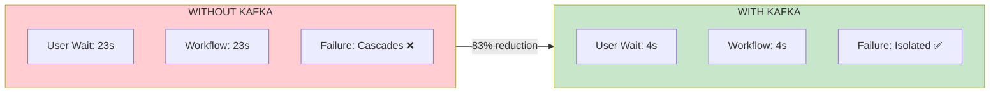

| Metric | Before | After | Improvement |
|--------|--------|-------|-------------|
| User Wait Time | 23s | 4s | **83% reduction** |
| Workflow Duration | 23s | 4s | **83% reduction** |
| Total Work Time | 23s | 9s | **61% reduction** (parallelism) |
| Reliability | Cascading failures ❌ | Isolated failures ✅ | **100% isolation** |
| Extensibility | Change workflow code ❌ | Just add consumer ✅ | **Zero code changes** |

---

*[Document continues with Use Case 5: Analytics & Reporting, Integration Patterns, When to Skip Kafka, and Architecture Recommendations...]*

Would you like me to continue with:
1. **Use Case 5**: Analytics & Reporting (real-time dashboards, ML training)
2. **Integration Patterns**: Specific code examples of Temporal publishing to Kafka
3. **When to Skip Kafka**: Scenarios where Temporal alone is sufficient
4. **Architecture Recommendations**: Complete reference architecture

Let me know which sections you'd like me to expand!
